# Lecture 1: 晶体学基础与对称性

## 1.1 晶胞与宏观晶体

### 1.1.1 晶胞的选取

众所周知，**晶胞**指的是晶体中可以通过**平移**无限延展的一种重复单元，一般由一个几何体以及其内部填充的原子组成。需要注意的是，一个晶胞不仅需要包含其内部的原子，还需要包含几何体内的空间，这意味着构成晶胞的几何体必须**仅通过平移形成二维或三维密铺**。

在二维情况，这类的情况有很多，主要包括以下两种结构的衍生：

|          **平行四边形**（包括正方形，矩形，菱形等）          |                     含有对称中心的六边形                     |
| :----------------------------------------------------------: | :----------------------------------------------------------: |
|  |  |

不难看出，对于二维结构而言，其共同含有**对边平行且相等**的特征，不妨称为**平行多边形**（parallelogon）。我们把这一特征运用的三维情况下，可以构造出如下**平行多面体**（parallelohedron）：

|                        **平行六面体**                        |                     截角八面体($4^66^8$)                     |                        菱形十二面体()                        |                         拉长十二面体                         |                        中心对称六棱柱                        |
| :----------------------------------------------------------: | :----------------------------------------------------------: | :----------------------------------------------------------: | :----------------------------------------------------------: | :----------------------------------------------------------: |
|  |  |  |  |  |
|  |       |       |  |  |

形如 $4^66^8$ 的记号被称为多面体记号（正式的叫**施莱夫利符号**，严格来说数学上并没有这样的写法，但是竞赛里一般都用这种写法表示），表示一个多面体由6个四边形面和8个六边形面组成。

一般而言，这样的多面体选取越简单越好，于是乎人们规定二维晶胞的形状为**平行四边形**，三维晶胞的形状为**平行六面体**。

常见的平行六面体晶胞分为两种：

- **素晶胞**（primitive cell，也叫原胞）：恰好只包含一个点阵点的晶胞，即所选的晶胞恰好是一个最小的重复单元，对平行六面体的具体形状没有要求。

习惯上对于素晶胞，常常选择一个点阵点作为顶点，这样方便定位。对于平行六面体而言，只需确定其棱边上的三个向量 $\vec{a}, \vec{b}, \vec{c}$ 即可确定其在空间内的位置，所以我们只需要先找到一个点阵点，再在它周围选择其他三个点阵点构建向量，最后由平移对称性即可构建整个素晶胞。

!!! example "素晶胞的画法"
    画出以下三种点阵：(1) 简单立方；(2) 体心立方；(3) 面心立方 对应的素晶胞。

    
    
    ??? success "答案"
        从紫色点阵点出发，找到红绿蓝三个向量，之后平移向量即可得解。
    
        

- **正当晶胞**（conventional cell）：

正当晶胞是为了更便捷的研究晶体的对称性取出的晶胞，因此引入了允许带心晶胞的概念，使晶胞整体呈现更加对称的形状。满足所谓“三原则”：

1. 完全反映点阵的对称性；
2. 包含尽可能多的直角；
3. 体积尽量小（但不一定是最小）。

一般而言，通常说的“晶胞”都指的是反映对称性的**正当晶胞**。

除此以外还有**超晶胞**（supercell）的概念，即由多个正当晶胞叠加形成的晶胞 ，通常只是作为计算或构建模型的辅助工具。

!!! note "拓展：维格纳-赛茨原胞（Wigner–Seitz cell）"
    物理学家创造了一种特殊的原胞，其通过**画出一个点阵点与周围相邻点阵点连线的垂直平分线**围出。它同样满足平移密铺，且只含一个点阵点，但是并不一定是平行四边形：

    
    
    在三维空间里也是同理，我们需要画出**一个点阵点与周围相邻点阵点连线的垂直平分面**，围出的立体图形即为维格纳-赛茨原胞。对于体心立方点阵和面心立方点阵而言，其对应的维格纳-赛茨原胞原胞分别为截角八面体和菱形十二面体。
    
    | 体心立方-截角八面体                                          | 面心立方-菱形十二面体                                        |
    | ------------------------------------------------------------ | ------------------------------------------------------------ |
    |  |  |

---

### 1.1.2 晶面与晶向

我们考虑一个立方体晶胞中的一个面：

显而易见的，他与三个坐标轴的交点为 $a, b, c$ ，因此我们可以用着三个数值表示这个晶面。但是如果是这样呢？

此时这个晶面在 $c$ 轴上没有交点，此时再想用上面那种方法表示就难了。于是我们不妨不直接用截距表示，而是用截距的倒数表示，定义：

$$
h = \frac 1a, k = \frac1b, l = \frac 1c
$$

我们就可以用 $(hkl)$ 来代表一个晶面，这样就可以利用 $0 = 1/\infty$ 把无穷远点消除掉。例如，上面这种晶面就可以表示为 $(\frac 1a, \frac 1b, 0)$ ，这样的定义方法叫做**Miller 晶面指数**。这样的定义方法对于其他形状的晶胞也是适用的。

!!! quote "更多晶面指数"
    一般而言，在晶体学里的 $-1$ 常常用 $\overline{1}$ 表示，由此可以延申出各个取向的晶面。符号相同的晶面都是互相平行的：

    
    
    对于立方晶胞，由于其对称性，$(100)$, $(010)$ 和 $(001)$ 的环境其实是一样的。为了方便起见，我们可以把它们设成一个集合 $\{100\}$ ，这便称为一个**晶面族**。同理我们还有 $\{110\}$ 晶面族和 $\{111\}$ 晶面族。

学过高中数理都知道，平面实际上是有方向的，不过我们一般只在向量运算中讨论。所以，如果严格讨论晶面的取向，晶面 $(100)$ 应当具有指向前方和指向后方两种向量，我们可以分别记为 $[100]$ 和 $[\overline{1}00]$ 。这被称为**晶向指数**。

同样的，晶向指数形成的族称为**晶向族指数**，用尖括号括起来，例如 $\left<100\right>$ 代表的是 $[100], [\overline{1}00], [010], [0\overline10], [001], [00\overline1]$ 六个晶向指数的集合。

!!! abstract "总结"
    | 名称           | 符号                   | 描述对象         | 核心含义                                         | 举例（立方晶系）                                             |
    | :------------- | :--------------------- | :--------------- | :----------------------------------------------- | :----------------------------------------------------------- |
    | **晶面指数**  | **$(hkl)$**            | **单个晶面**     | 表示一组特定的、相互平行的原子平面。             | **(100)**：与a轴垂直的平面。                                 |
    | **晶面族指标** | **$\{hkl\}$**          | **所有等效晶面** | 表示由晶体对称性联系起来的、性质相同的一组晶面。 | **{100}**：包括$(100), (010), (001)$的所有立方体表面。       |
    | **晶向指数**   | **$[uvw]$**            | **单个晶向**     | 表示晶体中的一个方向。                           | **[100]**：沿着a轴的方向。                                   |
    | **晶向族指数** | **$\left<uvw\right>$** | **所有等效晶向** | 表示由晶体对称性联系起来的、性质相同的一组晶向。 | **<100>**：包括$[100], [\overline{1}00], [010], [0\overline10], [001], [00\overline1]$的所有立方体棱边方向。 |

---

### 1.1.3 晶体生长与宏观晶体

现在我们来研究关于宏观晶体的性质。

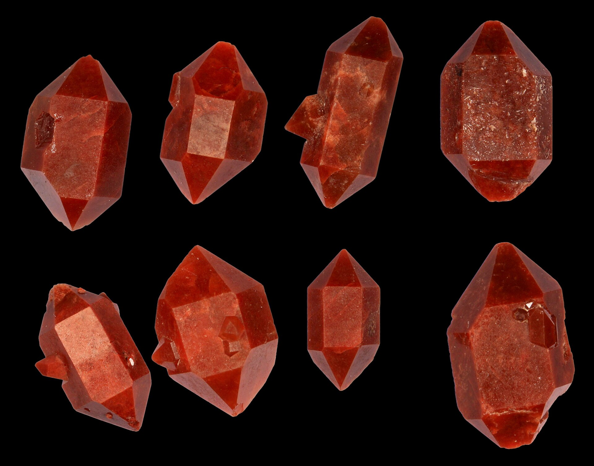

由于实际晶体不能满足平移对称性（否则整个空间就全是晶体了），所以不可避免的会产生形状。早期科学家通过对晶体的研究，确认了其具有以下性质：

- **二面角守恒定律**：同种晶体在相同条件下结晶，其相邻晶面**夹角总是保持一个恒定的值**；
- **各向异性**：晶体的热传导性质，力学性质等**在不同方向上存在差异**；
- **自范性**：人为改变晶体形状后使之在饱和溶液中继续结晶，晶体会**重新生长成多面体形**；
- **均匀性**：晶体内部的微观结构始终是均匀的，使之**具有恒定的熔点**。

观察这些性质，不难发现：**宏观晶体的表面和微观晶胞的晶面存在关系**。

事实上，宏观晶体的表面正是微观结构中某些晶面的对应，如何找出其对应关系呢？我们从晶体的生长考虑：晶体生长无非就是原子/分子靠近并沉积在晶面上的过程，因此，如果各个晶面上的沉积速度相同，**晶面上原子密度更大者，相同时间内沉积的层数就越小，进而生长速度也越小**。在最终晶体的形状上，生长快的晶面会消失，而**生长最慢，也就是原子密度最大的晶面会被保留下来**。这一规律被称为**布拉维法则**（Bravais' Rule）。

下图演示了这一沉积过程， $BC$ 晶面生长速度快而更快消失。

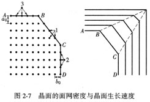

哪些晶面容易形成晶体表面呢？通常是**低指数的晶面**，因为其通常具有较低的原子密度。对于高指数晶面而言，其通常具有较大的表面积，因此其生长速度也是相当快的。

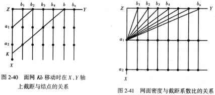

!!! question "另一种理解方式"
    我们也可以从吉布斯自由能变理解。晶体生长时需要满足**最低的吉布斯自由能**，而晶体本身的自由能包括内部能量和表面能两部分。在表面能上，原子密度越大的晶面，原子间的相互作用力越强，致使其在最终宏观晶体上得以体现。

以氯化钠晶体作为例子，我们来看看布拉维规则的运用。

!!! example "氯化钠的晶型"
    已知氯化钠晶体如下图所示，根据布拉维法则判断其宏观晶体形状。

    
    
    ??? success "答案"
        因其晶体结构相对简单，考虑较低指数的晶面族，如 $\{100\}, \{110\}, \{111\}$ 三个晶面族（不久前我们说过，对于立方晶系而言很多晶面都是等效的）：
    
        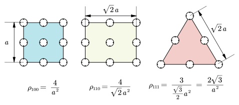
    
        所以在 $\{100\}$ 族的六个晶面将在宏观晶体里体现出来，即为**立方体形**。
    
        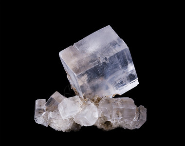

以立方晶系为例子，从最低指数的晶面开始考虑， $\{100\}$ 族对应**立方体形**，而 $\{111\}$ 族对应着沿体对角线的八个晶向生长的晶面，不难想出其对应**八面体形**，一个典型的例子是明矾晶体。 $\{110\}$ 族则对应沿体心到棱形延申的12个晶向生长的晶面，形状有些复杂，对应的是**菱形十二面体形**。

从这三种基础模式，我们可以延伸出更多“杂交”的晶形：

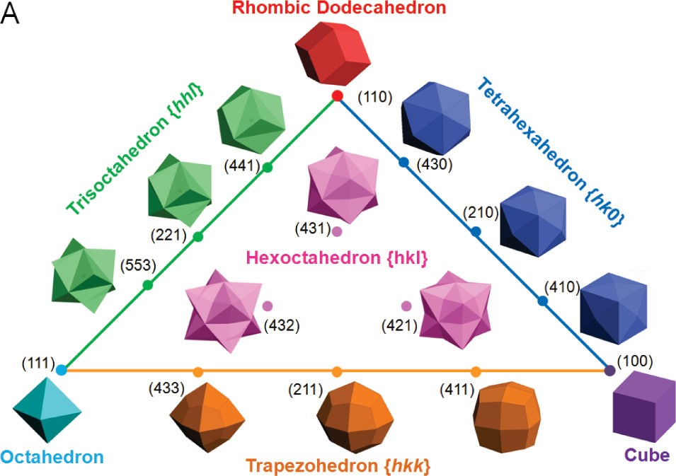

实际晶体的结构远比上面介绍的更加复杂，往往会体现更多的晶面，例如黝铜矿（$\ce{Cu3SbS3}$）：

|                         黝铜矿的晶面                         |                       黝铜矿的宏观晶体                       |
| :----------------------------------------------------------: | :----------------------------------------------------------: |
| 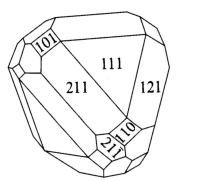 | 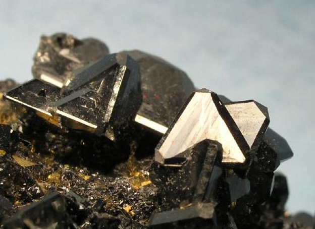 |

一个有趣的例子是黄铁矿。在黄铁矿的宏观晶体里，常常同时体现 $\{100\}$ 和 $\{210\}$ 两个晶面族，前者对应6种晶向，后者对应12种晶向。当后者在主体结构中占上风时。会形成类似五角十二面体的结构；然而晶体中**并不能存在五重轴**，这样的结构实际上只是对称性更低的 $T_h$ 结构。

|                         黄铁矿的晶面                         |                       黄铁矿-立方体形                        |                   黄铁矿-类五角十二面体形                    |
| :----------------------------------------------------------: | :----------------------------------------------------------: | :----------------------------------------------------------: |
| 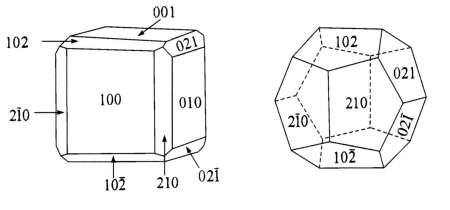 | 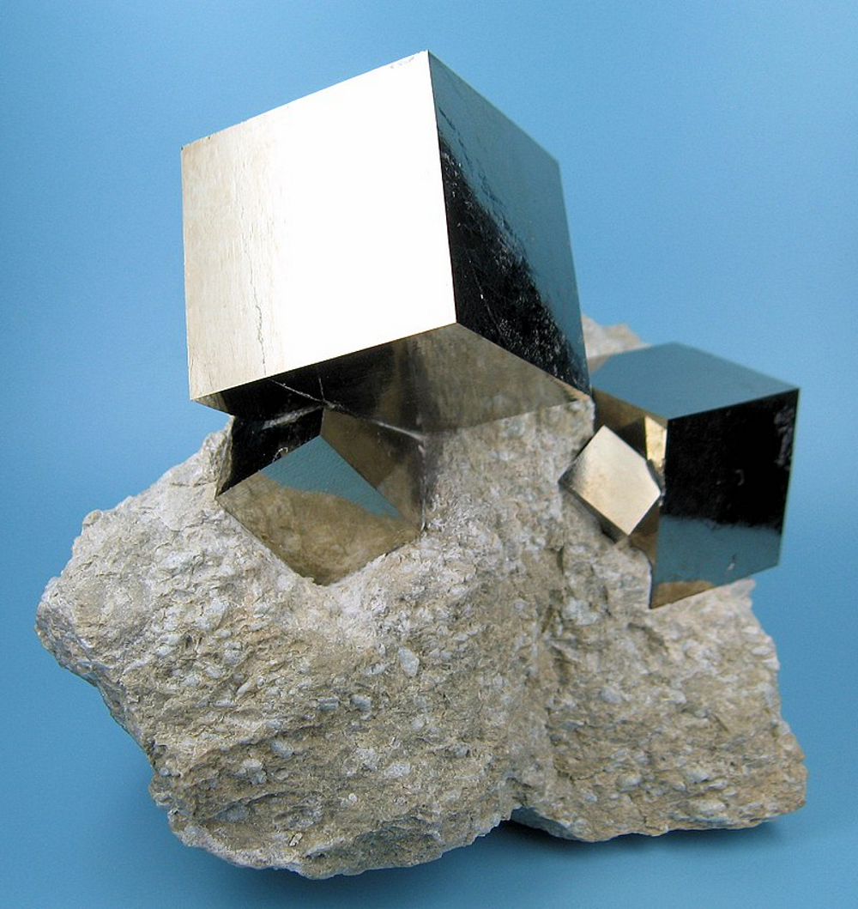 | 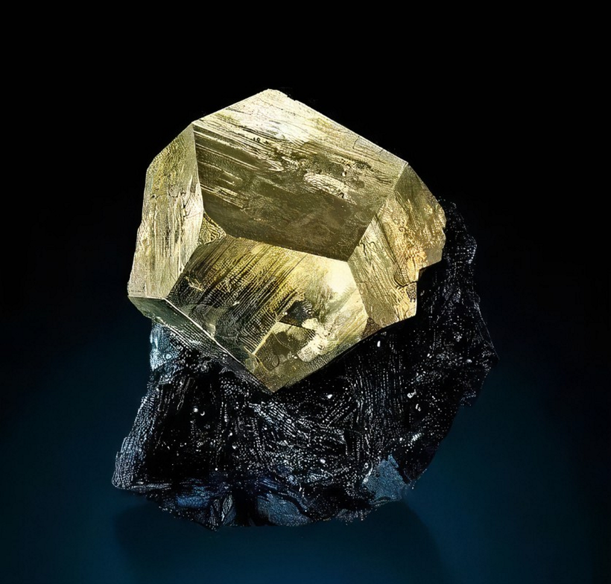 |

!!! abstract "准晶体"
    事实上，通过某种方式真能结出来五角十二面体的晶体。某种Ho-Mg-Zn合金的晶体具有**准晶**（quasicrystal）的性质，其结构如下图所示，具有五重对称性但并不满足平移对称性，神奇的是居然能密铺整个空间。

    |                        准晶的微观结构                        |                      五角十二面体的准晶                      |
    | :----------------------------------------------------------: | :----------------------------------------------------------: |
    | .svg.png) | 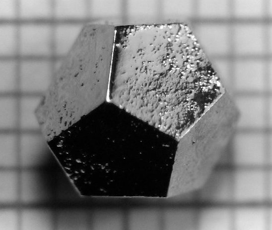 |
    
    有趣的是，已知最早的准晶居然是“三位一体”核试验中的一块核爆玻璃样本。~~失重的魅力这一块，发现这个的也是神人了。~~

再比如说对于氧化亚铜 $Cu_2O$ 的微晶，控制其结晶条件不同，可以获得含有多种晶面甚至高指数晶面的宏观晶体。

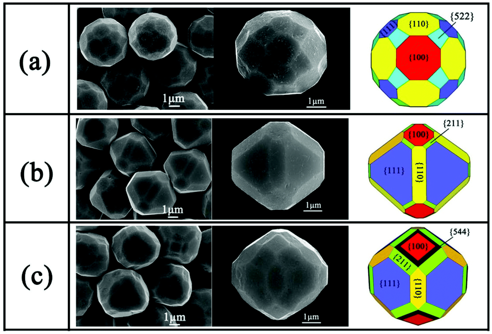

<b><i>Nanoscale</i></b>, 2020,<b>12</b>, 16657-16677

上述所探讨的都是**单晶**，即认为宏观晶体内只有一种连续的晶格结构。然而，由于结晶情况不同，有时候会由于产生了多种晶格结构而产生**多晶**。这样的产生的晶体内部并没有长程的平移对称性，可视为多种单晶形状的叠加。

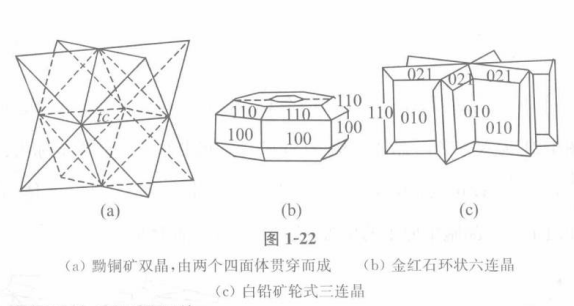

---

### 1.1.4 液晶

液晶（Liquid Crystal）是一种介于液体和固体之间的一种状态，表示其中的分子像晶体一样有固定的趋向，但可以像液体一样流动。这样的分子通常需要很长且具有一定的刚性，如下图所示的分子MBBA：

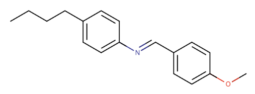

通常情况下的液晶存在三种状态：

- **近晶相**（**Smectic phases**）：液晶仍然很大程度上趋向层状固体的排列方式，层间可以互相滑动。通常在较低的温度下产生。
- **向列相**（**Nematic phase**）：无晶体的整齐排列，但每个分子都近似呈平行趋向。通常在较高的温度下产生。
- **胆甾相/手性相**（**Chiral phases**）：由手性分子形成，存在螺旋扭曲。

|                            近晶相                            |                            向列相                            |                            胆甾相                            |
| :----------------------------------------------------------: | :----------------------------------------------------------: | :----------------------------------------------------------: |
| 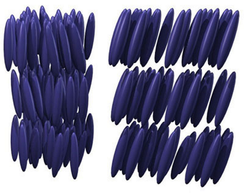 | 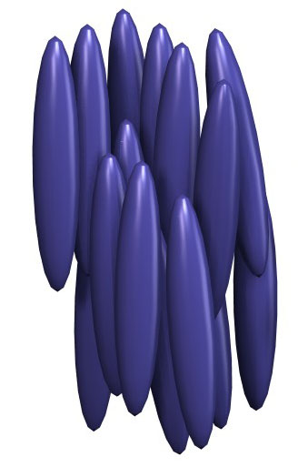 | 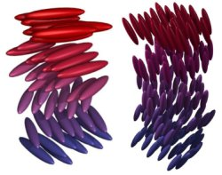 |

---

## 1.2 晶体的宏观对称性

### 1.2.1 宏观对称元素与晶系

