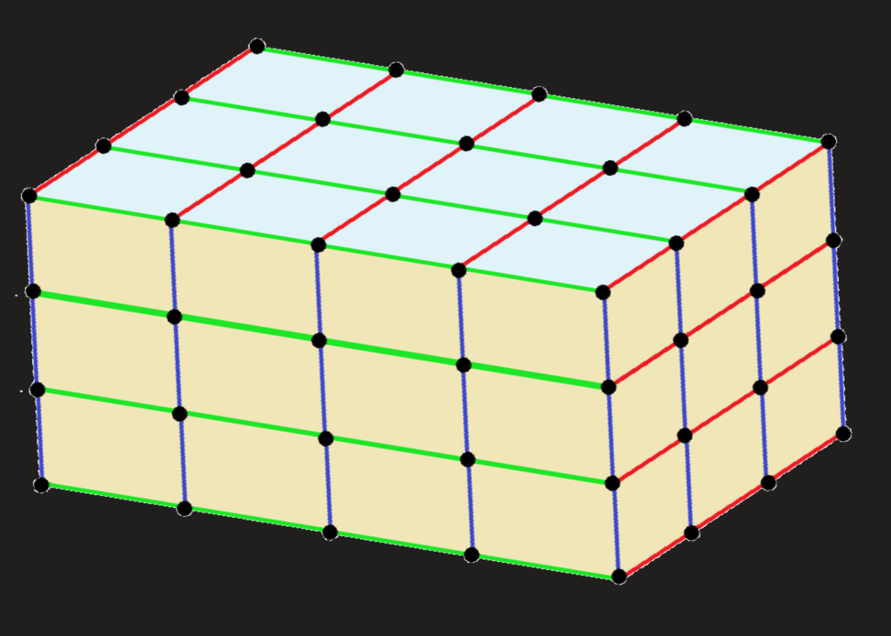

# Lecture 1: 晶体学基础与对称性

## 1.1 晶胞与宏观晶体

### 1.1.1 晶胞的选取

众所周知，**晶胞**指的是晶体中可以通过**平移**无限延展的一种重复单元，一般由一个几何体以及其内部填充的原子组成。需要注意的是，一个晶胞不仅需要包含其内部的原子，还需要包含几何体内的空间，这意味着构成晶胞的几何体必须**仅通过平移形成二维或三维密铺**。

在二维情况，这类的情况有很多，主要包括以下两种结构的衍生：

|          **平行四边形**（包括正方形，矩形，菱形等）          |                     含有对称中心的六边形                     |
| :----------------------------------------------------------: | :----------------------------------------------------------: |
|  |  |

不难看出，对于二维结构而言，其共同含有**对边平行且相等**的特征，不妨称为**平行多边形**（parallelogon）。我们把这一特征运用的三维情况下，可以构造出如下**平行多面体**（parallelohedron）：

|                        **平行六面体**                        |                     截角八面体($4^66^8$)                     |                        菱形十二面体()                        |                         拉长十二面体                         |                        中心对称六棱柱                        |
| :----------------------------------------------------------: | :----------------------------------------------------------: | :----------------------------------------------------------: | :----------------------------------------------------------: | :----------------------------------------------------------: |
|  |  |  |  |  |
|  |       |       |  |  |

形如$4^66^8$的记号被称为多面体记号（正式的叫**施莱夫利符号**，严格来说数学上并没有这样的写法，但是竞赛里一般都用这种写法表示），表示一个多面体由6个四边形面和8个六边形面组成。

一般而言，这样的多面体选取越简单越好，于是乎人们规定二维晶胞的形状为**平行四边形**，三维晶胞的形状为**平行六面体**。

常见的平行六面体晶胞分为两种：

- **素晶胞**（primitive cell，也叫原胞）：恰好只包含一个点阵点的晶胞，即所选的晶胞恰好是一个最小的重复单元，对平行六面体的具体形状没有要求。

习惯上对于素晶胞，常常选择一个点阵点作为顶点，这样方便定位。对于平行六面体而言，只需确定其棱边上的三个向量$\vec{a}, \vec{b}, \vec{c}$即可确定其在空间内的位置，所以我们只需要先找到一个点阵点，再在它周围选择其他三个点阵点构建向量，最后由平移对称性即可构建整个素晶胞。

!!! example "素晶胞的画法"
    画出以下三种点阵：(1) 简单立方；(2) 体心立方；(3) 面心立方 对应的素晶胞。

    
    
    ??? success "答案"
        从紫色点阵点出发，找到红绿蓝三个向量，之后平移向量即可得解。
    
        

- **正当晶胞**（conventional cell）：

正当晶胞是为了更便捷的研究晶体的对称性取出的晶胞，因此引入了允许带心晶胞的概念，使晶胞整体呈现更加对称的形状。满足所谓“三原则”：

1. 完全反映点阵的对称性；
2. 包含尽可能多的直角；
3. 体积尽量小（但不一定是最小）。

一般而言，通常说的“晶胞”都指的是反映对称性的**正当晶胞**。

除此以外还有**超晶胞**（supercell）的概念，即由多个正当晶胞叠加形成的晶胞 ，通常只是作为计算或构建模型的辅助工具。

!!! note "拓展：维格纳-赛茨原胞（Wigner–Seitz cell）"
    物理学家创造了一种特殊的原胞，其通过**画出一个点阵点与周围相邻点阵点连线的垂直平分线**围出。它同样满足平移密铺，且只含一个点阵点，但是并不一定是平行四边形：

    
    
    在三维空间里也是同理，我们需要画出**一个点阵点与周围相邻点阵点连线的垂直平分面**，围出的立体图形即为维格纳-赛茨原胞。对于体心立方点阵和面心立方点阵而言，其对应的维格纳-赛茨原胞原胞分别为截角八面体和菱形十二面体。
    
    | 体心立方-截角八面体                                          | 面心立方-菱形十二面体                                        |
    | ------------------------------------------------------------ | ------------------------------------------------------------ |
    |  |  |

---

### 1.1.2 晶面

我们考虑一个立方体晶胞中的一个面：

显而易见的，他与三个坐标轴的交点为$a, b, c$，因此我们可以用着三个数值表示这个晶面。但是如果是这样呢？

此时这个晶面在c轴上没有交点，此时再想用上面那种方法表示就难了。于是我们不妨不直接用截距表示，而是用截距的倒数表示，定义：

$$
h = \frac 1a, k = \frac1b, l = \frac 1c
$$

我们就可以用$(hkl)$来代表一个晶面，这样就可以利用$0 = 1/\infty$把无穷远点消除掉。例如，上面这种晶面就可以表示为$(\frac 1a, \frac 1b, 0)$，这样的定义方法叫做**Miller 晶面指数**。这样的定义方法对于其他形状的晶胞也是适用的。

!!! quote "更多晶面指数"
    一般而言，在晶体学里的$-1$常常用$\overline{1}$表示，由此可以延申出各个取向的晶面。符号相同的晶面都是互相平行的：

    
    
    对于立方晶胞，由于其对称性，$(100)$, $(010)$和$(001)$的环境其实是一样的。为了方便起见，我们可以把它们设成一个集合$\{100\}$，这便称为一个**晶面族**。同理我们还有$\{110\}$晶面族和$\{111\}$晶面族。

学过高中数理都知道，平面实际上是有方向的，不过我们一般只在向量运算中讨论。所以，如果严格讨论晶面的取向，晶面$(100)$应当具有指向前方和指向后方两种向量，我们可以分别记为$[100]$和$[\overline{1}00]$。这被称为**晶向指数**。

同样的，晶向指数形成的族称为**晶向族指数**，用尖括号括起来，例如$\left<100\right>$代表的是$[100], [\overline{1}00], [010], [0\overline10], [001], [00\overline1]$六个晶向指数的集合。

!!! abstract "总结"
    | 名称           | 符号                   | 描述对象         | 核心含义                                         | 举例（立方晶系）                                             |
    | :------------- | :--------------------- | :--------------- | :----------------------------------------------- | :----------------------------------------------------------- |
    | **晶面指数**  | **$(hkl)$**            | **单个晶面**     | 表示一组特定的、相互平行的原子平面。             | **(100)**：与a轴垂直的平面。                                 |
    | **晶面族指标** | **$\{hkl\}$**          | **所有等效晶面** | 表示由晶体对称性联系起来的、性质相同的一组晶面。 | **{100}**：包括$(100), (010), (001)$的所有立方体表面。       |
    | **晶向指数**   | **$[uvw]$**            | **单个晶向**     | 表示晶体中的一个方向。                           | **[100]**：沿着a轴的方向。                                   |
    | **晶向族指数** | **$\left<uvw\right>$** | **所有等效晶向** | 表示由晶体对称性联系起来的、性质相同的一组晶向。 | **<100>**：包括$[100], [\overline{1}00], [010], [0\overline10], [001], [00\overline1]$的所有立方体棱边方向。 |

---

### 1.1.3 晶体生长与宏观晶体

