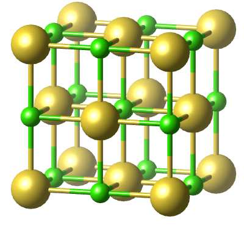
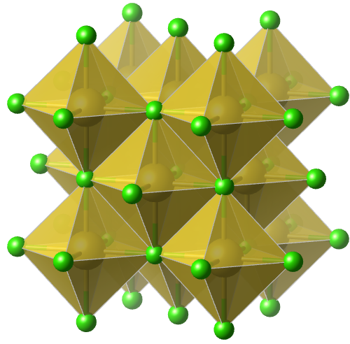

# 竞赛晶体进阶十讲-前言

> 本文档遵循[署名—非商业性使用—相同方式共享 4.0 协议](https://creativecommons.org/licenses/by-nc-sa/4.0/)（CC BY-NC-SA 4.0）授权:fontawesome-brands-creative-commons::fontawesome-brands-creative-commons-by::fontawesome-brands-creative-commons-nc::fontawesome-brands-creative-commons-sa:
>
> 作者：凯楽斯kelesss

<b>欢迎来到《竞赛晶体进阶》课程！</b>

## 本课程的定位

针对已经**初步掌握晶体化学**的竞赛生或大学本科生。

## 特色

本网站的晶体图片均附带对应的[Materials Project](https://next-gen.materialsproject.org/)链接，以便进行3D模型的查看。在此之前，你可以先注册一个[Materials Project](https://next-gen.materialsproject.org/)账号，并自行探索晶体模型演示。

同时，你也可以下载本地cif文件，并使用[VESTA](https://www.jp-minerals.org/vesta/en/download.html)软件打开查看。

!!! Tip "示例：  [**氯化钠 NaCl**](https://next-gen.materialsproject.org/materials/mp-22862)"
    | 球棍模型                                                     | 多面体模型                                                   |
    | ------------------------------------------------------------ | ------------------------------------------------------------ |
    |  |  |

     
[mp-22862](https://next-gen.materialsproject.org/materials/mp-22862) · [CIF下载](cifs/NaCl.cif)

（很抱歉开发一个美观的模型预览对我来说还是太难了，用3Dmol.js渲染的效果简直不能看，套mp的模板也不行。如果由更好的方法请联系我。）

## 参考书籍

- 钱逸泰. 结晶化学导论[M]. 4版. 合肥：中国科学技术大学出版社， 2022.9.
- 麦松威， 周公度， 李伟基. 高等无机结构化学[M]. 3版. 北京：北京大学出版社， 2021.
- Douglas, B. E., & Ho, S.-M. (2006). *Structure and chemistry of crystalline solids*. Springer.
