# Physical Chemistry II 物理化学 II 笔记

---

!!! NOTE "注意"
    此页面为物理化学II英文班的笔记，因此较为粗略。详细内容我之后会单开页面重新编写。

## Chapter 1 : Chemical and Electrochemical Equilibrium

### Gibbs Energy Minimum

for rxn $A \rightleftarrows B$, def. $\xi$ as **rxn extent**(mol)

so $-\dd n_A = \dd n_B = \dd \xi$,

$$
\dd G = \mu_A \dd n_A + \mu_B \dd n_B = (\mu_A-\mu_B)\dd\xi
$$

for

$$
\Delta_rG = \dv{G}{\xi} = \mu_B - \mu_A  = \mu_B^{\circ} - \mu_A^{\circ} + RT\ln{\frac{p_B}{p_A}}
$$

def. **rxn quotient** $Q = \frac{p_B}{p_A}$

at Eq. $0 = \Delta_rG = \Delta_rG^{\circ} + RT\ln{K}$

---

### General rxns

$$
\nu_A A + \nu_B B \rightleftarrows \nu_C C + \nu_D D
$$

we get:

$$
\Delta_rG = \Delta_rG^{\circ} + RTlnQ = \sum_j \nu_j \Delta_fG^{\circ}(j) + RT\ln(\prod_j a_j^{\nu_j})
$$

as $a_j$ remains **activity** or **fugacity**

Since $\delta _rG^{\circ}$ is defined as a single pressure, we have $(\frac{\partial K}{\partial p})_T = 0$

for rxn $A \rightleftarrows 2B$, $A$ changes from $n$ to $(1-\beta)n$

$$
x_A = \frac{(1-\beta)n}{(1-\beta)n + 2\beta n}, x_B = \frac{2\beta n}{(1-\beta)n + 2\beta n}
$$

so we have:

$$
\begin{gathered}
K = \frac{p_B^2}{p_A p^{\circ}} = \frac{x_B^2}{x_A} (\frac{p}{p^{\circ}}) = \frac{4\beta^2}{1-\beta^2}(\frac{p}{p^{\circ}}) \\
\beta  = \frac{1}{(1+4 p/Kp^{\circ})^{1/2}}
\end{gathered}
$$

as $p$ increase, $\beta$ decrease.

---

### Response of equilibria to changes

as

$$
\ln{K} = -\frac{\Delta_rG^{\circ}}{RT} = -\frac{1}{R} (\frac{\partial \Delta_rG^{\circ}/T}{\partial T}) = \frac{\Delta_rH^{\circ}}{RT^2}
$$

that is:

$$
\frac{\partial \ln{K}}{\partial {1/T}} = -\frac{\Delta_rH^{\circ}}{R}
$$

that means: when $\Delta_rH^{\circ} < 0$, when $T$ decrease, $K$ increase. *Vice Versa*

---

### Equilibrium electrochemistry

for rxn $\ce{H_2O <--> H_2 + O_2}$ we got half rxns:

**Anode**: $\ce{H_2 - 2e^-<--> 2H^+}$

**Cathode**: $\ce{0.5O_2 + 2H^+ + 2e^- <--> H_2O}$

for non-electrochemistry states:


$$
Q_1 = \frac{a(\ce{H^+})^2}{(p(\ce{H_2})/p^{\circ})}, Q_2 = \frac{a(\ce{H2O})}{(p(\ce{O_2})^{1/2}/p^{\circ})a(\ce{H^+})^2}
$$

consider the **Electromotive Force(EMF)**


$$
\begin{aligned}
-\nu EF = \Delta_rG &= \Delta_rG^{\circ} + RT\ln{Q} = \dv{W_e}{\xi}\\
E &= -\frac{\Delta_rG_m^{\circ}}{\nu F} - \frac{RT}{\nu F} \ln{Q}
\end{aligned}
$$

this is called ***Nerst* Equation**.

At eq: $0 = E^{\circ} - \frac{RT}{\nu F}\ln{K}$, so


$$
\ln K = \frac{\nu FE^{\circ}}{RT}
$$

---

### Lattice gas

def. $N$ as *indistinguishable particles*, $N_0$ as *indistinguishable sites*

as ***Boltzman* Entropy** $S = k_B \ln{\Omega}$, since $\displaystyle \Omega = \frac{N_0!}{(N_0 - N)!(N)!}$

let $x = N/N_0$, using ***Stiring* Approximation**:

$$
S = -k_BN(x\ln{x} + (1-x)\ln{1-x})
$$

for general cases:

$$
S = -k_BN(\Sigma_n x_i\ln{x_i})
$$

---

### Electrochemical Potential

$$
G = H - TS + zeN\varphi
$$

$$
\Delta G = \Delta H - T\Delta S + \Delta(zeN)\varphi
$$

so as $\displaystyle \mu = (\frac{\Delta G}{\Delta N})_{T,p,\varphi} = (\frac{\partial g}{\partial x})_{T, p, \varphi}$, def $g = G/N, h = H/N, S = S/N$

For a lattice as:


$$
S' = (\frac{\partial S}{\partial x})_{T,p,\varphi} = k_B \frac{x}{1-x}
$$

so:

$$
\mu  = h' + k_BT\ln{\frac{x}{1-x}} + ze\varphi
$$

in solution, when $x \rightarrow 0$,

$$
\mu = \underline{h' + k_BT\ln{x}} + ze\varphi = k_BT\ln{\gamma x} + ze\varphi
$$

that is called **Electrochemical Potential**

---

### Standard Hydrogen Potential

define *Standard Hydrogen Potential* as 0 V as the **Standard Hydrogen Electrode**:

$$
\ce{2H^+ + 2e^- -> H_2} \quad E^\circ = \pu{0V}
$$

whereas happens Pt electrode and every species are at the standard state (形成铂黑结构增加催化位点，促进反应快速达到平衡。)

eg: $\ce{2H_2 + O_2 -> 2H_2O}$, $E = \pu{1.23V}$

so $\ce{0.5O_2 + 2H^+ + 2e^- <--> H_2O}$, $E = \pu{1.23V}$

eg2: $\ce{AgCl + e <--> Ag + Cl^-}$

$$
\begin{aligned}
E &= E_{AgCl/Ag}^{\circ} - \frac{RT}{F} ln{a(\ce{Cl^-})} + \frac{RT}{F} ln{\frac{1}{a(\ce{H^+})}} \\
&= E_{AgCl/Ag}^{\circ} - \frac{RT}{F} \ln{a(\ce{Cl^-})a(\ce{H^+})}\\
&= E_{AgCl/Ag}^{\circ} - \frac{RT}{F} \ln{b(\ce{Cl^-})b(\ce{H^+})} -\frac{RT}{F} \ln{\gamma(\ce{Cl^-})\gamma(\ce{H^+})}
\end{aligned}
$$

where $b$ stands **molality**(质量摩尔浓度), $\gamma$ stands **activity coefficient**

as ***Debye-Huckle* Formula** $\ln{\gamma} = cb^{1/2}$:

$$
E = E_{AgCl/Ag}^{\circ} - \frac{2RT}{F} \ln{b} +\frac{2RT}{F} cb^{1/2}
$$

---

### Reversible Hydrogen Electrode (RHE)

$$
E_{RHE}^{\circ} = E_{SHE} + \frac{RT}{F} \ln{a(\ce{H^+})}\\
V_{RHE}^{\circ} = V_{SHE} - \frac{RT}{F} \ln{a(\ce{H^+})} = V_{SHE} + 0.059\mathrm{pH}
$$

Eg: Water Electrolysis


$$
\begin{aligned}
V_{SHE} &= E^{\circ} - \frac{RT}{4F}\ln{\frac{1}{(p(\ce{O_2}/p^{\circ}))a(\ce{H^+})^4}} \\
&= E^{\circ} + \frac{RT}{F} \ln{a(\ce{H^+})} + \frac{RT}{4F} \ln{p(\ce{O_2})/p^{\circ}}
\end{aligned}
$$

where $\displaystyle V_{RHE} = E^{\circ} + \frac{RT}{4F} \ln(p(\ce{O_2})/p^{\circ})$

In real case, if we want to drive the rxn, need let $E > E^{\circ} = 1.23 \mathrm{V}$

---

## Chapter 2 :  Fuel Cells, Batteries and Electric Double Layer

### Determining TD functions

$$
\begin{gathered}
\Delta_rG^{\circ} = \Delta_rH^{\circ} - T\Delta_rS^{\circ} = -\nu FE^{\circ}\\
\frac{\dd E^{\circ}}{\dd T} = \frac{\Delta_rS^{\circ}}{\nu F} \to \Delta_rS^{\circ} = \nu F\dv{E^{\circ}}{T}\\
\Delta_rH^{\circ} = \Delta_rG^{\circ} + T\Delta_rS^{\circ} = -\nu F(E^{\circ} - T\dv{ E^{\circ}}{T})
\end{gathered}
$$

---

### Energy Efficiency

$$
\begin{gathered}
\text{Fuel Cell}(EE) = \frac{\text{Electrical }E}{\text{Chemical }E}\\
\text{Electrolyzer}(EE) = \frac{\text{Chemical }E}{\text{Electrical }E}
\end{gathered}
$$

---

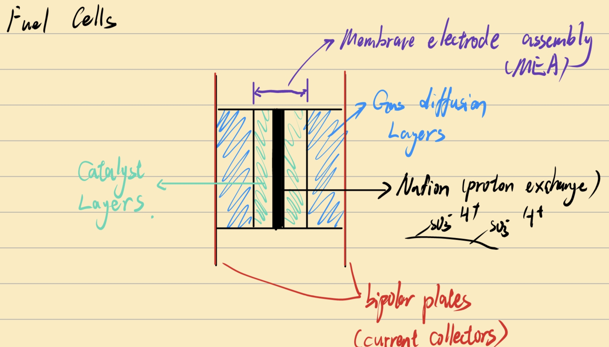

MEA: 膜电极组件


---

### Rechargable batteries

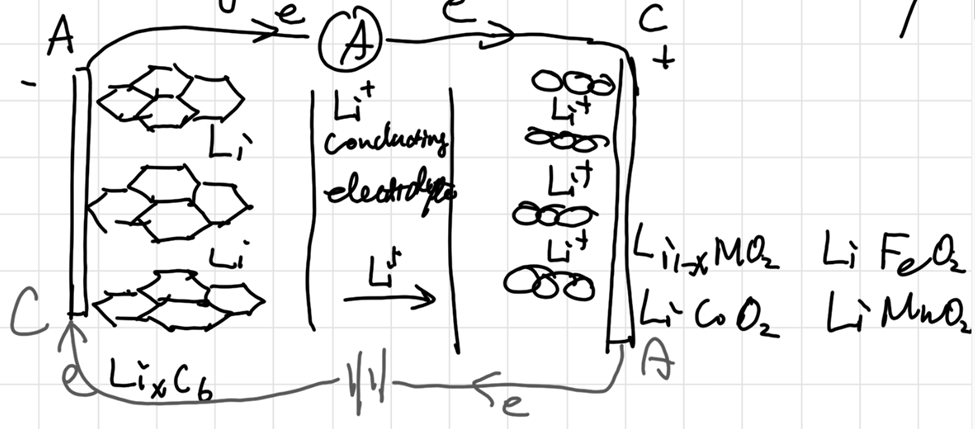

---

### Charging Mode

- **Positive Electrode**: supply e^-^(Sluggish) **Anode**
- **Negative Electrode**: receive e^-^(Energetic) **Cathode**

---

### Electric Double Layer(EDL)

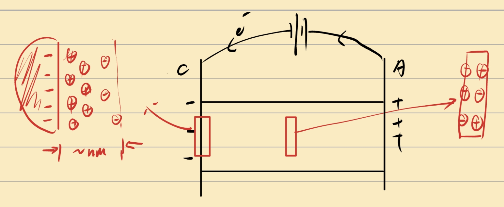

---

### Gouy-Chapman-Stern(GCS) Model

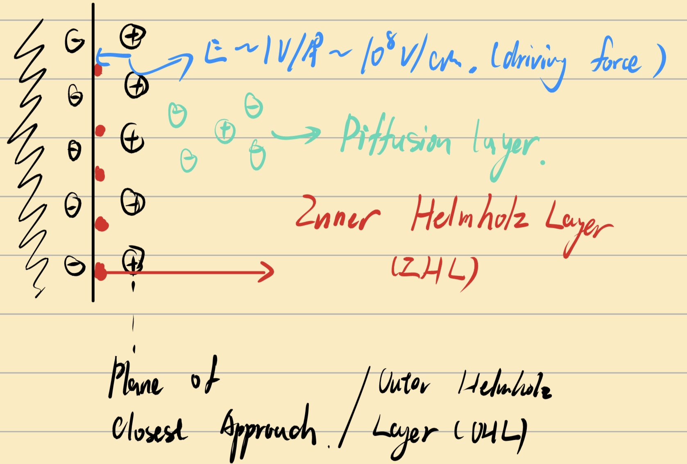


---

### The Gibbs adsorption isotherm

Pure Phase(A)  |   ……  |  Pure Phase(B)


Reference System: （省略了偏摩尔量）

$$
\dd G_R = (\frac{\partial G_R}{\partial T})\dd  T + (\frac{\partial G_R}{\partial p}) \dd p +(\frac{\partial G_R}{\partial n})\dd n
$$

Actual system:

$$
\dd G_S = (\frac{\partial G_S}{\partial T})\dd  T + (\frac{\partial G_S}{\partial p}) \dd p +(\frac{\partial G_S}{\partial n})\dd n + (\frac{\partial G_S}{\partial A})\dd A
$$

where $A$ indicates **interfacial area**, we call $\displaystyle(\frac{\partial G_S}{\partial A})_{p,T,n} = \gamma$ as **Surface Tension**

As p&T are const., 认为所有物质均为纯态，即$\mu_i^R = \mu_i^S$，we have:

$$
\dd G^\sigma = \dd G_S - \dd G_R = \sum_i \mu_i(\dd n_i^S - \dd n_i^R) + \gamma \dd A= \sum_i \mu_i\dd n_i^\sigma + \gamma \dd A
$$

$n_i^\sigma$ is difference.

for total differential:

$$
\dd G^\sigma = \sum_i \mu_i\dd n_i^\sigma + \sum_i n_i\dd \mu_i^\sigma + \gamma \dd A + A \dd\gamma
$$

that is **Gibbs-Duham Relation** :

$$
\begin{gathered}
A\dd \gamma + \sum_i n_i^\sigma \dd \mu_i = 0 \\
-\dd \gamma = \sum_i \frac{n_i^\sigma}{A} \dd\mu_i = \sum_i \Gamma_i \dd\mu_i
\end{gathered}
$$

$\Gamma$ is called **Surface excess concertation**(表面过剩浓度)

上文所说的实际上是，相对表面过剩浓度$\Gamma_i^1$，即认为组分1的表面过剩为零的平面为划分面，其不依赖于选取的分界面的位置 :

$$
\Gamma^1_1 = 0, \quad \Gamma_i^1 = \Gamma_i - \Gamma_1 (\frac{C_i^\alpha - C_i^\beta}{C_1^\alpha - C_1^\beta}) = \Gamma_i - \Gamma_1 \frac{C_i^\sigma}{C_1^\sigma}
$$

we have：

$$
\begin{gathered}
\dd\mu_i = RT\dd \ln fC_i \\
\Gamma_i = -\frac{1}{RT}(\frac{\partial \gamma}{\partial \ln fC_i})_{T,p}
\end{gathered}
$$

---

### Electrocapillary Equation

$$
\ce{Wire---Cu'|Ag|AgCl(Ref)|   K+, Cl-,  M(electrolyte)   |(WE)Hg|Ni|Cu---Wire}
$$

for Working Electrode :


$$
\begin{aligned}
-\dd \gamma &= (\Gamma_{Hg}\dd\mu_{Hg} + \Gamma_{e}\dd\mu_{e,Hg})\\
&+(\Gamma_{K+}\dd\mu_{K+} + \Gamma_{Cl-}\dd\mu_{Cl-})\\
&+(\Gamma_{M}\dd\mu_{M} + \Gamma_{H_2O}\dd\mu_{H_2O})
\end{aligned}
$$

we have:

$$
\begin{cases}
(\Gamma_{Hg}\dd\mu_{Hg} + \Gamma_{e}\dd\mu_{e,Hg}) = \Gamma_{e}\dd\mu_{e}^{Cu} \\
\dd \mu_{K+} + \dd \mu_{Cl-} = \dd \mu_{KCl}
\end{cases}
$$

for Ref Electrode :

$$
\ce{AgCl + e <--> Ag + Cl-}
$$

$$
\mu_{\ce{AgCl}} + \mu_{e}^{Cu'} = \mu_{\ce{Ag}} + \mu_{\ce{Cl-}}
$$

 做全微分：

$$
\dd \mu_{e}^{Cu} = \dd \mu_{\ce{Cl-}}
$$

代入原方程：

$$
\begin{aligned}
-\dd \gamma &= \Gamma_{e}\dd \mu_{e}^{Cu} -(\Gamma_{K+} - \Gamma_{Cl-})\dd \mu_{e}^{Cu'} \\
& +\Gamma_{K+}\dd\mu_{KCl} +(\Gamma_{M}\dd\mu_{M} + \Gamma_{H_2O}\dd\mu_{H_2O})
\end{aligned}
$$

where $\sigma_M = -F\Gamma_e$, $\sigma_S = -F(\Gamma_{K+} - \Gamma_{Cl-})$ stand for excess charge on WE and EDL

由于电中性：

$$
\sigma_M + \sigma_S = 0
$$

于是：

$$
\begin{aligned}
-\dd \gamma &= -\sigma_M \frac{\dd \mu_{e}^{Cu}}{F} + \sigma_M \frac{\dd \mu_{e}^{Cu'}}{F} \\
& +\Gamma_{K+}\dd\mu_{KCl} +(\Gamma_{M}\dd\mu_{M} + \Gamma_{H_2O}\dd\mu_{H_2O}) \\
&= \sigma_M \dd E +\Gamma_{K+}\dd\mu_{KCl} + \Gamma_{M}\dd\mu_{M} + \Gamma_{H_2O}\dd\mu_{H_2O}
\end{aligned}
$$

由G-D方程：

$$
\dd \mu_{\ce{H2O}} = - \frac{x_{KCl}}{x_{H2O}} \dd \mu_{KCl} - \frac{x_{M}}{x_{H2O}} \dd \mu_{M}
$$

代入：

$$
\begin{aligned}
-\dd \gamma &= \sigma_M \dd E + (\Gamma_{K+} - \frac{x_{KCl}}{x_{H2O}})\dd\mu_{KCl} + (\Gamma_{M} - \frac{x_{M}}{x_{H2O}})\dd \mu_M\\
&= \sigma_M \dd E + \Gamma_{K}(H_2O)\dd\mu_{KCl} + \Gamma_M(H_2O)\dd \mu_M \\ &=\sigma_M \dd E + C
\end{aligned}
$$

that is **Lippmann's equation**:

$$
\boxed{\sigma_M =-\frac{\dd \gamma}{\dd E}}
$$

---

### Droping Mercury Electrode


当且仅当导数为0时达到双电层净电荷平衡，前半段表面富集电子，排斥阴离子而吸引阳离子；后半段表面缺少电子，吸引阴离子。


---

### Adsorption Isotherm

$$
\begin{aligned}
\mu_i^{Adsorption} &= \mu_i^{bulk}\\
\mu_i^{\circ A} + RT\ln a_i^{A} &= \mu_i^{\circ b} + RT\ln a_i^b\\
a_i^A &= a_i^be^{-\frac{\Delta G^\circ_i}{RT}}
\end{aligned}
$$

Assumptions:

- All surface sites are identical
- No lateral interactions
- A full coverage can be achieved

def $a_i^A = \frac{\Gamma_i}{\Gamma_s-\Gamma_i}$, $\theta_i = \frac{\Gamma_i}{\Gamma_s}$

that is:

$$
\begin{gathered}
\frac{\theta_i}{1-\sum\theta_i} = a_i^be^{-\frac{\Delta G_i}{RT}}\\
\theta_i = \frac{a_i^be^{-\frac{\Delta G_i}{RT}}}{1+\sum_j^N a_j^be^{-\frac{\Delta G_i}{RT}}} = \frac{a_i^b K_i}{1+\sum_j^N a_j^b K_j}
\end{gathered}
$$

this is **Langmuir Isotherm**

*Including interaction among adsorbates*: **Frumkin isotherm**

$$
a_i^be^{-\frac{\Delta G_i}{RT}} = \frac{\theta_i}{1-\sum\theta_i} \exp (-\frac{2g\Gamma_i}{RT})
$$

其中$-2g\Gamma_i$代表相互作用项。

## Chapter 3 : Chemical Kinetics

### Kinetic Theory of Gases KTG (Ideal Gases)

$$
p = (\frac{\partial U}{\partial V})_S \quad \text{Pressure is a measurement of energy density}
$$

Assume one molecule in a $abc$ box:

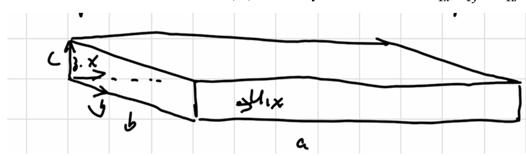

每次撞击动量改变为$2mu$，间隔时间为：

$$
\Delta t = \frac{2a}{u_{1x}}
$$

$$
\begin{gathered}
F_1 = \frac{\Delta (mu_x)}{\Delta t} = \frac{mu_{1x}^2}{a} \\
P_1 = \frac{F_1}{bc} = \frac{mu_{1x}^2}{V}\\
P = \sum_i P_i = \frac mV \sum_i u_{ix}^2
\end{gathered}
$$

With symmetry $\langle u_x^2 \rangle = \langle u_y^2 \rangle = \langle u_z^2 \rangle$

$$
\begin{gathered}
u^2 = u_x^2 + u_y^2 + u_z^2 \rightarrow \langle u^2 \rangle = \langle u_x^2 \rangle + \langle u_y^2 \rangle + \langle u_z^2 \rangle = 3\langle u_x^2 \rangle \\
PV = \frac 13 Nm\langle u^2 \rangle \\
\frac 12m\langle u^2 \rangle = \frac 32 \frac{PV}{N} = \frac 32 k_BT \\
\frac 13 M\langle u^2 \rangle = RT
\end{gathered}
$$

that is :

$$
\boxed{\sqrt{\langle u_x^2 \rangle} = \sqrt{\frac{3RT}{M}}}  
$$

let $h(u_x,u_y,u_z)$ be the fraction of molecules with velocity between $u_x + du_x,u_y + du_y, u_z + du_z$, as independent:

$$
h(u_x,u_y,u_z) = f(u_x) + f(u_y) + f(u_z)
$$

之后利用Boltzman公式，然后归一化概率密度函数：

$$
\begin{gathered}
f(u_x) = \sqrt{\frac{M}{2\pi RT}} e^{\frac{Mu_x^2}{2RT}}\\
h(u_x,u_y,u_z) = \left( \frac{M}{2\pi RT} \right)^\frac 32 e^{-M(u_x^2 + u_y^2 + u_z^2)/2RT}
\end{gathered}
$$

as polar coordinate，转化为球坐标（即在薄球壳内认为$\times 4\pi u^2$）:

$$
\begin{gathered}
F(u)du = 4\pi \left( \frac{M}{2\pi RT} \right)^\frac 32 u^2 e^{-Mu^2/2RT} du\\
\boxed{
\langle u \rangle = 4\pi \left( \frac{M}{2\pi RT} \right)^\frac 32 \int u^3 e^{-Mu^2/2RT} du = \sqrt{\frac{8RT}{\pi M}}
}\\
\langle u^2 \rangle = 4\pi \left( \frac{M}{2\pi RT} \right)^\frac 32 \int u^4 e^{-Mu^2/2RT} du = \frac{3RT}{M}
\end{gathered}
$$

求导可得最概然速率：

$$
u_p = \sqrt{\frac{2RT}{M}}
$$

---

### Collision of gas

assume collision in $dt$ in the oblique cylinder，考虑能撞上面积A的分子数：

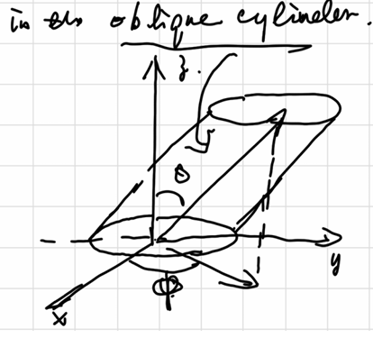

柱形内碰撞分子数等于$柱内分子数 \times 速度概率 \times 方向概率$

$$
\begin{aligned}
\dd N_{coll} &= \rho(Audt)\cos\theta \cdot F(u)du \cdot \frac{\sin\theta \dd\theta \dd\varphi}{4\pi} \\
\dd \xi_{coll} = \frac{\dd N_{coll}}{A \dd t} &= \rho u F(u)du \frac{\sin\theta\cos\theta \dd\theta \dd\varphi}{4\pi} \\
\xi_{coll} &= \frac{\rho}{4} \left< u \right>
\end{aligned}
$$

其中$\xi_{coll}$代表碰撞频率，即单位面积单位时间的碰撞次数。

---

### Mean Free Path

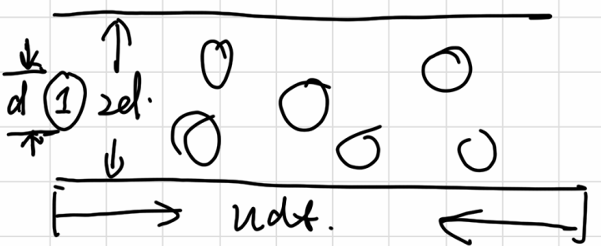

molecules in the cylinder will be collided

$$
\begin{gathered}
dN_{coll}  =\rho\pi d^2 \langle u_r \rangle dt \\
Z_A = \frac{dN_{coll}}{dt} = \rho\pi d^2\sqrt{\frac{8RT}{\pi \mu}} = \rho\pi d^2\sqrt{\frac{16RT}{\pi m}}
\end{gathered}
$$

(in dealing with two molecules relative motion)

$Z_A$ is called **collision frequency of one molecule**

$$
l = \langle u \rangle dt = \langle u \rangle / Z_A  = \frac{1}{\sqrt{2}\rho \pi d^2} = \frac{RT}{\sqrt{2}N_AP \pi d^2}
$$

$l$ is called **mean free path**

the **total collision frequency** $Z$ is:（the average angle is 90° so $u_r = \sqrt{2}u$）

$$
\begin{gathered}
Z_{AA} = \frac 12 \rho Z_A = \frac12 \pi d^2 \langle u_r \rangle \rho^2  =  \frac{1}{\sqrt2} \pi d^2 \langle u \rangle \rho^2\\
Z_{AB} = \sigma_{AB} \langle u_r \rangle \rho_A \rho_B = \pi\left( \frac{d_A + d_B}{2} \right)^2 ·\sqrt{\frac{8RT}{\pi \mu}}·\rho_A \rho_B
\end{gathered}
$$

**Collision theory**: $r \propto Z_{AB}$ and rxn only happen when $u_r > u_0$

$$
\begin{gathered}
\dd Z_{AB} \propto u_rF(u_r) = u_r^3 \exp(-\frac{\mu u_r^2}{2k_BT}) \dd u_r = Au_rF(u_r) \\
Z_{AB} = A\int_0^\infty u_rF(u_r) \to A = \sigma_{AB}\rho_A\rho_B(\frac{\mu}{k_BT})^\frac32(\frac2\pi)^\frac12
\end{gathered}
$$

let $\epsilon_r = \frac12 \mu u_r^2$ :

$$
\begin{aligned}
r = \int_{\epsilon_c}^\infty dz_{AB} &= \sigma_{AB}\rho_A\rho_B (\frac{1}{k_BT})^\frac32(\frac8{\pi\mu})^\frac12 \epsilon_r \exp(-\frac{\epsilon_r}{k_BT}) d\epsilon_r \\
&= \sigma_{AB}\rho_A\rho_B(\frac{8k_BT}{\pi\mu})^\frac12(1+\frac{\epsilon_C}{k_BT})\epsilon_r \exp(-\frac{\epsilon_r}{k_BT}) \\
&= A\exp(-\frac{\epsilon_r}{k_BT})\rho_A\rho_B
\end{aligned}
$$

即为**Arrhenius Equation**

---

### Phenomenological Kinetics


$$
\ce{\nu_AA + \nu_BB -> \nu_YY + \nu_ZZ}
$$

$$
\begin{gathered}
r = \frac{d\xi}{dt} = -\frac{1}{\nu_A}\frac{dn_A}{dt} = \frac{1}{\nu_Y}\frac{dn_Y}{dt} \\
r = k[\ce{A}]^{m_A}[\ce{B}]^{m_B} \\
\ln r = \ln k +  m_A\ln{[\ce{A}]} +  m_B\ln{[\ce{B}]}
\end{gathered}
$$

first/second order reactions ....

**Transition State Theory**:

- Reactant are in eq. with the activated complex(AC) or transition state
- AC converts to product in a irreversible step


$$
\begin{gathered}
\ce{A + B <=> [AB]^\ddagger -> P} \\
K_c^\ddagger =\frac{[AB^\ddagger]c^{\circ}}{[A][B]}
\end{gathered}
$$

at eq $\mu_A + \mu_B = \mu_{AB^\ddagger}$

from statistical mechanics: $Q = q^N / N!$

$$
\begin{gathered}
\mu = -RT(\frac{\partial \ln Q}{\partial N})_{VT} = -RT(\frac{\partial \ln {\frac{q^N}{N!}}}{\partial N})_{VT} =
-RT\ln{q/N} \\
\mu^\ddagger = \mu_A + \mu_B \rightarrow \frac{q^\ddagger}{N^\ddagger} = \frac{q_A}{N_A} \frac{q_ B}{N_B}\\
\frac{N^\ddagger}{N_AN_B} = \frac{q^\ddagger}{q_Aq_B} \\
K_c^\ddagger = \frac{\frac{q^\ddagger}{V}·c_0}{\frac{q_A}{V}\frac{q_B}{V}} = \exp(-\frac{\Delta^\ddagger G ^\circ}{RT})
\end{gathered}
$$


let $\nu_c$ be the freq. at which AC cross over the barrier


$$
\begin{gathered}
\frac{d[P]}{dt} = \nu_c[AB^\ddagger] = k[A][B] \\
k = \nu_c K_c^\ddagger /c^\circ
\end{gathered}
$$

---

### Normal mode for the rxn

对于普通分子的三维配分函数：

$$
q_t = \frac{(2\pi mk_BT)^\frac32}{h^3} V
$$

对于AC，只有一维的平动坐标：

$$
q_t^\ddagger = \frac{(2\pi m^\ddagger k_BT)^\frac12}{h} \delta
$$

平衡常数

$$
\begin{gathered}
K_c^\ddagger = \frac{(2\pi m^\ddagger k_BT)^\frac12}{h} \delta \frac{\frac{q^\ddagger_{other}}{V}·c_0}{\frac{q_A}{V}\frac{q_B}{V}} \\
k = \frac{(2\pi m^\ddagger k_BT)^\frac12}{h} \delta\nu_C \frac{\frac{q^\ddagger_{other}}{V}·c_0}{\frac{q_A}{V}\frac{q_B}{V}} = \frac{(2\pi m^\ddagger k_BT)^\frac12}{h} \left< u_{AC} \right> \frac{\frac{q^\ddagger_{other}}{V}·c_0}{\frac{q_A}{V}\frac{q_B}{V}}
\end{gathered}
$$

在一维坐标上积分速率得到

$$
\left< u_{AC} \right> = \sqrt{\frac{k_B T}{2\pi m^\ddagger}}
$$

代入即可得到：

$$
k = \frac{k_BT}{hc_0} K^\ddagger = \frac{k_BT}{hc_0} e^{-\frac{\Delta G^\ddagger}{RT}}
$$

---

### Arrhenius Equation

求导得：

$$
\begin{aligned}
\dv{\ln k}{T} &= \frac 1T + \dv{\ln K_C^\ddagger}{T} \\
&= \frac 1T + \dv{T}(\frac{\Delta G^\ddagger}{RT}) = \frac 1T + \frac{\Delta U^\ddagger}{RT^2} \\
&= \frac 1T + \frac{\Delta H^\ddagger + RT}{RT^2} = \frac{\Delta H^\ddagger + 2RT}{RT^2}
\end{aligned}
$$

由此即可得：

$$
E_a = \Delta H^\ddagger + 2RT
$$

---

## Chapter 4: Chemical Kinetics (II)

## Potential Energy Surface

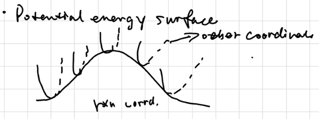

the top point of the surface is called **Saddle Point**

at local minimum:

$$
\frac{\partial^2u}{\partial x^2} > 0, k>0, \nu = \sqrt{\frac{\mu}{k}} \text{ is real}
$$

at local maximum:

$$
\frac{\partial^2u}{\partial x^2} < 0, k<0, \nu = \sqrt{\frac{\mu}{k}} \text{ is imaginary}
$$

---

### KIE

#### Primary KIE

**Zero Point Energy**: $E_0 = \frac 12 h\nu$ for ground state

**Harmonic Approx.**: $\displaystyle{\nu = \frac 1{2\pi}\sqrt{\frac k\mu}}, \tilde{v} = \frac 1{2\pi c}\sqrt{\frac k\mu}$

$$
\frac {\nu_{CH}}{\nu_{CD}} = \sqrt{\frac{m_Dm_C(m_D+m_C)}{m_Hm_C(m_H+m_C)}} \approx \sqrt2
$$

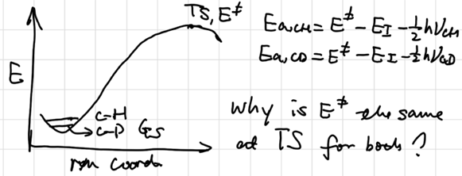

$$
\begin{aligned}
\ln(\frac{k'_{CH}}{k'_{CD}}) &= \ln{\frac {A_H}{A_D}} + \frac12 \frac{h(\nu_H-\nu_D)}{k_BT}\\
\frac{k'_{CH}}{k'_{CD}} &= \exp({\frac12 \frac{h(\nu_H-\nu_D)}{k_BT}}) \approx 1\sim10
\end{aligned}
$$


#### Secondary KIE

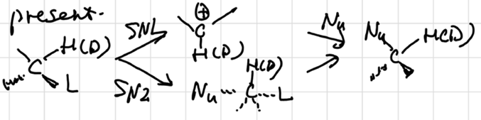

KIE: $S_N1$ ~ 1.2, $S_N2$ ~ 1. why?

$S_N1$ mechanism involves a temporary increase in the bond order of C-H(D)

---

#### Early vs. Late TS

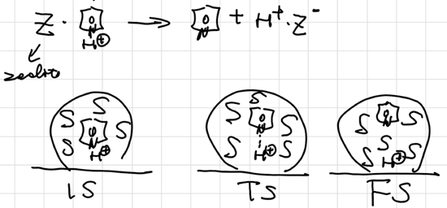

- Early TS: solvent interacts with IS&TS similarly ⇒ No solvent effect

- Later TS: solvent interacts with IS&TS differently ⇒ expect solvent effects

---

### Postulates based on TST

#### Bronsted-Evans-Polanyi principle (BEP)

for a series of similar reactions:

$$
\Delta G_1^\ddagger - \Delta G_2^\ddagger = \alpha(\Delta G_1-\Delta G_2)
$$

or

$$
\ln(k_2/k_1) = \alpha\ln(K_2/K_1)
$$

where $0<\alpha<1$

#### The Hammond Postulate

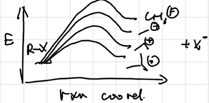

more reactive rxn will produce AC more resembles the reactant, result in less selectivity (**Activity-Selectivity Principle**)

#### The Curtin-Hammett Principle

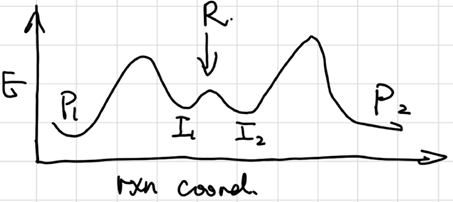

The ratio of products is determined by the relative heights of the highest energy barriers, leading to different products

#### Microscopic Reversibility

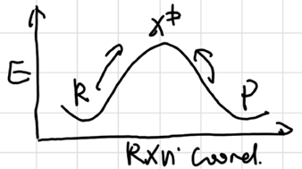{ style="display: block; margin: 0 auto;" }

The forward and reverse rxns go identical path

#### Kinetic vs Thermodynamic Control

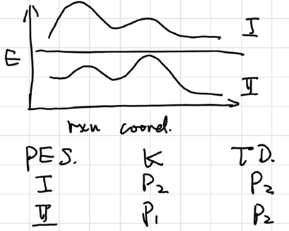{ style="display: block; margin: 0 auto;" }

#### Quasi Steady Approx. (QSSA)

Key assumptions:

- Concentrations of intermediates are low (why)

- Variations of concentrations of intermediates with time are negligible.

consider rxn:

$$
\ce{A ->[k_1] B ->[k_2] C}
$$

we have:

$$
\begin{gathered}
\frac{dx}{dt} = -k_1x \quad \frac{dy}{dt} = k_1x-k_2y \quad \frac{dz}{dt} = k_2y \\
\Rightarrow y = \frac{k_1}{k_2 - k_1}(e^{-k_1t} - e^{-k_2t}) \\
\frac{dy}{dt} = 0 \Rightarrow t_{max} = \frac 1{k_2-k_1}\ln{\frac {k_2}{k_1}} \\
y_{max} =  \frac {k_1}{k_2-k_1}[(\frac {k_2}{k_1})^{\frac {k_1}{k_2-k_1}} - (\frac {k_2}{k_1})^{\frac {k_2}{k_2-k_1}}]
\end{gathered}
$$

as $k_2\gg k_1 \Rightarrow t_{max} \to 0, y_{max} \to 0$

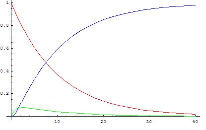

for rxns with more than one intermediates:

$$
\ce{A->[k_1]I_1 ->[k_2]I_2->...->I_n->[k_{n+1}]B}
$$

all $\ce{I_n}$ can consider into one steady state.

#### Pseudo-Equilibrium/ Rate limiting step

 If one step has a significantly lower rate constant, then it is considered as RLS

 Several steps in a row sequence could have low but comparable rate constants ⇒ kinetically relevant not RLS/RDS.

### Surface Mediate rxns

转换频率（Turnover freq.）：

$$
TOF = \frac {r}{[L]}
$$

Most Abundant Reaction Intermediate (MARI):

$$
\theta_i \sim 1
$$

---

## Chapter 5: Chemical Kinetics II

### RDS


let $k_{-2} =0 $

$$
\begin{aligned}
\frac{d[I]}{dt} = 0 &= k_1[R] - k_{-1}[I] - k_2 [I] + k_{-2}[P] \\
&= A\exp(-\frac{\Delta G_1^\ddagger}{RT}) [R] - A\exp[-\frac{\Delta G_1^\ddagger+\Delta G_1}{RT}](I) - A\exp[-\frac{\Delta G_2^\ddagger}{RT}](I)

\end{aligned}
$$

when $\Delta G_1^\ddagger + \Delta G_1 \ll \Delta G_2^\ddagger  $ :

$$
\begin{gathered}
\exp(-\frac{\Delta G_1^\ddagger}{RT}) [R] - \exp[-\frac{\Delta G_1^\ddagger+\Delta G_1}{RT}](I) = 0 \\
[R] = \exp[-\frac{\Delta G_1}{RT}](I)\\
r = k_2[I] = A\exp(-\frac{\Delta G_2^\ddagger}{RT})\exp[\frac{\Delta G_1}{RT}](R) \\
= A\exp[-\frac{\Delta G_2^\ddagger - \Delta G_1}{RT}](R)
\end{gathered}
$$

**Only the highest barrier** determines the rate.

---

### Degree of Rate Control (DRC)

define the DRC of elementary step i :

$$
X_{RC,i} = \frac{k_i}{r}(\frac{\partial r}{\partial k_i})_{k_{j \neq i}, K_i} = (\frac{\partial \ln r}{\partial \ln k_i})_{k_{j \neq i}, K_i}
$$

for RDS on step i :

$$
X_{RC,i} = 1, \quad X_{RC, j\neq i} = 0
$$

from TST :

$$
\begin{aligned}
X_{RC,i} &= (\frac{\partial \ln r}{\partial \ln k_i})_{k_{j \neq i}, K_i} \\
&= (\frac{\partial \ln r}{\partial \ln (\frac{k_BT}{h} \exp(\frac{-\Delta G_i^\ddagger}{RT}))})_{k_{j \neq i}, K_i} \\
&= (\frac{\partial \ln r}{\partial (\frac{-\Delta G_i^\ddagger}{RT})})_{k_{j \neq i}, K_i}

\end{aligned}
$$

we can also define **Degreee of thermodynamic controlled** ：

$$
\begin{aligned}
X_{TC,i} &=  (\frac{\partial \ln r}{\partial (\frac{-\Delta G_i}{RT})})_{k_{j \neq i}, K_i}
\end{aligned}
$$


for eg:

$$
\begin{gathered}
\ce{A + \ast <--> A\ast} &K_1 \\
\ce{B + \ast <--> B\ast} &K_2 \\
\ce{A\ast + B\ast -> AB\ast + \ast} &RDS, k_3\\
\ce{AB\ast <--> AB + \ast}

\end{gathered}
$$

\[
K_1 = \frac{\theta_A}{P_A \cdot \theta_*} \quad K_2 = \frac{\theta_B}{P_B \cdot \theta_B}
\]

\[
\theta_A + \theta_B + \theta_* = 1
\]

若A为MARI物种：
\[
\theta_* = \frac{1}{P_A K_1} \quad \theta_B = \frac{K_2 P_B}{K_1 P_A}
\]

\[
\tau = k_3 \theta_A \theta_B = \frac{k_3 K_2}{K_1} \frac{P_B}{P_A}= \frac{k_B T}{h} \exp \left[ -\frac{\Delta^\ddagger G_3^0 + \Delta G_2^0 - \Delta G_1^0}{RT} \right] \frac{P_B}{P_A}
\]

\[
= \frac{k_B T}{h} \exp \left[ -\frac{\neq G_3^0 - \Delta G_1^0 - \Delta G_2^0 + \Delta G_2^0 - \Delta G_1^0}{RT} \right] \frac{P_B}{P_A}
\]

\[
= \frac{k_B T}{h} \exp \left[ -\frac{\neq G_3^0 - 2G_A^0}{RT} \right] \frac{P_B}{P_A}
\]

可得$X_{A,RC} = -2$，为毒化剂作用

$X_{\ddagger,RC} = 1$意味着RDS控制反应速率

---

### Enzymatic Catalysis

Michaelis Manton kinetics

$$
r = \frac{r_{max}[S]}{K_m + [S]}
$$


Reaction with 2 substates:

$$
\begin{gathered}
E+S_1 \rightleftharpoons ES_1 &K_1\\
E+S_2 \rightleftharpoons ES_2 &K_2\\
ES_1+S_2 \rightleftharpoons ES_1S_2 &K_3\\
ES_2+S_1 \rightleftharpoons ES_1S_2 &K_4\\
ES_1S_2 \rightarrow E+P &K_5\\
K_1 = \frac{[E][S_1]}{[ES_1]} \quad K_2 = \frac{[E][S_2]}{[ES_2]} \\
K_3 = \frac{[ES_1][S_2]}{[ES_1S_2]} \quad K_4 = \frac{[ES_2][S_1]}{[ES_1S_2]}
\end{gathered}
$$

solve :

$$
r = \frac{k[E_0]}{1+\frac{k_4}{[S_0]} + \frac{k_3}{[S_2]} + \frac{k_2k_4 + k_2k_3}{[S_1][S_2]}}
$$


Assuming $[S_2]$ is large :

$$
r = \frac{\frac{k[E_0][S_2]}{[S_2]+K_3} \cdot [S_1]}{\frac{K_1K_3 + K_4[S_2]}{[S_2]+K_3}+[S_1]} = \frac{k[E_0][S_1]}{K_4 + [S_1]}
$$

---

### Kinetics in thermal dynamically non-ideal systems


$$
\ce{A + B <--> X^\ddagger -> P}
$$

应用艾琳方程：

$$
r = \frac{k_BT}{h}c_x^\ddagger = \frac{k_BT}{h}k^\ddagger \frac{\gamma_A \gamma_B}{\gamma^\ddagger} c_Ac_B
$$

we have **Broused-Bjerrum relation**

$$
k = k_1\frac{\gamma_A \gamma_B}{\gamma^\ddagger}
$$

#### Reaction is dilute electrolytes

$$
\lg \frac{k}{k_0} = -cZ_A^2\sqrt{I}-cZ_B^2\sqrt{I}+c(Z_A+Z_B)^2\sqrt{I} = 2cZ_AZ_B\sqrt{I}
$$

if $Z_A$ or $Z_B = 0$ ，$k = k_0$

#### 环己烯的氢气加成

on Pt：

```text
H₂(g) ⇌ H₂(l)          // 溶解
H₂(l) ⇌ H₂(p)          // p: 物理吸附于表面
H₂(p) + ** → 2H* (k₃)  // **RDS：氢分子解离**
```

$$
\begin{aligned}
r &= \frac{k_BT}{h} k^\ddagger \frac{\gamma_{H2}^p}{\gamma^\ddagger} c_{H2}^p \\
&= \frac{k_BT}{h} K_Hk^\ddagger \frac{\gamma_{H2}^l}{\gamma^\ddagger} c_{H2}^l
\end{aligned}
$$

由于放热步骤，可认为过渡态和H2活度系数相近。于是$r \propto K_H c^l_{H2}$依赖于溶剂。

on Pd:

```text
H₂(g) ⇌ H₂(l) ⇌ H₂(p) ⇌ 2H* (快速平衡)
RH* + H* ⇌ X^\neq → RH₂** (k₆ₐ, **RDS：表面加氢**)
```

$$
\begin{aligned}
r &= \frac{k_BT}{h} k^\ddagger \frac{\gamma_{RH*}c_{RH*}\gamma_{H*}c_{H*}}{\gamma^\ddagger} \\
&= L\frac{k_BT}{h} k^\ddagger \frac{\gamma_{RH*}}{\gamma^\ddagger}\sqrt{K_H^1p_{H2}a_{**}}
\end{aligned}
$$

RH为MARI物种，其物理状态受金属表面作用支配而与溶剂无关。

---

### 补偿效应

- 分解反应活化熵增加而活化焓也增加
- 缩合反应活化熵减小而活化焓也减小

焓熵相互补偿，导致$k$变化不大。考虑水合：


---

### 反应器

#### 间歇式反应器 Batch

- **系统类型**：**封闭系统**。
- **混合方式**：投料时瞬间混合，反应过程中**无混合**。
- **浓度特征**：所有组分的浓度**随时间不断变化**。不存在真正的稳态。
- **应用**：常用于小批量、多品种的生产，如制药、精细化工。

#### **连续搅拌釜式反应器** Continuously stirred tank reactor

- **系统类型**：**开放系统**。
- **混合方式**：**瞬间、全混**。进料一进入CSTR，其组成立即与釜内及出口物料完全相同。
- **浓度特征**：釜内各处浓度均匀，且**不随时间变化（稳态）**，但等于**出口的低浓度**。
- **应用**：适用于对返混要求不高的反应，易于控制温度和连续操作。

#### **活塞流反应器**l Pug-flow reaction

- **系统类型**：**开放系统**。
- **混合方式**：在垂直于流动的方向上**无混合**；在沿流动的方向上**无混合**。流体像“活塞”一样向前推进。
- **浓度特征**：反应物浓度**沿反应器长度方向逐渐降低**。在任一特定截面上，组成是均匀的。
- **应用**：适用于要求高转化率的反应，因为它避免了返混导致的效率下降，是工业上最常用的反应器类型之一。

---

## Chapter 6 Electrode Kinetics

### Electro Kinetics


理想可极化电极：不允许电子通过，只能积累电荷，电极本身不发生电化学反应，如惰性电极

理想不可极化电极：允许电子通过，反应快且电位基本不变，如参比电极

实际存在过电位：

$$
\eta = E - E_{eq}
$$


#### Semi-empirical Steady-State Treatment

扩散层：假定电极附近有一段无法搅拌的，厚度为$\delta$的停滞层（*stagnant layer*），其浓度是线性减小的：


$$
v_{mt} = D_O (\dv{C_O}{x})_{x=0} = D_O \frac{C_O^b - C_O}{\delta_O} = m_O(C_O^b - C_O)
$$

where $m = D / \delta$ stands for 质量传递系数（mass transfer coef.）. 若认为单位时间的扩散通量可用电流表示：

$$
\frac{i}{nFA} = m_O(C_O^b - C_O) = m_R(C_R - C_R^b)
$$

当$C_O = 0$时达到极限电流：

$$
i_l = nFAm_OC_O^b, \quad \frac{C_O}{C_b} = 1-\frac{i}{i_l}, \quad E = E^{\circ\prime} + \frac{RT}{nF}\ln\frac{i_l-i}{i_l}
$$

if R initially absent:

$$
\begin{gathered}
C^b_R = 0, C_R = \frac{i}{nAFm_R} \\
C_O  = (1-\frac{i}{i_l})\frac{i_l}{nAFm_O} \\
E = E^{\circ\prime} - \frac{RT}{nF} \ln \frac{m_O}{m_R} + \frac{RT}{nF} \ln \frac{i_l - i}{i_l}
\end{gathered}
$$

令半波电位$i = i_l/2$：

$$
E_{1/2} = E^{\circ\prime} - \frac{RT}{nF} \ln \frac{m_O}{m_R}
$$

可反映相对扩散速率

id R is isolable:

$$
\begin{gathered}
a_R = 1 \\
E = E^{\circ\prime} + \frac{RT}{nF}\ln C_O = E^{\circ\prime} + \frac{RT}{nF}\ln\frac{i_l-i}{i_l} + \frac{RT}{nF}\ln{C_O^b}
\end{gathered}
$$

when i=0, $C_O = C_O^b$:

$$
E_eq = E^{\circ\prime} +\frac{RT}{nF}\ln{C_O^b}
$$

于是过电位：

$$
\eta = |E-E_{eq}| = |\frac{RT}{nF}\ln\frac{i_l-i}{i_l}|
$$


### Electrode kinetics

**Tafel Equation**:

$$
\eta = a+b\log i
$$

b：Tafel 斜率 (mV/dec)，表示电流增一数量级所需的电位变化

***Bulter-Volmer Kinetics***

---

## Chapter 5: Phase Diagrams

---

### Canonical ensemble 正则系综

> define
>
> $$
> \alpha = -\frac{\mu}{kT}, \beta = \frac 1{kT}
> $$
>

we have mixing entropy(用概率代替浓度):

$$
S = -k\sum_I f_i\ln f_i
$$

and two condtrains:

$$
\begin{cases}
\sum_i f_i = 1 \\
\sum_i f_i E_i = U
\end{cases}
$$

when reaching maximum entropy, we can derive:

$$
f_i = \frac{e^{-\beta E_i}}{\sum_ie^{-\beta E_i}} = \frac{e^{-\beta E_i}}{Z(V,T,N)}
$$

where $Z(V,T,N)$是**正则配分函数**

在这里用离散和是不精确的，我们改成积分形式。by using H, for single partical:

$$
Z = \frac{1}{h^3} \int e^{-\beta H(\vec x,\vec p)} d^3\vec x d^3\vec p
$$

and for many partials:

$$
Z = \frac{1}{h^{3N}} \int \prod_{i=1}^{N} e^{-\beta H(\vec x_i , \vec p_i)} d^{3}\vec x_i d^{3} \vec p_i
$$

if particals are 全同：

$$
Z = \frac{1}{N!h^{3N}} \int \prod_{i=1}^{N} e^{-\beta H(\vec x_i , \vec p_i)} d^{3}\vec x_i d^{3} \vec p_i  = \frac{1}{N!h^{3N}}\pqty{\int \prod_{i=1}^{N} e^{-\beta U(\vec x_i)} d^{3}\vec x_i}\pqty{\int \prod_{i=1}^{N} e^{-\beta p^2/2m} d^{3}\vec p_i}
$$

这些即认为最小的单位空间是$\frac 1{h^3}$，把N个粒子分配到这些空间里。

通过配分函数计算能量的期望值：

$$
\begin{aligned}
\left< Z \right> = \sum_i E_iP_i &= \frac1Z \sum_i E_ie^{-\beta E_i}\\
&= -\frac1Z \frac{\partial}{\partial\beta} Z(\beta, E_i) \\
&= -\frac{\partial \ln Z}{\partial \beta} = kT^2\frac{\partial \ln Z}{\partial T}
\end{aligned}
$$

进而还可得出自由能的关系，我们有：

$$
\begin{gathered}
S = -k\sum f_i \ln f_i = -\frac kZ\sum (-\beta E_i - \ln Z)e^{-\beta E_i} = k(\ln Z + \beta\left< E \right>) \\
\left< E \right> = U \\
F = U-TS = -kT\ln Z
\end{gathered}
$$


巨配分函数$\Xi$：

$$
\Xi(\mu, V,T) = \sum_{N=0}^\infty Z(N,V,T) e^{N\beta\mu} = 1+\sum_{N=1}^\infty Z(N,V,T) \lambda^N
$$

where $\lambda = e^{\beta\mu}$ represent absolute acivity（绝对活度）

回到气体，对单个粒子，由于动能项积分可以从麦克斯韦分布推导，我们有：

$$
Z_N = \frac1{N!h^{3N}} \pqty{2\pi mkT}^{3N/2} \int e^{-\beta U(\vec x)} d^3\vec x
$$

定义构型积分：

$$
Q_N = \int e^{\sum_{i<j} U(r_{ij})} \dd r_1 ... \dd r_N
$$

于是：

$$
Z_N = \frac1{N!} \pqty{\frac{2\pi mkT}{h^2}}^{3N/2} Q_N
$$

于是我们有：

$$
\Xi = \sum_{N=0}^{\infty} \frac{z^N}{N!}Q_N \qc z = \lambda \pqty{\frac{2\pi mkT}{h^2}}^{3/2}
$$

压强在恒体积下：

$$
P = kT\pqty{\pdv{\ln \Xi}{V}}_{T, \mu} = \frac{kT}{\Xi}\sum_{N=0}^{\infty} \frac{z^N}{N!} \pdv{Z_N}{V} = \frac{kT}{\Xi V}\sum_{N=0}^{\infty} \frac{z^N}{N!} Z_N
$$

这里我们引入**集团展开**（Cluster Expansion）。我们知道维利展开：

$$
\frac{P}{kT} = \rho + B_2(T) \rho^2 + B_3(T)\rho^3 ... = b_1 z + b_2z^2 + b_3z^3 ...
$$

两边系数对比：

$$
(\sum_{j=1}^{\infty} b_j z^j ) = \frac{1}{V}\ln(1 + \sum_{N=1}^\infty \frac{z^N}{N!} Q_N)
$$

事实上，在这里泰勒硬展开就可以得到 $b_j$ 的各个解，但这样太麻烦了。不过比较第一项就可以得到：

$$
b_1 = Q_1/V = 1 \\
b_2 = -\frac{1}{2V}(Z_2 - Z_1)^2
$$

这是由于此时没有任何外场。

引入**Mayer函数**：

$$
f_{ij} = e^{-\beta U(r_{ij})} - 1
$$

于是对于稀薄气体展开：

$$
\prod_{i<j} e^{-\beta U(r_{ij})} = \prod_{i<j}(1+f_{ij}) = 1+\sum_{i<j} f_{ij} + \sum_{i<j,k<l} f_{ij} f_{kl}
$$

$$
\rho = \ev{N}/V = \frac{kT}{V} \pqty{\pdv{\ln \Xi}{\mu}}_T = \frac{\lambda}{V}\pqty{\pdv{\ln \Xi}{\lambda}}_T = \frac{z}{V}\pqty{\pdv{\ln \Xi}{z}}_T
$$

$$
\rho = \frac{z}{kT} \pqty{\pdv{P}{z}}_{V,T} = \sum_{j=1}^\infty jb_iz^{j}
$$

现在假设我们认为：

$$
z = a_1 \rho + a_2 \rho^2 + a_3 \rho^3 ... \\
\rho = \sum_{j=1}^\infty jb_j(a_1 \rho + a_2 \rho^2 + a_3 \rho^3 ...)^j
$$

对照上面的式子：

$$
a_1 = 1/b_1 = 1 \\
b_1a_2 + 2b_1a_1^2 = 0 \Rightarrow a_2 = -2b_2 \\
b_1a_3 + 4b_2a_1a_2 + 3b_3a_1^3 = 0 \Rightarrow a_3 = -3b_3 + 8b_2^2
$$

回到：

$$
\frac{P}{kT} = \rho + B_2(T) \rho^2 + B_3(T)\rho^3 ... = b_1 z + b_2z^2 + b_3z^3 ...
$$

于是：

$$
B_2(T) = -b_2 = -\frac{1}{2V} (Q_2 - Q_1^2) \\
B_3(T) = 4b_2^2 - 3b_3 = -\frac{1}{3V^2}[V(Q_3 - 3Q_2Q_1 + 2Q_1^3) - 3(Q_2 - Q_1^2)^2]
$$

再努努力！

$$
\begin{aligned}
B_2(T) &= -\frac{1}{2V} \iint(e^{-\beta U(\vec r_{12})} - 1)\dd(\vec r_1)\dd(\vec r_2) \\
&= -\frac{1}{2V} \int \dd(\vec r_1) \int(e^{-\beta U(\vec r_{12})}-1)\dd(\vec r_{12}) \\
&= -\frac12 \int \dd(\vec r_1) \int(e^{-\beta U(r_{12})}-1)4\pi r_{12}^2 \dd(r_{12}) \\
&= -2\pi \int(e^{-\beta U(r)}-1)r^2 \dd r = -2\pi \int_0^\infty f_{12}r^2\dd r
\end{aligned}
$$

现在我们考虑 $Q_3$ ，这时候就要考虑三体作用了。

$$
U(r_1,r_2,r_3) \simeq U(r_1,r_2) + U(r_2,r_3) + U(r_1,r_3)
$$

 于是：

$$
\begin{aligned}
Q_3 &= \iiint e^{U_3/kT} \dd{\vec r_1}  \dd{\vec r_2}  \dd{\vec r_3} = \iiint(1+f_{12})(1+f_{23})(1+f_{13})\dd{\vec r_1}  \dd{\vec r_2}  \dd{\vec r_3} \\
&= \iiint(f_{12}f_{23}f_{13} + f_{12}f_{23} + f_{12}f_{13} + f_{23}f_{13} + f_{12} + f_{13} + f_{23} + 1)\dd{\vec r_1}  \dd{\vec r_2}  \dd{\vec r_3}
\end{aligned}
$$

经过一堆化简可以得到：

$$
B_3(T) = -\frac{1}{3V}\iiint f_{12}f_{23}f_{13}\dd{\vec r_1}  \dd{\vec r_2}  \dd{\vec r_3} = -\frac{1}{3V}\iiint \triangle \dd{\vec r_1}  \dd{\vec r_2}  \dd{\vec r_3}
$$

其中 $\triangle$ 表示这是三个粒子两两作用的结果

对于第四位力系数：

$$
B_4(T) = \iiiint (3\square + 6\oslash + 1\boxtimes) \dd{\vec r_1}  \dd{\vec r_2}  \dd{\vec r_3} \dd{\vec r_4}
$$

其中对于四粒子系统，有3种 $\square$ 作用，6种 $\oslash$ 作用，1种 $\boxtimes$ 作用。

for 维利展开：

$$
B_2 = -2\pi \int_0^\infty [e^{-\beta u(r)} - 1] r^2 \dd r
$$

hard-sphere :

$$
u(r) = \begin{cases}
\infty ,&r<\sigma \\
0 ,&r\ge \sigma
\end{cases}
$$

$$
B_2 = -2\pi \int_0^\sigma (-1)r^2\dd r = \frac{2\pi}{3}
$$

square-well potential :

$$
u(r) = \begin{cases}
\infty &r<\sigma \\
-\epsilon &\sigma<r<\lambda\sigma \\
0 &r>\sigma
\end{cases}
$$

$$
B_2(T) = b_0{(1-(\lambda^3-1)(e^{\beta\epsilon}-1))}
$$

Lennard-Jones potential :

$$
u(r) = 4\epsilon [(\sigma/r)^{12} - (\sigma/r)^6]
$$

$$
B_2 = \frac 1Z \int_0^\infty( e^{-\beta u(r)}-1) 4\pi r^2 \dd r
$$


---

## Chapter 6


### Liquid cases: simple liquid theory

for 傻逼 case, He liquid 不考虑量子效应，直观上看就是解一个原子和周围的核和电子的关系，这里就要用B-O近似。

一个粒子包含六个信息：

$$
N(x_1, y_1,z_1,p_x,p_y,p_z)
$$

将N个位置出现粒子的概率用向量表示：

$$
P^{(N)} (\vec r_1 , \vec r_2, \vec r_3, ...\vec r_N, \vec p_1, \vec p_2, \vec p_3,...\vec p_N)
$$

现在我们假设只关心n个粒子的位置状态，其他的通过积分平均掉：

$$
P^{(n)} (\vec r_1 , \vec r_2, \vec r_3, ...\vec r_n) {\dd}\vec r_n ... {\dd}\vec r_1 = \int...\int P^{(n)} (\vec r_1 , \vec r_2, \vec r_3, ...\vec r_n) {\dd}\vec r_n ... {\dd}\vec r_1{\dd}r_{n+1} ... \dd r_N
$$

消掉两边

$$
P^{(n)} (\vec r_1 , \vec r_2, \vec r_3, ...\vec r_n) = \int...\int P^{(n)} (\vec r_1 , \vec r_2, \vec r_3, ...\vec r_n) {\dd}r_{n+1} ... \dd r_N = \int ... \int \frac{e^{-\beta U_N}}{Z_N} {\dd}r_{n+1} ... \dd r_N
$$

密度分布函数：在给定位置$r_1, ...,r_n$同时找到n个粒子的数密度

$$
\rho^{(n)}(\vec r_1 , \vec r_2, \vec r_3, ...\vec r_n) = \frac{N!}{(N-n)!(n)!}P^{(N)}
$$

$$
\rho^{(1)}(\vec r_1 , \vec r_2, \vec r_3, ...\vec r_n) = \frac{N!}{(N-1)!}P^{(N)} = N\int ... \int \frac{e^{-\beta U_N}}{Z_N} {\dd}r_2 ... \dd r_N = N/V
$$

对均匀体系，显然找到一个粒子的密度分布是是密度常数 $\rho$

$$
\int \rho \dd r = N \qc \rho V = N
$$

correlation function n粒子相关函数 （找到粒子$r$的相对概率）:

$$
g^{(n)} = \frac{\rho^{(n)}(\vec r_1 , \vec r_2, \vec r_3, ...\vec r_n)}{\rho^n}
$$

$$
g^{(2)} = \frac{V^2}{N^2} \frac{N(N-1)}{2}\int ... \int \frac{e^{-\beta U_N}}{Z_N} {\dd}r_{3} ... \dd r_N
$$

for sphere-symmetry molecules, $g^{(2)}$ only depend on $(r_1 - r_2)$

对这里的 $g(r)$ 而言，归一化积分，得到的应该是除了参考粒子外得到所有其他粒子数 $N-1$ ：

$$
\int_0^\infty \rho g(r)4\pi r^2\dd r = N-1
$$

对于相关函数：

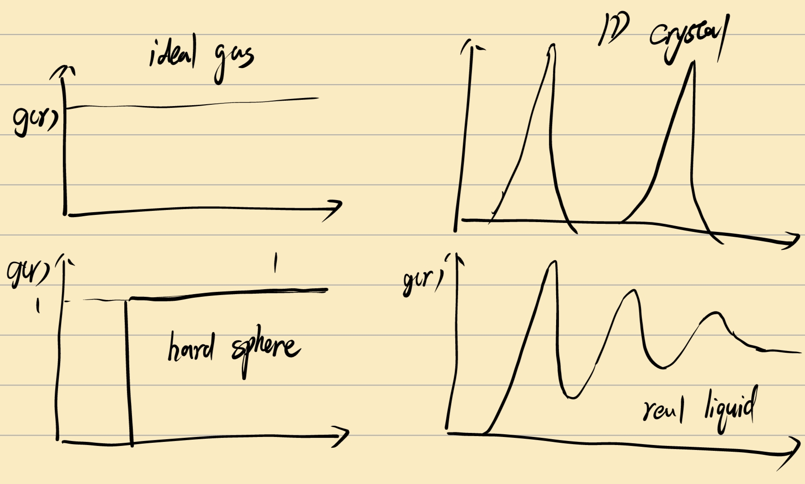

这里液体呈现出类似1D-crystal的关系，这是由于液体由于熵效应，在半径$\sigma$的地方出现粒子的概率很大，相应的在中间出现的概率很小。

引入结构因子 Structrural factor:

$$
h(r) = g(r)-1
$$

for pair-wise additive potential :

$$
U_N(r_1, r_2,r_3...r_N) = \sum_{i<j} U(r_{ij}) = \frac{N(N-1)}{2}U_{12}
$$

$$
\overline E = kT^2\pqty{\pdv{\ln Q}{T}} = 3/2 NkT + \overline U
$$

$$
\overline{U} = \frac{\int...\int e^{-\beta U_N}\dd r_1 ... \dd r_N}{Z_N} = \frac{N(N-1)}{2} \frac{\int...\int e^{-\beta U_N}\dd r_1 ... \dd r_N}{Z_N}
$$

经过一番推导：

$$
\overline U = \frac{4\pi N^2}{V} \int_0^\infty U(r)g(r) r^2 \dd r
$$

so $\overline E = ...$

$$
P = kT(\pdv{\ln Q}{V})_{N,T} = kT(\pdv{\ln Z_N}{V})_{N,T}
$$

where

$$
Z_N = \int_0^{V^{1/3}} \int_0^{V^{1/3}} \int_0^{V^{1/3}} e^{-\beta U_N} \dd x_1 \dd y_1 \dd z_1 ... \dd x_n \dd y_n \dd z_n
$$

作变量替换

$$
x_i' = x_i / V^{1/3}
$$

$$
Z_N = \int_0^{1} \int_0^{1} \int_0^{1} e^{-\beta U(x_1'V^{1/3}...)} \dd x_1' \dd y_1' \dd z_1' ... \dd x_n' \dd y_n' \dd z_n'
$$

于是

$$
\begin{aligned}
\pdv{Z}{V} &= NV^{N-1} \int_0^{1} \int_0^{1} \int_0^{1} e^{-\beta U_N} \dd x_1' \dd y_1' \dd z_1' ... \dd x_n' \dd y_n' \dd z_n' \\
& \quad -V^N\int_0^{1} \int_0^{1} \int_0^{1} \beta e^{-\beta U_N} \pdv{U_N}{V} \dd x_1' \dd y_1' \dd z_1' ... \dd x_n' \dd y_n' \dd z_n'
\end{aligned}
$$

解构一下：

$$
\pdv{U_N}{V} = \sum_{i<j} \dv{U_{ij}}{{r_{ij}}}\dv{{r_{ij}}}{V} = \sum_{i<j} \dv{U_{ij}}{{r_{ij}}} (\frac13 V^{-\frac23}r_{ij}')
$$

$$
\pdv{\ln Z}{V} = \rho - \frac{\rho^2}{3VkT}\int...\int r_{12} \dv{U(r_{r_12})}{r_{12}} g^{(2)}(r_1,r_2) \dd r_1 \dd r_2
$$

---

## Chapter 7 Polymer

### different levels

- primary structure
- secondary structure
- tertiary structure
- quantinary structure

### simple example: random coil

for freely joint chain:


$N$ as number of residues, $l$ as monomer length, $nl$ as end-to-end length.

define $R_c = Nl$ as counter length:

$$
N_L + N_R = N \\
n = N_L - N_R
$$

so:

$$
W = \frac{N!}{N_L!N_R!} = \frac{N!}{(\frac{N+n}{2})!(\frac{N-n}{2})!}
$$

probability of observing on end-to-end distance of $nl$ is:

$$
P = \frac{W}{2^N} = \frac{N!}{2^N(\frac{N+n}{2})!(\frac{N-n}{2})!}
$$

so

$$
\ln P \approx \sqrt{\frac2{\pi N}} - \frac12 N(\frac{n}{N})^2
$$


for 1D cases:

$$
P = \sqrt{\frac2{\pi N}}e^{-\frac{h^2}{2N}}
$$

for 3D cases:

$$
f =4\pi\pqty{\frac{3}{2\pi Nl^2}}^{3/2} R^2e^{-\frac{3R^2}{2Nl^2}}
$$

so RMSD

$$
RMSD = \sqrt{\int f(R)R^2dR}
$$

conformation entropy:

$$
S = k\ln W
$$

and we know:

$$
S_{max} = S(n=0)
$$

def $\nu = n/N$, we got

$$
\Delta S = -\frac12 kN \ln\Bqty{(1+\nu)^{1+\nu} \cdot (1-\nu)^{1-\nu}}
$$

### calculation of chemical potential

Free energy:

$$
-F = kT\ln Q = \ln Z_N - \ln N! - 3N\ln\Lambda
$$

and

$$
\mu = \pdv{F}{N} = F(N,V,T) - F(N-1,V,T)
$$

$$
\mu = -kT\bqty{\ln(Z_N/Z_{N-1}) - \ln N - \ln \Lambda^3}
$$

这里我们需要计算一个比较难算的量 构型积分之比。我们引入一个参数 $\xi$ 称为耦合参数，现在我们假设第 $N$ 个粒子是一个:ghost: ，它占据一部分空间但不与其他粒子发生作用。当其从0到1的过程相当于时粒子从完全没作用线性变化到与正常作用一样。

so

$$
Z_N(\xi) = \iint e^{-\frac{U(\xi)}{kT}} \dd r_i \dd r_N
$$

where

$$
U_N(r_1, \ldots r_N, \xi) = \sum_{j=2}^N \xi U(r_{1j}) + \sum_{2\le i,j \le N} U(r_{ij})
$$

$$
Z_N(\xi = 0) = \iint e^{-U(r_2,r_N)/kT}\dd r_2 \dd r_N \int 1\dd r_1 = Z_{N-1}V
$$

so 原始转化为

$$
\ln (Z_N/Z_{N-1}) = \ln(Z_N(\xi=1)/Z_N(\xi = 0)) + \ln V = \ln V + \int_0^1 \pdv{\ln Z_N}{\xi} d\xi
$$

$$
\pdv{Z_N}{\xi} = -\beta \int\cdots\int e^{-\beta U(\xi)} \bqty{\sum_{j=2}^N U_{ij}} \dd r_1 \cdots \dd r_N
$$

$$
\begin{aligned}
\pdv{\ln Z_N}{\xi} &= -\beta \int\cdots\int \frac{e^{-\beta U(\xi)}}{Z_N} \bqty{\sum_{j=2}^N U_{ij}} \dd r_1 \cdots \dd r_N \\
&= -\beta \int\cdots\int \frac{(N-1)e^{-\beta U(\xi)}}{Z_N}\dd r_3 \cdots \dd r_N \  U_{12} \dd r_1 \dd r_2 \\
&= -4\pi\beta\rho \int_0^\infty U(r)g(r,\xi,T) r^2 \dd r
\end{aligned}
$$

于是就可以表达出化学势。

### perturbation free energy calculation

$$
\begin{aligned}
\Delta F &= F_y - F_x \\
&= -kT \ln\frac{\iint e^{-\beta H_y}\dd r \dd p}{\iint e^{-\beta H_x}\dd r \dd p} \\
&= -kT \ln\frac{\iint e^{-\beta (H_y-H_x)}e^{-\beta H_x}\dd r \dd p}{\iint e^{-\beta H_x}\dd r \dd p} \\
&= -kT\ev{e^{-\beta(H_y - H_x)}}_x
\end{aligned}
$$

然而这样很多情况会失败，原因在于据大多数情况，对于偏离平衡态的 $H_y$ 能量会特别高，导致这个数特别小甚至就是0.

为了避免这一点，我们定义一个耦合参数 $\lambda$ 进行插值：

$$
H(\lambda) = (1-\lambda)H_x + \lambda H_y
$$

这样我们就可以积分计算：

$$
\begin{aligned}
\pdv{F(\lambda)}{\lambda} &= -kT\frac1Q\pdv{Q}{\lambda} \\
&= \frac1Q \iint \pdv{H_\lambda}{\lambda}e^{-\beta H_\lambda} \dd r \dd p \\
&= \ev{\pdv{H(\lambda)}{\lambda}}_\lambda
\end{aligned}
$$

于是

$$
\Delta F = F_y - F_x = \int_0^1 \ev{H_y - H_x}_\lambda \dd \lambda
$$

在实际计算中，通常 $P(F) = e^{-\beta H}/Q$ 是一个突跃值，实际上我i们可以通过测量及其多个温度下的曲线并作其抛物线：
$$
P(H) = \sum_i n_i e^{-\beta_iH}
$$


