# 物理化学(一) 笔记 Physical Chemisnbtry I

## PART I QUANTUM THEORY

## Lecture 1 经典力学

### 1.1 Lagrange 经典力学

我们先考虑动量 $\vb p$，很明显有 $\vb p = m\vb v$。这于是有：

$$
\dv{\vb p}{t} = m \dv{\vb v}{t} = m\vb a = \vb F_{ext}
$$

接下来考虑能量 $E = T+U = \frac 12 m \abs{\vb v}^2 + U(\vb r)$ ：

$$
\begin{aligned}
\dv{E}{t} &= \frac12m\dv{v^2}{t} + \dv{U(x)}{t} = mv\dv{v}{t} + v\dv{U}{x}
\end{aligned}
$$

于是当能量守恒时得到：

$$
\dv{p}{t} = -\pdv{U}{x} \Rightarrow \dv{\vb p}{t} = -\pdv{U}{\vb r}\hat r
$$

在*Newton*力学体系，相空间内的一个点 $(\vb r(0), \vb v(0))$ 的演化遵从：

$$
\begin{cases}
\dv{\vb r}{t} = \vb v\\
\dv{\vb v}{t} = -\frac1m \pdv{U(\vb r)}{\vb r}
\end{cases}
$$

 这就确定了从 $(\vb r(0), \vb v(0))$ 到 $(\vb r(t), \vb v(t))$ 的唯一一条演化路径。怎么证明路径唯一呢？

---

我们定义**拉格朗日量**（Lagrangian）：

$$
 L(\dot x,\dot y,\dot z,x,y,z,t) = T-U
$$

规定**作用量**（action）$S$ 为连接相空间两个点所有轨迹的泛函：

$$
S = \int_{t_1}^{t_2} L(\dot x,\dot y,\dot z,x,y,z,t)\dd
$$

**最小作用量原理**认为，相空间的真实运动轨迹是一阶变分 $\delta S = 0$ 的轨迹。

我们规定 $\dv{ L}{t} = 0$ ，这样对于静势能有：

$$
\begin{aligned}
\delta S&=\delta \int_0^t  L(\dot x,\dot y,\dot z,x,y,z,t) \dd t'\\
&= \int \dv{ L}{x}\delta x \dd t + \int \dv{ L}{\dot x} \dd \delta x + \cdots \\
&= \int \dv{ L}{x}\delta x \dd t + \eval{\dv{ L}{x}\delta x}_0^t - \int \dv{t} \dv{ L}{\dot x}\delta x \dd t +\cdots\\
&= \int_0^t (\dv{ L}{x} - \dv{t} \dv{ L}{\dot x})\delta x \dd t' \cdots
\end{aligned}
$$

这需要：

$$
\boxed{\dv{ L}{x} = \dv{t} \dv{ L}{\dot x}}
$$

这被称为**Euler-Lagrange方程**。

如果是正交坐标系，这和牛顿第二定律等价。但Langrange力学的先进之处其坐标可以换成任意一个广义坐标 $q_i$。比如对于球坐标系 $(r,\phi,\theta)$：

$$
\dv{ L}{\theta} = \dv{t} \dv{ L}{\dot \theta}
$$

当我们选取广义坐标 $q_j$ 时，其对应的动量 $p_j$ 被称为**共轭动量**（conjuncted momentum）。例如 $x\sim p_x$，$\theta \sim p_\theta$ 。我们有：

$$
p_j = \pdv{ L}{\ddot q_j}
$$

---

### 1.2 Hamilton 力学

我们定义**Hamilton量**：

$$
H =\sum_J p_j\dot q_j -  L(\dot q, q)
$$

例如对于单个粒子，当 $q_j = x$ 时，可以计算得到 $H = T+V = E$ 。

我们同样考虑微分：

$$
\begin{aligned}
\dd H &= \sum_j p_j \dd{\dot q_j} +  \sum_j \dot q_j \dd{p_j} - \sum_j \pdv{ L }{\dot q_j}\dd{\dot q_j} - \sum_j \pdv{ L }{q_j}\dd{q_j} \\
&= \sum_j \dot q_j \dd{p_j} - \sum_j \dot p_j \dd {q_j}
\end{aligned}
$$

又可以由全微分得到：

$$
\dd H = \sum_j\pdv{H}{p_j} \dd p_j + \sum_j\pdv{H}{q_j} \dd q_j
$$

对应系数得到：

$$
\begin{cases}
\dot q_j = \pdv{H}{p_j} \\
\dot p_j = -\pdv{H}{p_j}
\end{cases}
$$

这被称为**Hamilton方程组**。

这时候考虑哈密顿量的导数：

$$
\dv{H}{t} = \sum_j \dot q_j \dot{p_j} - \sum_j \dot p_j \dot {q_j} =0
$$

即**哈密顿量不随时间改变**。

---

考虑相空间内的一个区域 $((p,p+\dd p),(q,q+\dd q))$ ，我们定义**流量**(flux)) $f(p,q,t)$，表示这个微小区域进出粒子的梯度。

$$
\begin{aligned}
\dv{f}{t} &= \pdv{f}{t} + \pdv{f}{p}\dv{p}{t} + \pdv{f}{q}\dv{q}{t}\\
 &= \pdv{f}{t} - \pdv{f}{p}\pdv{H}{q} + \pdv{f}{q}\dv{H}{p}
\end{aligned}
$$

于是这个相空间内的粒子数：

$$
\begin{aligned}
N = \pdv{f}{t}\dd q \dd p &= \bqty{-f(q+\dd q)\dot q(q+\dd q) + f(q)\dot q(q)}\dd p \\
&=-\pqty{\pdv{f}{q}\dot q + f\pdv{\dot q}{q}}\dd p\dd q
\end{aligned}
$$

第二步忽略了高阶项。分别约去得到：

$$
\begin{aligned}
\pdv{f}{t} &= -\pqty{\pdv{f}{q}\dot q + f\pdv{\dot q}{q}}-\pqty{\pdv{f}{p}\dot p + f\pdv{\dot p}{p}} \\
&= -\pqty{\pdv{f}{q}\dot q + f\pdv{H}{p}{q}}-\pqty{\pdv{f}{p}\dot p - f\pdv{H}{p}{q}} \\
&= - \pdv{f}{q}\dot q - \pdv{f}{p}\dot p
\end{aligned}
$$

代入第一个式子，得到：

$$
\boxed{\dv{f}{t} = 0}
$$

这就是**刘维尔定理**，也就是相流是不可压缩的，也就是相空间体积元在演化过程中保持不变。

---

## Lecture 2 量子力学 Quantum Mechanics

### 2.1 Schrodinger 方程

我们都知道平面波的表达式 $e^{i(\vb k \cdot \vb r - \omega t)}$，其中 $\vb k = \vb p/\hbar$，$\omega = E/\hbar$。我们定义一个波函数 $\Psi(r,t)$ 为若干各平面波的叠加，它们的系数为 $f(k)$ ：

$$
\begin{aligned}
\Psi(r,t) &= \int f(k')e^{i(k'r - \omega t)} \dd k' \\
&=\int F(p)e^{i\frac{pr - Et}{\hbar}} \dd p
\end{aligned}
$$

我们把波函数对时间求一次导数：

$$
i\hbar \pdv{t}\Psi(r,t) = \int EF(p)e^{i\frac{pr - Et}{\hbar}} \dd p
$$

也可以对空间求一次导数：

$$
-i\hbar \pdv{r}\Psi(r,t) = \int pF(p)e^{i\frac{pr - Et}{\hbar}} \dd p
$$

好像只有动量的一次方弄不出能量，因此我们再求一次导数：

$$
\begin{aligned}
-\hbar^2 \pdv{r}\Psi(r,t) &= \int p^2F(p)e^{i\frac{pr - Et}{\hbar}} \dd p \\
&= \int 2m(E-U)F(p)e^{i\frac{pr - Et}{\hbar}} \dd p
\end{aligned}
$$

化简之后就可以得到：

$$
\boxed{\hat H \psi = (-\frac{\hbar^2}{2m}\pdv[2]{r} +U)\psi = E\psi}
$$

这就是**定态Schrodinger方程**。

再带入到时间导数的表达式里，我们有：

$$
\boxed{i\hbar\pdv{t}\Psi(r,t) = \hat H \Psi}
$$

这就是**含时Schrodinger方程**。

---

我们进入到原子层面。假设一个体系由很多个原子，需要考虑原子核和电子的相互作用。假设原子核坐标是 $R_I$ ，电子坐标是 $r_i$ ，用薛定谔方程写出就是：

$$
\hat H = -\sum_I \frac{\hbar^2}{2m} \nabla_I^2 -\sum_i \frac{\hbar^2}{2m} \nabla_i^2 + 一大堆库伦项
$$

其中，电子动能项和一大堆库伦项都可以全部视为电子有关项。

我们分离核和电子的运动，假设我们可以解出核坐标 $R_I$ 对应的电子能量 $E(R)$ ，我们定义一个新的波函数：

$$
\phi(r;R) = \sum_l \psi_l(r;R)\chi_l(R;t)
$$

由含时薛定谔方程得到：

$$
i\hbar\pdv{t} \sum_l \psi_l\chi_l = \hat H(\sum_l \psi_l\chi_l) =-\sum_I \frac{\hbar^2}{2m} \nabla_I^2 + E(R)
$$

---

### 2.2 波函数 Wavefunction

我们定义一个一维里的自由的电子，也就是 $V(x) = 0$，这样就有：

$$
-\frac{\hbar^2}{2m}\dv[2]{x} \psi = E \psi \Rightarrow \psi(x) = e^{i\frac{\sqrt{2mR}}{\hbar}x}
$$

对于这一项我们可以继续定义，我们知道动量 $p = \sqrt{2mE}$，波矢 $k = p/\hbar$，这样就是：

$$
\psi(x) = e^{ikx}
$$

对于这样一个粒子而言，是没有特定的“量子化能级”的。也就是说在量子力学里其实不必有量子化。

那么波函数到底是什么呢？我们可以认为波函数**包含了一个系统的所有信息**，而这一信息是通过**概率幅**（Probability Amplitude）来显示的。我们定义：

$$
\dd{P(\vb{r},t)} = \psi^*(\vb{r},t)\psi(\vb{r},t)\dd{\vb r}
$$

由于归一化限制，概率密度满足：

$$
\int \psi^*(\vb{r},t)\psi(\vb{r},t)\dd{\vb r} = 1 \Rightarrow \ip{\psi}{\psi} =1
$$

如何从波函数得到宏观物理量？我们认为宏观的物理量是一个算符对波函数的本征值。比如：

$$
\begin{gathered}
\hat{X}\ket{\psi} = x\ket{\psi} \\
\hat{P}\ket{\psi} = \frac{\hbar}{i}\grad\ket{\psi} = p\ket{\psi}
\end{gathered}
$$

对于一个算符 $\hat A$，如果它存在多个本征值 $a$ 和对应本征向量 $\phi_a$，我们就可以分解这个波函数：

$$
\psi(\vb r,t) = \sum_a c_a \phi_a
$$

这就引出了**正交性**：$\ip{\phi_i}{\phi_j} = 0$。把他们合并在一起就是正交归一性：

$$
\ip{\phi_i}{\phi_j} = \delta_{ij}
$$

我们可以计算 $\psi$ 处于 $\phi_i$ 时的概率：

$$
\mel{\psi}{c_i}{\phi_i} = \sum_n c_i c_n^* \ip{\phi_n}{\phi_i} = c_ic_i^*\ip{\phi_i} = |c_i|^2
$$

由于已经归一化 $\ip{\psi} = 1$，我们就能得到这个概率 $P_i = |c_i|^2$。

---

### 2.3 波包和不确定性原理

我们假设知道有这样一个z周期函数，他的形式像傅里叶级数，以 $L$ 为周期：

$$
f(x) = \sum_{-\infty}^{\infty} c_n e^{ik_n x}\qc k_n = \frac{2\pi n}{L}
$$

我们有：

$$
c_n = \frac{1}{L}\int_{x_0}^{x_0 + L}\dd{x}e^{-ik_n x}f(x)
$$

> 我们可以通过直接代入证明这个式子：
>
> $$
> \begin{aligned}
> \frac{1}{L}\int_{x_0}^{x_0 + L}\dd{x}e^{-ik_n x}f(x) &= \frac{1}{L}\int_{x_0}^{x_0 + L}\dd{x}e^{-ik_n x}\sum_{-\infty}^{\infty} c_p e^{ik_p x}\\
> &= \frac{1}{L}\sum_{-\infty}^{\infty}c_p\int_{x_0}^{x_0+L}e^{i(k_p - k_n)x} \dd{x}\\
> &= \frac{1}{L}\cdot  c_nL = c_n
> \end{aligned}
> $$

（不严谨地）取 $L\to\infty$，就不用管是不是周期函数了。这就是连续傅里叶变换。

$$
F(k) = \frac{1}{\sqrt{2\pi}}\int f(x)e^{-ikx}\dd{x}
$$

---

对于自由粒子 $f(x) = e^{ipx/\hbar}$，我们有：

$$
\frac{\hbar}{i} \pdv{f(x)}{x} = pf(x) \Rightarrow \hat{p} = \frac{\hbar}{i}\grad
$$

这就是动量算子的来源。

再代入含时Schrodinger方程，解自由粒子的波函数：

$$
\begin{gathered}
i\hbar\pdv{t}\Psi(r,t) = -\frac{\hbar^2}{2m}\grad^2 \Psi(r,t) \\
\Rightarrow \Psi(r,t) = Ae^{i(kr-\omega t)}\qc \omega = \frac{\hbar k^2}{2m}
\end{gathered}
$$

这和平面波的表达式是类似的，说明自由粒子波函数可以用平面波表示。

---

对于平面波而言，由于 $\hbar/i\ \grad \psi(x) = 0$，所以波峰是在空间内均匀分布的。

现在我们假设有很多个自由粒子，用叠加原理（Principle of superposition）累加在一起，并且用 $g(k)$ 控制权重，这样就改变的均匀分布：

$$
\psi(x,t) = \frac{1}{\sqrt{2\pi}}\int g(k)e^{ikx}\dd{k}
$$

运用傅里叶变换就可以得到权重：

$$
g(k) = \frac{1}{\sqrt{2\pi}}\int \psi(x,t)e^{-ikx}\dd{x}
$$

> 比如建立下面的权重：
>
> $$
> \begin{cases}
> \frac12 g(k_0)&,k = k_0 - \Delta k/2 \\
> g(k_0)&,k=k_0\\
> \frac12 g(k_0)&,k = k_0 + \Delta k/2
> \end{cases}
> $$
>
> 于是累加得到：
>
> $$
> \begin{aligned}
> \psi(x) &= g(k_0)\qty[e^{ik_0x} + \frac12 e^{i(k-\Delta k/2)}+\frac12 e^{i(k+\Delta k/2)}]\\
> &= g(k_0)e^{ik_0x}\qty[1+\cos(\Delta k/2\  x)]
> \end{aligned}
> $$
>
> 可以看到有两种波动模式。在一个周期内有：
>
> $$
> \frac{\Delta k\Delta x}{2} = 2\pi \Rightarrow \Delta k \cdot \Delta x = 4\pi
> $$

对于一个更加general的case：

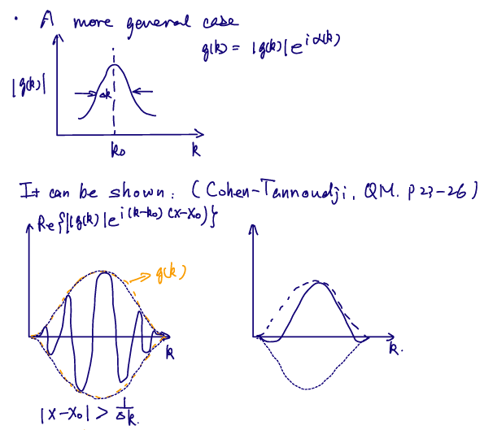

可以看到波在一定的部分里看起来在 $g(k)$ 的范围内，这就叫波包。

---

对于**高斯波包**（Gaussian wavepackets），也就是 $g(k)$ 按高斯分布形成的波函数，我们有：

$$
\psi(x) = \frac{\sqrt{a}}{(2\pi)^{3/4}}\int_{-\infty}^{\infty}e^{-\frac{a^2}{4}(k-k_0)^2}e^{ikx}\dd{k}
$$

这就有：

$$
\Delta x \cdot \Delta p = \frac{\hbar}{2}
$$

这就是 **Heisenberg不确定性原理**（Heisenberg uncertainty principal）。

---

### 2.4 势箱中的粒子

由一维势箱我们可以解得：

$$
\psi_n(x) = \sqrt{\frac{2}{a}}\sin[2](\frac{n\pi x}{a})
$$

我们可以认为 $\ket{\psi(x)} = \sum_n c_n \ket{\psi_n(x)}$。这之后，我们可以求能量的期望值。

$$
\mqty[\dmat{E_1, E_2, \ddots, E_n}]\mqty[c_1\\c_2\\\vdots\\c_n] = \mqty[c_1E_1\\c_2E_2\\\vdots\\c_nE_n] \Rightarrow \hat{H}\ket{\psi} = E\ket{\psi}
$$

能量的期望值可以表示为：

$$
\begin{aligned}
\ev{E} &= \frac{\mel{\psi}{\hat H}{\psi}}{\ip{\psi}} = \frac{\smqty[c_1&c_2&\cdots&c_n]\smqty[\dmat{E_1, E_2, \ddots, E_n}]\smqty[c_1\\c_2\\\vdots\\c_n]}{\smqty[c_1&c_2&\cdots&c_n]\smqty[c_1\\c_2\\\vdots\\c_n]}\\
&= \frac{\sum_i E_n|c_i|^2}{\sum_i |c_i|^2} = \sum_i P_i E_i
\end{aligned}
$$

---

### 2.5 对易子

对易子（Commutation）可以表示为：

$$
[A,B] = AB - BA
$$

如果对易子等于0，我们就说这两个算符对易，**这意味着 $\ket{\psi}$ 和 $B\ket{\psi}$ 具有相同的特征值**。

一个典型的例子是 $[x,p_x] = i\hbar$。

---

### 2.6 测量（Measurement）

对于一次测量，会使体系坍缩至其中一种可能的状态。需要注意的是，**测量的先后顺序可能会影响测量结果**。

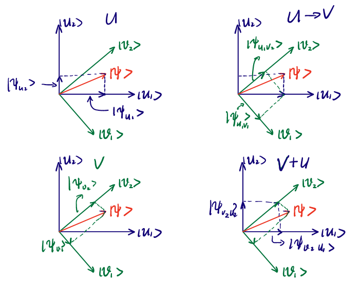

对于两个不对易的算符对应的物理量而言，比如 $\ket{u}$ 和 $\ket{v}$ ，先测量 $\ket{u}$ 会使波函数有一定概率坍缩到 $\ket{u_1}$ 上，有一定概率坍缩到 $\ket{u_2}$ 上，之后再测定 $v$ 结构就是坍缩之后的向量继续向 $\ket{v}$ 坍缩。

---

### 2.7 三维势箱

由于三个方向上的波函数都是线性无关的，我们可以把能量拆成：（假设边长为 $L$）：

$$
E = \frac{h^2}{8mL^2}(n_x^2 + n_y^2 + n_y^2)
$$

右边这一项有点像欧氏距离的平方……为了展示这一点，我们把空间坐标画出来：

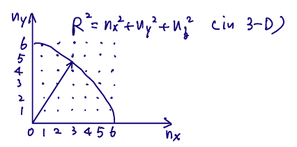

这样，图中的每一个点就代表了一个可能的量子态。我们把表达式化简成：

$$
E = \frac{h^2R^2}{8mV^{2/3}} \Rightarrow R^2 = \frac{8mEV^{2/3}}{h^2}
$$

这样这个空间内1/8球的体积就是：

$$
\phi(E) = \frac18 \cdot \frac43\pi R^3 = \frac{\pi}{6}(\frac{8mE}{h^2})^{3/2}V
$$

如果最高能量 $E=kT$，定义热波长，就有：

$$
\phi(E)\sim\frac{V}{\Lambda^3}\qc \Lambda = (\frac{h}{2\pi mkT})^{1/2}
$$

（怎么感觉这个证明略显奇怪……还是按配分函数的想法来吧）

---

### 2.8 Schrodinger方程与求导

接下来我们关注含时薛定谔方程。尝试对 $\ip{\psi(t)}$ 进行求导：

$$
\begin{aligned}
\dv{t}\ip{\psi(t)} &= [\dv{t}\bra{\psi(t)}]\ket{\psi(t)} + \bra{\psi(t)}[\dv{t}\ket{\psi(t)}] \\
&= -\frac{1}{ih}\mel{\psi(t)}{\hat H}{\psi(t)} + \frac{1}{ih}\mel{\psi(t)}{\hat H}{\psi(t)} = 0
\end{aligned}
$$

这意味着含时的波函数对应的概率是保持不变的。

接下来我们考虑对于 $\ev{A}{\psi(t)}$ 求导（此处假设算符 $A$ 对时间线性无关）：

$$
\begin{aligned}
\dv{t}\ev{A}{\psi(t)} &= [\dv{t}\bra{\psi(t)}]A\ket{\psi(t)} + \bra{\psi(t)}A[\dv{t}\ket{\psi(t)}]\\
&= -\frac{1}{i\hbar}\mel{\psi(t)}{\hat HA}{\psi(t)} + \frac{1}{i\hbar}\mel{\psi(t)}{A\hat H}{\psi(t)} = 0\\
&= \frac{1}{i\hbar}\ev{[A,H]}
\end{aligned}
$$

这被称为 **Ehvenfest 定理**。

---

对于带幂次的对易子而言，比如：

$$
\begin{gathered}
\comm{x}{p^2} = \comm{x}{p}p +p\comm{x}{p} = 2i\hbar p\\
\comm{x}{p^3} = \comm{x}{p^2}p +p^2\comm{x}{p} = 3i\hbar p^2
\end{gathered}
$$

由此我们可以总结出：

$$
\comm{x}{p^n} = ni\hbar p^{n-1}
$$

如果是一个函数，我们也可以作Taylor展开：

$$
\begin{aligned}
\comm{x}{F(p)} &= \comm{x}{\sum_n f_ip^n} \\
&= \sum_nf_n\comm{x}{p^n} \\
&= \sum_nni\hbar p^{n-1} = i\hbar F'(p)
\end{aligned}
$$

以此为基础，我们尝试对位矢的期望值求导：

$$
\begin{aligned}
\dv{\ev{R}}{t} &= \frac{1}{i\hbar}\ev{[R,H]}\\
&= \frac{1}{i\hbar}\ev{[R,\frac{p^2}{2m} + V]}\\
&= \frac{1}{i\hbar}\ev{[R,\frac{p^2}{2m}]}=\ev{\frac{p}{m}} = \ev{v}
\end{aligned}
$$

这正好符合我们在经典力学里的定义。也可以对动量求导：

$$
\begin{aligned}
\dv{\ev{P}}{t} &= \frac{1}{i\hbar}\ev{\comm{p}{H}}\\
&= \frac{1}{i\hbar}\ev{[p,\frac{p^2}{2m} + V]}\\
&= \frac{1}{i\hbar}\ev{[p,V(R)]}\\
&= -\ev{\grad_RV(R)}
\end{aligned}
$$

这也和经典力学相同。

---

### 2.9 纯态（Pure State）和混合态（Mixed State）

考虑一个波函数为两个波函数的线性组合：

$$
\ket{\psi} = \lambda_1\ket{\psi_1} + \lambda_2\ket{\psi_2}
$$

当不进行测量时，所有粒子都是相同的，这意味着 $\ket{\psi}$ 为纯态；但是一旦测量就会坍缩到 $\ket{\psi_1}$ 和$\ket\psi_2$ 之一，这意味着这是混合态。

我们可以认为，对于一次measurement（以 $\ket{u_n}$ 为basis），我们有两种可能的结果。概率分别为：

$$
P_i = \ip{u_n}{\psi_i}^2
$$

这意味着（方法1）：

$$
P = P_1+P_2 = \lambda_1^2\ip{u_n}{\psi_1}^2+\lambda_2^2\ip{u_n}{\psi_2}^2
$$

但是这和直接平方的结果时不一致的（方法2）：

$$
P = |\ip{u_n}{\psi}|^2 = \lambda_1^2\ip{u_n}{\psi_1}^2+\lambda_2^2\ip{u_n}{\psi_2}^2+...
$$

那种是正确的呢？注意我们不能忽略两组波函数的interaction的项，这也就是第二种方法比第一种方法多出来的部分。也就是说对于纯态来说，方法2比方法1更准确。

---

我们知道：

$$
\sum_n \op{u_n} = I
$$

我们可以插入到任何式子中：

$$
\begin{aligned}
\ev{A} = \ev{A}{\psi} &= \sum_n\mel{\psi}{A}{u_n}\ip{u_n}{\psi}\\
&= \sum_n\ip{u_n}{\psi}\mel{\psi}{A}{u_n}\\
&= \sum_n\mel{u_n}{\hat\rho A}{u_n}\\
&= \Tr(\hat\rho A)
\end{aligned}
$$

这里定义了密度算符 $\hat\rho = \op{\psi}$，它满足：

- $\Tr{\rho} = C_1C_1^* + \cdots + C_nC_n^* = 1$

- 幂等算符：$\rho^2 = \ket{\psi}\ip{\psi}\bra{\psi} = \op{\psi} = \rho$

- 导数可以表示为：

  $$
  \begin{aligned}
  \dv{\rho}{t} &= \qty[\dv{t}\ket{\psi}]\bra{\psi} + \ket{\psi}\qty[\dv{t}\bra{\psi}]\\
  &= \frac{1}{i\hbar}\qty[H\op{\psi} - \op{\psi}H] \\
  &= \frac{1}{i\hbar}\comm{H}{\rho}
  \end{aligned}
  $$
  
- 写成矩阵形式：

  $$
  \rho = \mqty(c_1c_1^*&c_1c_2^*&\cdots&c_1c_n^*\\c_2c_1^*&c_2c_2^*&\cdots&c_2c_n^*\\\vdots&\vdots&\vdots&\vdots&\\c_nc_1^*&c_nc_2^*&\cdots&c_nc_n^*\\)
  $$
  

---

我们假设若干个 $\ket{\psi_k}$ 的组合，它们的概率分别为 $p_k$。对于一次measurement：

$$
P_k(a_n) = |\ip{u_n}{\psi_k}|^2
$$

也就是对于一个混合态有：

$$
\begin{aligned}
P(a_n) &= \sum_kp_kP_k(a_n)\\
&= \sum_kp_k\ip{u_n}{\psi_k}\ip{\psi_k}{u_n}\\
&= \sum_kp_k\ev{\rho_k}{u_n}\\
&= \sum_kp_k|c_n^k|^2\\
&= \ev{\sum_k p_k\rho_k}{u_n}
\end{aligned}
$$

我们定义 $\sum_k p_k\rho_k = \rho$，写成矩阵形式就是：

$$
\rho = \mqty(\dmat{\sum_k p_kc_1c_1^*,\sum_k p_kc_2c_2^*,\ddots,\sum_k p_kc_nc_n^*})
$$

很容易知道 $\Tr{\rho} = 1$：

$$
\begin{aligned}
\Tr(\rho) = \sum_p^m \sum_k p_k|c_p^k|^2 = \sum_k(p_k \cdot \Tr \rho_k) = 1
\end{aligned}
$$

这样对于测量算符 $A$ 的期望值：

$$
\begin{aligned}
\ev{A} &= \sum_n a_n P(a_n)\\
&= \sum_n a_n\ev{\rho}{u_n}\\
&= \sum_n \ev{\rho A}{u_n}\\
&= \Tr(\rho A)
\end{aligned}
$$

这里的算符 $A$ 为：

$$
A = \mqty(\dmat{a_1,a_2,\ddots,a_n})
$$

---

### 2.10 时间演化

我们可以定义一个**时间演化算符**（time evolution operator），定义为：

$$
\ket{\psi(t)} = U(t,t_0) \ket{\psi(t_0)}
$$

插入到 Schrodinger 方程（注意这里我们认为 $V$ 可能随时间改变）：

$$
i\hbar \pdv{t}U(t,t_0) \ket{\psi(t_0)} = H(t)U(t,t_0) \ket{\psi(t_0)}
$$

这样就有：

$$
i\hbar \pdv{t}U(t,t_0) = H(t)U(t,t_0)
$$

如果 $H$ 不随时间改变，我们可以写出：

$$
U(t,t_0) = e^{iH(t,t_0)/\hbar}
$$

> 时间演化算符是幺正的。因为有：
>
> $$
> \dv{t}(U^\dagger U) = -\frac1{i\hbar}U^\dagger HU + \frac1{i\hbar}U^\dagger HU =0
> $$
>
> 又由于 $U_0(t_0,t_0) = I$，说明 $U^\dagger U = 1$。

---

对于时间演化，历史存在两个图景（pictures），也就是两种算符的定义方法：

- Schrodinger 图景：认为算符是静态（static）的，而state vector含时：

  $$
  \ket{\psi_S(t)} = U(t,t_0) \ket{\psi_S(t_0)}
  $$

- Hinsenberg 图景：认为state vector时静态的，而算符含时：

  $$
  \ket{\psi_H} = \ket{\psi_S(t_0)} = U^{-1}\ket{\psi_S(t)}
  $$

事实上这两种图景描绘的是一个事情，比方对于一个期望：

$$
\begin{aligned}
\ev{A_S}{\psi_S(t)} &= \ev{U^*(t,t_0)A_SU(t,t_0)}{\psi_S(t_0)}\\
&= \ev{U^{-1}A_SU}{\psi_H}
\end{aligned}
$$

也就是两种图景的算符存在对应关系：

$$
A_H =U^{-1}A_SU
$$

---

### 2.11 谐振子模型

全世界都知道的谐振子模型：

$$
V(x) = V(x_0) + \frac{1}{2}\eval{\dv[2]{V}{x}}_{x=x_0}(x-x_0)^2
$$

简化一点就是：

$$
V(x) = \frac{1}{2}m\omega^2x^2
$$

一系列经典力学的处理懒得写了。

接下来我们放到量子力学处理。定义算符：

$$
\hat x = \sqrt{\frac{m\omega}{\hbar}}x\qc
\hat p = \sqrt{\frac{1}{m\hbar \omega}}x
$$

很容易知道 $\comm{\hat x}{\hat p} = i$，这之后 $H$ 就是：

$$
H = \frac{p^2}{2m} + \frac12 m\omega^2 x^2 = \frac{\hbar\omega}{2}(\hat p^2 +\hat x^2)
$$

继续定义 $\hat H = \frac{1}{\hbar\omega}H =  \frac{1}{2}(\hat p^2 +\hat x^2)$.

接着定义：

$$
\begin{cases}
a = \frac{1}{\sqrt2}(\hat x + i\hat p)\\
a^\dagger = \frac{1}{\sqrt2}(\hat x - i\hat p)
\end{cases}
$$

可以计算：

$$
\begin{aligned}
\comm{a}{a^\dagger} &= \frac12\qty(\comm{\hat x}{-i\hat p} + \comm{i\hat p}{\hat x})\\
&= 1
\end{aligned}
$$

$$
\begin{aligned}
a^\dagger a &= \frac 12 \qty(\hat x^2 + \hat p^2 - i\hat p\hat x + i \hat x \hat p)\\
&=\frac12 \qty(\hat x^2 + \hat p^2 - 1)\\
&= \hat H-\frac 12
\end{aligned}
$$

我们之后定义 $a^\dagger a = N = \hat H - \frac 12$。

$$
\comm{N}{a} = a^\dagger\comm{a}{a} - \comm{a^\dagger}{a}a = -a
$$

$$
\comm{N}{a^\dagger} = a^\dagger\comm{a}{a^\dagger} - \comm{a^\dagger}{a^\dagger}a = a^\dagger
$$

我们假设 $N$ 的本征值是 $\nu$：

$$
\hat H\ket{\psi_\nu}= (\frac12 + N)\ket{\psi_\nu}= (\frac12 + \nu)\ket{\psi_\nu}
$$

我们知道：

$$
|a\ket{\psi_\nu}|^2 = \ev{a^\dagger a}{\psi_\nu} = \nu\ip{\psi_\nu} \ge 0
$$

于是 $\nu \ge 0$ 。当 $\nu = 0$ 时，只有零解，太Trivial了。所以我们考虑 $\nu > 0$ 的情况。

$$
\comm{N}{a} \ket{\psi_\nu} = -a\ket{\psi_\nu} = Na\ket{\psi_\nu} - aN\ket{\psi_\nu}
$$

于是有：

$$
Na\ket{\psi_\nu}  =  aN\ket{\psi_\nu}- a\ket{\psi_\nu} = (\nu -1)a\ket{\psi_\nu}
$$

我们发现：$N$ 对应的本征向量为 $a\ket{\psi_\nu}$ 时，本征值为 $(\nu - 1)$。我们称之为降算符（ladder down）。

同样的事情对着 $a^\dagger$ 也做一遍：

$$
\comm{N}{a^\dagger} \ket{\psi_\nu} = a^\dagger\ket{\psi_\nu} = Na^\dagger\ket{\psi_\nu} - a^\dagger N\ket{\psi_\nu}
$$

也就是：

$$
Na^\dagger\ket{\psi_\nu}  =  a^\dagger N\ket{\psi_\nu}+ a^\dagger\ket{\psi_\nu} = (\nu +1)a^\dagger\ket{\psi_\nu}
$$

$N$ 对应的本征向量为 $a^\dagger\ket{\psi_\nu}$ 时，本征值为 $(\nu + 1)$。我们称之为升算符（ladder up）。

现在有了递增和递减，就可以创造出整个系统的本征值了。对于 $\nu$ 而言：

- 如果不是整数：假设 $n<\nu<n+1$，那么 $a^n\ket{\psi_\nu}$ 的本征值为 $1>\nu -n>0$，再作用一个降算符 $a^{n+1}\ket{\psi_\nu}$ 本征值就是 $\nu - n - 1<0$ 了。**这不被允许**。
- 如果是非负整数：假设 $a^n\ket{\psi_\nu}$ 的本征值是 $0$，那么接下来怎么降本征值也只能是0了。

这意味着 $\nu$ **只能是非负整数**。前面我们知道：

$$
H = \hbar\omega \hat H = (\frac 12 + \nu)\hbar \omega
$$

这是简谐势能面的能级表达式。

---

 由于第一激发态和基态加升算符只差一个常数，也就是：

$$
\ket{\psi_1} = c_1a^\dagger\ket{\psi_0}
$$

利用归一化可以得到：

$$
\begin{aligned}
1=\ip{\psi_1} &= |c_1|^2\mel{\psi_0}{aa^\dagger}{\psi_0}\\
&= |c_1|^2\mel{\psi_0}{a^\dagger a + [a,a^\dagger]}{\psi_0}\\
&= |c_1|^2\mel{\psi_0}{N + 1}{\psi_0}\\
&= |c_1|^2(\ip{\psi_0}\mel{\psi_0}{N}{\psi_0})\\
&= |c_1|^2 \\
\end{aligned}
$$

也就是 $c_1 = 1$。我们再对下一个 $\ket{\psi_2} = c_2a^\dagger\ket{\psi_1}$ 如法炮制：

$$
\begin{aligned}
1=\ip{\psi_2} &= |c_2|^2\mel{\psi_1}{aa^\dagger}{\psi_1}\\
&= |c_2|^2(\ip{\psi_1}\mel{\psi_1}{N}{\psi_1})\\
&= 2|c_2|^2 \\
\end{aligned}
$$

这样下去我们就知道：

$$
c_n = \frac{1}{\sqrt{n}}
$$

带入之后得到：

$$
\ket{\psi_n} = \frac{1}{\sqrt{n}}a^\dagger\ket{\psi_{n-1}}= \frac{1}{\sqrt{n!}}(a^\dagger)^n\ket{\psi_{0}}
$$

---

$$
\mel{\psi_{n'}}{a}{\psi_n} = \sqrt{n}\ip{\psi_{n'}}{\psi_{n-1}} = \sqrt{n}\delta_{n',n-1}
$$

$$
\mel{\psi_{n'}}{a^\dagger}{\psi_n} = \sqrt{n}\ip{\psi_{n'}}{\psi_{n+1}} = \sqrt{n}\delta_{n',n+1}
$$

也就是这两个都能用矩阵形式表示：

$$
a=\mqty[0&1\\&0&\sqrt2\\&&\ddots&\ddots\\&&&0&\sqrt n]\qc a^\dagger=\mqty[0\\1&0\\&\sqrt2&0\\&&\ddots&\ddots\\&&&\sqrt n&0]
$$

之后就算波函数：

$$
\begin{gathered}
a\ket{\psi_0} = 0\\
\frac{1}{\sqrt2}(\hat x + i\hat p) \ket{\psi_0} = 0\\
\frac{1}{\sqrt2}(\sqrt{\frac{m\omega}{\hbar}} x + i\sqrt{\frac{1}{m\hbar \omega}} p) \ket{\psi_0} = 0 \\
\frac{1}{\sqrt2}(\sqrt{\frac{m\omega}{\hbar}} x + \sqrt{\frac{\hbar}{m \omega}} \dv{x}) \ket{\psi_0} = 0 \\
(\frac{m\omega}{\hbar} x+ \dv{x})\psi_0 = 0
\end{gathered}
$$

最后解出来归一化可以得到：

$$
\psi_0(x) = \qty(\frac{m\omega}{\pi\hbar})^{1/4}e^{-\frac12\frac{m\omega}{\hbar}x^2}
$$

然后用升降算符就能求出体系的所有波函数了。

$$
\begin{aligned}
\psi_n(x) = \ip{x}{\psi_n} &= \frac{1}{\sqrt{n!}}\mel{x}{(a^\dagger)^n}{\psi_0}\\
&= \frac{1}{\sqrt{n!}}\frac{1}{\sqrt{2^n}}\mel{x}{(\sqrt{\frac{m\omega}{\hbar}} x + \sqrt{\frac{\hbar}{m \omega}} \dv{x})}{\psi_0}\\
&=\qty(\frac{1}{2^n\cdot n!}\frac{\hbar}{m\omega})^{1/2}\qty(\frac{m\omega}{\pi\hbar})^{1/4}\qty[\frac{m\omega}{\hbar} x + \dv{x}]^ne^{-\frac12\frac{m\omega}{\hbar}x^2}
\end{aligned}
$$

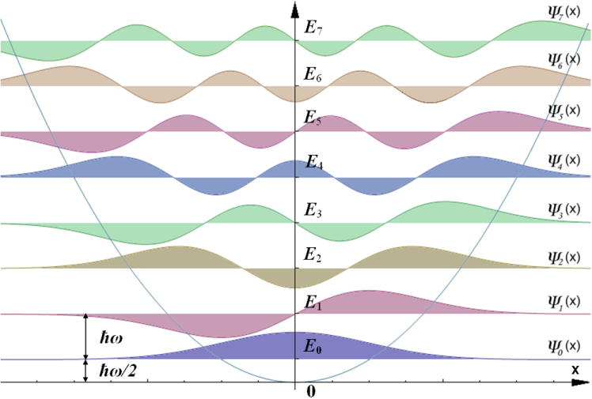

---

### 2.12 振动光谱

bro昨天得到了：

$$
\hat H = -\sum_I \frac{\hbar^2}{2m} \nabla_I^2 -\sum_i \frac{\hbar^2}{2m} \nabla_i^2 + \frac12 \sum_{I\neq J}\frac{Z_IZ_Je^2}{|R_I-R_J|} + \frac12 \sum_{i\neq j}\frac{e^2}{|r_i-r_j|} - \sum_{i,I}\frac{Z_Ie}{|R_I-r_i|}
$$

运用 BO approximation，我们把一大堆势能项写成：

$$
V = \frac12 \sum_{I\neq J}\frac{Z_IZ_Je^2}{|R_I-R_J|} + E(R_I - R_J)
$$

进一步对于双原子分子而言：

$$
V = \frac{Z_IZ_Je^2}{r} + E(r)
$$

考虑偶极矩 $D=qd$，然后对其Taylor展开忽略2次以上的项（后文会解释）：

$$
D = d_0 + d_1(r-r_e)
$$

注意我们认为 $\psi = \sum_n \lambda_n \ket{\phi_n}$，于是：

$$
\ev{D(r)}{\psi} = \sum_{n,n'}\lambda_n^*\lambda_{n'} \mel{\phi_n}{d_0+ d_1(r-r_e)}{\phi_{n'}}
$$

对于每一项有：

$$
\begin{aligned}
\mel{\phi_{n'}}{d_0+ d_1(r-r_e)}{\phi_n} &= d_1\mel{\phi_{n'}}{(r-r_0)}{\phi_n} = d_1\mel{\phi_{n'}}{x}{\phi_n}\\
&= d_1\mel{\phi_{n'}}{\sqrt{\frac{\hbar}{2m\omega}}(a+a^\dagger)}{\phi_n}\\
&= d_1\sqrt{\frac{\hbar}{2m\omega}}(\mel{\phi_{n'}}{a}{\phi_n} + \mel{\phi_{n'}}{a^\dagger}{\phi_n})\\
&= d_1\sqrt{\frac{\hbar}{2m\omega}}(\sqrt{n}\delta_{n',n-1} + \sqrt{n+1}\delta_{n',n+1})
\end{aligned}
$$

这说明：只有跃迁到相邻的层级 $n' = n \pm 1$ 时才是能表征偶极矩的有效跃迁。这被称为**跃迁选律**（selection rule）。

回到之前的一阶近似，如果存在 $d_2 (r-r_0)^2$ 项，对应存在 $n' = n\pm 2$ 和 $n'=n$ 的选律，由于比较微弱所以一般不涉及。

---

我们尝试求解一个微小势能的变化。假设势能由 $N$ 个原子的 $3N$ 个广义坐标定义，可以写成：

$$
\Delta V = \frac 12 \sum_{i=1}^N\sum_{j=1}^N (\pdv{V}{q_i}{q_j})q_iq_j
$$

写成矩阵形式就是：

$$
\mqty[q_1\\\vdots\\q_N]\mqty[\pdv{V}{q_1}{q_1}&\cdots&\pdv{V}{q_1}{q_N}\\\vdots&&\vdots\\\pdv{V}{q_N}{q_1}&\cdots&\pdv{V}{q_N}{q_N}]\mqty[q_1\cdots q_N]
$$

对角化得到：

$$
\mqty[Q_1\\\vdots\\Q_N]\mqty[\dmat{\pdv[2]{V}{Q_1},\ddots,\pdv[2]{V}{Q_N}}]\mqty[Q_1\cdots Q_N]
$$

这里每一个 $Q_N$ 代表一个**简正模**（Normal modes），可以认为将势能用类似简谐的形式表示：

$$
\Delta V = \frac12 \sum_i\pdv[2]{V}{Q_i}Q_i^2
$$

同时，每一个简正模都是正交的（由于本征矢量的正交性）。这样体系的运动波函数就等于所有简正模对应波函数的直积。

$$
\psi(Q_1,\cdots,Q_N) = \psi_1(Q_1)\otimes\cdots\otimes\psi_N(Q_N)
$$

这可以和自由度的概念组合起来，也就是简正模的个数代表总自由度的个数，分为平动转动振动三种。不再赘述。

---

### 2.13 简并态 Degeneracy

假设对于两个对易算符：

$$
\comm{A}{B}=0
$$

这就有：

$$
AB\ket{\psi} = BA\ket{\psi} = aB\ket{\psi} = bA\ket{\psi}=ab\ket{\psi}
$$

> 相容性定理：如果两个可观测量的算子 $\hat A$ 和 $\hat B$ 对易，则它们共用相同本征基。反之共用相同本征基的算子对易。

**如果 $A$ 不含有简并本征值**，假设 $A,B$ 均为厄米算符，这就有：

$$
\mel{\psi_1}{AB-BA}{\psi_2} = (a_1-a_2)\mel{\psi_1}{B}{\psi_2} = 0
$$

由于不简并，意味着本征值不同，也就是 $(a_1-a_2) \neq 0$。这对应，$\mel{\psi_1}{B}{\psi_2} = 0$， $A$ 和 $B$ 的本征向量相同。

**如果 $A$ 包含简并的本征值**，我们假设每个本征值 $a_n$ 为 $g$ 重简并，对应的本征矢为 $\ket{\psi_{nr}}$，其中 $r$ 取值为 $g$ 重简并度的 $\{1,2,\cdots,g\}$。于是根据上一个结论，$B\ket{\psi_{nr}}$ 可以与 $a_n$ 对应的矢量线性表示：

$$
B\ket{\psi_{nr}} = \sum_{s=1}^g c_{rs}\ket{\psi_{ns}}\qc s = 1,2,\cdots,g
$$

由于 $B$ 是厄米算子， $c_{rs}$ 构成一个厄米（自伴）矩阵，尝试对角化：

$$
B\sum_{r=1}^gd_r\ket{\psi_{nr}} = \sum_{r=1}^g\sum_{s=1}^g d_rc_{rs}\ket{\psi_{ns}}
$$

如果可以对角化成功，则有：

$$
\sum_{r=1}^g d_rc_{rs} = b_n d_s
$$

这构成了关于 $d_r$ 的 $g$ 个线性方程组。存在非平凡解的情况满足：

$$
\det[c_{rs}-b_n\delta_{rs}]=0
$$

这是一个关于 $b_n$ 的 $g$ 阶方程。一共有 $g$ 个根 $b_n = b_n^{(k)}$，并且都对应一个非平凡解 $d_r^{(k)}$。由于 $c_{rs}$ 厄米，所有解线性无关。于是构成了新的基矢：

$$
\ket{\psi_n^{(k)}} = \sum_{r=1}^g d_r^{(k)}\ket{\psi_{nr}}
$$

对应本征值分别为 $a_n$ 和 $b_n^{(k)}$ 。

> 假设 $\hat A$ 满足：
>
> $$
> A = \mqty[\dmat{1,2,2,4}]
> $$
>
> 我们当然可以取每个列向量 $\psi_1,\psi_2,\psi_3,\psi_4$ 作为本征态，但是也可以这么取：
>
> $$
> \ket{\psi_2'} = \frac1{\sqrt{2}} \mqty[0\\1\\1\\0]\qc\ket{\psi_2'} = \frac1{\sqrt{2}} \mqty[0\\1\\-1\\0]
> $$
>
> 事实上只需要满足以下正交归一条件的态就能作为本征函数：
>
> $$
> \begin{cases}
> \ket{\psi_2'} =a\ket{\psi_2}+b\ket{\psi_3}\\
> \ket{\psi_3'} =c\ket{\psi_2}+d\ket{\psi_3}
> \end{cases}\qc\begin{cases}
> |a|^2+|b|^2 =1\\
> |c|^2+|d|^2 =1\\
> ac+bd=0
> \end{cases}
> $$
>
> 再比如说对于矩阵：
>
> $$
> B = \mqty[\dmat{1,2&1\\1&2,3}]
> $$
>
> 于是需要解久期方程对角化中间的矩阵，之后变成这样：
>
> $$
> B = \mqty[\dmat{1,3,3,1}]
> $$
>
> 于是它们都共享同一个本征矢量基组 $\ket{\psi_1},\ket{\psi_2'},\ket{\psi_3'},\ket{\psi_4}$.
>

对于一组可观测量 $A,B,C,\cdots$，如果它们**两两对易**，并且指定所有算符的本征值，即可在系统的希尔伯特空间确定唯一的本征向量，我们称其为**完全对易可观测量完备集**（CSCO）。

---

### 2.13 角动量

角动量算符的定义和经典力学相同，就是改成了算符形式：

$$
\begin{cases}
L_x = YP_z-ZP_y\\
L_y = ZP_x-XP_z\\
L_z=XP_y-YP_x
\end{cases}
$$

另外有对易关系：

$$
\comm{L_x}{L_y} = i\hbar L_z
$$

> $$
> \begin{aligned}
> \comm{L_x}{L_y} &= \comm{YP_z-ZP_y}{ZP_x-XP_z}\\
> &=\comm{YP_z}{ZP_x}-\comm{ZP_y}{ZP_x}-\comm{YP_z}{XP_z}+\comm{ZP_y}{XP_z}\\
> &= \comm{P_z}{Z}YP_x + \comm{Z}{P_z}P_y X\\
> &= -i\hbar(YP_x)+i\hbar(XP_y) = i\hbar L_z
> \end{aligned}
> $$

定义总角动量为 $J$：

$$
J^2 = J_x^2+J_y^2+J_z^2
$$

这样有：

$$
\begin{aligned}
\comm{J^2}{J_x}&=\comm{J_y^2}{J_x}+\comm{J_z^2}{J_x}\\
&= J_y\comm{J_y}{J_x}+\comm{J_y}{J_x}J_y + J_z\comm{J_z}{J_x}+\comm{J_z}{J_x}J_z\\
&= 0
\end{aligned}
$$

同样总角动量平方也和其他方向的角动量对易。

根据自由度，至少需要三个量子数确定一个粒子，我们分别假设是 $k,j,m$，设：

$$
\begin{gathered}
J^2\ket{\psi} = j(j+1)\hbar^2\ket{\psi}\qq{$j$: angular momentum quantum n}\\
J_z\ket{\psi} = m\hbar\ket{\psi}\qq{$m$: megnatic momentum quantum n}
\end{gathered}
$$

其中 $j$ 取整数和半整数，$m$ 取 $-j,\cdots,j$.

类似地，定义升降算符：

$$
\begin{cases}
J_+ = J_x+iJ_y\\
J_- = J_x-iJ_y
\end{cases}
$$

同样有对易关系：

$$
\comm{J_+}{J_-} = i(\comm{J_y}{J_x}-\comm{J_x}{J_y}) = 2\hbar J_z
$$

$$
\comm{J_z}{J_{\pm}} = \pm i\hbar J_y - \hbar J_x= \pm \hbar J_\pm
$$

相对应的升算符：

$$
\begin{aligned}
J_zJ_+\ket{k,j,m} &= \comm{J_z}{J_+}\ket{k,j,m} + J_+J_z\ket{k,j,m}\\
&= (\hbar J_+ + m\hbar J_+)\ket{k,j,m}\\
&= J_+(m+1)\hbar\ket{k,j,m}
\end{aligned}
$$

降算符：

$$
\begin{aligned}
J_zJ_-\ket{k,j,m} &= \comm{J_z}{J_-}\ket{k,j,m} + J_-J_z\ket{k,j,m}\\
&= (-\hbar J_- + m\hbar J_-)\ket{k,j,m}\\
&= J_+(m-1)\hbar\ket{k,j,m}
\end{aligned}
$$

同样满足升降算符的特性。于是我们设：

$$
\ket{k,j,m+1} = c_n J_+\ket{k,j,m}
$$

由于归一化：

$$
\begin{aligned}
\ip{m+1} = 1 &= c_n^2 \ev{J_-J_+}{m}\\
&= c_n^2 \ev{J_x^2+J_y^2 + i\comm{J_x}{J_y}}{m}\\
&= c_n^2 \ev{J^2-(J_z^2+\hbar J_z)}{m}\\
&= c_n^2 \hbar^2(j(j+1) - m(m+1))
\end{aligned}
$$

然后就有：

$$
|k,j,m+1\rangle = \frac{1}{\hbar \sqrt{j(j+1)-m(m+1)}} J_+ |k,j,m\rangle
$$

$$
|k,j,m-1\rangle = \frac{1}{\hbar \sqrt{j(j+1)-m(m-1)}} J_+ |k,j,m-1\rangle
$$

这就是与角动量相关的能级和波函数。

---

### 2.14 球谐波函数

考虑一个有心力场的体系，可以分离变量：把波函数拆成径向和轴向：

$$
\psi(r,\theta,\phi) = R_{k,l}(r)Y_l^m(\theta,\phi)
$$

对于 $Y_l^m(\theta,\phi)$ 是一个球谐函数。

按照上面的定义：

$$
\begin{gathered}
L^2Y_l^m(\theta,\phi)=l(l+1)\hbar^2Y_l^m(\theta,\phi)\\
L_zY_l^m(\theta,\phi)=m\hbar Y_l^m(\theta,\phi) = \frac{\hbar}{i}\pdv{\phi}Y_l^m(\theta,\phi)
\end{gathered}
$$

第二个式子可以解得：

$$
Y_l^m(\theta,\phi) = F_l^m(\theta)e^{im\phi}
$$

为了保证周期连续性， $m$ 必须为整数。

个悲剧升降算符的结论：

$$
\begin{aligned}
L_+ Y_l^m(\theta,\phi) &= \sqrt{l(l+1) - m(m+1)} \, Y_l^{m+1}(\theta,\phi), \\
L_- Y_l^m(\theta,\phi) &= \sqrt{l(l+1) - m(m-1)} \, Y_l^{m-1}(\theta,\phi).
\end{aligned}
$$

为了满足正交归一条件：

$$
\int_0^{2\pi} d\phi \int_0^\pi \sin\theta\, d\theta \, Y_{l'}^{m'*}(\theta,\phi) \, Y_l^m(\theta,\phi)
= \delta_{l'l} \, \delta_{m'm}
$$

然后一般解就可以写成：

$$
f(\theta,\phi) = \sum_{l=0}^\infty\sum_{m=-l}^l C_{lm}Y_l^m(\theta,\phi)
$$

之后用Fourier变换即可得到常数：

$$
C_{lm} = \int_0^{2\pi} d\phi \int_0^\pi \sin\theta\, d\theta \, Y_{l}^{m*}(\theta,\phi) f(\theta, \phi)
$$

对于径向部分也是同理。由于 $L_{\pm}$ 算符作用在 $R(r)$ 上不改变 $R(r)$ 本身，于是镜像波函数和 $m$ 无关。

代入正交归一条件：

$$
\int r^2\dd{r} R^*_{k',l}(r)R_{k,l}(r) = \delta_{k,k'}
$$

然后就能够求出总的波函数了：

$$
\psi_{k,l,m} =\sum_{k,l,m} C_{klm} R_{k,l}(r)Y_l^m(\theta,\phi)
$$

常数同样通过代入Fourier变换求得：

$$
C_{klm} = \int_0^\infty r^2 \dd{r} R_{k,l}^*(r)\int_0^{2\pi} d\phi \int_0^\pi \sin\theta\, d\theta \, Y_{l}^{m*}(\theta,\phi) \psi(r,\theta,\phi)
$$

由于 $L^2$ 和 $L_z$ 对易，于是可以同时测量：

$$
\begin{gathered}
P_{L^2,L_z} = \sum_k|C_{klm}|^2\\
P_{L^2} = \sum_k \sum_m |C_{klm}|^2\\
P_{L_z} = \sum_{k,l \ge m} |C_{klm}|^2\\
\end{gathered}
$$

---

回去手搓氢原子薛定谔方程吧。

$$
(-\frac{\hbar^2}{2m_e}\grad^2 -\frac{e^2}{r^2})\psi_{k,l,m} = E\psi_{k,l,m}
$$

对于质量，应该写成折合质量，但由于电子质量小得多所以 $\mu\approx m_e$ 了。

最后解得：

$$
E_{k,l} = -\frac{E_I}{(k+l)^2}
$$

定义主量子数 $n=k+l$，就有经典的轨道图形了。

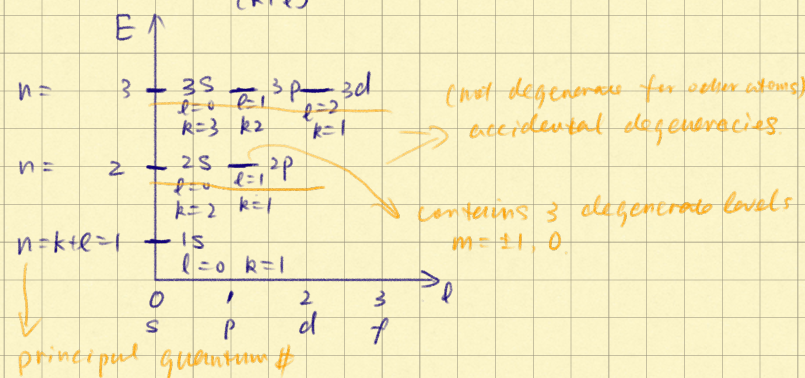

---

### 2.14 旋转光谱

假设对一个双原子分子系统：

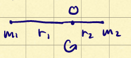

得到对应的哈密顿量：

$$
H = \frac12I\omega_R^2 = \frac{L^2}{2I} = \frac{L^2}{\mu r_e^2}
$$

对应到算符：

$$
H\ket{\psi_{klm}} = \frac{l(l+1)\hbar^2}{2\mu r_e^2}\ket{\psi_{klm}} = l(l+1)hB\qc B=\frac{\hbar}{4\pi\mu r_e^2}
$$

于是相邻的能极差为：

$$
E_l - E_{l-1} = [l(l+1)-l(l-1)]hB=2lBh
$$

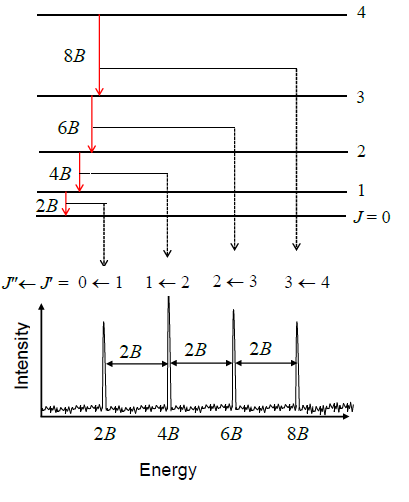

这在光谱上显示出相差 $2Bh$ 的谱线。

---

对于 Z 轴的分量（也就是 $r_e$ 在 Z 的投影）：

$$
\begin{aligned}
Z \, Y_l^m(\theta,\phi)
&= r_e \cos\theta \, Y_l^m(\theta,\phi) \\
&= r_e \left[
\sqrt{\frac{l^2 - m^2}{4l^2 - 1}} \, Y_{l-1}^m(\theta,\phi)
+ \sqrt{\frac{(l+1)^2 - m^2}{4(l+1)^2 - 1}} \, Y_{l+1}^m(\theta,\phi)
\right]
\end{aligned}
$$

于是对于选律：只有能量为 $E_{l+1} - E_l$ 或 $E_l - E_{l-1}$ 会被吸收，而 $m$ 保持不变。

另外也可以把旋转和振动光谱结合起来。振动光谱利用偶极矩作为观测量，这里也采用偶极矩，这即使在 $r_e$ 处也有分量。

$$
\mel{Y_{l\pm1}^{m}}{d_0 \cos\theta}{Y_l^m}\neq 0
$$

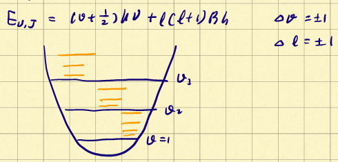

---

### 2.15 自旋和NMR

电子和核都有自旋。把空间自由度和自旋自由度用张量结合起来：

$$
\ket{\psi_r}\otimes\ket{\psi_s}
$$

我们假定 $R$ 算符专门处理空间自由度，$S$ 算符处理自旋自由度。它们的本征值为 $r$ 和 $s$。

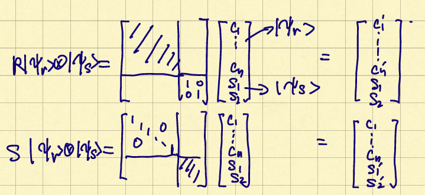

全世界都知道电子自旋是 $\pm 1/2$：

$$
\begin{gathered}
S_z\ket{\alpha} = +\frac12\hbar\ket{\alpha}\\
S_z\ket{\beta} = -\frac12\hbar\ket{\beta}
\end{gathered}
$$

对于核自旋，可能为整数和半整数。

- $\ce{^1H}$ & $\ce{^13C}$: 1/2
- $\ce{^2H}$ & $\ce{^14 N}$: 1
- $\ce{^12 C}$: 0

相似的对于氢原子也有：

$$
\begin{gathered}
I_z\ket{\alpha} = +\frac12\hbar\ket{\alpha}\\
I_z\ket{\beta} = -\frac12\hbar\ket{\beta}
\end{gathered}
$$

> 自旋算符的作用和角动量算符一样：
>
> $$
> \comm{I_x}{I_y} = i\hbar I_z
> $$
>
> 升降算符：
>
> $$
> \begin{cases}
> I_+ = I_x+iI_y\\
> I_- = I_x-iI_y
> \end{cases}
> $$
>
> 升算符作用在 $\ket{\beta}$ 上时有：
>
> $$
> I_zI_+\ket{\beta} = \frac{\hbar}{2}I_+\ket{\beta}
> $$
>

---

磁矩和自旋有关系。比如对于电子

$$
\mu_e = g_e\frac{q_e}{2m_e}S = g_e\beta_eS = \gamma_e S
$$

其中 $\beta$ 为玻尔磁子（Bohr Magneton），$\gamma$ 为磁旋比（gyromagnetic ratio）。对于原子核也一样：

$$
\mu_N = g_N\frac{q_N}{2m_N}I = g_N\beta_NI = \gamma_e I
$$

由磁矩可以得到势能：

$$
V = -\mu B = -\mu_zB_z = -\gamma B_zI_z
$$

这就是自旋的哈密顿量，然后就有：

$$
H\psi = -\hbar\gamma B_zI_z\psi = E\psi
$$

这意味着：

$$
E = -\hbar\gamma B_zI_z
$$

这对应不同磁场下，不同自旋的核的能量将不同。比如对于电子而言有两种可能的状态：

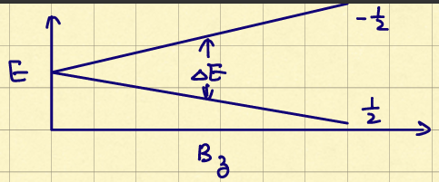

能量的裂分：

$$
\Delta E = \hbar \gamma B_z
$$

由此原理就可以做出核磁共振仪：

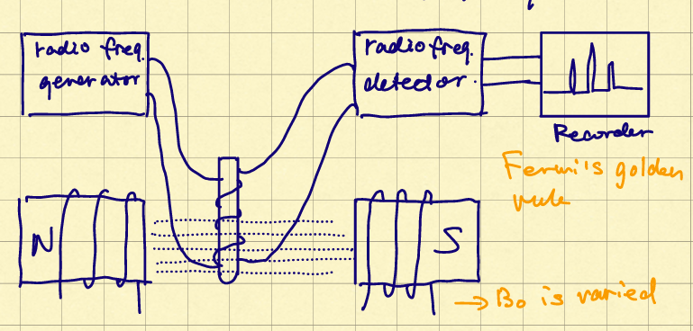

---

当然在真实的化学环境里，由于原子不是孤立的，所以感受到的磁场要比正常的要小。设：

$$
B_z = (1-\sigma)B_0
$$

其中 $\sigma$ 为屏蔽常数，对应减去被屏蔽的分量。代入到之前的式子就是：

$$
\nu_H = \frac{\gamma B_0}{2\pi}(1-\sigma_H)
$$

由此可以定义化学位移（Chemical Shift）：

$$
\delta_H = \frac{\nu_{H,0}\ \text{relative to hydrogen in TMS}}{\nu_H}\times 10^6
$$

真实的化学体系可能存在原子核之间的耦合：

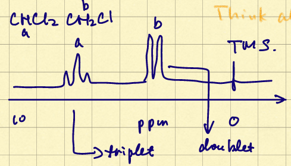

$$
H = -\gamma B_0(1-\sigma_1)I_{z1}-\gamma B_0(1-\sigma_2)I_{z2}+\frac{hJ_{12}}{\hbar^2}I_{z1}I_{z2}
$$

前两项是我们已知的：对应单原子的势能。而最后一项可以认为是微扰带来的能量项。

---

### 2.16 定态微扰理论

我们把上面的式子化简成：

$$
H = H_0+W
$$

我们假设 $W$ 项相对于 $H_0$ 是较小的。设 $W = \lambda \hat W$ （$\lambda$ 在 $\sim 0.1$ 的量级，$\hat W$ 和 $H$ 量级大致相等），之后展开：

$$
\ket{\phi_n(\lambda)} = \ket{\phi_n}+\lambda\ket{1}+\lambda^2\ket{2}+\cdots
$$

这对应能量项

$$
E_n(\lambda) = E_n^\circ + \lambda\epsilon_1+\lambda^2\epsilon_2+\cdots
$$

插入到 Schrodinger 方程：

$$
\begin{aligned}
&(H_0+\lambda W)(\ket{\phi_n}+\lambda\ket{1}+\lambda^2\ket{2}+\cdots) \\
&\quad= (E_n^\circ + \lambda\epsilon_1+\lambda^2\epsilon_2+\cdots)(\ket{\phi_n}+\lambda\ket{1}+\lambda^2\ket{2}+\cdots)
\end{aligned}
$$

考虑零阶项很显然：

$$
H_0\ket{\phi_n} = E_n^\circ\ket{\phi_n}
$$

对于一阶项：

$$
\begin{gathered}
H_0\ket{1} +  W \ket{\phi_n} = E_n^\circ\ket{1} + \epsilon_1 \ket{\phi_n}  \\
(H_0-E_n^\circ)\ket{1}+(W-\epsilon_1)\ket{\phi_n}=0
\end{gathered}
$$

对于二阶项：

$$
\begin{gathered}
H_0\ket{2}+W\ket{1} = E_n^\circ\ket{2}+\epsilon_1\ket{1}+\epsilon_2\ket{\phi_n}\\
(H_0 - E_n^\circ)\ket{2} + (W-\epsilon_1)\ket{1} - \epsilon_2\ket{\phi_n} = 0
\end{gathered}
$$

---

从一阶开始，由于归一化，两个波函数内积都为1. 忽略掉二阶项：

$$
\begin{aligned}
\ip{\phi_n(\lambda)} =1&=\qty[\bra{\phi_n}+\lambda\bra{1}]\qty[\ket{\phi_n}+\lambda\ket{1}]+ \order{\lambda^2}\\
&= 1+\lambda\qty[\ip{\phi_n}{1}+\ip{1}{\phi_n}]
\end{aligned}
$$

这于是有 $\ip{\phi_n}{1}+\ip{1}{\phi_n} = 0$，也就是 $\ip{\phi_n}{1}$ 为纯虚数或0。由于任意性（如果 $\phi_n$ 是解，那么 $\phi_n e^{i\theta}$ 也一定是解），我们可以取它就是0. 这也是说微扰前波函数和施加的微扰是正交的。

对照 Schrodinger 方程的一阶项关系，如果投影到自身：

$$
\bra{\phi_n}(H_0-E_n^\circ)\ket{1}+\bra{\phi_n}(W-\epsilon_1)\ket{\phi_n}=0
$$

这就得到：

$$
\epsilon_1 = \mel{\phi_n}{W}{\phi_n}
$$

这样就有一阶近似能级：

$$
E_n(\lambda) = E_n^\circ + \ev{W}{\phi_n}
$$

如果投影到其他波函数：

$$
\bra{\phi_p}(H_0-E_n^\circ)\ket{1}+\bra{\phi_p}(W-\epsilon_1)\ket{\phi_n}=0
$$

于是得到：

$$
\ip{\phi_p}{1} = \frac{\mel{\phi_p}{W}{\phi_n}}{E_n^\circ - E_p^\circ}
$$

根据投影得到：

$$
\ket{1} = \sum_{p\neq n}\frac{\mel{\phi_p}{W}{\phi_n}}{E_n^\circ-E_p^\circ}\ket{\phi_p}
$$

回到自旋的方程。不考虑作用项的本征值分别为：

$$
\begin{cases}
\psi_1 = \alpha(1)\alpha(2)\\
\psi_2 = \beta(1)\alpha(2)\\
\psi_3 = \alpha(1)\beta(2)\\
\psi_4 = \beta(1)\beta(2)
\end{cases}
$$

先解出微扰前的能量。对于 $\ket{\psi_1}$：

$$
H\ket{\alpha(1)\alpha(2)} = -\gamma B_0(1-\sigma_1)\frac12 \ket{\alpha(1)\alpha(2)}-\gamma B_0(1-\sigma_2)\frac12 \ket{\alpha(1)\alpha(2)}
$$

于是求得：

$$
E_1^\circ = -\hbar \gamma B_0 (1-\frac{\sigma_1+\sigma_2}{2})
$$

对于其他项：

$$
\begin{gathered}
E_2^\circ = -\hbar \gamma B_0 \frac{\sigma_1-\sigma_2}{2}\\
E_3^\circ = \hbar \gamma B_0 \frac{\sigma_1-\sigma_2}{2}\\
E_4^\circ = \hbar \gamma B_0 (1-\frac{\sigma_1+\sigma_2}{2})
\end{gathered}
$$

之后再求微扰项。对任意两个能级的微扰有：

$$
\begin{aligned}
W_{ii} &= \frac{hJ_{12}}{\hbar^2}\ev{I_1\cdot I_2}{\psi_i}\\
&= \frac{hJ_{12}}{\hbar^2}\ev{I_{x_1}I_{x_2}+I_{y_1}I_{y_2}+I_{z_1}I_{z_2}}{\psi_i}\\
&= \frac{hJ_{12}}{\hbar^2}\ev{I_{z_1}I_{z_2}}{\psi_i}\\
\end{aligned}
$$

> 其中用到了：
>
> $$
> \ev{I_{x_1}I_{x_2}}{\psi_i} = \ev{I_{y_1}I_{y_2}}{\psi_i} = 0
> $$
>
> 以第一个为例子，也就是：
>
> $$
> \begin{aligned}
> \ev{I_{x_1}I_{x_2}}{\psi_i} &= \ev{(I_{+1} + I_{-1})(I_{+2} + I_{-2})}{\psi_i}\\
> &= \ev{I_{+1}I_{+2} + I_{+1}I_{-2} + I_{-1}I_{+2}+I_{-1}I_{-2}}{\psi_i}
> \end{aligned}
> $$
>
> 总之无论怎么样都会翻转出现其他正交态，于是总体值为0。

由此可以算出：

$$
W_{11} =W_{44} =\frac{hJ_{12}}{4}\qc W_{22}=W_{33}=-\frac{hJ_{12}}{4}
$$

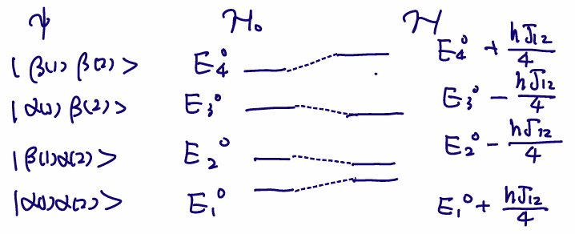

考虑那些态可以跃迁：必须要只改变一个电子自旋。也就是分别是：

$$
\begin{cases}
\nu_{1\to2} = \nu_0(1-\sigma_1)-J_{12}/2\\
\nu_{1\to3} = \nu_0(1-\sigma_2)-J_{12}/2\\
\nu_{2\to4} = \nu_0(1-\sigma_2)+J_{12}/2\\
\nu_{3\to4} = \nu_0(1-\sigma_1)+J_{12}/2\\
\end{cases}
$$

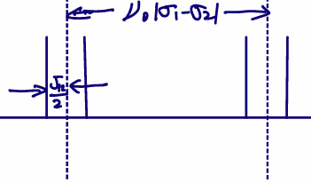

这对应产生了二重峰。以此类推还有多重峰，他们的相对大小为：

| 1    |   2   |    3    |     4     |
| ---- | :---: | :-----: | :-------: |
| $1$  | $1:1$ | $1:2:1$ | $1:3:3:1$ |

需要注意的是，当氢原子环境相等时，也就是 $\sigma_1 = \sigma_2$ 时，不存在峰的裂分。此时对应的状态为：

$$
\begin{cases}
\ket{\psi_1} = \ket{\alpha\alpha}\\
\ket{\psi_2} = \frac{1}{\sqrt{2}}(\ket{\alpha\beta} - \ket{\beta\alpha})\\
\ket{\psi_3} = \frac{1}{\sqrt{2}}(\ket{\alpha\beta} + \ket{\beta\alpha})\\
\ket{\psi_4} = \ket{\beta\beta}
\end{cases}
$$

---

对于二阶微扰，代入一阶微扰的式子：

$$
(H_0 - E_n^\circ)\ket{2} + (W-\epsilon_1)\sum_{p\neq n}\frac{\mel{\phi_p}{W}{\phi_n}}{E_n^\circ-E_p^\circ}\ket{\phi_p} - \epsilon_2\ket{\phi_n} = 0
$$
左乘 $\ket{\phi_n}$ 得到：
$$
\epsilon_2 = \sum_{p\neq n}\frac{\abs{\mel{\phi_p}{W}{\phi_n}}^2}{E_n^\circ-E_p^\circ}
$$
这就是二阶微扰的能量，可以看出一阶微扰关注的是一个状态自身的变化，二阶微扰关注的是其他态的影响。

---

### 2.17 含时微扰理论

现在我们尝试解决对时间的微扰问题，写出含时SE：
$$
i\hbar\dv{t}\ket{\psi(t)}=[H_0+W(t)]\ket{\psi(t)}
$$

展开波函数，使系数为时间的函数：

$$
\ket{\psi(t)} = \sum_k c_k(t)\ket{\phi_k}
$$

代入SE之后，左乘正交基 $\ket{\phi_n}$ ：

$$
\begin{gathered}
i\hbar\dv{c_n(t)}{t}=\bra{\phi_n}[H_0+W(t)]\sum_k c_k(t)\ket{\phi_k(t)}\\
i\hbar\dv{c_n(t)}{t}=c_n(t)E_n + \bra{\phi_n}W(t)\sum_k c_k(t)\ket{\phi_k(t)}
\end{gathered}
$$

如果 $W(t) =0$，解出来的就是系数不含时的平面波：

$$
c_n(t) = b_ne^{-iE_nt/\hbar}
$$

如果 $\hat W(t) \neq 0$ 并且 $\lambda \ll 1$，可以视作微扰。注意围绕前后的本征向量会变化！使用常数变异：

$$
\begin{aligned}
&\qquad i\hbar  \dv{t}b_n(t) e^{-iE_nt/\hbar} + b_n(t)E_n e^{-iE_nt/\hbar}\\
&= b_n(t)E_n e^{-iE_nt/\hbar} + \lambda\sum_k \hat W(t)b_k(t) e^{-iE_kt/\hbar}\\
\end{aligned}
$$

消去后得到：

$$
i\hbar \dv{b_n(t)}{t} = \lambda\sum_k \hat W_{kn} e^{i\omega_{kn} t}b_k(t)\qc \omega_{kn} = \frac{E_k - E_n}{\hbar}
$$

这就得到了 $b_n(t)$ 的精确表达式，然而没法精确求出来。我们企图将 $b_n(t)$ 展开成 $\lambda$ 的系数：
$$
b_n(t) = b_n^0(t) + \lambda b_n^1(t) + \lambda^2 b_n^2(t) + \cdots
$$
对于0阶项：
$$
i\hbar \dv{b_n^0(t)}{t} = 0
$$
也就是 $b_n^0$ 和时间无关。

对于高阶项：
$$
i\hbar \dv{b_n^r(t)}{t} = \sum_k \hat W_{kn} e^{i\omega_{kn} t}b_k^{r-1}(t)
$$
我们假设初态是 $\ket{\phi_i}$，这样初始条件就有：
$$
b_n(t=0) = \delta_{ni}
$$
这对应每个高阶项 $b_n^r(t=0) = 0$，并且 $b_n^0 = \delta_{ni}$ 由于时间无关。对于一阶项有：
$$
i\hbar \dv{b_n^1(t)}{t} = \sum_k \hat W_{kn} e^{i\omega_{kn} t}\delta_{ki} = W_{ni} e^{i\omega_{ni} t}
$$
于是有：
$$
b^1_n(t) = \frac{1}{i\hbar}\int_0^t e^{i\omega_{ni}t'} \hat W_{ni}(t)\dd{t'}
$$

忽略高阶项，我们就得到：
$$
b_f(t) = \frac{1}{i\hbar}\int_0^t e^{i\omega_{fi}t'} W_{fi}(t)\dd{t'}
$$
这里假设初末态状态不同，也就是 $b_f^0(t)=  0$.

处在某能级的概率：
$$
P_{if}(t) = \abs{\ip{\phi_f}{\psi(t)}}^2 = \abs{\sum_n c_n(t)\delta_{fn}}^2 = |b_f(t)|^2
$$

之后就代入：

$$
\begin{aligned}
P_{if}(t) &= \frac{\lambda^2}{\hbar^2}\abs{\int_0^t e^{i\omega_{fi}t'} \hat W_{fi}(t)\dd{t'}}^2\\
&= \frac{1}{\hbar^2}\abs{\int_0^t e^{i\omega_{fi}t'}  W_{fi}(t)\dd{t'}}^2\\
&= \frac{1}{\hbar^2}\abs{\tilde{W_{fi}}(\omega_{fi})}^2
\end{aligned}
$$

**例子**：假设满足周期关系：
$$
\hat W_{fi}(t) = \hat W_{fi}\sin\omega t = \frac{\hat W_{fi}}{2i}(e^{i\omega t}-e^{-i\omega t})
$$

计算得到系数：

$$
b_n^1(t) = -\frac{\hat W_{fi}}{2\hbar}\qty[\frac{1-e^{i(\omega+\omega_{fi})t}}{\omega_{fi}+\omega}-\frac{1-e^{i(\omega-\omega_{fi})t}}{\omega_{fi}-\omega}]
$$

对应跃迁概率：

$$
P_{if}(t) = \frac{|W_{fi}|^2}{4\hbar^2}\abs{\frac{1-e^{i(\omega+\omega_{fi})t}}{\omega_{fi}+\omega}-\frac{1-e^{i(\omega-\omega_{fi})t}}{\omega_{fi}-\omega}}^2
$$

注意这里的两个值：对于第一项，会在 $\omega = -\omega_{fi}$ 时取到极大值，这对应发射一个 $\hbar\omega = E_f-E_i$ 的光子；对于第二项会在 $\omega = \omega_{fi}$ 时取到极大值，对应吸收一个 $\hbar\omega = E_f-E_i$ 的光子跃迁。

只考虑第二项，我们可以写成：

$$
P_{if} = \frac{|W_{fi}|^2}{4\hbar^2}\qty[\frac{\sin((\omega_{fi}-\omega)t/2)}{(\omega_{fi}-\omega)t/2}]^2
$$

其中右侧函数在 $t\to 0$ 可以近似为 $\delta(\omega-\omega_{fi})$ 函数。

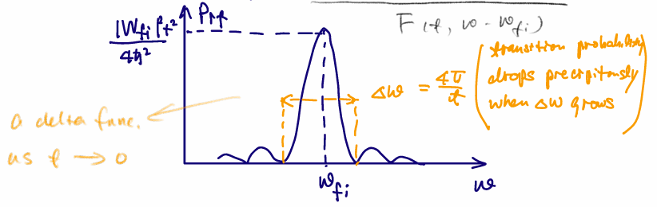

---

我们来考虑连续光谱的情况。假设对于 $\ket{\Psi_f}$ 是一个连续能级，此时对应概率变为概率密度：
$$
|\ip{\phi_f}{\psi(t)}|^2
$$
此时：
$$
\var{P(\phi_f,t)} = \int_{p\in D_f} |\ip{p}{\psi(t)}|^2 \dd[3]{\va p} =  \int_{p\in D_f} |\ip{p}{\psi(t)}|^2 p^2\dd{p}\dd{\Omega}
$$
这里 $D_f$ 代表 $P_f$ 周边的一块区域。

 我们把变量转到能量上。设：
$$
\rho(E) = {p^2}\dv{p}{E} = \frac{p^2m}{p} = m\sqrt{2mE}
$$
于是：
$$
\var{P(\phi_f,t)} = \int_{E\in E_f} |\ip{E}{\psi(t)}|^2 \rho(E)\dd{E}\dd{\Omega}
$$
前面得到：
$$
P_{if} = \frac{|W_{fi}|^2}{4\hbar^2}F(t,\omega-\omega_{fi})
$$
于是：
$$
\abs{\ip{E}{\psi(t)}}^2 = \frac{|\mel{E}{W}{\phi_i}|^2}{4\hbar^2}F(t,\omega-\omega_{fi})
$$
又因为当 $t\to\infty$ 时，有：
$$
\lim_{t\to \infty} F(t,\omega-\omega_{fi}) = 2\pi\hbar t\delta(\hbar\omega+E_i-E)
$$
带入得到：

这样就可以得到单位时间的变换概率：
$$
\Gamma_{i\to k} = \frac{\pi}{2\hbar}|\mel{E_f}{W}{\phi_i}|^2\rho(E_f)
$$

---

 
