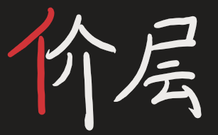

# 凯楽斯社会学: 人，社会与聖教

## 前言

> 创教88天载，我，作为凯楽斯聖教的教主,遭受过别人的质疑与不解,然而,我从未放弃，即使聖教人数有限，我依然相信我的教会能实现我的最终理想。因此，我编写了这一份教材，旨在让更多X-Man能学习到最新的思想，同时普及我的思想，让更多人加入到聖教中来。希望大家能认真学习社会学知识，争做拯救世界新X-Man。
>
> 
——<i>kelesss</i>

[TOC]

## 第一章 凯楽斯社会的基本要素

!!! tip "情景引入"

    
    
<i>图1.1：古印度的种姓制度</i>

    
    
<i>图1.2:现代社会的阶级</i>

### 社会五价层理论

凯楽斯社会学认为社会分为**五个价层**。

!!! Question "辨析"

    |  |  |
    | ------------------------------------------------------------ | ------------------------------------------------------------ |
    | “亻”字旁的价层                                               | “阝”字旁的阶层                                               |
    | 是凯楽斯社会学的新名词                                       | 是现代社会的基础                                             |
    | 是凯楽斯社会学的基础                                         | 是ljers所划分出的对象                                        |

 凯楽斯社会学的基础是社会五价层理论。社会五价层分别为：**kelesss**、**X-Man**、**High-Stars-Players(HSPs)**、**Low-Stars-Players(LSPs)**、**Ljers**。

<i>图1.3 社会五价层了理论图解</i>

### 辨别社会的各个价层

Ljers是社会发展中产生的毒瘤，而X-Man是凯楽斯聖教的主要组成部分。凯楽斯聖教的目标是扫清（Wipe out）所有ljers，实现X-Man领导的和谐社会。

凯楽斯聖教的教义是：**Ljers fight ljers**。这也是区分ljers的主要方法。ljers自身会主动进行fight的活动，而其他价层并不会进行这样的活动。

kelesss从属X-Man的一部分，但其单独作为一个价层领导X-Man，原因是：X-Man不同于ljers，其并不会对其他价层进行fight的活动，而只有在kelesss的领导下，X-Man才会主动对ljers进行fight，为了区分其与ljers自身fight，我们将其赋予一个新的名词——即**Wipe over**。

LSPs是指原为X-Man，但受到ljers影响较深的人，其虽受到ljers的影响，也会进行fight的活动，但其与ljers的本质区别是，此时的fight并不是主动的，而是受到ljers影响不得已的被动的fight，我们给予一个新的名词：oppose。HSPs是受ljers影响较浅的X-Man，其oppose的频率相对LSPs较少，但并不能完全称作X-Man。

<i>图1.4 fight关系示意图（fight图谱）</i>

### 聖教的目标

为了实现wipe out all ljers的伟大壮举，kelesss作为领导者，开辟了**凯楽斯聖教**（**the Church of Holy Kelesss, CHK**），为反ljers运动奠定了坚实的根基，是开天辟地的壮举。

目前，凯楽斯聖教的路线是：**在kelesss的领导下，团结和发展X-Man群体，教化和改造HSPs和LSPs，扫清所有ljers，建设平等X-Man社会。**(*Follow kelesss, Unite all X-Man, Recreate all HSPs and LSPs, Wipe out all ljers, Build fair X-Man society.*)

**通过Wipe out的方式去除社会上所有的ljers，实现平等X-Man社会**是凯楽斯聖教最终极的目标。

区别于理想社会主义，平等X-Man社会是有明确的Wipe out理论和Recreate理论指导的最终极社会，而非空谈的理想社会。

!!! Warning "名词辨析"
	
    | 宗教 | 邪教 | 聖教          |
    | -------------------------- | -------------------------- | ----------------------------------- |
    | 无或少有fight关系          | 是引起自身进行fight的产物  | 完全或部分由X-Man组成               |
    | 所憧憬的是神               | 所崇敬的是称作“神”的人     | 所崇敬的是领导人kelesss（与神区分） |
    | 被认为是LSPs-HSPs          | 被认为是ljers              | 是教会发展的最高形态                |

!!! Abstrack "拓展理论" 
	一般来说，价层是评判某个人的划分，但在一些情况下可将一个群体视为一个价层。如：ljer player，ljer team，ljer nation均视为ljer价层。

---

### 课后习题

**1-1** 识别下图中人物所属的价层:

**1-2** 观察下列fight图，识别A-H分别属于何种价层:

---

