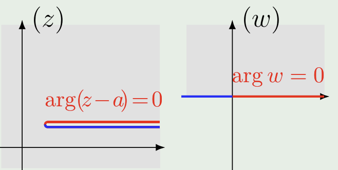
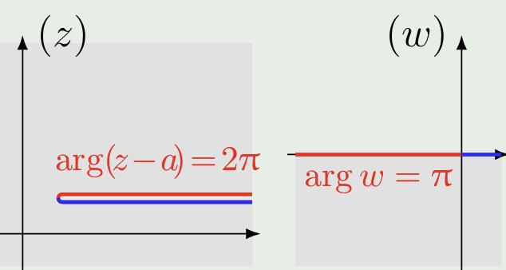
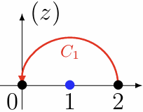
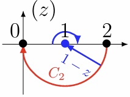
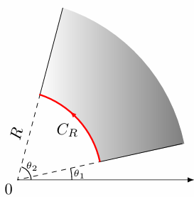

# 复变函数 Complex Variable Functions

## 0. 关于复数的基本认识

### 0.1 复数的表述及运算

传统上，复数可用**实部**和**虚部**来表示：

$$
z = x + iy\qc
\begin{cases}
\Re(z) = x \\
\Im(z) = y
\end{cases}
$$

也可以用**模**和**辐角**来表示，也可使用欧拉公式化成指数形式：

$$
z = r(\cos \theta + i\sin \theta) = re^{i\theta} \qc
\begin{cases}
\abs{z} = r \\
\arg{z} = \theta
\end{cases}
$$

!!! tips "提示"
    这同样也告诉我们**任何以纯虚数项作指数的幂函数模为1**：

    $$
    \abs{a^{ix}} = \abs{e^{ix\ln a }} = 1
    $$

### 0.2 复变函数

就是**以复数作为自变量的函数**。这相当于在二维复平面上做运算，因此一些区域的概念就不赘述。

值得一提的是**无穷远点**的概念。我们可以把一个模为正无穷，辐角为任意值的“复数点”定位无穷远点，其可以在复平面上以任意方式无限远离原点得到。一个直观的理解是 Reiman 球：

在如图所示的球面上，可以用顶点到球面上任意一点的射线与复平面交点一一对应复平面上的每个点，此时，上顶点的位置就对应着无穷远点 $\infty$ 。

## 1. 可导与解析

### 1.1 复变函数的导数性质

$$
f'(z) = \lim_{\Delta z \to 0} \frac{f(z+\Delta z)-f(z)}{\Delta z}
$$

$f(z)$ 可导的必要条件：处处满足**Cauchy-Reiman Equation**

固定另一个为0，同时对 $x$ 和 $y$ 求偏导：

$$
\begin{aligned}
f'(z) = f'(x+iy) &= \frac{\partial f}{\partial x} =
\frac{\partial u}{\partial x} + i\frac{\partial v}{\partial x}\\
&= \frac 1i \frac{\partial f}{\partial y} =
-i\frac{\partial u}{\partial y} + \frac{\partial v}{\partial y}
\end{aligned}
$$

即有

$$
\boxed{
\begin{cases}
\displaystyle{\frac{\partial u}{\partial x} = \frac{\partial v}{\partial y}} \\
\displaystyle{\frac{\partial u}{\partial y} =-\frac{\partial v}{\partial x}}
\end{cases}
}
$$

**解析**：复变函数 **在某一区域内可导**，而不能是在某一点或某一线上可导。

!!! example "Cauchy-Reiman Equation"
    **计算 $|z|$ 是否可导/解析？**

    $|z| = \sqrt{x^2+y^2}$，所以 $u=\sqrt{x^2+y^2}$，$v = 0$，计算偏导数得到：
    
    $$
    \begin{gathered}
    \frac{\partial u}{\partial x} = \frac{x}{\sqrt{x^2+y^2}}, \frac{\partial u}{\partial y} = \frac{y}{\sqrt{x^2+y^2}}, \quad \frac{\partial v}{\partial x} = \frac{\partial v}{\partial y} = 0
    \end{gathered}
    $$
    
    可见$\begin{cases}
    \displaystyle{\frac{\partial u}{\partial x} = \frac{\partial v}{\partial y}} \\
    \displaystyle{\frac{\partial u}{\partial y} =-\frac{\partial v}{\partial x}}
    \end{cases}$不能同时满足，故不解析。

计算 $u(x,y)$ 的二阶微分有：

$$
\begin{aligned}
\nabla^2u &= \frac{\partial^2u}{\partial x^2}+ \frac{\partial^2u}{\partial y^2}\\
&= \frac{\partial}{\partial x}\frac{\partial v}{\partial y} + \frac{\partial}{\partial y}(-\frac{\partial v}{\partial x})\\
&= 0
\end{aligned}
$$

同理有：

$$
\nabla^2v = 0
$$

这被称为 **(共轭)调和函数** ，其充分条件是满足 Cauchy-Reiman 方程。

同理还可证：

$$
\nabla^2(uv) = 0
$$

!!! NOTE
    很多情况下 $u(x,y)$ 和 $v(x,y)$ 均为初等函数，根据二阶导有：

    $$
    \frac{\partial^2u}{\partial x^2} = \frac{\partial^2u}{\partial y^2} = \frac{\partial^2u}{\partial (xy)} = 0
    $$

---

### 1.2 通过积分求解解析函数

我们知道

$$
dv = \frac{\partial v}{\partial x}dx + \frac{\partial v}{\partial y}dy =
-\frac{\partial u}{\partial y}dx + \frac{\partial u}{\partial x}dy
$$

因此，只要知道任一解析函数的实部 $u(x,y)$ 或虚部 $v(x,y)$，即可求出其另外一个部分

!!! example "Eg1"
    $f(z)$ 解析且 $\mathrm{Re} f = u(x,y) = 2xy$, 求 $f(z)$

    观察有 $dv = -2xdx + 2ydy = d(y^2-x^2)$，于是 $v = y^2-x^2+C$
    
    $$
    f(z) = 2xy + i(y^2-x^2+C) = -i(x+iy)^2 + iC = -iz^2+iC
    $$

---

### 1.3 采取共轭复数的求解（不积分）

$$
\begin{cases}
x = \displaystyle{\frac{z+z^*}{2}}\\
y = \displaystyle{\frac{z-z^*}{2i}}
\end{cases}
$$

于是

$$
\frac{\partial f}{\partial z^*} = \frac{\partial f}{\partial x}\frac{\partial x}{\partial z^*} + \frac{\partial f}{\partial y}\frac{\partial y}{\partial z^*} = \frac 12 \frac{\partial f}{\partial x} - \frac{1}{2i}\frac{\partial f}{\partial y} = 0
$$

这意味着 **$f$ 与 $z^*$ 无关**。又有

$$
\begin{aligned}
f(x+iy) &= u(x, y)+iv(x, y)\\
f^*(x-iy) &= u(x, y)-iv(x, y)
\end{aligned}
$$

若已知实部，我们有：

$$
u(x, y) = \frac{f(x+iy)+f^*(x-iy)}{2}
$$

若令：$x+iy = z, x-iy = 0$，则 $x=\frac z2,y = \frac{z}{2i}$

$$
\begin{aligned}
f(z) &= 2u(\frac z2,\frac{z}{2i}) -f^*(0) \\
&= 2u(\frac z2,\frac{z}{2i}) - u(0,0) + iv(0,0)\\
&= 2u(\frac z2,\frac{z}{2i}) - u(0,0) + iC
\end{aligned}
$$

!!! NOTE
    若函数在 0 处无定义，可取解析域内 $x-iy = z_0$。eg：$u = \frac{x}{x^2+y^2}$

!!! warning

    此处的 $z$ 和 $z^*$ 为“形式化推导”的产物，即两者并不存在数量关系（不一定同时等于 0）

---

### 1.4 特殊情况下的处理

!!! Example "Eg2"
    **$f(z)$ 解析且已知 $u+v$，求 $f(z) = u+iv$**

    设
    
    $$
    F = u+v+\mathrm{Im}(F) = u+v + iv-iu = (1-i)f
    $$
    
    此时退化成 $U(x,y) = u+v$ 已知的解析函数求解。

!!! Example "Eg3"
    **$f(z)$ 解析且已知 $uv$，求 $f(z) = u+iv$**

    求平方有：
    
    $$
    f^2 = u^2 - v^2 + i(2uv) = U(x, y) + iV(x, y)
    $$
    
    此时退化成 $V(x,y) = 2uv$ 已知的解析函数求解。

---

## 2. 初等函数

### 2.1 幂函数

$$
f(z) = z^n,\quad n\in\mathbb{C}
$$

for $n = 1,2,3 ...$, $f(z)$ 在 $\infty$ 不解析，但在 $\mathbb{C}$ 解析

for $n = -1,-2,-3 ...$, $f(z)$ 在 $\mathbb{C}/0$ 上解析

### 2.2 指数函数

$$
f(z) = e^z
$$

表现为周期函数且 $e^x>0\quad if\quad x\in\mathbb{R}$

$e^z+1=0$ 在 $\mathbb{R}$ 内无解但在 $\mathbb{C}$ 内有无穷多解，since  $e^{i\pi + 2k\pi} = -1$

于是其解 $z = i\pi + 2k\pi$

| 实部图像                                                    | 虚部图像                                                    |
| ------------------------------------------------------- | ------------------------------------------------------- |
|  |  |

### 2.3 三角函数

$$
f(z) = \sin z, \cos z, \tan z, \cot z
$$

对于复数域可能有 $|\sin z| > 1$

由欧拉公式我们有：

$$
\begin{aligned}
\sin z &= \frac{e^{iz} - e^{-iz}}{2i} \\
\cos z &= \frac{e^{iz} + e^{-iz}}{2}
\end{aligned}
$$

| sin(z)实部图像                | sin(z)虚部图像                |
| ----------------------------- | ----------------------------- |
|  |  |
| **cos(z)实部图像**            | **cos(z)虚部图像**            |
|  |  |

双曲函数形式：

$$
\begin{aligned}
\sinh z &= \frac{e^z - e^{-z}}{2} \\
\cosh z &= \frac{e^z + e^{-z}}{2}
\end{aligned}
$$

若要讨论函数在无穷远点的性质，取变量替换 $t = \frac 1z$

---

## 3. 多值函数

### 3.1 根式函数的多值性

讨论函数：

$$
\begin{aligned}
w &= \sqrt{z-a}\\
w^2 &= z-a
\end{aligned}
$$

若令 $w = \rho e^{i\phi}$, $z-a = r e^{i\theta}$

$$
\rho^2 e^{i2\phi} = re^{i\theta}
$$

于是

$$
\begin{cases}
r = \sqrt{\rho}\\
\theta = 2\phi + 2k\pi
\end{cases}
$$

即为 $\mathrm{arg}(\sqrt{z-a}) = \frac 12 \mathrm{arg}(z-a)$，这意味着对于函数 $w$，如果考虑 $z$ 在 $a$ 点附近旋转一圈，在 $w$ 平面上只旋转了半圈。

$\sqrt{z}$ 的图像如下图所示，可见虚部是螺旋上升的：

| 实部图像                         | 虚部图像                         |
| -------------------------------- | -------------------------------- |
|  |  |

这种单一自变量对应多个函数值的函数被称为 **多值函数**

---

### 3.2 多值函数的单值化

考虑模和辐角：

$$
\begin{gathered}
|w| = \sqrt{|z-a|} \\
\arg{w} = \frac 12\arg(z-a)
\end{gathered}
$$

可见其多值性 **体现在辐角而不是模上**（相差 $\pi$ 而不是 $2\pi$）

$$
\frac 12 (\arg(z-a)+2\pi) = \arg w+\pi
$$

多值性的根源：**宗量**（作为自变量的函数）$z-a$ 具有任意性

简单的办法是限制其辐角变化范围（$\arg(z-a) \in [0,2\pi)$），即在平面上作 **割线**，此时 $\arg w \in [0,\pi)$，意味着 $w$ 只位于平面上半部分，这被称为一个 **单值分支**

此处 **割线** 的作用是限制辐角的变化方式，规定 **割线上岸** 为 $\arg(z-a)=0$

同理，如果限制 $\arg(z-a) \in [2\pi, 4\pi)$，有 $\arg w \in [\pi,2\pi)$，这是 $\sqrt{z-a}$ 的另一个单值分支：

| 单值分支 I                                                    | 单值分支 II                                                   |
| ------------------------------------------------------------ | ------------------------------------------------------------ |
|  |  |

据此可以判断这一类函数的多值性。

!!! example "判断函数的多值性"
    **判断以下函数是否为多值函数**

    $$
    (1)\sin \sqrt{x}, (2)\cos \sqrt{x}, (3)\frac{\sin \sqrt{x}}{\sqrt {x}},  (4)\frac{\cos \sqrt{x}}{\sqrt {x}}
    $$
    
    由根式函数的两个分支互为相反数，可注意到：
    
    $$
    \cos (-w) = \cos(w), \frac{\sin (-w)}{-w} = \frac{\sin (w)}{w}
    $$
    
    即(2)(3)中两个分支中，每一对相反数函数值均相同，可视为一个单值分支。于是(2)(3)为单值函数。

### 3.3 分支点

在上面的讨论中，考虑函数 $w=\sqrt{z-a}$，自变量 $z$ 绕点 $a$ 旋转两圈（同时也是绕无穷远点 $\infty$ 旋转）其函数值才能复原，因此我们可以说 $z=a$ 和 $z=\infty$ 是函数 $w=\sqrt{z-a}$ 的 **分支点**，其 **分支指数** 为 2。

!!! note "小贴士"
    想象分支点连着一根线到路径上，让这个绳子缠在分支点上几圈就是绕这个点转的辐角。

讨论函数：

$$
w = \sqrt [4]{(z-a)(z-b)}
$$

我们写成辐角形式：

$$
\begin{aligned}
w^4 &= r_1r_2e^{i(\theta_1+\theta_2)}\\
4\arg w &= \theta_1 + \theta_2
\end{aligned}
$$

可以看，当 $z$ 绕 $z=a$ 和 $z=b$ 四圈才能让函数值复原，因此其分支指数为 4；而同时绕两个点（$即绕z=\infty$）两次即可复原，分支指数为 2。

要想让其为单值函数，必须做割线使得 **$z$ 不能绕任意一个分支点一圈**，因此通常我们分别做连接 $z=a$ 和 $z=\infty$ 的射线和连接 $z=b$ 和 $z=\infty$ 的射线。

---

### 3.4 Reimann 面

另一种方法是，规定复变函数在某一点的值，描述其 **沿某一路径** 运动到另一点的值。

先考虑函数 $w = \sqrt{1-z}$，规定 $w(2) = -i$，考虑 $C_1$ 和 $C_2$ 两种路径：

| 路径               |  |  |
| ------------------ | ------------------------------------------------------------ | ------------------------------------------------------------ |
| $\Delta \arg(1-z)$ | $\pi$                                                        | $-\pi$                                                       |
| $\arg(1-z)$        | $(4k-1)\pi + \pi = 4k\pi$                                    | $(4k-1)\pi - \pi = (4k-2)\pi$                                |
| $w$                | $e^{\frac{4k\pi}{2}i} = 1$                                   | $e^{\frac{(4k-2)\pi}{2}i} = -1$                              |

在几何图形上，我们可以视作两个平面粘合起来（其实这个图形不能用三维描述）：

可以看到对于任意点绕原点的运动，只有在这个诡异的平面上转两圈才能复原；这种曲面就是 **Reiman 面**，对于这种根式函数有 **二叶 Reiman 面**。

---

### 3.5 对数函数

考虑复平面的对数函数：

$$
w = \ln(z)
$$

令 $w = u+iv$, $z = re^{i\theta}$，我们有：

$$
\begin{gathered}
u = \ln r = \ln \abs{z}, v = \theta + 2n\pi \\
w = \ln \abs{z} + i(\arg{z} + 2n\pi)
\end{gathered}
$$

也就是其每一个 $z$ 空间内的点对应 $w$ 空间实部相同的无数点：

其限制在 $[-\pi,\pi)$ 内的函数图像：

显而易见其分支点是 $z=0$ 和 $z=\infty$，于是做原点出发的射线可以使对数函数 $\ln z$ 单值化。其 Reiman 面是无穷叶的：

---

### 3.6 反三角函数

$$
\begin{aligned}
\arcsin z &= \frac 1i \ln(iz+\sqrt{1-z^2})\\
\arccos z &= \frac 1i \ln(z+\sqrt{z^2-1})\\
\arctan z &= \frac 1{2i} \ln(\frac{1+iz}{1-iz})
\end{aligned}
$$

---

## 4. 复变积分

### 4.1 复变积分的定义

复变积分就是 **复平面上的第一类曲线积分**

$$
\begin{aligned}
\int_C f(z)dz &= \lim_{\abs{z_k-z_{k-1}}\to 0} \sum_{k = 1}^n f(\zeta_k)(z_k - z_{k-1}) \\
\end{aligned}
$$

其可以拆成两个线积分的组合：

$$
\begin{aligned}
\int_C f(z)dz &= \int_C(u+iv)(dx+idy) \\
&= \int_C(udx-vdy) + i\int_C(vdx+udy)
\end{aligned}
$$

于是如果 $C$ 可求长，而 $f(z)$ 在 $C$ 上连续，则复变积分 $\int_C f(z)dz$ 一定存在。

!!! example "复变积分的直接求法"
    **要求：**

    $$
    \int_C z^ndz
    $$
    
    **已知 $n$ 为整数，$C$ 为以原点为原型，$r$ 为半径，夹角为 $\theta_2-\theta_1$ 的圆弧。**
    
    可以得出：
    
    $$
    \begin{aligned}
    \int_C z^ndz &= \int_C r^n e^{in\theta}d(re^{i\theta}) \\
    &= ir^{n+1} \int_C e^{in\theta}·e^{i\theta} d\theta \\
    &= ir^{n+1} \int_C e^{i(n+1)\theta} d\theta
    \end{aligned}
    $$
    
    此处需要分类讨论。当 $n=-1$ 时我们有：
    
    $$
    \int_C z^ndz = i(\theta_2 - \theta_1)
    $$
    
    在其他情况下：
    
    $$
    \begin{aligned}
    \int_C z^ndz &= ir^{n+1} \int_C e^{i(n+1)\theta} d\theta \\
    &= ir^{n+1} (\frac{e^{i(n+1)\theta_2} - e^{i(n+1)\theta_1}}{i(n+1)}) \\
    &= \frac{r^{n+1}}{n+1} (e^{i(n+1)\theta_2} - e^{i(n+1)\theta_1})
    \end{aligned}
    $$
    
    注意：如果对复数微元取模（即取弧长微元）：
    
    $$
    \abs{dz} = ds = \sqrt{r'(\theta)^2 + r^2}d\theta = rd\theta = \sqrt{1+(y')^2}dx
    $$
    
    则有
    
    $$
    \int_C z^n\abs{dz} = r^{n+1} \int_C e^{in\theta} d\theta = 
    \begin{cases}
    r(\theta_2 - \theta_1),& n = 0 \\
    \displaystyle r^{n+1}\cdot\frac{e^{in\theta_2} - e^{in\theta_1}}{in},& n\neq0
    \end{cases}
    $$

!!! example "复变积分的分解求法"
    **求 $\int_C zdz$, $C$ 为直线 $0 \to 1+i$**

    $$
    \begin{aligned}
    \int_C zdz &= \int_C(x+iy)d(dx + idy) \\
    &= \int_C (xdx-ydy) + i\int_C (ydx + xdy) \\
    &= \frac12 - \frac12 + i = i
    \end{aligned}
    $$
    
    事实上，这个积分是一个整函数，可以直接有：
    
    $$
    \int_C zdz = \frac 12 z^2 \big|_0^{1+i} = i
    $$

复变积分的 **所有基本性质与曲线积分类似**。

---

### 4.2 Cauchy 定理与不定积分

如果函数 $f(z)$ 满足：

1. 在有界单连通区域 $G$ 内解析；
1. 积分路径 $C$ 为 $G$ 内任意一条首尾相接的可求长曲线；

则有：

$$
\boxed{\oint f(z)dz = 0}
$$

这被称为 **Cauchy 积分定理**。

!!! warning "注意"
    单连通区域只能是有界区域，不能是绕 $\infty$ 的无界区域。例如 $f(z) = \frac 1z$ 沿 $\infty$ 一周的积分不为 0（即使是解析的）。
    由于在 $G$ 内解析，曲线 $C$ 不可包含任何无定义或不可导点。

!!! note "推论"
    若 $f(z)$ 在有界单连通区域 $G$ 内解析，则对任意 $C \subset G$ 有：

    $$
    \int_C f(z)dz \quad \text{与路径无关}
    $$

!!! question
    Cauchy 定理和 Cauchy-Reiman 方程互为微分/积分形式。

    这也提供了 Cauchy 定理的证明：由 Green 公式：
    
    $$
    \begin{aligned}
    \oint_C f(z)dz &= \int_C(udx-vdy) + i\int_C(udy + vdx) \\
    &= \iint_D (- \frac {\partial v}{\partial x} - \frac {\partial u}{\partial y})
    +i \iint_D (\frac {\partial u}{\partial x} - \frac {\partial v}{\partial y})
    \end{aligned}
    $$
    
    然后应用 Cauchy-Reiman 方程：
    
    $$
    \frac {\partial v}{\partial x} = - \frac {\partial u}{\partial y}, \quad \frac {\partial v}{\partial y} = \frac {\partial u}{\partial x}
    $$
    
    可知：
    
    $$
    \oint_C f(z)dz = 0
    $$
    
    事实上，格林公式的应用条件是**导函数存在且连续**，而在一般的解析函数并未定义导函数连续。但由Goursat定理可证：解析函数的任意阶导函数存在且连续（即无限可微）。证明懒得写。

由 **Cauchy 定理推论**，可以知道在有界单连通区域 $G$ 内的函数：

$$
\boxed{\int_{z_0}^z f(\zeta)d\zeta = F(z)}
$$

为单值函数。这也被称作 $f(z)$ 的 **不定积分**。我们有：

$$
F'(z) = \frac{d}{dz}\int_{z_0}^z f(\zeta)d\zeta = f(z)
$$

$f(z)$ 被称为 $F(z)$ 的 **原函数**。（并不唯一，可以相差常数 C）

$$
F(z) = \Phi(z) +C
$$

显然有：

$$
\begin{aligned}
F(z_0) = \Phi(z_0) + C &= 0 \\
C &= -\Phi(z_0) \\
F(z) = \int_{z_0}^z f(\zeta)d\zeta = \Phi(z) +C &= \Phi(z) - \Phi(z_0)
\end{aligned}
$$

!!! Warning "注意"
    引用以上公式的时候必须首先说明 $f(z)$ 在某一单连通区域内解析。

---

### 4.3 多连通区域

对于多连通区域，我们有：

$$
\boxed{\oint_{C_0} f(z)dz = \sum_{n} \oint_{C_i}f(z)dz}
$$

其中 $C_0$ 为外部框线的环路积分，$C_i$ 为内部框线的环路积分。注意对于这里的内部框线，指的是将内部的洞视为一个“区域”时这个区域的边界，因此积分方向是逆时针，有别于一般内部框线的定义。

证明可以通过构造下列割线形成单连通区域 $G'$：

由于割线两岸积分相互抵消，整个 $G'$ 的环路积分为 0，移项可以得到结果。

$$
\oint_{C_0} f(z)dz - \sum_{n} \oint_{C_i}f(z)dz + \sum_n \int_{a_i}^{b_i} f(z)dz + \sum_n \int_{b_i}^{a_i} f(z)dz = 0
$$

!!! example "求环路积分"
    **计算 $\oint_C z^ndz$，其中 $n \in \mathbb{R}$**

    显然当 $n \in \mathbb{N}$（$\mathbb{C}/\infty$ 内解析）和 $C$ 内不含 $z=0$ 时，有
    
    $$
    \oint_C z^ndz = 0
    $$
    
    而当 $n$ 为负整数且 $C$ 内含有原点时：
    
    $$
    \begin{aligned}
    \oint_C z^ndz &= \int_{\abs{z} = \epsilon} z^ndz = i\epsilon^{n+1}\int_0^{2\pi} e^{in\theta} \cdot e^{i\theta} d\theta \\
    &= i\epsilon^{n+1}\int_0^{2\pi} e^{i(n+1)\theta} d\theta =
    \begin{cases}
    2\pi i, &n =-1 \\
    0, &n = -2,-3,-4, ...
    \end{cases}
    \end{aligned}
    $$

在未给定圆形路径的半径$r$或比较难算时，常常采用在奇点附近取$|z-a|\to0$的小圆，通过极限求得其路径积分。

### 4.4 大小圆弧引理/Jordan 引理

!!! NOTE "一致收敛"
    逐点收敛：当 $z\to a$ 时，$f(z,w) \to A$，iff：

    $$
    \forall \epsilon > 0, \exists \delta(w)> 0, s.t. 当\abs{z-a}<\delta 时，\abs{f(z, w)-A}<\epsilon
    $$
    
    一致收敛：当 $z\to a$ 时，$f(z,w) \rightrightarrows A$，iff：
    
    $$
    \forall \epsilon > 0, \exists \delta > 0, s.t. 对\forall w\in G, 当\abs{z-a}<\delta 时，\abs{f(z, w)-A}<\epsilon
    $$
    
    注意此时 $\delta$ 和 $w$ 无关，也可以理解为 $\sup{f(z,w)} \to 0$。
    
    作为例子，当 $f(z,w)=zw$ 时，考虑 $z\to0$：
    
    $$
    \forall \epsilon > 0, \exists \delta(w) = \frac{\epsilon}{|w|}> 0, s.t. \abs{f(z, w)-0} = \abs{zw}<\epsilon
    $$
    
    因此 $f(z,w) \to 0$。
    
    考虑有限区域 $G= \{z,|z|<M\}$，考虑 $z\to0$：
    
    $$
    \forall \epsilon > 0, \exists \delta = \frac{\epsilon}{M}> 0, s.t. \abs{f(z, w)-0} = \abs{zw}<|\frac {\epsilon w} M| \le \epsilon
    $$
    
    因此 $f(z,w) \rightrightarrows 0$。但是，如果考虑无限区域，则找不到 $\delta$，因此不是一致收敛。这意味着一致收敛比逐点收敛的条件更强。

**小圆弧引理**：$f(z)$ 在灰色区域内连续，令 $z-a=re^{i\theta}$，且有 **扇形区域内** 一致收敛：

$$
(z-a)f(z) = re^{i\theta}f(a+re^{i\theta}) \rightrightarrows k
$$

则：

$$
\lim_{r\to0} \int_{C_r} f(z)dz = ik(\theta_2-\theta_1)
$$

!!! Warning "注意"
    只是扇形区域内一致收敛，而不是极限是 $k$。后者的条件更强（包括了所有辐角）。

    eg：当 $z\to0$ 时，$\displaystyle f(z)=e^{\frac 1z} = \exp(\frac 1r e^{-i\theta})$ 的极限不存在，但存在扇区内一致收敛。
    
    考虑 $\displaystyle \frac{\pi}{2} < \frac \pi2+\xi < \theta < \pi$ 范围内，显然 $f(r,\theta) \rightrightarrows 0$。
    
    化简原式：
    
    $$
    \abs{\exp(\frac 1r e^{-i\theta})} = \abs{\exp(\frac1r(\cos\theta-i\sin\theta))} = e^{\frac{\cos\theta}{r}} < e^{\frac{\cos(\frac\pi2 + \theta)}{r}} = e^{\frac{-\sin\theta}{r}} < \epsilon
    $$
    
    于是我们可以说：
    
    $$
    \forall \epsilon > 0, \exists \delta = -\frac{\sin\epsilon}{\ln\epsilon}, s.t. 当 r <\delta 时，f(r,\theta)<\epsilon
    $$

**大圆弧引理**：$f(z)$ 在灰色区域内连续，令 $z=re^{i\theta}$，且有 **扇形区域内** 一致收敛：

$$
zf(z) = Re^{i\theta}f(Re^{i\theta}) \rightrightarrows K
$$

则：

$$
\lim_{R\to\infty} \int_{C_R} f(z)dz = iK(\theta_2-\theta_1)
$$

---

## 5. 含参定积分

### 5.1 Cauchy 积分公式

如果函数 $f(z)$ 满足：

1. <u>在有界区域 $G$ 内解析</u>，闭区域 $\overline{G}$ 内连续且边界 $\partial G$ 可求长；
2. $a \in G$

就有：

$$
f(a) = \frac 1{2\pi i} \oint_{\partial G} \frac{f(z)}{z-a}dz
$$

这被称为 **有界区域的 Cauchy 积分公式**

在特殊情况下，常用圆周型区域 $d(z-a) = iRe^{i\theta}d\theta$，有

$$
f(a) = \frac 1{2\pi} \int_0^{2\pi}f(a+Re^i\theta) d\theta
$$

这就说明 $f(a)$ 等于在解析区域内，以 $a$ 为圆心的圆周上的积分值的平均值（**均值定理**）。

!!! abstract "证明"
    在 $z-a$ 附近取圆周 $\abs{z-a} = r$，由多连通区域的 Cauchy 定理：

    $$
    \oint_{\partial G} \frac{f(z)}{z-a}=\oint_{\abs{z-a} = r} \frac{f(z)}{z-a}
    $$
    
    在 $[0,2\pi)$ 内使用小圆弧定理：
    
    $$
    \lim_{r\to0} \oint_{\abs{z-a} = r} \frac{f(z)}{z-a} = 2\pi i \cdot \lim_{(z-a) \to 0} (z-a)\frac{f(z)}{z-a} = 2\pi i f(a)
    $$

如果拓展到无解区域内，函数 $f(z)$ 满足：

1. 在无界区域 $G$ 内 **单值** 解析，闭区域 $\overline{G}$ 内连续且边界 $\partial G$ 可求长；
2. $a \in G$；
3. $\lim_{z\to\infty}f(z) = 0$ 且存在一个原点为圆心的大圆 $C_R$，使得大圆外的区域均解析

就有：

$$
f(a) = \frac 1{2\pi i} \oint_{\partial G} \frac{f(z)}{z-a}dz
$$

!!! abstract "证明"
    取一个足够大的大圆 $\abs{z} = R$，对有界区域有：

    $$
    f(a) = \frac{1}{2\pi i}\oint_{\partial G} \frac{f(z)}{z-a}dz + \frac{1}{2\pi i}\oint_{C_R} \frac{f(z)}{z-a}dz
    $$
    
    取 $R\to\infty$，由大圆弧引理：
    
    $$
    f(a) = \frac{1}{2\pi i}\oint_{\partial G} \frac{f(z)}{z-a}dz + \lim_{z\to\infty}f(z) = \frac{1}{2\pi i}\oint_{\partial G} \frac{f(z)}{z-a}dz
    $$

!!! warning "求Cauchy型积分"
    一定注意该公式使用的前提是$f(z)$在区域$G$内解析！如果需要积分$\frac{\phi(z)}{(z-a)(z-b)}$：

    - 如果$a \in G$，而$b \notin G$，可以将$a$作为外部的$(z-a)$项（避免奇点在区域内部）。
    - 如果$a \in G$，且$b \in G$，可考虑分式分解成$\frac{A}{z-a} + \frac{B}{z-b}$。

---

### 5.2 Cauchy 型积分

若 $C \subset \mathbb{C}$ 是一条可求长曲线，定义 **Cauchy 型积分**：

$$
F_n(z) = \int_C \frac{\varphi(\zeta)}{(z-\zeta)^n} d\zeta,\quad z\notin C, \quad n\in\mathbb{N}
$$

有如下性质：

1. $F_n(z)$ 对任意 $z \notin C$ 均解析；
2. $F_{n}'(z) = nF_{n+1}(z)$

Cauchy 积分公式的右侧实际上可看作 Cauchy 型积分的 $n=1$ 形式。

观察性质 2，其实有：

$$
\begin{aligned}
F_n'(z) = \frac{d}{dz} \int_C \frac{\varphi(\zeta)}{(z-\zeta)^n} d\zeta &= n\int_C \frac{\varphi(\zeta)}{(z-\zeta)^{n+1}} \\
&= \int_C \frac{d}{dz} \frac{\varphi(z)}{(z-\zeta)^{n+1}}
\end{aligned}
$$

即对于 Cauchy 型积分 **微商和积分可互换**。

由此性质可以推出 **高阶导数公式**（有界区域及无界区域的要求同 Cauchy 积分）：

$$
f^{(n)}(z) = \frac{n!}{2\pi i}\oint_{\partial G} \frac{f(\zeta)}{(z-\zeta)^{n+1}} d\zeta
$$

这意味着对于一个解析函数，只要一阶导数存在，则任意阶导数均存在。

---

### 5.3 含参变量积分

对于含参复变函数 $f(t,z)$，若满足：

1. 对于 $t \in [a,b]$， $z \in \overline{G}$，$f(t,z)$ 对 $t$ 和 $z$ 均连续；
2. $\forall t\in [a,b]$，$f(t,z)$ 在 $G$ 内解析且在 $\overline{G}$ 中连续；

则有：

1. 函数 $F(z) = \int_a^b f(t,z)dt$ 在 $G$ 内解析；
2. $f(z)$ 积分号和微商号可互换，即：

$$
\frac{d}{dz} \int_a^b f(t, z) dt = \int_a^b [\frac{\partial}{\partial z}f(t, z)] dt
$$

---

### 5.4. 更多引理

#### Cauchy不等式

$$
|f^{(n)}(\zeta)| \leq \frac{n!}{2\pi}\frac{Ml}{d^{n+1}} = \frac{n!M}{R^n}(|\zeta-z| = R)
$$

其中 $l$ 是边界周长，$d$ 为 $z$ 到边界的最短距离，$M$ 为函数上界。

#### Liouville定理

如果 $f(z)$ 在 $\mathbb{C}$ 上解析且有界，则其必为常函数。

---

## 6. 无穷级数

### 6.1 复数级数

无穷级数收敛的判别方法大致与实数相同，对于复数数列 $u_i$ ，我们有：

$$
\sum_n u_n = \sum_n a_n + i\sum_n b_n
$$

因此，复数级数的收敛性**完全等价于实部和虚部两个实数级数的收敛性**。

类似任意项指数，复数级数也有绝对收敛的概念，即绝对收敛对应着 $\sum_n \abs{u_n}$ 收敛。显然，如果一个级数绝对收敛，那么这个级数本身也收敛。

由于绝对级数已经转换为正数项级数的问题，可以用高等数学结论进行判断。此处不赘述。

---

### 6.2 函数级数

逐点收敛和一致收敛的定义前文已经说过，此处不再赘述。

同样的，对于一致收敛的函数级数，满足：

- 如果原函数 $u_k(z)$ 连续，那么级数 $\sum_{k=1}^\infty u_k(z)$ 也连续。其实就是：

$$
\lim_{z \to z_0} \bqty{\sum_{k=1}^\infty u_k(z)} = \sum_{k=1}^\infty\bqty{\lim_{z \to z_0}  u_k(z)}
$$

- 可以逐项求积分：

$$
\int_C \sum_{k=1}^\infty u_k(z) dz = \sum_{k=1}^\infty \int_C u_k(z) dz
$$

- 可以逐项求导数（**Weierstrass 定理**）：

$$
\dv[p] z \sum_{k=1}^\infty u_k(z) = \sum_{k=1}^\infty \bqty{\dv[p] z u_k(z)}
$$

如果把求个扩展到积分，我们就可以判断含参反常积分的一致收敛性。事实上，一般判断函数项级数和反常积分一致收敛的方法是**比较判别法**，即找到一个模更大且一致收敛的函数进行比较（M-判别法）。

对于一个连续且区域内解析的函数 $f(t,z)$ ，如果积分一致连续，我们就可以判断**其积分解析**，且求导和积分可以互换：

$$
\dv z \int_a^\infty f(t,z) dt = \int_a^\infty \pdv z f(t,z) dt
$$

---

### 6.3 幂级数

和实数一样，幂级数被定义为：

$$
\sum_{n=0}^\infty c_n(z-a)^n \equiv c_0 + c_1(z-a) + c_2(z-a)^2 + ...
$$

同样我们有幂级数的**收敛半径**，即在复平面上，使幂级数收敛的区域是**半径为 $r$ 的一个圆形**。对于边界上的情况，实际上由于我们只关心收敛区域，因此一般不需要单独考虑。

收敛半径通常有两种求法：

- Cauchy 判别法：收敛半径为系数的上极限的 $1/n$ 次方的倒数：

$$
R = \frac{1}{\varlimsup_{n\to\infty} \abs{c_n}^{1/n}}
$$

- d'Alembert 判别法：**如果相邻相的比值极限存在**，则：

$$
R = \lim_{n\to\infty} \abs{\frac{c_n}{c_{n+1}}}
$$

通常而言后者的计算更简单，但是前者更加普遍通用。

---

### 6.4 Taylor 展开

和实变函数一样，对于复变函数 $f(z)$ ，如果在半径为 $R$ 的区域 $|z-a|<R$ 内解析，则可以展开成幂级数：

$$
f(z) = \sum_{n=0}^\infty \alpha_n(z-a)^n
$$

由高阶导数公式，实际上：

$$
\alpha_n = \frac{f^{(n)}(a)}{n!} = \frac{1}{2\pi i}\oint_{|z-a|=R}\frac{f(z)}{(z-a)^{n+1}} dz
$$

公式和实变函数一样，但收敛条件略有不同。在复数域种，我们说收敛半径内均能保证收敛，这意味着找到一个离展开点最近的不可导点就足够确定收敛半径了。但在实变函数中还要求 Lagrange 余项的极限为0：

$$
R_n(x) = \frac{f^{(n+1)}{(\zeta)}}{(n+1)!}(x-x_0)^{n+1} \to 0
$$

一个经典的粒子是对于 $f(x) - \frac{1}{1+x^2} = \sum_{n=0}^\infty (-)^nz^{2n}$ ，收敛半径为 $R=1$ ，但在实数范围内难以解释其收敛域。

其他解 Taylor 级数的方法与实变相同。

一个有用的技巧是**柯西乘积**：

$$
\pqty{\sum_{i=0}^{\infty} a_ix^i} \cdot \pqty{\sum_{j=0}^{\infty} b_jx^j} =
\sum_{k=0}^{\infty} \pqty{\sum_{l=0}^{k} a_lb_{k-l}}x^k
$$

其实际作用就是一个自变量的范围限制在另一个自变量内，其实就是转化成对角线的求和：

!!! example "级数相乘"
    **在 $z=0$ 展开 $\frac1{1-3z+2z^2}$** 。

    $$
    \begin{aligned}
    \frac1{1-3z+2z^2} &= \frac1{1-z} \cdot \frac1{1-2z} \\
    &= \sum_{i=0}^\infty z^k \cdot \sum_{j=0}^\infty 2^jz^j \\
    &= \sum_{k=0}^\infty \pqty{\sum_{l=0}^k 2^l} z^k \\
    &= \sum_{k=0}^\infty(2^{k+1} - 1)z^k
    \end{aligned}
    $$

对于多值函数，在规定单值分支后即可展开。如对于函数：

$$
f(z) = (1+z)^\alpha
$$

若规定原点处值为 $a$ ，则有：

$$
\begin{gathered}
f(0) = a \\
f'(0) = a\alpha(1+z)^{\alpha-1} \eval{}_{z=0} = a\alpha \\
f''(0) = a\alpha(\alpha-1)
\end{gathered}
$$

一般地，有：

$$
(1+z)^\alpha = a\sum_{n=0}^\infty \binom{\alpha}{n} z^n
$$

其收敛半径**视展开点到割线距离**，且最大展开半径为 $R = 1$。

再对于对数函数：

$$
\begin{aligned}
f(z) = \ln(1+z) &= \int_0^z \frac{1}{1+\zeta} d\zeta + \ln(1+\zeta) \eval{}_{\zeta=0} \\
&= \int_0^z \sum_{n=0}^\infty (-)^n\zeta^nd\zeta + a \\
&= \sum_{n=0}^\infty \frac{(-)^n}{n+1} z^{n+1} + a \\
&= \sum_{m=1}^\infty \frac{(-)^{m-1}}{m} z^{m} + a
\end{aligned}
$$

对于复变函数而言，还有一种特殊的展开是在**无穷远点展开**。前面我们说过 $\infty$ 和 $0$ 可以通过 $1/z$ 相互映射，因此实际上无穷远点就是做变换 $z = \frac 1t$ ，然后在 $0$ 处展开 $f(\frac 1t)$：

$$
f(1/t) = \alpha_0 + \alpha_1t + \alpha_2t^2 + ...
$$

!!! example "无穷远点展开"
    **在无穷远点展开 $\frac{1}{1-z}$** 。

    $$
    \frac{1}{1-z} = -\frac 1z \frac{1}{1-\frac1z} = -\frac1z \sum_{n=0}^\infty \pqty{\frac1z}^n = -\sum_{n=0}^\infty \pqty{\frac1z}^{n+1}
    $$

---

### 6.5 解析函数的唯一性

对于朴素的零点定义，我们有：

> 对于一个函数 $f(z) \not\equiv 0$ ，如果在 $a$ 点解析并且 $f(a) = 0$ ，则 $z=a$ 为函数的零点。

我们可以把这个概念进行拓展。如果一个非零函数可以在半径 $R$ 内展开：

$$
f(z) = \sum_{n=0}^\infty \alpha_n(z-a)^n
$$

此时如果 $f(a) = 0$ ，则存在一个正整数 $m$ 使得：

$$
f(a) = f'(a) = ... = f^{(m-1)}(a) = 0 \qc f^{(m)}(a) \neq 0
$$

即：

$$
\alpha_0 = \alpha_1 = ... = \alpha_{m-1} = 0 \qc \alpha_m \neq 0
$$

此时 $z=a$ 称为 $f(z)$ 的 **$m$ 阶零点**。

对于零点有一个重要的定理：

**零点孤立性定理**：如果 $f(z)$ 在区域 $G$ 内解析且不恒为零，对于 $a \in G$, 且 $f(a) = 0$，则必然存在 $\delta > 0$ 使得 $f(z)$ 在空心邻域 $0 < |z-a| < \delta$ 内无零点。

**零点孤立性定理**的逆否命题：如果 $f(z)$ 在区域 $G$ 内解析，对于 $a \in G$, 且 $f(a) = 0$，如果存在 $\delta > 0$ 使得 $f(z)$ 在空心邻域 $0 < |z-a| < \delta$ 内**有**零点，则 **$f(z)$ 恒等于 0**。

如果我们设：

$$
f_1(z) - f_2(z) = f(z)
$$

这样就可以将逆否命题改写为：如果 $f_1(z), f_2(z)$ 在区域 $G$ 内解析，对于 $a \in G$, 且 $f_1(a) = f_2(a)$，如果存在 $\delta > 0$ 使得 $f(z)$ 在空心邻域 $0 < |z-a| < \delta$ 内**有**零点，则 **$f_1(z) = f_2(z)$**。

这其实意味着**解析函数的唯一性**：对于两个解析函数，如果在一个恒等式**在一段弧或者一个区域内成立**，那么其**在复平面上仍然成立**。

---

## 7. Laurrent 级数和留数

### 7.1 Laurent 展开

---

### 7.2 奇点的分类

---

### 7.3 Γ 函数

$\Gamma$ 函数的定义与实数相同：

$$
\Gamma(z) = \int_0^\infty e^{-t}t^{z-1} dt \qc \Re(z) > 0
$$

其中 $t \in \mathbb{Z}^*$ 。

为了讨论 $\Gamma$ 函数的解析性，我们定义：

$$
\Gamma(z) = \int_0^1 e^{-t}t^{z-1} dt + \int_1^\infty e^{-t}t^{z-1} dt = \gamma(z,1) + \Gamma(z,1)
$$

!!! proof "$\Gamma(z,1)$ 的解析性"
    > 如果一列**解析函数**在区域 $D$ 上**内闭一致收敛**于函数 $f$，那么：
    >
    > - $f$ 也在 $D$ 上解析。
    > - 导函数、积分等也内闭一致收敛。

    要证 $\Gamma(z,1)$ 解析，即证其（内闭）一致收敛。我们有：
    
    $$
    e^t > \frac{t^N}{N!} > 0 \Rightarrow e^{-t} < \frac{N!}{t^N}
    $$
    
    现在我们选择一个 $x_0$，使得 $\max\Re\ z < x_0$
    
    
    
    于是原积分：
    
    $$
    \Gamma(z,1) < \int_1^\infty N!t^{z-1-N}dt < \int_1^\infty t^{x_0-N-1}dt = \frac{1}{N-x_0}
    $$
    
    内闭一致收敛，于是 $\Gamma(z,1)$ 在全平面解析。

!!! proof "$\gamma(z,1)$ 的解析性"
    也是证内闭收敛。选择一个**正**实数 $\delta$ ，使得 $\min \Re\ z > \delta$ ：

    
    
    于是：
    
    $$
    \gamma(z,1) < \int_0^1 t^{\delta-1}dt = \frac1\delta
    $$
    
    内闭一致收敛，于是 $\gamma(z,1)$ 在右半平面解析。
    
    我们发现 $\gamma(z,1)$ 的解析域是较窄的，现在我们想办法将其延拓至全平面。对原积分作 Taylor 展开：
    
    $$
    \gamma(z,1) = \sum_{n=0}^\infty \frac{(-)^n}{n!} \int_0^1 t^{n+z-1}dt = \sum_{n=0}^\infty \frac{(-)^n}{n!} \frac{1}{n+z}
    $$
    
    这样 $\Gamma(z)$ 就可以在 $\mathbb C \backslash 0, -1, -2\ldots$ 上定义。

$\Gamma$ 函数的各种性质与实数类似：

- $\Gamma(1) = 1$
- $\Gamma(z+1) = z\Gamma(z)$, 当 $z \neq 0, -1, -2...$

!!! note "推论"
    根据性质2，我们可以在平面左端解析延拓 $\Gamma$ 函数：

	$$
	\Gamma(z) = \frac 1z \Gamma(z+1)
	$$
	
	于是我们就可以说 $z=0$ 是 $\Gamma$ 函数的一阶极点，其留数：
	
	$$
	\Res\ \Gamma(0) = 1
	$$
	
	依次延拓到全平面，我们就有 $z = 0,-1,-2...$ 都是 $\Gamma$ 函数的一阶极点：
	
	$$
	\Gamma(z) = \frac1{z(z+1)}\Gamma(z+2)
	$$
	
	其留数：
	
	$$
	\Res\ \Gamma(-n) = \frac{(-1)^n}{n!}
	$$

- 阶乘函数：

  $$
  \Gamma(n+1) = n! \qc n \in \mathbb N
  $$
  
- 互余宗量定理：

  $$
  \displaystyle \Gamma(z)\Gamma(1-z) = \frac{\pi}{\sin \pi z}
  $$

  其有几个重要推论：
  
  - $\Gamma(\frac12) = \sqrt{\pi}$
  - $\Gamma$ 函数在全平面无零点。

- 倍乘公式：

  $$
  \Gamma(2z) = 2^{2z-1}\pi^{-1/2}\ \Gamma(z)\Gamma(z+1/2)
  $$
  
- Stirling 公式：

  $$
  \Gamma(z) \sim z^{z-1/2}e^{-z}\sqrt{2\pi} \qc n! = \sqrt{2\pi n} (n/e)^n
  $$

---

### 7.4 B 函数

B 函数的定义：

$$
B(p,q) = \int_0^1 t^{p-1}(1-t)^{q-1} dt\qc \Re\ p>0\qc \Re\ q>0
$$

做变换 $t = \sin[2]\theta$，可以得到：

$$
B(p,q) = 2\int_0^{\pi/2} \sin[2p-1]\theta \cos[2q-1]\theta\ d\theta
$$

由于对称性，可以得到：

- 交换性质：

$$
B(p,q) = B(q,p)
$$

- 与 $\Gamma$ 函数的联系：

$$
B(p,q) = \frac{\Gamma(p)\Gamma(q)}{\Gamma(p+q)}
$$

!!! proof "证明"
    令 $t = x^2 = y^2$ 。

    $$
    \Gamma(p) = \int_0^\infty e^{-t} t^{p-1} dt = 2\int_0^\infty e^{-x^2}x^{2p-1} dx
    $$
    
    于是：
    
    $$
    \begin{aligned}
    \Gamma(p)\Gamma(q) &= 4\int_0^\infty\int_0^\infty e^{-(x^2+y^2)} x^{2p-1}y^{2q-1} dxdy \\
    &= 4\int_0^\infty \int_0^{\pi/2} e^{-r^2} (r\cos\theta)^{2p-1}(r\sin\theta)^{2q-1} r drd\theta \\
    &= 2\int_0^\infty e^{-r^2} r^{2p+2q-2} \cdot 2\int_0^{\pi/2}\cos\theta^{2p-1}\sin\theta^{2q-1} d\theta \\
    &= \Gamma(p+1)B(p,q)
    \end{aligned}
    $$

根据这一点，可以把 B 函数解析延拓至 $\mathbb C$。

---

### 7.5 留数定理

我们说对于 Laurent 级数有：

$$
2\pi i a_n = \oint_C \frac{f(\zeta)}{(\zeta-b)^{n+1}}d\zeta
$$

这样就可以反过来来计算右边的积分，特别是当 $n = -1$ 时：

$$
\oint_C f(\zeta)d\zeta = 2\pi ia_{-1}
$$

我们定义 $f(z)$ 在孤立奇点 $z=b$ 处的**留数**：

$$
\boxed{\Res\ f(b) = a_{-1}}
$$

于是我们有**留数定理**：设**有界区域** $G$ 的边界为可求长曲线，若除**有限个**孤立奇点 $b_k$ 外 $f(z)$ 在 $G$ 内解析，且在闭区域连续，则：

$$
\oint_{\partial G} f(z)dz = 2\pi i \sum_{k=1}^n \Res\ f(b_k)
$$

这可以由多连通区域的柯西定理直接得出。

对于不同类型的奇点，我们有：

- 可去奇点：由于邻域内展开 $a_{-1} = 0$ ，于是留数为0。
- 一阶极点：领域内展开后有 $a_{-1} = \lim_{z\to b} (z-b)f(z)$。

一个常见的形式是 $f(z) = P(z)/Q(z)$ ，其中 $P(z)$ 和 $Q(z)$ 均在 $b$ 点及邻域内解析，且：

$$
Q(b) = 0,Q'(b) \neq 0, P(b) = 0
$$

那么我们有：

$$
a_{-1} = \lim_{z\to b}(z-b)\frac{P(z)}{Q(z)} = \lim_{z\to b}\frac{P(b)}{Q'(b)}
$$

- $m$ 阶极点：我们有：

$$
f(z) = a_{-m}(z-b)^{-m} + \cdots + a_{-1}(z-b)^{-1} + a_0 + a_{1}(z-b) + \cdots
$$

$$
(z-b)^mf(z) = a_{-m} + \cdots + a_{-1}(z-b)^{m-1} + a_0(z-b)^{m} + a_{1}(z-b)^{m+1} + \cdots
$$

于是：

$$
a_{-1} = \frac{1}{(m-1)!}\dv[m-1]{z}\eval{\bqty{(z-b)^mf(z)}}_{z=b}
$$

!!! example "留数的求法"
    **求 $f(z) = (e^{iaz} - e^{ibz})/z^2$ 在孤立奇点（$z=0$）处的留数。**

    $$
    \begin{aligned}
    \Res\ f(0) &= \frac{1}{1!} \eval{\dv z z^2\frac{e^{iaz}-e^{ibz}}{z^2}}_{z=0} \\
    &= \eval{\dv z (e^{iaz}-e^{ibz})}_{z=0} = i(a-b)
    \end{aligned}
    $$
    
    或用上一个结论：
    
    $$
    \begin{aligned}
    \Res\ f(0) &= \lim_{z\to 0} z\cdot \frac{e^{iaz}-e^{ibz}}{z^2}\\
    &= \frac{e^{iaz}-e^{ibz}}{z} = i(a-b)
    \end{aligned}
    $$

- 本性奇点：只能展开之后求得 $a_{-1}$ 的值。

通过留数定理可以方便的解决一些问题。

!!! example "部分分式"
    **将 $1/(z-1)(z-2)(z-3)$ 分解成部分分式。**

    $$
    f(z) = \frac1{(z-1)(z-2)(z-3)} = \frac{A}{z-1} + \frac{B}{z-2} + \frac{C}{z-3}
    $$
    
    其中：
    
    $$
    A = \Res\ f(z)\eval{}_{z=1} = \frac12 \qc B = \Res\ f(z)\eval{}_{z=2} = -1 \qc C = \Res\ f(z)\eval{}_{z=3} = \frac12
    $$

!!! example "求简单积分"
    **计算 $\oint_{|z|=n}\tan\pi zdz $**，$z\in\Z^*$ 。

    即求留数和。在 $z_k = \frac\pi2+k\pi$ 处考虑留数：
    
    $$
    \Res\ \tan\pi z = \eval{\frac{\sin\pi z}{(\cos\pi z)'}}_{z=z_k} = -\frac1\pi
    $$
    
    于是：
    
    $$
    I = 2\pi i\cdot 2n \cdot (-\frac1\pi)= -4ni
    $$

在无穷远点也可给出留数，定义：

$$
\Res f(\infty) = \frac1{2\pi i}\oint_{|z|=R} f(z)dz
$$

!!! warning "注意"
    1. 这个积分的方向是**顺时针的**。
    2. $\infty$ 可能是孤立奇点或解析点。
    3. 这里的留数**不是 Laurent 展开中 $z^{-1}$ 或 $z^1$ 项的系数**。

    作为证明：
    
    $$
    \Res\ f(\infty) = \frac1{2\pi i}\oint_{|z|=R} f(z)dz = \frac1{2\pi i}\oint_{|t|=1/R} f(1/t) \frac{dt}{t^2}
    $$
    
    于是其等于：
    
    - $-f(1/t)/t^2$ 在 $t=0$ 点展开的 $t^{-1}$ 的系数；
    - $-f(1/t)$ 在 $t=0$ 点展开的 $t^{1}$ 的系数；
    - $-f(z)$ 在 $z=\infty$ 点展开的 $z^{-1}$ 的系数。
    
    这导致在无穷远点解析的函数，其留数也可能不为0；以无穷远点为奇点的函数，其留数也可能为0。

一个定理是：如果 $f(z)$ 在 $\C$ 内除有限个孤立奇点外均解析，则其在扩充的复平面 $\bar\C$ 中的留数和为0.

!!! example "无穷远点留数的求法"
    **求 $f(z) = (e^{iaz} - e^{ibz})/z^2$ 在无穷远点（$z=\infty$）处的留数。**

$$
\Res\ f(\infty) = -\Res\ f(0) =  -i(a-b)
$$

---

### 7.6 通过留数定理计算积分

#### 7.6.1 有理三角函数

$$
I = \int_0^{2\pi} R(\sin\theta, \cos\theta)d\theta
$$

令 $z=e^{i\theta}$：

$$
\begin{aligned}
I &= \oint_{|z|=1} R(\frac{z^2-1}{2iz}, \frac{z^2+1}{2z})\frac{dz}{iz} \\
&= 2\pi\sum_{|z|<1} \Res(\frac1z R(\frac{z^2-1}{2iz}, \frac{z^2+1}{2z}))
\end{aligned}
$$

#### 7.6.2 无穷积分

无穷积分严格定义为：

$$
\int_{\infty}^{\infty} f(x)dx = \lim_{R_1,R_2\to\infty} \int_{-R_1}^{R_2} f(x)dx
$$

其中，较易求且大部分情况下存在的情况 $R_1 = R_2$ 下被称为无穷积分的积分主值：

$$
\text{v.p.}\int_{-\infty}^{\infty}f(x)dx = \lim_{R\to\infty} \int_{-R}^{R}f(x)dx
$$

要转化成复积分，最好的方式是补上积分围道。一种做法是补成半圆形：

然后令 $R\to\infty$ ，这样我们就转变为计算：

$$
\int_{-\infty}^{\infty}f(x)dx = \lim_{R\to\infty} \oint_C f(z)dz - \lim_{R\to\infty} \int_{C_R} f(z)dz
$$

在 $f(z)$ 在上半部分只有有限个奇点时，第一部分可以用留数求。而第二部分在无穷远点一致收敛时就是大圆弧定理：

$$
 \lim_{R\to\infty} \int_{C_R} f(z)dz = i\pi K
$$

