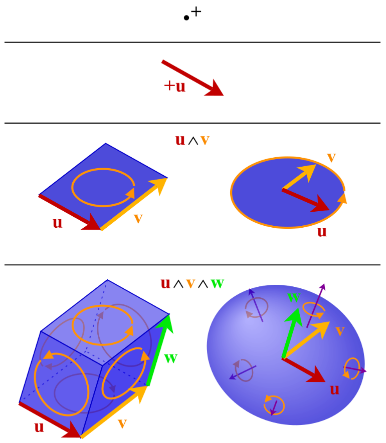

# 数学物理方程 Partial Differential Equations

## 1. 定解问题

### 弦振动问题

考虑一根绷紧的**完全柔软**的均匀**轻质**弦，激发后在平面内的微小振动。考虑弦平衡时的微元：

- 选取 $y$ 方向位移物理量 $u(x,t)$，表示在 $t$ 时刻位于 $x$ 的位移。
- **轻弦**：忽略重力；
- **完全柔软**：弹力只沿切向。

对于一段在 $(x, x+\dd x)$ 上的一小段弦，在两个端点上拉力的角度不同：

由于弦仅有 $y$ 方向上的运动，我们有：

$$
\begin{cases}
T_1\cos\theta_1 = T_2\cos\theta_2 \\
T_2\sin\theta_2-T_1\sin\theta_1 = \rho\dd x \cdot\overline{\pdv[2]{u}{t}}
\end{cases}
$$

由于振动很微小，我们近似这段弦为一条直线段。也就是：

$$
\frac{u_2-u_1}{(x+\dd x) - x} \ll 1 \Rightarrow \pdv{u}{x}  =\tan\theta \ll 1
$$

> 即为底边长 $\dd x$ 高为 $u_2 - u_1$ 的直角三角形。

于是忽略高阶项认为 $\sin \theta = \tan\theta = \pdv{u}{x},\cos\theta=1$。由第一个方程可得：

$$
T_1 = T_2
$$

统一为 $T$ 代入方程2：

$$
T(\eval{\pdv{u}{x}}_{x+\dd x} - \eval{\pdv{u}{x}}_{x}) = \rho\dd x \cdot\overline{\pdv[2]{u}{t}}
$$

同除 $\dd x$ 得到：

$$
T\pdv[2]{u}{x} = \rho\pdv[2]{u}{t}
$$

定义 $a = \sqrt{T/\eta}$ ，得到**弦的自由振动方程**：

$$
\boxed{\pdv[2]{u}{t} -a^2\pdv[2]{u}{x} = 0}
$$

> 分析量纲 $\sqrt{MLT^{-2}/ML^{-3}} = L/T$，得到 $a$ 为速度单位。

弹力和时间有关吗？由于hook定理，对于弹性弦，只要长度不变弹力就保持不变。分析微元段的长度：

$$
\dd s = \sqrt{(\dd u)^2 + (\dd x)^2} = \dd x \sqrt{1+\pqty{\pdv{u}{x}}^2}  \approx \dd x
$$

也就是 $\dd s - \dd x = 0$，即长度始终保持不变，也就是**弹力不随时间变化**。

接下来考虑受外力作用的形式。如果在 $u$ 方向上单位长度受力为 $f$ ，初始条件改为：

$$
\begin{cases}
T_2\cos\theta_2 - T_1\cos\theta_1 = 0 \\
T_2\sin\theta_2-T_1\sin\theta_1 + f\dd x = \rho\dd x \cdot\pdv[2]{u}{t}
\end{cases}
$$

用相同方法解得：

$$
\boxed{\pdv[2]{u}{t} -a^2\pdv[2]{u}{x} = \frac{f}{\rho}}
$$

这被称为**弦的受迫振动方程**。右侧的 $f/\rho$ 可以认为是单位质量受力。

---

### 杆纵振动问题

考虑一个**均匀轻细杆**沿杆长方向的**微小振动**。同样取一段微元 $(x,x+\dd x)$ 进行分析。

- 均匀：认为处处截面积相等；
- 轻：忽略重力；
- 微小振动：忽略因振动引起的截面积变化。

由 *Newton* 第二定律：

$$
\begin{gathered}
\rho S \dd x \overline{\pdv[2]{u}{t}} = [P(x+\dd x, t) - P(x,t)]S \\
\rho \pdv[2]{u}{t} = \pdv{P}{x}
\end{gathered}
$$

由 *Young* 模量得到：$P = E\pdv{u}{x}$，于是：

$$
\boxed{\pdv[2]{u}{t} -a^2\pdv[2]{u}{x} = 0}\  \qc a = \sqrt{\frac{E}{\rho}}
$$

形如此的方程被称为**波动方程**。拓展成三维空间就是：

$$
\pdv[2]{u}{t} - a^2\grad^2u = 0
$$

---

## 热传导方程

假设一块连续介质，用 $u(x,y,z,t)$ 表示 $(x,y,z)$ 处 $t$ 时刻的温度。如果沿 $x$ 方向由温度梯度，由于能量守恒定律，在 $x$ 方向一定存在热量传递。由 *Fourier* 定律得：

$$
q_x = -k_x\pdv{u}{x}
$$

其中 $q$ 为热流密度，$k$ 为导热率。同样也有：

$$
q_y = -k_y\pdv{u}{y}\qc q_z = -k_z\pdv{u}{z}
$$

如果材料是各向同性的，那么三个方向上的导热率 $k$ 应该都相同。我们合并写成：

$$
\vb q = -k\grad u
$$

而如果是各向异性的就变成矩阵乘积：

$$
\vb q = -\vb K\cdot\grad u
$$

我们取出一个平行六面体：

沿 $x$ 方向的流入的热量：

$$
(q_x - q_{x+\dd x})\dd y \dd z \dd t = -\pdv{q_x}{x}\dd x\dd y \dd z \dd t
$$

其他两个方向也是同理，于是把他们相加得到 $-\div \vb q \dd x\dd y \dd z \dd t$，又因为对应温度上升：

$$
-\div \vb q \dd x\dd y \dd z \dd t =  \dd (\rho c u) \cdot\dd x\dd y \dd z
$$

得到：

$$
\pdv{(\rho cu)}{t} + \div \vb q = \pdv{(\rho cu)}{t} - \div \vb K \cdot \grad u = 0
$$

而如果是各向同性介质，$\rho c$ 是常数，进一步化简得：

$$
\boxed{\pdv{u}{t} - \kappa\grad^2u = 0}\ \qc \kappa = \frac{k}{\rho c}
$$

其中 $\kappa$ 被称为**扩散率**。这类方程被称为**热扩散方程**。

如果体系中还有单位时间单位体积产生的热量 $f$，进一步携程：

$$
(f-\div \vb q) \dd x\dd y \dd z \dd t =  \dd (\rho c u) \cdot\dd x\dd y \dd z
$$

最终可以化简成：

$$
\pdv{u}{t} - \kappa\grad^2u = \frac{f}{\rho c}
$$

对于扩散问题，由于扩散过程和热传导类似，定义扩散率 $D$，也有：

$$
\pdv{u}{t} - D\grad^2 u = 0
$$

---

### 稳态情况

现在我们考虑当热传导体系达到稳定的状态，此时 $\pdv{u}{t} = 0$。也就是：

$$
\boxed{\grad^2u = \frac{f}{\kappa\rho c}}
$$

这被称为**Poisson方程**。特别的当 $f=0$ 时，得到：

$$
\boxed{\grad^2u = 0}
$$

这被称为**Laplace方程**。

同样也可以对弦振动作一样的考虑。假设有一个特别的振动 $u(x,y,z,t) = v(x,y,z)e^{i\omega t}$，这是一个周期性的振动。带入到振动公式：

$$
-\omega^2 v - a^2\grad^2v = 0
$$

于是有：

$$
\boxed{\grad^2 v + k^2v = 0} \qc k = \frac{\omega}{a}
$$

这被称为**Helmholtz方程**。

---

总结以上三种方程的性质：

|             波动方程              |            热传导方程             |       稳态方程        |
| :-------------------------------: | :-------------------------------: | :-------------------: |
| $\pdv[2]{u}{t} -a^2\grad^2 u = 0$ | $\pdv{u}{t} - \kappa\grad^2u = 0$ | $\grad^2u  + k^2u= 0$ |
|            双曲形方程             |            抛物线方程             |       椭圆方程        |

---

## 2. 行波法

### 定解条件的条件

假设对于一个二阶偏微分方程的问题，已经求出其通解，需要用已知条件消解未知数：

- 初始条件（Initial Condition，IC）：关注对时间 $t$ 微商的最高阶数。

- 边界条件（Boundary Condition，BC）：对于不同维度的问题，边界条件也不同。例如对于一维问题的边界条件：

  - 弦的横振动（第一类边界条件）： $\eval{u}_{x=0} = \eval{u}_{x=l} = 0$；

  - 杆的纵振动（第二类边界条件）：$\eval{u}_{x=0} = 0$，$x=l$ 单位面积受外力 $F(t)$。通过微元法分析：

    $$
    FS - P(l-\epsilon , t)S = \rho S \epsilon \overline{\pdv[2]{u}{t}}
    $$

    当 $\epsilon \to 0$ 时：

    $$
    F - E\eval{\pdv{u}{t}}_{x=l} = 0
    $$

    于是边界条件变为：

    $$
    \begin{cases}\displaystyle
    \eval{u}_{x=0} = 0\\ E\eval{\pdv{u}{t}}_{x=l} = F
    \end{cases}
    $$

  - 一段连接轻弹簧的轻杆（第三类边界条件）：$\eval{u}_{x=0} = 0$，且对于一端的弹簧有：

    $$
    FS = -k(u-u_0)
    $$

    其中 $u_0$ 为平衡位置杆末端位移，$u$ 为任意时刻杆末端位移。于是有：

    $$
    \begin{gathered}
    E\eval{\pdv{u}{t}}_{x=l} = -\frac{k}{S}(u-u_0)\\
    \eval{\pqty{E\eval{\pdv{u}{t}}_{x=l} + \frac{k}{S}u}}_{x=l} = \frac{k}{S}u_0
    \end{gathered}
    $$

    这里边界条件就是一阶微商和二阶微商的线性组合。

> 对热传导方程，由于是一个三维问题，我们需要通过曲面确定边界条件，例如：
>
> - 给定两曲面的温度：$\eval{u}_{x=\Sigma_0} =0,\ \eval{u}_{x=\Sigma} = f(\Sigma)$。这是第一类边界条件。
>
> - 如果表面单位时间通过单位面积散热为 $\psi$。取表面上的一个微元：
>
>   
>
>   $$
>   q = -k\pdv{u}{n}
>   $$
>
>   其中 $n$ 为法向量。进一步得到：
>
>   $$
>   -k\pdv{u}{n} S\Delta t - \psi S\Delta t + 四个侧面的q\cdot四个侧面面积\cdot\Delta t = \rho S \epsilon \Delta t
>   $$
>
>   考虑 $\epsilon \to 0$，就有：
>
>   $$
>   \psi = -k\eval{\pdv{u}{n}}_{\Sigma}
>   $$
>
>   这是第二类边界问题。
>
> - 如果 $\psi$ 和外界环境与体系的温度差成正比：
>
>   $$
>   \begin{gathered}
>   -k\eval{\pdv{u}{n}}_{\Sigma} = H(\eval{u}_{\Sigma} - u_0)\\
>   \eval{\pqty{k\pdv{u}{n} + Hu}}_{\Sigma} = Hu_0
>   \end{gathered}
>   $$
>
>   这是第三类边界问题。
>

---

### 照搬常微分方程

假设我们有无限长的弦，考虑初值问题：

$$
\begin{cases}\displaystyle
\pdv[2]{u}{t} - a^2 \pdv[2]{u}{x} = 0&,-\infty < x < \infty,\ t > 0\\
\eval{u}_{t=0} = \psi(x)\\
\eval{\pdv{u}{t}}_{t=0} = \phi(x)
\end{cases}
$$

我们常识把第一个式子看成：

$$
(\pdv{u}{t} - a\pdv{u}{x})(\pdv{u}{t} + a\pdv{u}{x}) = 0
$$

我们得到了两个一阶方程。尝试作变换：

$$
\begin{cases}
\xi = x+at\\
\eta = x-at
\end{cases}\Rightarrow
\begin{cases}x = \frac{\xi + \eta}{2}\\t = \frac{\xi - \eta}{2a}\end{cases}
$$

然后我们努努力把偏微分都求出来：

$$
\begin{gathered}
\pdv{u}{t} = \pdv{\xi}{t}\pdv{u}{\xi} + \pdv{\eta}{t}\pdv{u}{\eta} = a\pqty{\pdv{u}{\xi} - \pdv{u}{\eta}} \\
\pdv{u}{x} = \pdv{\xi}{x}\pdv{u}{\xi} + \pdv{\eta}{x}\pdv{u}{\eta} = \pdv{u}{\xi} + \pdv{u}{\eta} \\

\end{gathered}
$$

还有二阶微分：

$$
\begin{aligned}
\pdv[2]{u}{t} &= \pdv{\xi}{t}\pdv{\xi}\pdv{u}{t} + \pdv{\eta}{t}\pdv{\eta}\pdv{u}{t}\\
&= a^2\pqty{\pdv[2]{u}{\eta}-2\pdv{u}{\xi}{\eta} + \pdv[2]{u}{\eta}}
\end{aligned}
$$

$$
\begin{aligned}
\pdv[2]{u}{x} &= \pdv{\xi}{x}\pdv{\xi}\pdv{u}{x} + \pdv{\eta}{x}\pdv{\eta}\pdv{u}{x}\\
&= \pdv[2]{u}{\eta}+2\pdv{u}{\xi}{\eta} + \pdv[2]{u}{\eta}
\end{aligned}
$$

全部代入原方程，可得：

$$
\pdv{u}{\xi}{\eta} = 0
$$

于是这个波动方程的通解是：

$$
u(x,t) = f(x-at) + g(x+at)
$$

由此可见：这个微分方程的解是由**两个函数相互叠加组成**（区别于常微分方程，是由两个常数组成的）。从物理角度来看，这代表的就是以恒定速度 $a$ 向左和向右传播的两个波的叠加。

接下来我们代入初值：

$$
\begin{cases}
\eval{u}_{t=0} = \psi(x) \Rightarrow f(x) + g(x) = \psi(x)\\
\eval{\pdv{u}{t}}_{t=0} = \phi(x)\Rightarrow -af'(x) + ag'(x) = \phi(x)
\end{cases}
$$

对后项积分也就是：

$$
f(x) - g(x) = -\frac{1}{a}\int_0^x \phi(s)\dd s + C
$$

这就可以解出：

$$
\begin{cases}
\displaystyle f(x) = \frac12 \psi(x) - \frac{1}{2a}\int_0^x\phi(s)\dd s + \frac{C}{2} \\
\displaystyle g(x) = \frac12 \psi(x) + \frac{1}{2a}\int_0^x\phi(s)\dd s - \frac{C}{2}
\end{cases}
$$

带回通解就是：

$$
u(x,t) = \frac{1}{2}\pqty{\psi(x-at) + \psi(x+at)} + \frac{1}{2a}\int_{x-at}^{x+at}\phi(s)\dd s
$$

从物理意义来看，第一项代表初始位移激发的波，其分成两份独立向左向右传播；第二项代表初始速度激发的波，其左右对称地扩展到 $(x-at, x+at)$。它们的传播速率均为 $a$。通过这样求解的方法称为**行波法**。

---

## 3. 分离变量法

> 一定要注意自己到底在对哪个变量作偏微分/积分！

### 得到本征方程

回到热传导问题的初始问题：

$$
\begin{cases}\displaystyle
\pdv{u}{t} - \kappa \pdv[2]{u}{x} = 0&, t > 0\\
\eval{u}_{t=0} = \psi(x)\\
u(0,t) = u(l,t) = 0
\end{cases}
$$

我们不妨认为通解满足：

$$
u(x,t) = X(x)T(t)
$$

这样原式子就满足：

$$
\frac{T'(t)}{T(t)} - \kappa \frac{X''(x)}{X(x)} = 0
$$

于是我们可以设：

$$
\frac{T'(t)}{\kappa T(t)} = \frac{X''(x)}{X(x)} = -\lambda
$$

其中 $T(t)$ 与 $x$ 无关，$X(x)$ 与 $t$ 无关，而常数 $\lambda$ 和两者都无关。我们把 $X(x)$ 的分式拆开，结合边界条件可以得到：

$$
\begin{cases}
X''(x) + \lambda X(x) = 0\\
X(0) = X(l) = 0
\end{cases}
$$

这个问题我们称为**本征值问题**。

同理对于 $T(t)$ ：

$$
T'(t) + \kappa\lambda T(t) = 0
$$

这就完成了分离变量。

---

同理可以看看两端固定的弦振动问题：

$$
\begin{cases}\displaystyle
\pdv{u}{t} - a^2 \pdv[2]{u}{x} = 0&, t > 0\\
u(0,t) = u(l,t) = 0\\
\eval{u}_{t=0} = \phi(x)\\
\eval{\pdv{u}{t}}_{t=0} = \psi(x) \\
\end{cases}
$$

设 $u = T(t)X(x)$ 得到：

$$
\frac{T''(t)}{T(t)} - a^2 \frac{X''(x)}{X(x)} = 0
$$

得到的本征值问题就是：

$$
\begin{cases}
X''(x) + \lambda X(x)=0\\ X(0)=X(l)=0
\end{cases}\qc T''(t) + a^2\lambda T(t) = 0
$$

> eg：氢原子的Schrodinger方程：
>
> $$
> \mathrm{i}\hbar \frac{\partial \psi}{\partial t} = -\frac{\hbar^2}{2\mu} \left[ \frac{1}{r^2} \frac{\partial}{\partial r} \left( r^2 \frac{\partial \psi}{\partial r} \right) + \frac{1}{r^2 \sin\theta} \frac{\partial}{\partial \theta} \left( \sin\theta \frac{\partial \psi}{\partial \theta} \right) + \frac{1}{r^2 \sin^2\theta} \frac{\partial^2 \psi}{\partial \phi^2} \right] - \frac{e^2}{4\pi\varepsilon_0 r} \psi
> $$
>
> 把波函数拆解为：
>
> $$
> \psi(r,\theta,\phi,t) = R(r)\Theta(\theta)\Phi(\phi)T(t)
> $$
>
> 代入得到：
>
> $$
> \mathrm{i}\hbar \frac{T'(t)}{T(t)} = -\frac{\hbar^2}{2\mu} \left[ \frac{[r^2R'(r)]'}{r^2R(r)} + \frac{[\sin\theta\Theta'(\theta)]'}{r^2 \sin\theta\Theta(\theta)} + \frac{\Phi''(\phi)}{r^2 \sin^2\theta\Phi(\phi)} \right] - \frac{e^2}{4\pi\varepsilon_0 r} = E
> $$
>
> 首先可以分离时间 $T$：
>
> $$
> \boxed{i\hbar T'(t) -ET(t) = 0}
> $$
>
> 原式化为：
>
> $$
> -\frac{\hbar^2}{2\mu} \left[ \frac{[r^2R'(r)]'}{r^2R(r)} +\frac1{r^2} (\frac{[\sin\theta\Theta'(\theta)]'}{ \sin\theta\Theta(\theta)} + \frac{\Phi''(\phi)}{ \sin^2\theta\Phi(\phi)}) \right] - \frac{e^2}{4\pi\varepsilon_0 r} = E
> $$
>
> 角度部分不含 $R(r)$，直接分离掉：
>
> $$
> \frac{[\sin\theta\Theta'(\theta)]'}{ \sin\theta\Theta(\theta)} + \frac{\Phi''(\phi)}{ \sin^2\theta\Phi(\phi)} = \lambda
> $$
>
> 之后再设：
>
> $$
> \boxed{\Phi''(\phi) + \mu\Phi(\phi) = 0}
> $$
>
> 原式化为：
>
> $$
> \frac{[\sin\theta\Theta'(\theta)]'}{ \sin\theta\Theta(\theta)} + \frac{\mu}{ \sin^2\theta} = \lambda
> $$
>
> 进一步化简为：
>
> $$
> \boxed{-\frac{1}{\sin^2\theta}\qty[\sin\theta\dv{\theta}(\sin\theta\dv{\theta})-\mu]\Theta(\theta) = \lambda\Theta(\theta)}
> $$
>
> 然后再回到径向的式子：
>
> $$
> -\frac{\hbar^2}{2\mu} \left[ \frac{[r^2R'(r)]'}{r^2R(r)} +\frac{\lambda}{r^2} \right] - \frac{e^2}{4\pi\varepsilon_0 r} = E
> $$
>
> 最后化简得到：
>
> $$
> \boxed{\qty[-\frac{\hbar^2}{2\mu r^2} \left[ \dv{r}(r^2\dv{r}R(r)) +\lambda \right] - \frac{e^2}{4\pi\varepsilon_0 r}]R(r) = ER(r)}
> $$
>
> 这就完成了分离变量。可以看到，引入常数数量是独立变量数-1。

---

### 求解本征值问题

先来看本征值问题，如果 $X''(x) = 0$，就意味着这是一个线性方程，而由于边界条件：

$$
b=kl+b = 0
$$

这意味着 $\lambda = 0$，也就是只有零解。我们说0不是本征值。

> 注意有时候 $\lambda=0$ 时并非只有零解，此时一般解会多出来一个线性项。例如当边界条件均不为时。

如果 $\lambda \neq 0$，这意味着：

$$
X(x) = A\sin\sqrt{\lambda}x + B\cos\sqrt{\lambda}x
$$

代入边界条件：

$$
B= A\sin\sqrt{\lambda}l = 0
$$

这意味着必有：

$$
\begin{cases}
\lambda_n = \qty(\frac{n\pi}{l})^2\\
X_n(x) = \sin(\frac{n\pi x}{l})
\end{cases}
$$

其中 $\lambda_n$ 称为本征值， $X_n(x)$ 称为本征函数。$n$ 为所有正整数。

这个时候 $T(t)$ 也很容易求，我们结合在一起：

$$
u(x,t)=X(x)T(t) = C_n e^{-\kappa \lambda_n t}\sin(\frac{n\pi x}{l})
$$

这个解我们叫做**特解**，将特解叠加可以得到**一般解**：

$$
u(x,t) = \sum_{n=1}^\infty C_n e^{-\kappa \lambda_n t}\sin(\frac{n\pi x}{l})
$$

要得到通解就要利用到初值条件了。我们有：

$$
u(x,0) = \sum_{n=1}^\infty C_n \sin(\frac{n\pi x}{l}) = \psi(x)
$$

我们知道本征函数具有正交性，现在我们再叠加一个本征函数并积分，尝试把常数表示出来：

$$
\int_0^l\sum_{n=1}^\infty C_n \sin(\frac{n\pi x}{l})\sin(\frac{m\pi x}{l}) \dd{x} = \int_0^l\psi(x)\sin(\frac{m\pi x}{l})\dd{x}
$$

交换积分和求和（这是一个平均收敛的函数）：

$$
\begin{aligned}
&\int_0^l\sum_{n=1}^\infty C_n \sin(\frac{n\pi x}{l})\sin(\frac{m\pi x}{l}) \dd{x} \\
&= \sum_{n=1}^\infty C_n \int_0^l\sin(\frac{n\pi x}{l})\sin(\frac{m\pi x}{l}) \dd{x}\\
&= \sum_{n=1}^\infty \frac{l}{2}C_n\delta_{nm} = \frac{l}{2}C_m
\end{aligned}
$$

这样就可以得到 $C_n$ 的值了。

> 总结：
>
> 1. 分离变量；
> 2. 求解本征值问题；
> 3. 求出特解，叠加得到一般解；
> 4. 通过正交性得到通解。

同理我们求解本征值问题：

$$
\begin{cases}
X''(x) + \lambda X(x)=0\\ X(0)=X(l)=0
\end{cases}\qc T''(t) + a^2\lambda T(t) = 0
$$

根据边界条件得到：

$$
X_n(x) = \sin(\sqrt{\lambda_n} x)\qc \lambda_n = \qty(\frac{n\pi}{l})^2
$$

又有：

$$
u(x,t) = T(t)X_n(x) = \qty(C_n \sin(\sqrt{\lambda_n} at) + D_n \cos(\sqrt{\lambda_n} at))\sin(\sqrt{\lambda_n} x)
$$

叠加得到一般解：

$$
u(x,t) = \sum_{n=1}^\infty\qty(C_n \sin(\sqrt{\lambda_n} at) + D_n \cos(\sqrt{\lambda_n} at))\sin(\sqrt{\lambda_n} x)
$$

之后同样乘正交值并积分，得到常数：

$$
\begin{gathered}
D_n = \frac{2}{l}\int_0^l \phi(x)\sin(\frac{n\pi x}{l})\dd{x}\\
C_n = \frac{2}{n\pi a}\int_0^l \psi(x)\sin(\frac{n\pi x}{l})\dd{x}
\end{gathered}
$$

---

### 本征值问题的性质

我们来看本征值问题的几个性质。

> **本征值问题的本征值一定是实数。**

我们不妨取复共轭

$$
\begin{cases}
X''^*(x) + \lambda^* X^*(x) = 0\\
X^*(0) = X^*(l) = 0
\end{cases}
$$

之后交叉相乘相减：

$$
[X^*(x)X''(x) - X(x)X''^*(x)] + (\lambda-\lambda^*)X^*(x)X(x) = 0
$$

积分得到：

$$
\begin{aligned}
&\int_0^l\qty[X^*(x)X''(x) - X(x)X''^*(x)] + (\lambda-\lambda^*)\int_0^lX^*(x)X(x)\\
&=\eval{\qty[X^*(x)X'(x) - X(x)X'^*(x)]}_0^l + (\lambda-\lambda^*)\int_0^lX^*(x)X(x)\\
&=  (\lambda-\lambda^*)\int_0^lX^*(x)X(x) = 0
\end{aligned}
$$

于是 $\lambda = \lambda^*$，即本征值为实数。

> **本征值问题的不同本征值对应本征函数正交。**

我们取另一个函数的复共轭：

$$
\begin{cases}
X_m''^*(x) + \lambda_m X_m^*(x) = 0\\
X_m(0) = X_m(l) = 0
\end{cases}
$$

交叉相乘相减：

$$
[X^*_m(x)X''_n(x) - X_n(x)X''^*_m(x)] + (\lambda_n-\lambda_m)X^*_m(x)X_n(x) = 0
$$

积分：

$$
\begin{aligned}
&\int_0^l[X^*_m(x)X''_n(x) - X_n(x)X''^*_m(x)] + (\lambda_n-\lambda_m)X^*_m(x)X_n(x)\\
&=\eval{\qty[X^*_m(x)X'_n(x) - X_n(x)X'^*_m(x)]}_0^l + (\lambda_n-\lambda_m)\int_0^lX^*_m(x)X_n(x)\\
&=  (\lambda_n-\lambda_m)\int_0^lX^*_m(x)X_n(x) = 0
\end{aligned}
$$

由于本征值不同，于是 $\int_0^lX^*_m(x)X_n(x) = 0$，即本征函数正交。

---

### 稳定方程

考虑一个矩形区域 $[0,a]\times[0,b]$ 的稳定问题：

$$
\begin{cases}\displaystyle
\pdv[2]{u}{x}+\pdv[2]{u}{y} = 0\\
\eval{u}_{x=0}=0\qc\eval{\pdv{u}{x}}_{x=a}=0\\
\eval{u}_{y=b}=0\qc\eval{\pdv{u}{y}}_{y=0}=f(x)\\
\end{cases}
$$

我们可以分离变量 $u(x,y) = X(x)Y(y)$，分离变量：

$$
\frac{X''(x)}{X(x)}+\frac{Y''(y)}{Y(y)}=0
$$

写出本征方程：

$$
\begin{cases}
X''(x) +\lambda X(x)=0\\
X(0) = X'(a) = 0
\end{cases}\qc Y''(y) -\lambda Y(y)=0
$$

先求解 $X(x)$，排除 $\lambda = 0$ 的零解，求得：

$$
X(x) = A\sin(\sqrt{\lambda}x) + B\cos(\sqrt{\lambda}x)
$$

代入边界条件：

$$
\begin{cases}
B=0\\
A\cos(\sqrt{\lambda}a)=0
\end{cases}
$$

又因为非零解，$A\neq0$，所以只能是：

$$
\sqrt{\lambda}a = \frac{\pi}{2}+n\pi\Rightarrow\lambda_n = \pqty{\frac{2n+1}{2a}\pi}^2
$$

于是：

$$
\boxed{X(x) = A\sin(\frac{2n+1}{2a}\pi x)}
$$

同理可以解得：

$$
Y(y) = A_n\sinh(\sqrt{\lambda_n}y)+B_n\cosh(\sqrt{\lambda_n}y)
$$

代入边界条件：

$$
A_n\sinh(\sqrt{\lambda_n}b)+B_n\cosh(\sqrt{\lambda_n}b)=0
$$

于是原式可以化为：

$$
\boxed{Y(y) = C_n\sinh(\frac{2n+1}{2a}\pi (y-b))}
$$

这样相乘并叠加得到一般解：

$$
u_n(x,y) =\sum_{n=0}^\infty C_n\sinh(\frac{2n+1}{2a}\pi (y-b))\sin(\frac{2n+1}{2a}\pi x)
$$

再根据边界条件：

$$
\eval{\pdv{u}{y}}_{y=0} =\sum_{n=0}^\infty C_n\frac{2n+1}{2a}\pi\cosh(\frac{2n+1}{2a}\pi b)\sin(\frac{2n+1}{2a}\pi x) = f(x)
$$

同样根据正交性积分：

$$
\begin{aligned}
&\int_0^a\sum_{n=0}^\infty C_n\frac{2n+1}{2a}\pi\cosh(\frac{2n+1}{2a}\pi b)\sin(\frac{2n+1}{2a}\pi x)\sin(\frac{2m+1}{2a}\pi x)\\
&= C_m\frac{2m+1}{2a}\pi\cosh(\frac{2m+1}{2a}\pi b) = \int_0^a f(x)
\end{aligned}
$$

这样就得到通解了。

---

### 非齐次方程——同时齐次化

对于受迫弦振动问题：

$$
\begin{cases}\displaystyle
\pdv[2]{u}{t} - a^2 \pdv[2]{u}{x} = f(x,t)&, t > 0\\
u(0,t) = u(l,t) = 0\\
\eval{u}_{t=0} = \eval{\pdv{u}{x}}_{t=0} =0\\
\end{cases}
$$

这里我们把 $u(x,t)$ 拆成两个函数：

$$
u(x,t) = v(x,t) + w(x,t)
$$

分别满足：

$$
\begin{cases}
\pdv[2]{v}{t} - a^2 \pdv[2]{v}{x} = f(x,t)\\
v(0,t) = v(l,t) = 0\\
\end{cases}\qc
\begin{cases}
\pdv[2]{w}{t} - a^2 \pdv[2]{w}{x} = 0\\
w(0,t) = w(l,t) = 0\\
\eval{w}_{t=0} = -\eval{v}_{t=0}\qc \eval{\pdv{w}{x}}_{t=0} = -\eval{\pdv{v}{x}}_{t=0}
\end{cases}
$$

> 特例1： $f(x)$ 与 $t$ 无关。可以设 $v(x,t) = v(x)$ 满足：
>
> $$
> \begin{cases}
> - a^2 \pdv[2]{v}{x} = f(x)\\
> v(0) = v(l) = 0\\
> \end{cases}
> $$
>
> 特例2：$f(x,t)=g(x)\sin\omega t$。可设 $v(x,t) = h(x)\sin\omega t$ ，此时有：
>
> $$
> \begin{cases}
> -\omega^2h(x)- a^2 h''(x) = g(x)\\
> h(0) = h(l) = 0\\
> \end{cases}
> $$

这样通过第一个式子，就可以把 $v(x,t)$ 解出来。之后解 $w(t)$ 就是经典的问题了。

---

### 非齐次方程——按本征函数展开

我们还是考虑齐次的问题：

$$
\begin{cases}\displaystyle
\pdv[2]{u}{t} - a^2 \pdv[2]{u}{x} = 0\\
u(0,t) = u(l,t) = 0\\
\end{cases}
$$

> 注意这里不能取初始条件 $\eval{u}_{t=0} = \eval{\pdv{u}{x}}_{t=0} =0\\$，因为该条件会得出原方程只有零解的结论。

对于齐次的情况我们知道：

$$
u(x,t) = \sum_{n=1}^\infty T_n(t)\sin\frac{n\pi}{l}x
$$

我们尝试将 $f(x,t)$ 也按这种方法展开：

$$
f(x,t) = \sum_{n=1}^\infty f_n(t)\sin\frac{n\pi}{l}x
$$

全部代入初始式子：

$$
\sum_{n=1}^\infty \qty[T''_n(t)\sin\frac{n\pi}{l}x+a^2\qty(\frac{n\pi}{l})^2T_n(t)\sin\frac{n\pi}{l}x-f_n(t)\sin\frac{n\pi}{l}x] = 0
$$

之后同样乘正交基并积分，最后这个方程就转化为：

$$
\begin{cases}
T''_n(t) +a^2\qty(\frac{n\pi}{l})^2T_n(t)-f_n(t)=0\\
T(0) = T'(0) = 0
\end{cases}
$$

这是一个二阶常微分方程，一定有解。这样理论上就可以把原方程解出来了。

---

### 非齐次边界条件

我们把边界条件改成这样：

$$
\begin{cases}\displaystyle
\pdv[2]{u}{t} - a^2 \pdv[2]{u}{x} =0\\
u(0,t) = \psi(t), u(l,t) = \phi(t)\\
\eval{u}_{t=0} = \eval{\pdv{u}{x}}_{t=0} =0\\
\end{cases}
$$

同样拆成两个函数：

$$
u(x,t) = v(x,t) + w(x,t)
$$

我们让 $v(x,t)$ 满足边界条件，这样 $w(x,t)$ 的边界条件就是齐次的了：

$$
v(0,t) = \psi(t), v(l,t) = \phi(t)
$$

> 一种可能的取法是取线性函数 $v(x,t) = \psi(t)+\frac{\phi(t)-\psi(t)}{l}x$.

这样 $w(x,t)$ 就满足：

$$
\begin{cases}\displaystyle
\pdv[2]{w}{t} - a^2 \pdv[2]{w}{x} = -\pdv[2]{v}{t} + a^2 \pdv[2]{v}{x} \\
w(0,t) = w(l,t) = 0\\
\eval{w}_{t=0} = -\eval{v}_{t=0}\qc \eval{\pdv{w}{x}}_{t=0} = -\eval{\pdv{v}{x}}_{t=0}
\end{cases}
$$

这就转化为了非齐次方程的情况，如果 $v(x,t)$ 选的好，使 $-\pdv[2]{v}{t} + a^2 \pdv[2]{v}{x} = 0$，那就转化成更简单的齐次方程了。

就算初始条件也是非齐次方程，只需要把后面一项改成 $-\pdv[2]{v}{t} + a^2 \pdv[2]{v}{x} + f(x,t)$ 即可。

$$
\begin{cases}\displaystyle
\pdv[2]{w}{t} - a^2 \pdv[2]{w}{x} = -\pdv[2]{v}{t} + a^2 \pdv[2]{v}{x}+f(x,t) \\
w(0,t) = w(l,t) = 0\\
\eval{w}_{t=0} = -\eval{v}_{t=0}\qc \eval{\pdv{w}{x}}_{t=0} = -\eval{\pdv{v}{x}}_{t=0}
\end{cases}
$$

> 特例：
>
> $$
> \begin{cases}
> \pdv[2]{u}{t} - a^2 \pdv[2]{u}{x} =0\\
> u(0,t) = \sin\omega t, u(l,t) = 0\\
> \eval{u}_{t=0} = \eval{\pdv{u}{x}}_{t=0} =0\\
> \end{cases}
> $$
>
> 可以设 $v(x,t) = f(x)\sin\omega t$，就有：
>
> $$
> \begin{cases}
> -\omega^2f(x) - a^2 f''(x) =0\\
> f(0) = 1, f(1) = 0\\
> \end{cases}
> $$

---

## 4. 非直角坐标系

### Laplace算符

我们都知道在 $n$ 维直角坐标系 $(x^1,x^2,\cdots,x^n)$ 里的标量 $u$ ：

$$
\grad^2u=\div\grad u = \pdv[2]{u}{(x^1)}+\pdv[2]{u}{(x^2)}+\cdots+\pdv[2]{u}{(x^n)}
$$

对于向量 $\va A$：

$$
\grad^2\va A = \grad(\div\va A)-\curl\curl\va A
$$

这表示对向量的每个分标量都做一次 $\laplacian$ 操作。

现在我们想知道：假设不是直角坐标，而是 $n$ 个曲面坐标 $(q^1,q^2,\cdots,q^n)$ ，构成正交曲面坐标系时，Laplacian的表达式；当然还有可能是四维 Minkvoski 时空。

---

### 度规矩阵

我们知道曲面坐标都是相互独立的，也就是Yacobi行列式不为0.

计算弧长：

$$
\begin{aligned}
(\dd{s})^2 &= \sum_{i=1}^n (\dd{x^i})^2\\
&= \sum_{i=1}^n\qty(\sum_{j=1}^n \pdv{x^i}{q^j}\dd{q^j})\qty(\sum_{k=1}^n \pdv{x^i}{q^k}\dd{q^k})\\
&=\sum_{j=1}^n\sum_{k=1}^n\qty(\sum_{i=1}^n \pdv{x^i}{q^j}\pdv{x^i}{q^k})\dd{q^j}\dd{q^k}\\
&=\sum_{j=1}^n\sum_{k=1}^n\qty(g_{jk})\dd{q^j}\dd{q^k}\\
&= \left( \mathrm{d}q^1 \quad \mathrm{d}q^2 \quad \cdots \quad \mathrm{d}q^n \right)
\begin{pmatrix}
g_{11} & g_{12} & \cdots & g_{1n} \\
g_{21} & g_{22} & \cdots & g_{2n} \\
\vdots & \vdots & \ddots & \vdots \\
g_{n1} & g_{n2} & \cdots & g_{nn}
\end{pmatrix}
\begin{pmatrix}
\mathrm{d}q^1 \\
\mathrm{d}q^2 \\
\vdots \\
\mathrm{d}q^n
\end{pmatrix}
\end{aligned}
$$

这样就定义出了**度规矩阵元** $g_{jk}$。

$$
g_{jk} = \sum_{i=1}^n \pdv{x^i}{q^j}\pdv{x^i}{q^k}
$$

只要度规矩阵为对角矩阵，说明 $(q^1,q^2,\cdots,q^n)$ 正交，反之亦然。对于对角矩阵有：

$$
g_{ik} = g_{ii}\delta_{ik}
$$

我们设一个方向上的**单位矢量**为：

$$
\dd{x^i} = \sqrt{g_{ii}}\dd{q^i}
$$

> 对柱坐标系有：
>
> $$
> \begin{gathered}
> q^1 = \rho\qc q^2 = \phi\qc q^3 = z\\
> x^1 = \rho\cos\phi\qc x^2 = \rho\sin\phi\qc x^3 = z\\
> \end{gathered}
> $$
>
> 计算弧长：
>
> $$
> \begin{aligned}
> (\dd{s})^2 &= (\cos\phi\dd{\rho} - \rho\sin\phi\dd{\phi})^2+(\sin\phi\dd{\rho} + \rho\cos\phi\dd{\phi})^2 +(\dd z)^2\\
> &= (\dd \rho)^2+\rho^2(\dd\phi)^2+(\dd z)^2
> \end{aligned}
> $$
>
> 这样度规矩阵就是：
>
> $$
> G=\mqty(\dmat{1,\rho^2,1})
> $$
>
> 对球坐标系有：
>
> $$
> \begin{gathered}
> q^1 = \rho\qc q^2 = \theta\qc q^3 = \phi\\
> x^1 = \rho\sin\theta\cos\phi\qc x^2 = \rho\sin\theta\sin\phi\qc x^3 = \rho\cos\theta\\
> \end{gathered}
> $$
>
> 计算弧长：
>
> $$
> (\dd s)^2 = (\dd r)^2+r^2(\dd{\theta})^2+r^2\sin[2]\theta(\dd{\phi})^2
> $$
>
> 对应度规矩阵：
>
> $$
> G=\mqty(\dmat{1,r^2,r^2\sin[2]\theta})
> $$
>
> 因为两个矩阵都是对角矩阵，于是这两个都是正交曲面坐标系。
>
> 也可以用求切向量法来得到度规矩阵。求出切向量：
>
> $$
> \va e_{q_i} = \pdv{\va r}{q_i} = \qty(\pdv{x_1}{q_i},\pdv{x_2}{q_i},\cdots,\pdv{x_n}{q_i})
> $$
>
> 这样每个度规矩阵元就可以用这样表示：
>
> $$
> g_{ij} = \va e_{q_i}\cdot \va e_{e_j}
> $$
>
> 这样只要 $i\neq j$ 时，$g_{ij}$ 不为 $0$ ，即可判定非正交。对于正交坐标系也可以通过 $g_{ii} = \abs{\va e_{q_i}}^2$ 快速得到。

---

### 外微分

 定义一个**外微分运算** $\dd$ ，写出来和全微分很像。我们说对于一个标量函数 $u(q^1,q^2,\cdots,q^n)$ 时0次形式（0-form），现在我们进行一次外微分：

$$
\dd{u} = \sum_{i}\pdv{u}{q^i}\dd{q^i}
$$

这就得到了1次形式（1-form），和全微分一样。继续外微分！

$$
\begin{aligned}
\dd{\alpha} &= \dd(\sum_{i}\alpha_i\dd{q^i})\\
&=\sum_{i}\dd(\alpha_i\dd{q^i})\\
&=\sum_i\dd{\alpha_i}\wedge\dd{q^i}+\sum_i\alpha_i\dd(\dd{q_i})
\end{aligned}
$$

规定二次积分为0，就有：

$$
\dd \alpha =\sum_i\dd{\alpha_i}\wedge\dd{q^i}
$$

这里 $\wedge$ 是**楔积运算**（wedge product）。对于一次楔积可以认为是“有方向的面积”。有：

$$
\dd{q^i}\dd{q^j} = -\dd{q^j}\dd{q^i}
$$

很显然对于两次楔积就是体积。我们规定 $\dd{q^1}\wedge\dd{q^2}\wedge\cdots\wedge\dd{q^n}$ 为正的 $n$ 为体积，显然对于任意一个排列 $\dd{q^{i_1}}\wedge\dd{q^{i_2}}\wedge\cdots\wedge\dd{q^{i_n}}$ ，只需要知道交换的次数就能知道正负性了。

> 叉乘实际上可以认为是楔积在三维情况下表示成向量的形式，实际上可以认为是三维两个向量楔积的 Hodge star。
>
> $$
> \va A\cp\va B = \star(\va A\wedge\va B)
> $$
>
> 对于点乘也有：
>
> $$
> \va A\cdot\va B = \star(\va A\wedge\dd{\va B})
> $$
>

---

### Hodge star 运算

定义一个 ***运算**，可以把 p-form 转变为 (n-p)-form。形式如下：

$$
\star(\dd{x^{i_1}}\wedge\dd{x^{i_2}}\wedge\cdots\wedge\dd{x^{i_p}}) = \epsilon_{i_1,\cdots,i_n}(\dd{x^{i_{p+1}}}\wedge\dd{x^{i_{p+2}}}\wedge\cdots\wedge\dd{x^{i_{n}}})
$$

其中 $x_i$ 为单位矢量， $\epsilon_{i_1,\cdots,i_n}$ 为 Levi-Civita 记号，当整个排列 $i_1,\cdots,i_n$ 为奇排列时为 $-1$，偶排列时为 $1$。

> 例：
>
> 对于二维坐标有：
>
> $$
> \begin{gathered}
> \star1 = \dd{x}\wedge\dd{y}\\
> \star\dd{x} = \dd{y}\\
> \star\dd{y} = \dd{x}\\
> \star(\dd{x}\dd{y) = 1}
> \end{gathered}
> $$
>
> 对于三维坐标有：
>
> $$
> \begin{gathered}
> \star1 = \dd{x}\wedge\dd{y}\wedge\dd{z}\\
> \star\dd{x} = \dd{y}\wedge\dd{z}\\
> \star\dd{y} = \dd{z}\wedge\dd{x}\\
> \star\dd{z} = \dd{x}\wedge\dd{y}\\
> \star(\dd{x}\wedge\dd{y}) = \dd{z}\\
> \star(\dd{z}\wedge\dd{x}) = \dd{y}\\
> \star(\dd{y}\wedge\dd{z}) = \dd{x}\\
> \star(\dd{x}\wedge\dd{y}\wedge\dd{z}) = 1
> \end{gathered}
> $$

假如不是单位矢量，只需要替换成度规矩阵元的形式：

$$
\begin{gathered}
\star(\sqrt{g_{i_1i_1}}\dd{x^{i_1}}\wedge\sqrt{g_{i_2i_2}}\dd{x^{i_2}}\wedge\cdots\wedge\sqrt{g_{i_pi_p}}\dd{x^{i_p}}) \\= \epsilon_{i_1,\cdots,i_n}(\sqrt{g_{i_{p+1}i_{p+1}}}\dd{x^{i_{p+1}}}\wedge\sqrt{g_{i_{p+2}i_{p+2}}}\dd{x^{i_{p+2}}}\wedge\cdots\wedge\sqrt{g_{i_{n}i_{n}}}\dd{x^{i_{n}}})
\end{gathered}
$$

---

### 外微分运算

我们来看之前的矢量分析在外微分里对应什么：

| 矢量分析                                         | 外微分分析                                                   |
| ------------------------------------------------ | ------------------------------------------------------------ |
| 标量函数 $u(q^1,q^2,\cdots,q^n)$                 | 0-form $u(q^1,q^2,\cdots,q^n)$                               |
| 单位坐标矢量 $\va{e_i}$                          | 1-form $\sqrt{g_{ii}}\dd{q^i}$                               |
| 矢量 $A = \sum_i A_i\va{e_i}$                    | 1-form $\sum_i A_i\sqrt{g_{ii}}\dd{q_i}$                     |
| 标量梯度 $\grad u = \sum_i \pdv{u}{q^i}\va{e^i}$ | 1-form $\dd u =  \sum_{i}\pdv{u}{q^i}\dd{q^i}$               |
| 矢量散度 $\div\va{A}$                            | $\star{\dd}\star(\sum_i A_i\sqrt{g_{ii}}\dd{q_i})$           |
| 标量Laplcian $\laplacian u$                      | $\star{\dd}\star\dd u$                                       |
| 矢量旋度 $\curl\va A$                            | $\star\dd(\sum_i A_i\sqrt{g_{ii}}\dd{q_i})$                  |
| 矢量Laplacian $\laplacian\va A$                  | $\dd{\star\dd{\star\va A}} + (-1)^n\star\dd{\star\dd{\va A}}$ |

对于散度 $\div\va{A}$，对应将1-form变为0-form，也就是对应star运算。以三维空间为例：

$$
\begin{aligned}
\star{\dd}\star(A_x\dd{x}+A_y\dd{y}+A_z\dd{z})&= \star\dd(A_x\dd{y}\wedge\dd{z}+A_y\dd{z}\wedge\dd{x}+A_z\dd{x}\wedge\dd{y})\\
&= \star\qty(\pdv{A_x}{x}+\pdv{A_y}{y}+\pdv{A_z}{z})\dd{x}\wedge\dd{y}\wedge\dd{z}\\
&= \pdv{A_x}{x}+\pdv{A_y}{y}+\pdv{A_z}{z}
\end{aligned}
$$

进一步的，对于三维曲面的Laplcian运算：

$$
\begin{aligned}
\star \dd \star \dd u &= \star\dd(\sqrt{\frac{g_{22}g_{33}}{g_{11}}}\pdv{u}{q_1}\dd{y}\wedge\dd{z}+\sqrt{\frac{g_{33}g_{11}}{g_{22}}}\pdv{u}{q_2}\dd{z}\wedge\dd{x}+\sqrt{\frac{g_{11}g_{22}}{g_{33}}}\pdv{u}{q_3}\dd{x}\wedge\dd{y})\\
&= \star\qty(\pdv{q_1}(\sqrt{\frac{g_{22}g_{33}}{g_{11}}}\pdv{u}{q_1})+\pdv{q_2}(\sqrt{\frac{g_{33}g_{11}}{g_{22}}}\pdv{u}{q_2})+\pdv{q_3}(\sqrt{\frac{g_{11}g_{22}}{g_{33}}}\pdv{u}{q_3})\dd{x}\wedge\dd{y}\wedge\dd{z})\\
&= \frac{1}{\sqrt{g_{11}g_{22}g_{33}}}\qty(\pdv{q_1}(\sqrt{\frac{g_{22}g_{33}}{g_{11}}}\pdv{u}{q_1})+\pdv{q_2}(\sqrt{\frac{g_{33}g_{11}}{g_{22}}}\pdv{u}{q_2})+\pdv{q_3}(\sqrt{\frac{g_{11}g_{22}}{g_{33}}}\pdv{u}{q_3})\dd{x}\wedge\dd{y}\wedge\dd{z})
\end{aligned}
$$

> 例如对柱坐标：
>
> $$
> G=\mqty(\dmat{1,\rho^2,1})
> $$
>
> 计算得到：
>
> $$
> \laplacian u = \frac1\rho\pdv{\rho}(\rho\pdv{\rho})+\frac1{\rho^2}\pdv[2]{\phi}+\pdv[2]{z}
> $$
>
> 对球坐标：
>
> $$
> G=\mqty(\dmat{1,r^2,r^2\sin[2]\theta})
> $$
>
> 计算得到：
>
> $$
> \laplacian u = \frac1{r^2}\pdv{r}(r^2\pdv{r})+\frac1{r^2\sin\theta}\pdv{\theta}(\sin\theta\pdv{\theta})+\frac1{r^2\sin[2]\theta}\pdv[2]{\phi}
> $$

对于旋度：

$$
\begin{aligned}
\curl \va A
&= \epsilon_{ijk}\sum_{i,j,k}\pdv{A_k}{x^j}\va{e_i}\\
&= \left(\pdv{A_3}{x^2}-\pdv{A_2}{x^3}\right)\va e_1
+ \left(\pdv{A_1}{x^3}-\pdv{A_3}{x^1}\right)\va e_2
+ \left(\pdv{A_2}{x^1}-\pdv{A_1}{x^2}\right)\va e_3
\end{aligned}
$$

相当于从 1-form 变到 1-form，且有一个微分形式。我们先用一次微分，之后再取star运算：

$$
\begin{aligned}
\star\dd(A_1\dd{x}+A_2\dd{y}+A_3\dd{z})
&= \star\Big[
\dd A_1 \wedge \dd{x}
+ \dd A_2 \wedge \dd{y}
+ \dd A_3 \wedge \dd{z}
\Big]\\
&= \star\Big[
(\pdv{A_1}{x}\dd{x}+\pdv{A_1}{y}\dd{y}+\pdv{A_1}{z}\dd{z})\wedge\dd{x}\\
&\qquad+
(\pdv{A_2}{x}\dd{x}+\pdv{A_2}{y}\dd{y}+\pdv{A_2}{z}\dd{z})\wedge\dd{y}\\
&\qquad+
(\pdv{A_3}{x}\dd{x}+\pdv{A_3}{y}\dd{y}+\pdv{A_3}{z}\dd{z})\wedge\dd{z}
\Big]\\
&= \star\Big[
(\pdv{A_2}{x}-\pdv{A_1}{y})\dd{x}\wedge\dd{y}
+(\pdv{A_3}{y}-\pdv{A_2}{z})\dd{y}\wedge\dd{z}
+(\pdv{A_1}{z}-\pdv{A_3}{x})\dd{z}\wedge\dd{x}
\Big]\\
&= (\pdv{A_3}{y}-\pdv{A_2}{z})\dd{x}
+(\pdv{A_1}{z}-\pdv{A_3}{x})\dd{y}
+(\pdv{A_2}{x}-\pdv{A_1}{y})\dd{z}
\end{aligned}
$$

这可以将定义拓展到二维空间：

$$
\star\dd(A_1\dd{x}+A_2\dd{y}) = \pdv{A_2}{x}-\pdv{A_1}{y}
$$

这是一个 0-form 形式。

我们带入到矢量的 Laplacian 里面，对于第一项 $\grad(\div\va A)$ 对应：

$$
\begin{aligned}
\dd{\star\dd{\star\va A}}
&= \dd{\star\dd{\qty(A_1\dd{x}+A_2\dd{y}+A_3\dd{z})}}\\
&= \dd{\star\Big[
\qty(\pdv{A_2}{x}-\pdv{A_1}{y})\dd{x}\wedge\dd{y}
+\qty(\pdv{A_3}{y}-\pdv{A_2}{z})\dd{y}\wedge\dd{z}
+\qty(\pdv{A_1}{z}-\pdv{A_3}{x})\dd{z}\wedge\dd{x}
\Big]}\\
&= \dd(
\qty(\pdv{A_3}{y}-\pdv{A_2}{z})\dd{x}
+\qty(\pdv{A_1}{z}-\pdv{A_3}{x})\dd{y}
+\qty(\pdv{A_2}{x}-\pdv{A_1}{y})\dd{z}
)\\
&= \qty(\pdv{}{y}\qty(\pdv{A_3}{y}-\pdv{A_2}{z}) - \pdv{}{z}\qty(\pdv{A_1}{z}-\pdv{A_3}{x}))\dd{y}\wedge\dd{x}\\
&\quad+
\qty(\pdv{}{z}\qty(\pdv{A_2}{x}-\pdv{A_1}{y}) - \pdv{}{x}\qty(\pdv{A_3}{y}-\pdv{A_2}{z}))\dd{z}\wedge\dd{x}\\
&\quad+
\qty(\pdv{}{x}\qty(\pdv{A_1}{z}-\pdv{A_3}{x}) - \pdv{}{y}\qty(\pdv{A_2}{x}-\pdv{A_1}{y}))\dd{x}\wedge\dd{y}
\end{aligned}
$$

对于第二项对应：

$$
\begin{aligned}
\star\dd{\star\dd{\va A}}
&= \star\dd{\star\dd{\qty(A_1\dd{x}+A_2\dd{y}+A_3\dd{z})}}\\
&= \star{\dd}\qty[
\qty(\pdv{A_3}{y}-\pdv{A_2}{z})\dd{x}
+\qty(\pdv{A_1}{z}-\pdv{A_3}{x})\dd{y}
+\qty(\pdv{A_2}{x}-\pdv{A_1}{y})\dd{z}]\\
&= \star\Big[
\qty(\pdv{}{y}\qty(\pdv{A_3}{y}-\pdv{A_2}{z}) - \pdv{}{z}\qty(\pdv{A_1}{z}-\pdv{A_3}{x}))\dd{y}\wedge\dd{x}\\
&\quad+
\qty(\pdv{}{z}\qty(\pdv{A_2}{x}-\pdv{A_1}{y}) - \pdv{}{x}\qty(\pdv{A_3}{y}-\pdv{A_2}{z}))\dd{z}\wedge\dd{x}\\
&\quad+
\qty(\pdv{}{x}\qty(\pdv{A_1}{z}-\pdv{A_3}{x}) - \pdv{}{y}\qty(\pdv{A_2}{x}-\pdv{A_1}{y}))\dd{x}\wedge\dd{y}\Big]\\
&= \qty(\pdv{}{y}\qty(\pdv{A_3}{y}-\pdv{A_2}{z}) - \pdv{}{z}\qty(\pdv{A_1}{z}-\pdv{A_3}{x}))(-\dd{z})\\
&\quad+
\qty(\pdv{}{z}\qty(\pdv{A_2}{x}-\pdv{A_1}{y}) - \pdv{}{x}\qty(\pdv{A_3}{y}-\pdv{A_2}{z}))\dd{y}\\
&\quad+
\qty(\pdv{}{x}\qty(\pdv{A_1}{z}-\pdv{A_3}{x}) - \pdv{}{y}\qty(\pdv{A_2}{x}-\pdv{A_1}{y}))\dd{x}
\end{aligned}
$$

最后得到：

$$
\begin{aligned}
\laplacian\va A
&= \dd{\star\dd{\star\va A}} - \star\dd{\star\dd{\va A}}\\
&= \Big[
\qty(\pdv[2]{A_1}{x}+\pdv[2]{A_1}{y}+\pdv[2]{A_1}{z})
\Big]\dd{x}\\&
\quad+\Big[
\qty(\pdv[2]{A_2}{x}+\pdv[2]{A_2}{y}+\pdv[2]{A_2}{z})
\Big]\dd{y}\\
&\quad+\Big[
\qty(\pdv[2]{A_3}{x}+\pdv[2]{A_3}{y}+\pdv[2]{A_3}{z})
\Big]\dd{z}
\end{aligned}
$$

这就可以把矢量 Laplacian 扩展到其他空间了。对于三维欧氏空间的曲面坐标系有：

$$
\begin{aligned}
\laplacian \va A
&= \sum_{i=1}^3 \Bigg[
\frac{1}{\sqrt{g_{11}g_{22}g_{33}}}
\sum_{j=1}^3 \pdv{q^j}
\qty(
\frac{\sqrt{g_{11}g_{22}g_{33}}}{g_{jj}}
\pdv{A_i}{q^j}
)
\Bigg]\,\va e_i
\end{aligned}
$$

---

## 5. 非齐次条件下的分离变量法

### 圆形区域内的定解问题

把边界改成圆形形式：

$$
\begin{cases}\displaystyle
\pdv[2]{u}{x}+\pdv[2]{u}{y} = 0\\
\eval{u}_{x^2+y^2=a^2}=f\\
\end{cases}
$$

尝试写成极坐标形式：

$$
\begin{cases}\displaystyle
\frac1\rho\pdv{\rho}(\rho\pdv{u}{\rho}) + \frac1{\rho^2}\pdv[2]{u}{\phi} = 0\\
\eval{u}_{\rho=a}=f
\end{cases}
$$

分离变量得到：

$$
\rho\dv{\rho}(\rho\dv{R}{\rho})-\lambda R = 0\qc\dv[2]{\Phi}{\phi} + \lambda\Phi=0
$$

但是此时边界条件变成 $R(a)\Phi = f$ ，解不了！

考虑根本原因：在原方程里，$(x,y)$ 取值是整个圆面；但在改写后的方程，$\phi=0$ 和 $\phi=2\pi$ 处的偏导数没有意义。并且，在 $\rho=0$ 处也没有定义。

于是我们需要补充两个条件：

- 周期性条件：

  $$
  \begin{gathered}
  \eval{u}_{\phi = 0} = \eval{u}_{\phi = 2\pi}\\
  \eval{\pdv{u}{\phi}}_{\phi = 0} = \eval{\pdv{u}{\phi}}_{\phi = 2\pi}
  \end{gathered}
  $$

- 原点条件：

  $$
  \eval{u(\rho,\phi)}_{\rho = 0} \qq{有界}
  $$

先讨论 $\lambda = 0$ 的情形，也就是 $\Phi(\phi) = A_0+B_0\phi$，由于 $\Phi(0) = \Phi(2\pi)$ 有 $B_0 = 0$，于是对应本征函数：

$$
\Phi_0(\phi) = 1
$$

$\lambda\neq0$ 时：

$$
\Phi(\phi) = A\sin(\sqrt{\lambda}\phi)+ B\cos(\sqrt{\lambda}\phi)
$$

代入周期条件得到：

$$
\begin{cases}
B = A\sin(2\sqrt{\lambda}\pi)+ B\cos(2\sqrt{\lambda}\pi)\\
A = A\cos(2\sqrt{\lambda}\pi)- B\sin(2\sqrt{\lambda}\pi)
\end{cases}
$$

这对应行列式：

$$
\mqty|\sin(2\sqrt{\lambda}\pi)&\cos(2\sqrt{\lambda}\pi)-1\\\cos(2\sqrt{\lambda}\pi)-1&-\sin(2\sqrt{\lambda}\pi)|
$$

也就是 $2(\cos(2\sqrt{\lambda}\pi)-1)=0$，

$$
\lambda_m = m^2\qc m=1,2,3,\dots
$$

对应有两个本征函数：

$$
\Phi_{m1}(\phi) = \sin{m\phi}\qc\Phi_{m2}(\phi) = \cos{m\phi}
$$

对于 $R(r)$ 的方程：

$$
\rho\dv{\rho}(\rho\dv{R}{\rho})-\lambda R = \dv[2]{R}{(\ln\rho)} - \lambda R = 0
$$

对应 $\lambda = 0$ 时：

$$
R = C_0 + D_0 \ln \rho
$$

$\lambda \neq 0$ 时：

$$
R_m(\rho) = C_m\rho^m + D_m \rho^{-m}
$$

叠加得到一般解：

$$
\begin{aligned}
u(\rho,\phi) &= C_0+D_0\ln\rho + \sum_{m=1}^\infty (C_{m1}\rho^m + D_{m1}\rho^{-m})\sin(m\phi)\\
&\quad+\sum_{m=1}^\infty (C_{m2}\rho^m + D_{m2}\rho^{-m})\cos(m\phi)
\end{aligned}
$$

由于 $\eval{u}_{\rho = 0}$ 有界，对应无界项系数均为0，也就是：

$$
D_0 = D_{m1}=D_{m2} = 0
$$

一般解化为：

$$
\begin{aligned}
u(\rho,\phi) &= C_0 + \sum_{m=1}^\infty C_{m1}\rho^m \sin(m\phi)+\sum_{m=1}^\infty C_{m2}\rho^m\cos(m\phi)
\end{aligned}
$$

代入边界条件得到：

$$
C_0 + \sum_{m=1}^\infty (C_{m1}\sin(m\phi)+ C_{m2}\cos(m\phi))a^m=f(\phi)
$$

利用成正交基积分得到：

$$
\begin{gathered}
C_0 = \frac1{2\pi} \int_0^{2\pi} f(\phi)\dd{\phi}\\
C_{m1} = \frac1{a^m\pi} \int_0^{2\pi} f(\phi)\sin(m\phi)\dd{\phi}\\
C_{m2} = \frac1{a^m\pi} \int_0^{2\pi} f(\phi)\cos(m\phi)\dd{\phi}\\
\end{gathered}
$$

这就得到了解。注意这里出现了一个本征值对应多个本征函数的情况，我们说此时本征问题是简并的。

代入原式得到：

$$
u(\rho,\phi) = \frac{1}{2\pi}\int_0^{2\pi}f'(\phi)\qty[1+2\sum_{m=1}^\infty \qty(\frac\rho a)^m \cos(m(\phi-\phi'))]\dd{\phi'}
$$

当 $\rho < a$ 时，级数收敛。写成求和形式：

$$
u(\rho,\phi) = \frac{a^2-\rho^2}{2\pi} \int_0^{2\pi} \frac{f(\phi')}{\rho^2+a^2-2a\rho\cos(\phi')}\dd{\phi'}
$$

这个公式被称为 **Poisson 积分公式**。

---

### 球坐标系下的定解问题

改成球坐标系的形式：

$$
\frac1{r^2}\pdv{r}(r^2\pdv{u}{r})+\frac1{r^2\sin\theta}\pdv{\theta}(\sin\theta\pdv{u}{\theta})+\frac1{r^2\sin[2]\theta}\pdv[2]{u}{\phi}=0
$$

通过分离变量得到：

$$
\begin{gathered}
\frac1{r^2}\pdv{r}(r^2\pdv{R(r)}{r}) - \frac{\lambda}{r^2}R(r)=0\\
\frac1{\sin\theta}\pdv{\theta}(\sin\theta\pdv{\Theta(\theta)}{\theta})+\qty(\lambda - \frac{\mu}{\sin[2]\theta})\Theta(\theta) = 0\\
\pdv[2]{\Phi}{\phi}+\mu\Phi = 0
\end{gathered}
$$

其中第三个方程很容易解得：

$$
\mu = m^2\qc\Phi_0 = 1\qc\Phi_m = \begin{cases}\sin(m\phi)\\\cos(m\phi)\end{cases}
$$

第二个方程式连带 Legendre 方程。做变换 $x = \cos\theta$，$y = \Theta(\theta)$ 则转化为：

$$
\dv{x}((1-x^2)\dv{y}{x})+\qty(\lambda-\frac{\mu}{1-x^2})y=0
$$

先来关注比较简单的 Legendre 方程，对应 $\mu= 0$ 的特例：

$$
\dv{x}((1-x^2)\dv{y}{x})+\lambda x=0
$$
分开得到：
$$
\dv[2]{y}{x} - \frac{2x}{1-x^2}\dv{y}{x} + \frac{\lambda}{1-x^2}y=0
$$
我们在 $x=1$ 邻域内求解：
$$
y = (x-1)^\rho \sum_{n=0}^\infty c_n(x-1)^n
$$
