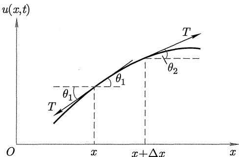
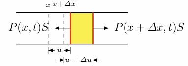
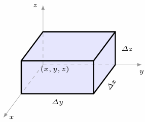
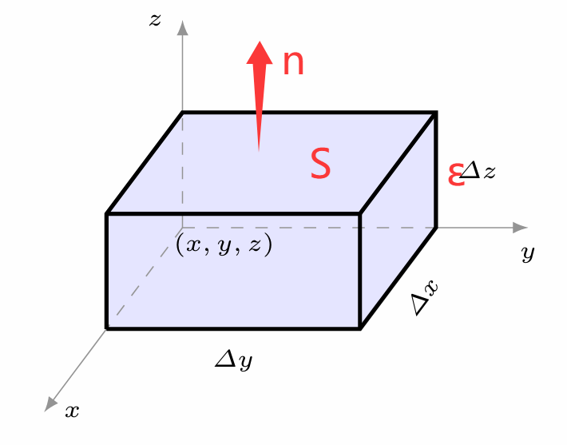

# 数学物理方程 Partial Differential Equations

## 1. 定解问题

### 弦振动问题

考虑一根绷紧的**完全柔软**的均匀**轻质**弦，激发后在平面内的微小振动。考虑弦平衡时的微元：

- 选取 $y$ 方向位移物理量 $u(x,t)$，表示在 $t$ 时刻位于 $x$ 的位移。
- **轻弦**：忽略重力；
- **完全柔软**：弹力只沿切向。

对于一段在 $(x, x+\dd x)$ 上的一小段弦，在两个端点上拉力的角度不同：

由于弦仅有 $y$ 方向上的运动，我们有：

$$
\begin{cases}
T_1\cos\theta_1 = T_2\cos\theta_2 \\
T_2\sin\theta_2-T_1\sin\theta_1 = \rho\dd x \cdot\overline{\pdv[2]{u}{t}}
\end{cases}
$$

由于振动很微小，我们近似这段弦为一条直线段。也就是：

$$
\frac{u_2-u_1}{(x+\dd x) - x} \ll 1 \Rightarrow \pdv{u}{x}  =\tan\theta \ll 1
$$

> 即为底边长 $\dd x$ 高为 $u_2 - u_1$ 的直角三角形。

于是忽略高阶项认为 $\sin \theta = \tan\theta = \pdv{u}{x},\cos\theta=1$。由第一个方程可得：

$$
T_1 = T_2
$$

统一为 $T$ 代入方程2：

$$
T(\eval{\pdv{u}{x}}_{x+\dd x} - \eval{\pdv{u}{x}}_{x}) = \rho\dd x \cdot\overline{\pdv[2]{u}{t}}
$$

同除 $\dd x$ 得到：

$$
T\pdv[2]{u}{x} = \rho\pdv[2]{u}{t}
$$

定义 $a = \sqrt{T/\eta}$ ，得到**弦的自由振动方程**：

$$
\boxed{\pdv[2]{u}{t} -a^2\pdv[2]{u}{x} = 0}
$$

> 分析量纲 $\sqrt{MLT^{-2}/ML^{-3}} = L/T$，得到 $a$ 为速度单位。

弹力和时间有关吗？由于hook定理，对于弹性弦，只要长度不变弹力就保持不变。分析微元段的长度：

$$
\dd s = \sqrt{(\dd u)^2 + (\dd x)^2} = \dd x \sqrt{1+\pqty{\pdv{u}{x}}^2}  \approx \dd x
$$

也就是 $\dd s - \dd x = 0$，即长度始终保持不变，也就是**弹力不随时间变化**。

接下来考虑受外力作用的形式。如果在 $u$ 方向上单位长度受力为 $f$ ，初始条件改为：

$$
\begin{cases}
T_2\cos\theta_2 - T_1\cos\theta_1 = 0 \\
T_2\sin\theta_2-T_1\sin\theta_1 + f\dd x = \rho\dd x \cdot\pdv[2]{u}{t}
\end{cases}
$$

用相同方法解得：

$$
\boxed{\pdv[2]{u}{t} -a^2\pdv[2]{u}{x} = \frac{f}{\rho}}
$$

这被称为**弦的受迫振动方程**。右侧的 $f/\rho$ 可以认为是单位质量受力。

---

### 杆纵振动问题

考虑一个**均匀轻细杆**沿杆长方向的**微小振动**。同样取一段微元 $(x,x+\dd x)$ 进行分析。

- 均匀：认为处处截面积相等；
- 轻：忽略重力；
- 微小振动：忽略因振动引起的截面积变化。

由 *Newton* 第二定律：

$$
\begin{gathered}
\rho S \dd x \overline{\pdv[2]{u}{t}} = [P(x+\dd x, t) - P(x,t)]S \\
\rho \pdv[2]{u}{t} = \pdv{P}{x}
\end{gathered}
$$

由 *Young* 模量得到：$P = E\pdv{u}{x}$，于是：

$$
\boxed{\pdv[2]{u}{t} -a^2\pdv[2]{u}{x} = 0}\  \qc a = \sqrt{\frac{E}{\rho}}
$$

形如此的方程被称为**波动方程**。拓展成三维空间就是：

$$
\pdv[2]{u}{t} - a^2\grad^2u = 0
$$

---

## 热传导方程

假设一块连续介质，用 $u(x,y,z,t)$ 表示 $(x,y,z)$ 处 $t$ 时刻的温度。如果沿 $x$ 方向由温度梯度，由于能量守恒定律，在 $x$ 方向一定存在热量传递。由 *Fourier* 定律得：

$$
q_x = -k_x\pdv{u}{x}
$$

其中 $q$ 为热流密度，$k$ 为导热率。同样也有：

$$
q_y = -k_y\pdv{u}{y}\qc q_z = -k_z\pdv{u}{z}
$$

如果材料是各向同性的，那么三个方向上的导热率 $k$ 应该都相同。我们合并写成：

$$
\vb q = -k\grad u
$$

而如果是各向异性的就变成矩阵乘积：

$$
\vb q = -\vb K\cdot\grad u
$$

我们取出一个平行六面体：

沿 $x$ 方向的流入的热量：

$$
(q_x - q_{x+\dd x})\dd y \dd z \dd t = -\pdv{q_x}{x}\dd x\dd y \dd z \dd t
$$

其他两个方向也是同理，于是把他们相加得到 $-\div \vb q \dd x\dd y \dd z \dd t$，又因为对应温度上升：

$$
-\div \vb q \dd x\dd y \dd z \dd t =  \dd (\rho c u) \cdot\dd x\dd y \dd z
$$

得到：

$$
\pdv{(\rho cu)}{t} + \div \vb q = \pdv{(\rho cu)}{t} - \div \vb K \cdot \grad u = 0
$$

而如果是各向同性介质，$\rho c$ 是常数，进一步化简得：

$$
\boxed{\pdv{u}{t} - \kappa\grad^2u = 0}\ \qc \kappa = \frac{k}{\rho c}
$$

其中 $\kappa$ 被称为**扩散率**。这类方程被称为**热扩散方程**。

如果体系中还有单位时间单位体积产生的热量 $f$，进一步携程：

$$
(f-\div \vb q) \dd x\dd y \dd z \dd t =  \dd (\rho c u) \cdot\dd x\dd y \dd z
$$

最终可以化简成：

$$
\pdv{u}{t} - \kappa\grad^2u = \frac{f}{\rho c}
$$

对于扩散问题，由于扩散过程和热传导类似，定义扩散率 $D$，也有：

$$
\pdv{u}{t} - D\grad^2 u = 0
$$

---

### 稳态情况

现在我们考虑当热传导体系达到稳定的状态，此时 $\pdv{u}{t} = 0$。也就是：

$$
\boxed{\grad^2u = \frac{f}{\kappa\rho c}}
$$

这被称为**Poisson方程**。特别的当 $f=0$ 时，得到：

$$
\boxed{\grad^2u = 0}
$$

这被称为**Laplace方程**。

同样也可以对弦振动作一样的考虑。假设有一个特别的振动 $u(x,y,z,t) = v(x,y,z)e^{i\omega t}$，这是一个周期性的振动。带入到振动公式：

$$
-\omega^2 v - a^2\grad^2v = 0
$$

于是有：

$$
\boxed{\grad^2 v + k^2v = 0} \qc k = \frac{\omega}{a}
$$

这被称为**Helmholtz方程**。

---

总结以上三种方程的性质：

|             波动方程              |            热传导方程             |       稳态方程        |
| :-------------------------------: | :-------------------------------: | :-------------------: |
| $\pdv[2]{u}{t} -a^2\grad^2 u = 0$ | $\pdv{u}{t} - \kappa\grad^2u = 0$ | $\grad^2u  + k^2u= 0$ |
|            双曲形方程             |            抛物线方程             |       椭圆方程        |

---

## 2. 行波法

### 定解条件的条件

假设对于一个二阶偏微分方程的问题，已经求出其通解，需要用已知条件消解未知数：

- 初始条件：关注对时间 $t$ 微商的最高阶数。

- 边界条件：对于不同维度的问题，边界条件也不同。例如对于一维问题的边界条件：

  - 弦的横振动（第一类边界条件）： $\eval{u}_{x=0} = \eval{u}_{x=l} = 0$；

  - 杆的纵振动（第二类边界条件）：$\eval{u}_{x=0} = 0$，$x=l$ 单位面积受外力 $F(t)$。通过微元法分析：

    $$
    FS - P(l-\epsilon , t)S = \rho S \epsilon \overline{\pdv[2]{u}{t}}
    $$

    当 $\epsilon \to 0$ 时：

    $$
    F - E\eval{\pdv{u}{t}}_{x=l} = 0
    $$

    于是边界条件变为：

    $$
    \begin{cases}
    \eval{u}_{x=0} = 0\\ E\eval{\pdv{u}{t}}_{x=l} = F
    \end{cases}
    $$

  - 一段连接轻弹簧的轻杆（第三类边界条件）：$\eval{u}_{x=0} = 0$，且对于一端的弹簧有：

    $$
    FS = -k(u-u_0)
    $$

    其中 $u_0$ 为平衡位置杆末端位移，$u$ 为任意时刻杆末端位移。于是有：

    $$
    \begin{gathered}
    E\eval{\pdv{u}{t}}_{x=l} = -\frac{k}{S}(u-u_0)\\
    \eval{\pqty{E\eval{\pdv{u}{t}}_{x=l} + \frac{k}{S}u}}_{x=l} = \frac{k}{S}u_0
    \end{gathered}
    $$

    这里边界条件就是一阶微商和二阶微商的线性组合。

> 对热传导方程，由于是一个三维问题，我们需要通过曲面确定边界条件，例如：
>
> - 给定两曲面的温度：$\eval{u}_{x=\Sigma_0} =0,\ \eval{u}_{x=\Sigma} = f(\Sigma)$。这是第一类边界条件。
>
> - 如果表面单位时间通过单位面积散热为 $\psi$。取表面上的一个微元：
>
>   
>
>   $$
>   q = -k\pdv{u}{n}
>   $$
>
>   其中 $n$ 为法向量。进一步得到：
>
>   $$
>   -k\pdv{u}{n} S\Delta t - \psi S\Delta t + 四个侧面的q\cdot四个侧面面积\cdot\Delta t = \rho S \epsilon \Delta t
>   $$
>
>   考虑 $\epsilon \to 0$，就有：
>
>   $$
>   \psi = -k\eval{\pdv{u}{n}}_{\Sigma}
>   $$
>
>   这是第二类边界问题。
>
> - 如果 $\psi$ 和外界环境与体系的温度差成正比：
>
>   $$
>   \begin{gathered}
>   -k\eval{\pdv{u}{n}}_{\Sigma} = H(\eval{u}_{\Sigma} - u_0)\\
>   \eval{\pqty{k\pdv{u}{n} + Hu}}_{\Sigma} = Hu_0
>   \end{gathered}
>   $$
>
>   这是第三类边界问题。
>

---

### 照搬常微分方程

假设我们有无限长的弦：

$$
\begin{cases}
\pdv[2]{u}{t} - a^2 \pdv[2]{u}{x} = 0&,-\infty < x < \infty,\ t > 0\\
\eval{u}_{t=0} = \psi(x)\\
\eval{\pdv{u}{t}}_{t=0} = \phi(x)
\end{cases}
$$

我们常识把第一个式子看成：

$$
(\pdv{u}{t} - a\pdv{u}{x})(\pdv{u}{t} + a\pdv{u}{x}) = 0
$$

我们得到了两个一阶方程。尝试作变换：

$$
\begin{cases}
\xi = x+at\\
\eta = x-at
\end{cases}\Rightarrow
\begin{cases}x = \frac{\xi + \eta}{2}\\t = \frac{\xi - \eta}{2a}\end{cases}
$$

然后我们努努力把偏微分都求出来：

$$
\begin{gathered}
\pdv{u}{t} = \pdv{\xi}{t}\pdv{u}{\xi} + \pdv{\eta}{t}\pdv{u}{\eta} = a\pqty{\pdv{u}{\xi} - \pdv{u}{\eta}} \\
\pdv{u}{x} = \pdv{\xi}{x}\pdv{u}{\xi} + \pdv{\eta}{x}\pdv{u}{\eta} = \pdv{u}{\xi} + \pdv{u}{\eta} \\

\end{gathered}
$$

还有二阶微分：

$$
\begin{aligned}
\pdv[2]{u}{t} &= \pdv{\xi}{t}\pdv{\xi}\pdv{u}{t} + \pdv{\eta}{t}\pdv{\eta}\pdv{u}{t}\\
&= a^2\pqty{\pdv[2]{u}{\eta}-2\pdv{u}{\xi}{\eta} + \pdv[2]{u}{\eta}}
\end{aligned}
$$

$$
\begin{aligned}
\pdv[2]{u}{x} &= \pdv{\xi}{x}\pdv{\xi}\pdv{u}{x} + \pdv{\eta}{x}\pdv{\eta}\pdv{u}{x}\\
&= \pdv[2]{u}{\eta}+2\pdv{u}{\xi}{\eta} + \pdv[2]{u}{\eta}
\end{aligned}
$$

全部代入原方程，可得：

$$
\pdv{u}{\xi}{\eta} = 0
$$

于是这个波动方程的通解是：

$$
u(x,t) = f(x-at) + g(x+at)
$$

由此可见：这个微分方程的解是由**两个函数相互叠加组成**（区别于常微分方程，是由两个常数组成的）。从物理角度来看，这代表的就是以恒定速度 $a$ 向左和向右传播的两个波的叠加。

接下来我们代入初值：

$$
\begin{cases}
\eval{u}_{t=0} = \psi(x) \Rightarrow f(x) + g(x) = \psi(x)\\
\eval{\pdv{u}{t}}_{t=0} = \phi(x)\Rightarrow -af'(x) + ag'(x) = \phi(x)
\end{cases}
$$

对后项积分也就是：

$$
f(x) - g(x) = -\frac{1}{a}\int_0^x \phi(s)\dd s + C
$$

这就可以解出：

$$
\begin{cases}
f(x) = \frac12 \psi(x) - \frac{1}{2a}\int_0^x\phi(s)\dd s + \frac{C}{2} \\
g(x) = \frac12 \psi(x) + \frac{1}{2a}\int_0^x\phi(s)\dd s - \frac{C}{2}
\end{cases}
$$

带回通解就是：

$$
u(x,t) = \frac{1}{2}\pqty{\psi(x-at) + \psi(x+at)} + \frac{1}{2a}\int_{x-at}^{x+at}\phi(s)\dd s
$$

从物理意义来看，第一项代表初始位移激发的波，其分成两份独立向左向右传播；第二项代表初始速度激发的波，其左右对称地扩展到 $(x-at, x+at)$。它们的传播速率均为 $a$。通过这样求解的方法称为**行波法**。

---

