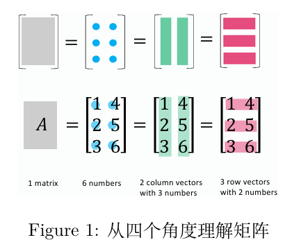
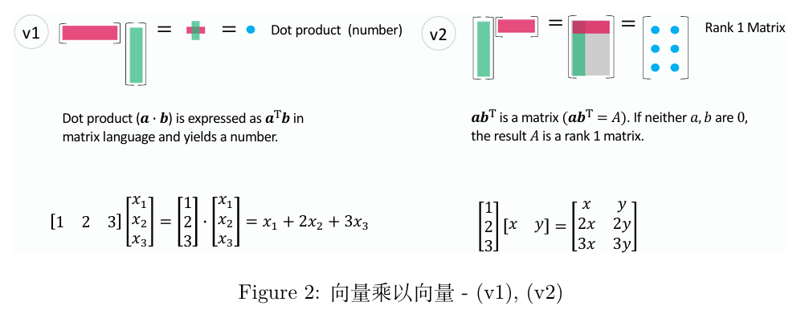
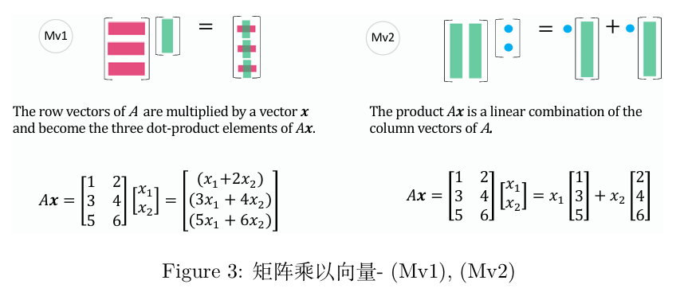
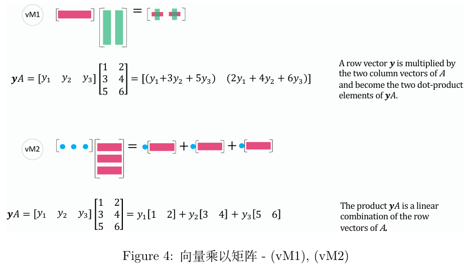
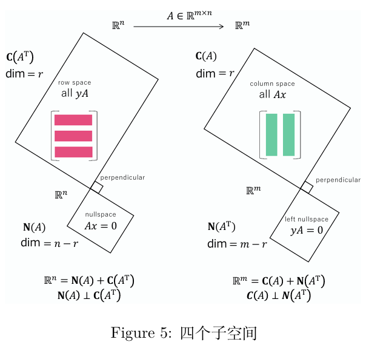
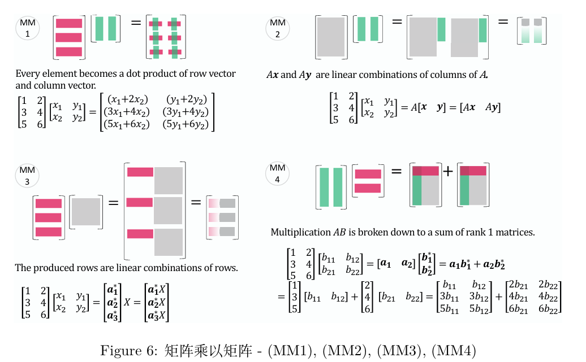
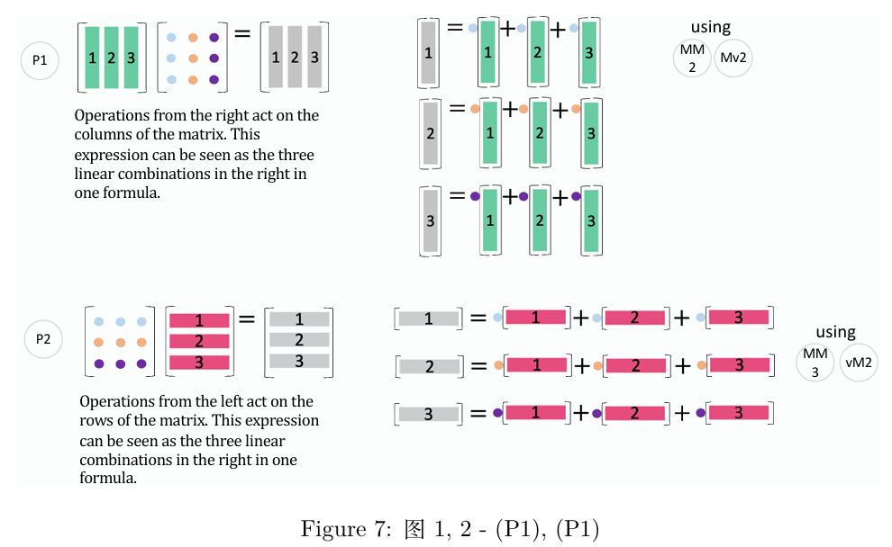
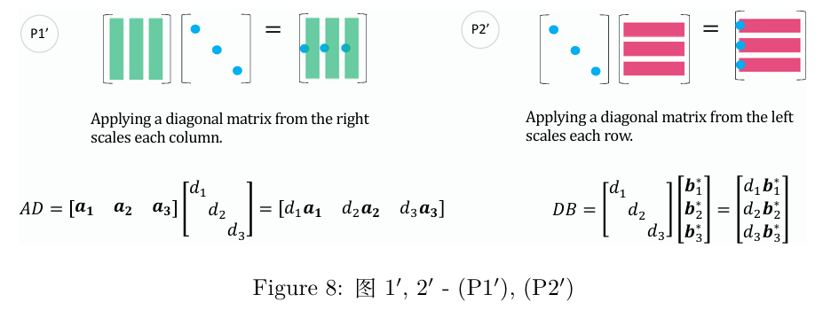
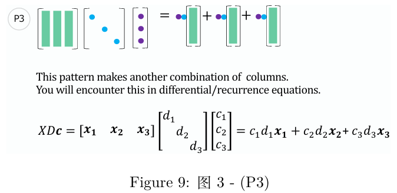
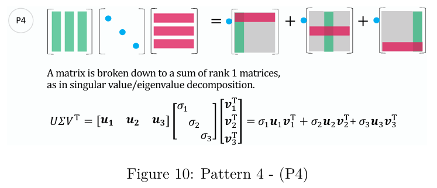

# 线性代数概要

> 说明：这份资料本质上是**对结论的总结**，供快速阅览和查找用。不适合任何形式的线性代数考试。

## 1. 线性方程组

### 行列式通常定义

$$
{\displaystyle \det(A)=\sum _{i_{1},i_{2},\ldots ,i_{n}}\varepsilon _{i_{1}\cdots i_{n}}a_{1,i_{1}}\!\cdots a_{n,i_{n}}}
$$

其中 $\varepsilon _{i_{1}\cdots i_{n}}$ 为 Levi-Civita记号。

---

### 行列式递归定义

定义余子式（minor）：

$$
M_{i,j} \qq{为删除矩阵第$i$行和第$j$列的子方阵行列式}
$$

代数余子式（cofactor）：

$$
C_{i,j} = (-1)^{i+j} M_{i,j}
$$

则行列式为：

$$
{\displaystyle \det(A)=\sum _{i=1}^{n}(-1)^{i+j}a_{i,j}M_{i,j}}
$$

---

### Vandermonde 矩阵

$$
{\displaystyle {\begin{vmatrix}1&1&1&\cdots &1\\x_{1}&x_{2}&x_{3}&\cdots &x_{n}\\x_{1}^{2}&x_{2}^{2}&x_{3}^{2}&\cdots &x_{n}^{2}\\\vdots &\vdots &\vdots &\ddots &\vdots \\x_{1}^{n-1}&x_{2}^{n-1}&x_{3}^{n-1}&\cdots &x_{n}^{n-1}\end{vmatrix}}=\prod _{1\leq i<j\leq n}\left(x_{j}-x_{i}\right).}
$$

其中当 $x_1,\cdots,x_n$ 各不相同时，行列式值不为0.

---

### Cramer 法则

如果有 $n$ 个方程的 $n$ 元线性方程组有唯一解时，系数矩阵满足：

$$
\abs{A} = \mqty|a_{11}& a_{12}& \cdots &a_{1n} \\ a_{21} &a_{22}&\cdots&a_{2n} \\ \vdots&\vdots&\vdots&\vdots\\a_{n1}&a_{n2}&\cdots&a_{nn}| \neq 0
$$

且解集为：

$$
\qty(\frac{|B_1|}{|A|},\frac{|B_2|}{|A|},\cdots,\frac{|B_n|}{|A|})
$$

其中：

$$
\abs{B_j} = \mqty|a_{11}& \cdots& a_{1,(j-1)}&b_1&a_{1,(j-1)}&\cdots &a_{1n}  \\ a_{21}& \cdots& a_{2,(j-1)}&b_2&a_{2,(j-1)}&\cdots &a_{2n}\\\vdots&\vdots&\vdots&\vdots&\vdots&\vdots&\vdots\\a_{n1}& \cdots& a_{n,(j-1)}&b_n&a_{n,(j-1)}&\cdots &a_{nn}|
$$

---

## 2. 向量及矩阵的运算

### 基本运算

---

### 特殊矩阵

---

