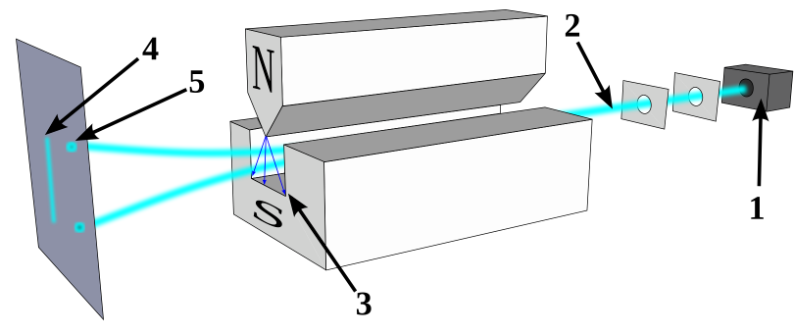
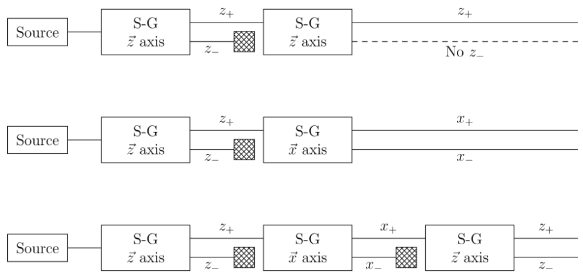

# 量子力学导论（中级物理化学）

## 1. 数学准备

### 1.1 线性空间

我们都知道矢量构成一个线性空间。假设将一类自变量为复数 $a$ 的函数称为矢量，用 $\ket{a}$ 表示，称为**右矢**（ket）。所有函数的集合 $\{\ket{a}\}$ 和所有复数的集合 $\{a\}$ 构成空间 $L$ 。如果它满足：

- 任意两个矢量加和 $\ket{a} + \ket{b} = \ket{c} \in L$
- 矢量和复数乘积仍为线性空间 $L$ 内的矢量 $a\ket{a} = \ket{a'}$
- 存在零矢量 $\vb{0}$ 满足 $\ket{a} + \vb0 = \ket{a}$
- 加和和复数的乘积满足线性运算 $a(\ket{a} + \ket{b}) = a\ket{a} + b\ket{b}$

这样我们就说空间 $L$ 时复数线性空间。其中比较常见的线性空间有：

1. 二维列矩阵集合：

   $$
   S_{1/2} = \qty{\mqty(c_1\\c_2)}
   $$

2. 所有定义在 $[0,a]$ 上，端点值为0且平方可积的函数集合 $L_2$：

   $$
   \begin{cases}
   f(0) = f(a) = 0 \\
   \int_0^a |f(x)|^2 < M
   \end{cases}
   $$

---

### 1.2 共轭空间

类似线性代数的定义，如果对于 $n$ 个矢量：

$$
a_1\ket{u_1} + a_2\ket{u_2}+\cdots+a_n\ket{u_n} = 0\qq{iff} a_1 = a_2 = \cdots = a_n = 0
$$

我们就说这 $n$ 个矢量是**线性无关**的。如果 $L$ 内包含 $n$ 个线性无关矢量，我们就说 $L$ 是 $n$ 维的，并且这写线性无关矢量的集合构成 $L$ 的**基组**（basis）。这个维度甚至可以是无限维的。

现在我们定义一个抽象的 $L$ 的共轭空间 $\tilde{L}$，$L$ 中右矢 $\ket{a}$ 在 $\tilde{L}$ 中的共轭矢量用 $\bra{a}$ 表示，并称为**左矢**（bra）。它们的对应法则是：

1. $\bra{u_1}, \bra{u_2}, \cdots , \bra{u_n}$ 是 $\tilde{L}$ 的基组；
2. $\alpha\ket{a}+\beta\ket{b}$ 的共轭矢量是 $\alpha^*\bra{a}+\beta^*\bra{b}$ .

这样就可以通过共轭矢量定义**内积**（inner product）：$\ip{a}{b}$。它满足：

1. $\ip{a}{b} = \ip{b}{a}^*$
2. $\bra{a}(\beta\ket{b} + \gamma\ket{c}) = \beta\ip{a}{b} + \gamma \ip{b}{c}$
3. $\ip{a} \ge 0 \qq{且只有当 $\ket{a} = 0$ 时取等} $

> 比如对 $S_2$ 空间有：
>
> $$
> \ip{a}{b} = \mqty(a_1^*&a_2^*)\mqty(b_1\\b_2) = a_1^*b_1 + a^*_2b_2
> $$
>
> 对于 $L_2$ 空间有：
>
> $$
> \ip{a}{b} = \int_0^a f^*_a(x)f_b(x) \dd{x}
> $$
>
> 只要存在 $\ket{u} \neq 0$，满足 $\ip{u}{w} =0$，那么就一定有 $\ket{w} = 0$。 取 $\ket{u} = \ket{w}$ 即可得证。

我们还可以推广欧氏空间的长度为**范数**（norm）：

$$
\norm{a} = \sqrt{\ip{a}}
$$

如果一个矢量满足 $\ip{a} = 1$，我们就说它是**归一化**的。于是我们总能得到归一化矢量：

$$
\ket{\tilde{a}} = \frac{1}{\sqrt{\ip{a}}} \ket{a}
$$

另外，如果两个矢量满足 $\ip{a}{b} = 0$，我们就说是他们是正交的。

---

### 1.3 正交归一基组

回到基组，如果基矢满足：

$$
\ip{\varphi_i}{\varphi_j} = \delta_{ij}
$$

我们就说这个基组是**正交归一基组**。

如何从任意基组得到正交归一基组？我们不妨先归一化一个基矢：

$$
\ket{\varphi_1} = \frac{1}{\sqrt{\ip{a}}} \ket{a}
$$

之后对于下一个基组，考虑投影掉 $\ket{\varphi_1}$ 的部分，也就是 $\ket{\varphi_2} = \alpha_2\ket{u_2} + \beta\ket{\varphi_1}$ ，左乘 $\bra{\varphi_1}$ 由正交性：

$$
\begin{gathered}
\ip{\varphi_1}{\varphi_2} = \alpha_2 \ip{\varphi_1}{u_2} +\beta = 0\\
\beta = -\alpha_2 \ip{\varphi_1}{u_2}
\end{gathered}
$$

这就可以得到：

$$
\ket{\varphi_2} = \alpha_2(\ket{u_2} - \ket{\varphi_1}\ip{\varphi_1}{u_2)}
$$

之后归一化即可得到 $\alpha_2$ 的值，如此反复就可以得到所有的基矢了。

$$
\ket{\varphi_n} = \alpha_n(\ket{u_n} - \sum_{k<n}\ket{\varphi_k}\ip{\varphi_k}{u_n)}
$$

这种构造也被叫做 **Schmitt构造**。

对空间内任意一个矢量 $\ket{w} = \sum_i w_i\ket{\varphi_i}$ ，左乘 $\bra{\varphi_j}$ 得到：

$$
\ip{\varphi_j}{w} = \sum_i w_i\delta_{ij} = w_i
$$

这就有：

$$
\ket{w} = \sum_i \ket{\varphi_i}\ip{\varphi_i}{w}
$$

此外，对于两个矢量的内积可以表示为：

$$
\ip{v}{w} = \sum_i v_i^*w_i
$$

---

### 1.4 算符

如果有一个操作或者运算，可以试一个矢量映射成同一个空间内的另一个矢量，这个操作就被称作**算符**（operator），记作 $\hat{A}$：

$$
\ket{v} = \hat{A}\ket{u}
$$

显然算符是满足加法结合律和交换律的。

如果算符满足：

$$
\hat{A}(\alpha\ket{u} + \beta\ket v) = \alpha\hat{A}\ket{u} + \beta\hat{B}\ket{u}
$$

这样这个算符就叫做**线性算符**。绝大多数的算符都是线性算符。

算符的乘积满足结合律，但一般不满足交换律。我们可以定义**对易子**（communicator）：

$$
\comm{\hat{A}}{\hat{B}} = \hat{A}\hat{B} - \hat{B}\hat{A}
$$

如果 $\comm{\hat{A}}{\hat{B}}\neq 0$，我们就说这两个算符是不对易的，也就是不可交换的。反之，如果 $\comm{\hat{A}}{\hat{B}}=0$，这两个算符就是对易，可交换的。

一些比较重要的性质：

- $\comm{\hat{A}}{\hat{B}\hat{C}} = \comm{\hat{A}}{\hat{B}}\hat{C} + \hat{B}\comm{\hat{A}}{\hat{C}}$

逆算符满足：

$$
\ket{u} = \hat{A}^{-1}\ket{v} = \hat{A}^{-1}\hat{A}\ket{u}
$$

显然有 $\hat{A}^{-1}\hat{A} = \hat{I}$. 如果一个算符没有逆算符，就称他为奇异算符。

---

### 1.5 厄米共轭算符

有右矢就有左矢，必然存在一个 $\hat{A}^\dagger$ 满足：

$$
\qif \ket{v} = \hat{A}\ket{u}\qc\bra{v} = \bra{u}\hat{A}^\dagger
$$

这个算符 $\hat{A}^\dagger$ 就被称为 $\hat{A}$ 的厄米共轭算符。

厄米共轭算符也可以被以下两种方式定义：

- $\forall \ket{w},\ket{u}\qc\mel{w}{\hat{A}}{u} = \mel{u}{\hat{A}^\dagger}{w}^*$
- $\forall \ket{u}\qc\mel{u}{\hat{A}^\dagger}{u} = \mel{u}{\hat{A}}{u}^*$

如果对于一个算符满足 $\hat{A}^\dagger = \hat{A}$，这个算符就被叫做**厄米算符**（Hermit Operator）。物理学上的很多算符都是厄米算符（坐标，动量，能量，角动量等）。

对于一个厄米算符，我们有：

$$
\ev{\hat{A}}{u} = \ev{\hat{A}}{u}^*
$$

也就是说 $\ev{\hat{A}}{u}$ 是一个实数。这个值也被称为**期望值**。

> 算符的存在是唯一的，也就是：
>
> $$
> \forall \ket{u},\ket{v}\qc\mel{u}{\hat{A}}{v} = \mel{u}{\hat{B}}{v} \Rightarrow \hat{A} = \hat{B}
> $$
>
> 通过移项可以得到 $\mel{u}{\hat A - \hat B}{v} = 0$；取 $(\hat A - \hat B)\ket{v} = \ket{w}$，有 $\ip{u}{w} = 0$，对应 $\ket{w} = 0$；也就是$(\hat A - \hat B) = 0$，得证。
>
> 逆定理：期望值为实数的算符一定是厄米算符，即：
>
> $$
> \ev{\hat{A}}{u} = \ev{\hat{A}}{u}^* \Rightarrow \hat A = \hat A^\dagger
> $$
>
> 可以设 $\ket{u} = \ket{v}+\lambda\ket w$，于是有：
>
> $$
> \begin{aligned}
> &\ev{\hat A}{v} + \lambda \mel{v}{\hat A}{w} + \lambda^*\mel{w}{\hat A}{v} + \lambda\lambda^*\ev{\hat A}{w}\\
> &=\ev{\hat A}{v}^* + \lambda^* \mel{w}{\hat A^\dagger}{v} + \lambda\mel{v}{\hat A^\dagger}{w} + \lambda\lambda^*\ev{\hat A}{w}^*
> \end{aligned}
> $$
>
> 这就有：
>
> $$
> \lambda (\mel{v}{\hat A}{w}-\mel{v}{\hat A^\dagger}{w}) + \lambda^*(\mel{w}{\hat A}{v} - \mel{w}{\hat A^\dagger}{v}) =0
> $$
>
> 分别取：
>
> $$
> \begin{cases}
> (\mel{v}{\hat A}{w}-\mel{v}{\hat A^\dagger}{w}) + (\mel{w}{\hat A}{v} - \mel{w}{\hat A^\dagger}{v}) = 0&,\lambda=1\\
> (\mel{v}{\hat A}{w}-\mel{v}{\hat A^\dagger}{w}) - (\mel{w}{\hat A}{v} - \mel{w}{\hat A^\dagger}{v}) = 0&,\lambda=i
> \end{cases}
> $$
>
> 相加即得到：
>
> $$
> \mel{v}{\hat A}{w}=\mel{v}{\hat A^\dagger}{w}
> $$
>
> 即为 $\hat A$ 是厄米算符。

厄米算符的乘积并不是厄米算符，因为：

$$
(\hat{A}\hat{B})^\dagger = \hat{B}^\dagger\hat{A}^\dagger = \hat{B}\hat{A}
$$

厄米算符的对易子有：

$$
\comm{\hat{A}}{\hat{B}}^\dagger = \hat{B}^\dagger\hat{A}^\dagger - \hat{A}^\dagger\hat{B}^\dagger = \hat{B}\hat{A} - \hat{A}\hat{B}
$$

可以发现 $\comm{\hat{A}}{\hat{B}}^\dagger = -\comm{\hat{A}}{\hat{B}}$，这一类算符也被称为**反厄米算符**。显而易见的，只需要在反厄米算符前面乘一个虚数 $i$，就能得到一个厄米算符。

如果对于一个算符满足 $\hat{A}^\dagger = \hat{A}^{-1}$，这个算符就被叫做**幺正算符**（Unitary Operator），我们一般用 $\hat{U}$ 表示。

现在同时对两个矢量作**幺正变换**：

$$
\begin{cases}
\ket{\tilde{u}} = \hat{U}\ket{u}\\
\ket{\tilde{v}} = \hat{U}\ket{v}
\end{cases}
\Rightarrow
\ip{\tilde{v}}{\tilde{u}} = \mel{\tilde{v}}{\hat{U}^\dagger\hat{U}}{\tilde{u}} = \ip{v}{u}
$$

由此可见幺正算符不改变内积运算结果。

---

### 1.6 外积

**外积**（outer product）可以定义为：

$$
\hat{Q} = \op{w}{u}
$$

此外对于一个正交归一基组而言，根据前面的讨论，有投影算符：

$$
\hat{P_i}= \op{\phi_i}
$$

这样 $\hat{P}_i\ket{u}$ 就代表 $\ket u$ 在 $\ket{\phi_i}$ 方向上的投影值。

如果一个算符的平方和自身相等，我们称之为**幂等算符**，也就是：

$$
\hat{P}_i^2 = \hat{P}_i
$$

很显而易见的，幂等算符的任意线性组合同样是幂等算符。很显然投影算符是幂等算符。

我们考虑把每个方向上的投影相加，最后得到的就是原来的算符本身，相当于恒等变换。这也就是说：

$$
\hat{I} = \sum_i \hat{P}_i = \sum_i \op{\phi_i}
$$

这个式子被称为**恒等分解**。

---

### 1.7 微分算符

我们先将右矢认为是定义在 $(-\infty,\infty)$ 上的 $L_2 : f(x)$，这样我们可以定义微分算符：

$$
\hat{d_x}\ket{u} = \dv{x}u(x)
$$

它的厄米共轭也就是：

$$
\bra{u}\hat{d_x}^{\dagger} = \dv{x}u^*(x)
$$

我们用 $\bra{v}$ 和 $\hat{d_x}\ket{u}$ 作内积，就有：

$$
\mel{u}{\hat{d}_x}{v} = \int_{-\infty}^\infty \qty[u^*(x)\dv{x}v(x)]\dd{x}
$$

通过分部积分：

$$
\begin{aligned}
\mel{u}{\hat{d}_x}{v} &= \eval{u^*(x)v(x)}_{-\infty}^{\infty} - \int\qty[\dv{x}u^*(x)v(x)]\dd{x}\\
&= -\int\qty[\dv{x}u^*(x)v(x)]\dd{x}
\end{aligned}
$$

所以：

$$
\bra{u}\hat{d_x} = -\dv{x}u^*(x)
$$

这也可以看出 $\hat{d_x}^\dagger = -\hat{d_x}$，也就是这是一个反厄米算符。在量子力学中，我们更经常在其前面左乘一个 $i$ 把它变成厄米算符：

$$
\hat{p_x} = i\hbar\hat{d_x}
$$

---

### 1.8 本征值

如果有一系列非零矢量满足：

$$
\hat{A}\ket{a_i} = a_i\ket{a_i}
$$

那么我们称 $a_i$ 为**本征值**，$\ket{i}$ 为**本征矢量**。

> 厄米算符的本征值**必为实数**，且不同本征矢是**相互正交的**。

我们左乘一个 $\bra{a_j}$：

$$
\mel{a_j}{\hat A}{a_i} = a_i\ip{a_j}{a_i}
$$

又有：

$$
\mel{a_j}{\hat A}{a_i} = \mel{a_i}{\hat A}{a_j}^* = a_j^*\ip{a_i}{a_j}^* = a_j^*\ip{a_j}{a_i}
$$

二式相减：

$$
(a_i - a_j^*)\ip{a_j}{a_i} = 0
$$

- 当 $i=j$ 时，有 $a_i = a_i^*$，于是 $a_i$ 为实数；
- 当 $i\neq j$ 时，有 $\ip{a_j}{a_i} = 0$，于是正交。

> 幺正算符的本征值**必定模为1**.

左乘一个 $\bra{a_i}\hat U^\dagger = a_i^* \bra{a_i}$ ：

$$
\mel{a_i}{\hat U^\dagger \hat U}{a_i} = \ip{a_i} = a_i^*a\ip{a_i}
$$

于是必有 $a_i^*a_i = 1$ .

> 幂等算符的本征值**必为0或1**.

左乘一个 $\bra{a_i}\hat P$ ：

$$
\mel{a_i}{\hat P^2}{a_i}  = a_i^2\ip{a_i} = \ev{\hat P}{a_i}= a_i\ip{a_i}
$$

于是 $a_i^2 = a_i$，就是必为0或1.

> 反厄米算符的本征值均为纯虚数或0。

假设有两个本征值 $a_i,a_j$：

$$
\mel{a_j}{\hat A}{a_i} = -\mel{a_i}{\hat A}{a_j}^* = -a_j^*\ip{a_i}{a_j}^* = -a_j^*\ip{a_j}{a_i}
$$

相减得到：

$$
(a_i + a_j^*)\ip{a_j}{a_i} = 0
$$

- 当 $i=j$ 时，有 $a_i = -a_i^*$，于是 $a_i$ 为纯虚数或0；
- 当 $i\neq j$ 时，有 $\ip{a_j}{a_i} = 0$，于是正交。

---

### 1.9 矩阵表示

用一组正交归一化的基组可以把任意一个向量写成：

$$
\ket{w} = \sum_i \ket{a_i}\ip{a_i}{w}
$$

这样就可以用一个列矩阵表示：

$$
\vb*{W} = \mqty[\ip{a_2}{w}\\\ip{a_2}{w}\\\vdots]
$$

相对应的 $\bra{w}$ 可以用行矩阵表示：

$$
\vb*{W}^\dagger = \mqty[\ip{a_2}{w}&\ip{a_2}{w}&\cdots]
$$

需要注意的是，选择的基组不同，对应的到的矩阵也不同。

这样内积就可以表示为：

$$
\ip{w}{u} = \vb*{W}^\dagger\vb*{U} = \sum_i\ip{w}{a_i}\ip{a_i}{u} = \ip{w}{u}
$$

我们还可以找到算符 $\vu*O$ 的矩阵表示：假设 $\ket{u} = \hat O\ket{w}$

$$
\ket{u} = \sum_{i,j}\ket{a_i}\mel{a_i}{\hat O}{a_j}\ip{a_j}{w}
$$

就可以用矩阵表示算符：

$$
\vu*O = \mqty[\mel{a_1}{\vu*O}{a_1}&\mel{a_1}{\vu*O}{a_2}&\cdots\\\mel{a_2}{\vu*O}{a_1}&\mel{a_2}{\vu*O}{a_2}&\cdots\\\vdots&\vdots&\ddots]
$$

于是就有：

$$
\vb*U = \vu*O\vb*W
$$

很明显，如果举个算符在自己本征矢上的表示是对角化的，并且如果本征矢是正交归一的，每一个对角元就是本征值。

$$
\boldsymbol{A} =
\begin{bmatrix}
a_1 & 0 & \cdots \\
0 & a_2 & \cdots \\
\vdots & \vdots & \ddots
\end{bmatrix}
$$

---

### 1.10 幺正变换

我们假设一个ket可以通过两组正交归一基组展开：

$$
\ket{u} = \sum_i\ket{a_i}\ip{a_i}{u} = \sum_j\ket{b_j}\ip{b_j}{u}
$$

这样就有：

$$
\begin{aligned}
\sum_j\ip{b_j}{u} &= \sum_{i,j} \ip{b_j}{a_i}\ip{a_i}{u}=\sum_{i,j}\ip{a_i}{b_j}^*\ip{a_i}{u}
\end{aligned}
$$

这样定义算符：

$$
(\vu*{U})_{ij}= \ip{a_i}{b_j}^*
$$

也可以写成：

$$
\vu*U = \sum_{ij}U_{ij}\op{a_i}{a_j} = \sum_{i}\op{b_i}{a_i}
$$

就可以把一个基组下的ket变换到另一个基组去：

$$
\ket{u}_b = \vu*U\ket{u}_a
$$

可以证明 $\vu*U$ 算符是幺正的，也就是 $\vu*U^\dagger\vu*U=\vu*I$ 。

同样我们也可以变换一个算符：

$$
\begin{aligned}
\mel{b_i}{\vu*O}{b_j} &= \sum_{kl}\ip{b_i}{a_k}\mel{a_k}{\vu*O}{a_l}\ip{a_l}{b_j}\\
&= \sum_{kl}\mel{a_i}{\vu*U^\dagger}{a_k}\mel{a_k}{\vu*O}{a_l}\mel{a_l}{\vu*U}{a_j}\\
&= \mel{a_i}{\vu*U^\dagger\vu*O\vu*U}{a_j}
\end{aligned}
$$

也就是：

$$
\vu*O_b = \vu*U^\dagger\vu*O_a\vu*U
$$

这也被称为算符的**幺正变换**，也就是在幺正算符下的相似变换。

由于 $\Tr(XY) = \Tr(YX)$，于是有：

$$
\Tr{\vu*O_b} = \Tr(\dagger\vu*O_a\vu*U)
$$

也就是算符的迹在幺正变换前后不改变。这样我们就可以定义一个**算符的迹**。算符的迹是可以在任意基组上定义的。

$$
\Tr\vu*O = \sum_k\mel{b_k}{\vu*O}{b_k}
$$

一个经典结论：

$$
\Tr(\op{u}{v}) = \sum_k\ip{b_k}{u}\ip{v}{b_k} = \sum_k\ip{v}{b_k}\ip{b_k}{u} = \ip{v}{u}
$$

> 一些记号：
>
> $$
> \tilde{\ket{a}} = \hat U\ket{a}\\
> \tilde{\hat O} = \hat U^\dagger\hat O\hat U
> $$

对于幺正变换后的算符，有：

$$
\hat U\hat O\ket{a_i} = \hat U\hat O\hat U^\dagger\hat U\ket{a_i}  = \tilde{\hat O}\tilde{\ket a_i}
$$

同时又有：

$$
\hat U\hat O\ket{a_i} = a_i\tilde{\ket a_i}
$$

也就是**幺正变换后的算符本征值不变，本征矢量为原矢量的幺正变换**。

---

对于本征方程：

$$
\hat B\ket{b_i} = b_i\ket{b_i}
$$

写成矩阵形式就是：

$$
\vu*B\vb b = b_i\vu*I\vb b
$$

移项：

$$
(\vu*B - \lambda\vu*I)\vb b = 0
$$

本征矢量不为0的情况下，可以得到**久期方程**：

$$
\boxed{|\vu*B - \lambda\vu*I| = 0}
$$

久期方程的每个解都是 $\hat B$ 的本征值。

---

### 1.11 相容厄米算符

如果两个厄米算符对易，则称之为是**相容的**。

$$
\comm{\hat A}{\hat B} = 0
$$

> **相容的厄米算符可以有共同的正交归一完备基组。**

取 $\mel{a_i}{\hat A}{a_j} = 0\qc i\neq j$，有：

$$
\mel{a_i}{\comm{\hat A}{\hat B}}{a_j} =(a_i-a_j)\mel{a_i}{B}{a_j} = 0
$$

 这样就有 $\mel{a_i}{\hat B}{a_j} = 0$，也就是 $\hat B$ 也在 $\ket{a_i}$ 上对角化。

（该证明实际不严谨，可看物理化学I的推导。）

> 不对易的厄米算符的对易子一定有如下形式：
>
> $$
> \comm{\hat A}{\hat B} = i\hat C
> $$
>
> 其中 $\hat C$ 为厄米算符。这也就是厄米算符的对易子的期望为纯虚数。

$$
\comm{\hat A}{\hat B}^\dagger = (\hat B\hat A - \hat A\hat B) = -(\hat A\hat B-\hat B\hat A) = -\comm{\hat A}{\hat B}
$$

---

### 1.12 算符的函数

算符的函数可以定义成级数展开：

$$
f(\hat A) = \sum_n c_n\hat A^n
$$

其中最重要的是指数函数：

$$
e^{\alpha\hat A} = \sum_n \frac{\alpha}{n!}\hat{A}^n
$$

有如下性质：

$$
e^{\hat A}e^{-\hat A} = \hat I
$$

> 设函数：
>
> $$
> f(\lambda) =e^{\lambda\hat A}e^{-\lambda\hat A}
> $$
>
> 很显然 $f(0) = \hat I$。求导数，由于一个算符的函数永远与自己对易，所以可以交换顺序：
>
> $$
> f'(\lambda) = \hat Ae^{\lambda\hat A}e^{-\lambda\hat A} - e^{\lambda\hat A}\hat Ae^{-\lambda\hat A} = 0
> $$
>
> 于是 $f(1) = \hat I$，也就是 $e^{\hat A}e^{-\hat A} = \hat I$.

$$
\hat U e^\hat A \hat U^{-1} = e^{\hat U \hat A \hat U^{-1}}
$$

> 可以通过插入任意个幺正对得到：
>
> $$
> \begin{aligned}
> \hat U e^\hat A \hat U^{-1} &= \sum_{n} \frac{1}{n!}  \hat U \hat A^n \hat U^{-1}\\
> &= \sum_{n} \frac{1}{n!}  (\hat U \hat A \hat U^{-1}\hat U \hat A \hat U^{-1}\cdots)\\
> &= \sum_{n} \frac{1}{n!}  (\hat U \hat A \hat U^{-1})^n = e^{\hat U \hat A \hat U^{-1}}
> \end{aligned}
> $$

**Baker–Campbell–Hausdorff 公式**（BCH公式）：

$$
e^{\hat A}\hat Be^{-\hat A} = \hat B + \comm{\hat A}{\hat B} + \frac{1}{2!}\comm{\hat A}{\comm{\hat A}{\hat B}} + \cdots
$$

> 设函数：
>
> $$
> f(\lambda) = e^{\lambda\hat A}\hat Be^{-\lambda\hat A}
> $$
>
> 在 $\lambda = 0$ 处作泰勒展开。对每阶导数有：
>
> $$
> \begin{gathered}
> f(0) = \hat B\\
> f'(0) = \hat A e^{\lambda\hat A}\hat Be^{-\lambda\hat A} -  e^{\lambda\hat A}\hat B\hat Ae^{-\lambda\hat A}\eval{}_{\lambda=0} = \comm{A}{B}\\
> f''(0) = \hat A f'(0)-f'(0)\hat A=\comm{\hat A}{\comm{\hat A}{\hat B}}
> \\
> \vdots
> \end{gathered}
> $$
>
> 代入泰勒展开式，取 $\lambda=1$ 即得原公式。

---

### 1.13 重要不等式

**Schwartz 不等式**：

$$
\ip{u}\ip{v} \ge \abs{\ip{u}{v}}^2
$$

> 取 $\ket w = \ket u + \lambda \ket v$ ：
>
> $$
> \ip{w} = \ip{u} + c\ip{u}{v}+c^*\ip{v}{u}+cc^*\ip{v}
> $$
>

**不确定性关系：**对于两个厄米算符有：

$$
\ev{(\Delta A)^2}\ev{(\Delta B)^2}\ge\frac14\abs{\ev{\comm{\hat A}{\hat B}}}^2
$$

> 由于：
>
> $$
> \ev{(\hat A - \ev{\hat A})^2}{u}\ev{(\hat B - \ev{\hat B})^2}{u} \ge \abs{\ev{(\hat A - \ev{\hat A})(\hat B - \ev{\hat B})}{u}}^2
> $$
>
> 这也就是：
>
> $$
> \ev{(\Delta\hat A)^2}\ev{(\Delta\hat B)^2} \ge \abs{\ev{\Delta\hat A\Delta\hat B}}^2
> $$
>
> 又有：
>
> $$
> \Delta\hat A\Delta\hat B = \frac12\comm{\Delta\hat A}{\Delta\hat B}+\frac12\acomm{\Delta\hat A}{\Delta\hat B}
> $$
>
> 因为期望值 $\ev{A},\ev{B}$ 为实数，于是 $\comm{\Delta\hat A}{\Delta\hat B}=\comm{\hat A}{\hat B}$ 。我们又知道厄米算符的对易子的期望纯虚数，反对易子的期望为实数。代入到不等式有：
>
> $$
> \ev{(\Delta\hat A)^2}\ev{(\Delta\hat B)^2} \ge \frac14\abs{\ev{\comm{\hat A}{\hat B}}}^2+\frac14\abs{\ev{\acomm{\Delta\hat A}{\Delta\hat B}}}^2
> $$

---

## 2. 量子力学基本假设

### 2.1 Stern-Gerlach 实验

对于银原子的电动力学有：

$$
F_z = \pdv{z}(\va\mu\cdot \va B) = \mu_z\pdv{B}{z}
$$

在经典力学里，如果电子磁矩为 $\mu$，由于磁矩取向随机，会得到 $[-\mu,\mu]$ 的任何取值；单实际只有两个分立的峰，对应：

$$
s_z = \pm \frac{\hbar}{2}
$$

连续的S-G实验出现了以下的结果：

---

### 2.2 量子力学基本假设

**基本假设1**：体系的一个确定状态对应线性矢量空间内一束确定的有相同方向的矢量，称之为态矢。

例如电子自旋，假设沿 $z$ 方向的自旋投影为 $s_z$，由于有两个状态，所以体系内任意一个自旋状态可以表示成：

$$
\ket\chi = \alpha\ket{s_z+}+\beta\ket{s_z-}
$$

由于归一化，有：

$$
|\alpha|^2+|\beta|^2=1
$$

这样 $x$ 方向的自旋和 $y$ 方向的自旋就可以用这两个ket表示：

$$
\begin{gathered}
\ket{s_x \pm} = \frac{1}{\sqrt2}\ket{s_z+}\pm\frac{1}{\sqrt2}\ket{s_z-}\\
\ket{s_y \pm} = \frac{1}{\sqrt2}\ket{s_z+}\pm i\frac{1}{\sqrt2}\ket{s_z-}
\end{gathered}
$$

**基本假设2**：物理可观测量对应于厄米算符，该算符的本征矢构成线性空间的完备基组。

**基本假设3**：对于 $\ket u$ 用算符 $\hat A$ 测量得到本征值 $a_i$ ，会使原来的状态 $\ket u$ 投影到 $\ket{a_i}$ （坍缩），该事件发生的概率为：

$$
P_i = \abs{\ip{a_i}{u}}^2
$$

这表示期望值可以表示为：

$$
\begin{aligned}
\ev{\hat A}{u} &= \sum_{i,j} \ip{u}{a_i}\mel{a_i}{\hat A}{a_j}\ip{a_j}{u}\\
&=\sum_{i,j}a_j\ip{u}{a_i}\ip{a_i}{a_j}\ip{a_j}{u}\\
&= \sum_i a_i\ip{u}{a_i}\ip{a_i}{u}\\
&= \sum_i |\ip{u}{a_i}|^2a_i = \sum_i P_ia_i
\end{aligned}
$$

---

### 2.3 位置和动量算符

对于位置算符，由于位置的取值为 $(-\infty,\infty)$ ，对应的是一个连续无穷维的空间。

$$
\hat x\ket{x} = x\ket{x}
$$

这种状态下本征矢完备性改为：

$$
\hat I = \int\ket{x}\dd{x}\bra{x}
$$

对于位置算符的本征矢有：

$$
\ip{x'}{x} = \delta(x-x')
$$

我们把 $\ket{u}$ 在位置表象上的表示写成 $\ip{x}{u} = \psi(x)$，这就是**波函数**。因为概率（概率密度）我们知道：

$$
P(x)\dd{x} = \psi^*(x)\psi(x)\dd{x}
$$

这就是波函数表示。

对于一个态由于完备性有：

$$
\ket{u} = \int\ket{x}\ip{x}{u}\dd{x} = \int\psi(x)\ket{x}\dd{x}
$$

于是就有：

$$
\ip{u} = \int\psi(x)\ip{u}{x}\dd{x} = \int\psi^*(x)\psi(x)\dd{x} = 1
$$

自动满足正交归一条件。

同理可以定义动量算符：

$$
\hat p\ket{p} = p\ket{p}
$$

可以定义 $\ip{p}{u} = \phi(p)$ 为动量空间的波函数。

**基本假设4**：对位置算符和动量算符满足基本对易关系：

$$
\comm{\hat x}{\hat p} = i\hbar
$$

> 在三维情境下，有：
>
> $$
> \comm{\hat x_i}{\hat p_j} = i\hbar\delta_{ij}
> $$

根据不确定性原理有：

$$
\ev{(\Delta x)^2}\ev{(\Delta p)^2} = \frac{\hbar^2}{4}
$$

这也就是：

$$
\Delta x\cdot\Delta p = \frac{\hbar^2}{2}
$$

---

现在需要推导动量算符。考虑一个平移算符，可以平移一个无穷小的量（注意后续讨论都是基于无穷小量的平移！）：

$$
\hat D(\dd{s}) \ket{x}= \ket{x+\dd{s}}
$$

于是分别有：

$$
\begin{gathered}
\hat x\hat D(\dd s)\ket{x} = (x+\dd{s})\ket{x+\dd s}\\
\hat D(\dd s)\hat x\ket{x} = x\ket{x+\dd s}
\end{gathered}
$$

这于是就有对易关系：

$$
\comm{\hat x}{\hat D(\dd{s})} = \dd{s}\ket{x+\dd{s}} \approx \dd{s}\ket{x}
$$

由于物理意义，我们规定：

- 平移算符作用不改变归一性，也就是对 $\hat D\ket{u}$ 有 $\ev{D^\dagger D}{u} = 1$，也就是**平移算符是幺正算符**。
- 平移可加：$\hat D(\dd{s})+\hat D(\dd{s}') = \hat D(\dd{s}+\dd{s}')$
- 反方向平移等于平移的你操作：$\hat D^{-1}(\dd{s}) = \hat D{(-\dd{s})}$
- $\lim_{\dd s\to 0}\hat D(\dd{s}) = \hat I$

于是我们可以设：

$$
\hat D(\dd{s}) = 1-i\hat K \dd{s}
$$

其中 $\hat K$ 是任意一个厄米算符。这个式子满足任意一个性质。

带入到平移对易关系有：

$$
\hat {x}(\hat K\dd{s})-(\hat K\dd{s})\hat {x}=i\dd{s}
$$

我们假设 $\dd{s}$ 为沿着任意一个坐标轴的 $\dd{s}\vu{e_j}$，上式转变为：

$$
\comm{\hat x_i}{\hat K_j} = i\delta_{ij}
$$

这样只要取：

$$
\hat{K}_j = \frac{\hat p_j}{\hbar}
$$

就有基本对易关系了。此时平移算符为：

$$
\hat D(\dd{s})=1-\frac{i}{\hbar}\hat p\cdot\dd{s}
$$

如果平移量不是无穷小，而是有限量，通过极限可以得到：

$$
\hat D(s) = \lim_{N\to\infty}(1-\frac{i}{\hbar}\hat p\cdot\frac{s}{N})^N = e^{-\frac{i}{\hbar}\hat p\cdot s}
$$

---

把平移算符作用于任意一个矢量：
$$
\hat D(\dd{s})\ket{u} = (1-\frac{i}{\hbar}\hat p\cdot\dd{s})\ket{u}
$$
左乘一个 $\bra{x}$ 得到：
$$
\begin{aligned}
\bra{x}\hat D(\dd{s})\ket{u} = \ip{x-\dd{s}}{u} &=\bra{x} (1-\frac{i}{\hbar}\hat p\cdot\dd{s})\ket{u}\\
&= \ip{x}{u} - \frac{i}{\hbar}\mel{x}{\hat p}{u}\cdot \dd{s}
\end{aligned}
$$
将左边做泰勒展开，保留到一阶项：
$$
\begin{gathered}
\grad\ip{x}{u}\cdot \dd{s} = \frac{i}{\hbar}\mel{x}{\hat p}{u}\cdot \dd{s}\\
\mel{x}{\hat p}{u} = \frac{\hbar}{i}\grad\ip{x}{u}
\end{gathered}
$$
这意味着动量算符等同于将 $\hbar/i\ \grad$ 作用在算符上。我们取 $\ket{u} = \ket{x'}$，得到：
$$
\mel{x}{\hat{p}}{x'} = \frac{\hbar}{i}\grad\delta^3(x-x')
$$
这就是动量算符在位置空间的表示。

---

动量基矢和位置基矢的内积：
$$
\mel{x}{\hat p}{p}= p\ip{x}{p}\Rightarrow -i\hbar\grad\ip{x}{p} = p\ip{x}{p}
$$
得到：
$$
\ip{x}{p} = Ae^{ip\cdot x/\hbar}
$$
利用归一化得到：
$$
\begin{aligned}
\delta^3(p'-p) = \ip{p'}{p} &= \int\ip{p'}{x}\dd[3]{x}\ip{x}{p'}\\
&= |A|^2\int e^{i(p-p')\cdot x/\hbar} \dd[3]{x}\\
&= |A|^2(2\pi\hbar)^3 \delta^3(p'-p)
\end{aligned}
$$
这就得到归一化常数了：
$$
\ip{x}{p} = (2\pi\hbar)^{-3/2}e^{ip\cdot x/\hbar}
$$
以此可以得到位置空间和动量空间的转换：
$$
\begin{cases}
\displaystyle\psi(x) = \ip{x}{u} = \int\ip{x}{p}\dd[3]{p}\ip{p}{u} = (2\pi\hbar)^{-3/2}\int \dd[3]{p}e^{ip\cdot x/\hbar}\phi(p)\\
\displaystyle\phi(p) = \ip{p}{u} = \int\ip{p}{x}\dd[3]{p}\ip{x}{u} = (2\pi\hbar)^{-3/2}\int \dd[3]{x}e^{-ip\cdot x/\hbar}\psi(x)
\end{cases}
$$

---

