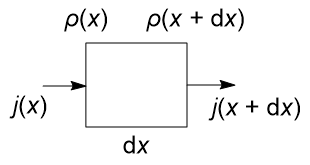

# 近平衡态的热力学

> 本文档遵循[署名—非商业性使用—相同方式共享 4.0 协议](https://creativecommons.org/licenses/by-nc-sa/4.0/)（CC BY-NC-SA 4.0）授权:fontawesome-brands-creative-commons::fontawesome-brands-creative-commons-by::fontawesome-brands-creative-commons-nc::fontawesome-brands-creative-commons-sa:
>
> 作者：**凯楽斯kelesss**

## 1. 布朗运动与 Langevin 方程

### 1.1 布朗运动

我们都知道，**布朗运动**（Brownian motion）指的是悬浮在介质中的微粒所做的随机运动。在数学上描述随机过程（也叫 **Wiener 过程**（Wiener process））通常用一个函数 $W(t)$ 表示。

对于这个函数，你不需要了解太多的数学信息，只需要了解一些基本性质：

- 通常规定 $W(0) = 0$ 。
- 对于任何时间 $t$，这个函数的增量 $(W_{t+s} - W_t)$ 都是独立的。换句话说就是维纳函数的**均值为0**：

$$
\ev{W(t)} = 0
$$

- 对于任何时间 $t$，这个函数的增量 $(W_{t+s} - W_t)$ **满足正态分布** $\mathcal N(0,u)$。
- $W(t)$ 是**连续函数**。

---

### 1.2 Langevin 方程

对于任意一个经典粒子，假设它收到一个和速度相关的阻力 $-m\zeta u$ 和一个布朗运动相关的随机力 $mA(t)$，由经典的牛二定律可得：

$$
\dv{u}{t} = -\zeta u + A(t)
$$

这个方程被称作**朗之万方程**（Langevin Equation）。

我们用常数变易法，假设 $u = c(t)e^{-\zeta t}$ ：

$$
\begin{gathered}
\dv{c}{t} e^{-\zeta t} - \zeta ce^{-\zeta t} = -\zeta u + A(t) \\
\dv{c}{t} = A(t)e^{\zeta t}
\end{gathered}
$$

积分得到：

$$
c = c_0 + \int_0^t A(t') e^{\zeta t'}\dd t'
$$

改写成速度的形式：

$$
u = u_0e^{-\zeta t} + e^{-\zeta t}\int_0^t A(t') e^{\zeta t'}\dd t'
$$

对其进行平均，而又由于第二项有随机函数，对时间的平均为0：

$$
\boxed{\ev{u} = u_0 e^{-\zeta t}}
$$

现在我们考察方差。先直接对方差进行展开：

$$
\begin{aligned}
\ev{(u-\ev u)^2} &= \ev{\bqty{e^{\zeta t' } \int_0^t e^{\zeta t } A(t') \dd t'}^2} \\
&= \ev{e^{2\zeta t } \int_0^t\int_0^t e^{\zeta t' } A(t') e^{\zeta t^{\prime\prime}} A(t^{\prime\prime}) \dd t'\dd t^{\prime\prime}} \\
&= e^{2\zeta t } \int_0^t\int_0^t e^{\zeta t'} e^{\zeta t^{\prime\prime}} \ev{ A(t')A(t^{\prime\prime})} \dd t'\dd t^{\prime\prime}
\end{aligned}
$$

这里有一个诡异的项： $\ev{ A(t')A(t^{\prime\prime})}$ 是什么鬼？

因为随机函数对时间有平移不变性，我们不妨定义**自相关函数**（Autocorrelation Function）：

$$
\ev{ A(t')A(t^{\prime\prime})} = \ev{A(0)A(t^{\prime\prime} - t')} = \phi(t^{\prime\prime}-t')
$$

随机力来自**溶剂分子对布朗粒子的频繁碰撞**。每一次碰撞都非常短暂（~ $10^{-13}$量级），而我们关心的布朗粒子运动的时间尺度要长得多（例如微秒或更长）。因此我们可以认为其正比于 $\delta$ 函数：

$$
\phi(t^{\prime\prime}-t') = \Gamma\delta(t^{\prime\prime}-t')
$$

于是原函数可以进一步转化：

$$
\begin{aligned}
\ev{(u-\ev u)^2} &= e^{2\zeta t } \int_0^t\int_0^t e^{\zeta (t' + t^{\prime\prime})} \phi(t^{\prime\prime}-t') \dd t'\dd t^{\prime\prime} \\
&= e^{2\zeta t } \int_0^t\int_0^t e^{\zeta \tau'} \phi(\tau^{\prime\prime}) \dd (\frac{\tau' + \tau^{\prime\prime}}2 )\dd (\frac{\tau' - \tau^{\prime\prime}}2 ) \\
&= \frac 12 e^{2\zeta t } \int_0^{2t} e^{\zeta \tau'}  \dd \tau' \int_{-t}^t \phi(\tau^{\prime\prime}) \dd \tau^{\prime\prime} \\
&= \frac{\Gamma}{2\zeta} \pqty{1-e^{-2\zeta t}}
\end{aligned}
$$

当 $t \to \infty$:

$$
\ev{(u-\ev u)^2} = \frac{\Gamma}{2\zeta}
$$

而我们又同时知道：

$$
\begin{aligned}
\ev{(u-\ev u)^2} &= \ev{u^2} - 2\ev u^2 + \ev u^2 \\
&= \ev{u^2} - \ev{u}^2 \\
&= \ev{u^2} - (u_0 e^{-\zeta t})^2 = \ev{u^2}
\end{aligned}
$$

我们就得到速度平方的均值：

$$
\boxed{\ev{u^2} = \frac{\Gamma}{2\zeta}}
$$

进一步地，我们知道分子动能：

$$
\frac{m\ev{u^2}}{2} = \frac32 kT
$$

于是就可以得到：

$$
\boxed{\Gamma = \frac{6\zeta kT}{m}}
$$

!!! note "注意"
    这个结果是对于三维的情况。当然，对于一维的运动过程（更经常讨 出发   论）有：

    $$
    \Gamma = \frac{2\zeta kT}{m}
    $$

也就是：

$$
\ev{A(0)A(\tau)} = \frac{6\zeta kT}{m} \delta(\tau)
$$

这有点奇怪，这里方程 $\zeta$ 是一个代表“环境阻力”的量，但是我们推导出来却是一个常数，也就是**物体运动不改变环境**，这和现实世界的认知是不同的。因此我们需要对 Langevin 方程进行修正。

我们认为环境是“有记忆的”，用积分修正阻力项，就可以得到**广义朗之万方程**（generalized Langevin equations）：

$$
\dv{u}{t} = \int_{-\infty}^t -\zeta(t-t') u \dd t' + A(t)
$$

另外，我们还可以求得：

$$
\ev{u(t)u(0)} = \frac{kT}{m}e^{\zeta|t|}
$$

---

### 1.3 扩散效应

考察粒子运动的距离：

$$
\begin{aligned}
r(t) - r_0 &= \int_0^t u(t') \dd t' \\
r - r_0 &= \int_0^t \bqty{u_0e^{-\zeta t'} + e^{-\zeta t'} \int_0^{t'}e^{\zeta t^{\prime\prime}} A(t^{\prime\prime}) \dd t^{\prime\prime} }dt' \\
&= \frac{1}{\zeta}u_0(1-e^{-\zeta t}) + \int_0^t\int_0^{t'}  e^{-\zeta t'}e^{\zeta t^{\prime\prime}}A(t'') \dd{t''}\dd t' \\
\ev{r-r_0} &= \frac{1}{\zeta}u_0(1-e^{-\zeta t})
\end{aligned}
$$

同样的，我们对于距离取平方的平均（这被称为**均方位移**（Mean Squared Displacement, MSD））：

$$
\begin{aligned}
\ev{(r-r_0)^2} &= \ev{\pqty{\frac{1}{\zeta}u_0(1-e^{-\zeta t}) +
\int_0^te^{-\zeta t'}\dd t'\int_0^{t'}  e^{\zeta t^{\prime\prime}}A(t'') \dd{t''}}^2 }
\end{aligned}
$$

我们先处理最后一项积分:

$$
\begin{aligned}
&\quad \int_0^te^{-\zeta t'}\dd t'\int_0^{t'}  e^{\zeta t^{\prime\prime}}A(t'') \dd{t''} \\
&= -\frac{1}{\zeta}\bqty{e^{-\zeta t'}\eval{\int_0^{t'}  e^{\zeta t^{\prime\prime}}A(t'') \dd{t''}}_0^t - \int_0^t e^{-\zeta t'} \dd(\int_0^{t'}  e^{\zeta t^{\prime\prime}}A(t'') \dd{t''})} \\
&= -\frac{1}{\zeta}\bqty{e^{-\zeta t}\int_0^{t}  e^{\zeta t^{\prime\prime}}A(t'') \dd{t''} - \int_0^t A(t') \dd{t'}} \\
&= \frac{1}{\zeta}\bqty{\int_0^t \pqty{A(t') - A(t')e^{\zeta(t'-t)}}\dd t'} \\
&= \frac{1}{\zeta}\bqty{\int_0^t \pqty{1 - e^{\zeta(t'-t)}}A(t')\dd t'}
\end{aligned}
$$

带回到原式：

$$
\begin{aligned}
&\quad\ev{(r-r_0)^2} \\
&= \pqty{\frac{1}{\zeta}u_0(1-e^{-\zeta t})}^2 + 0\\
&\quad + \frac1{\zeta^2}\int_0^t\int_0^t (1-e^{\zeta (t'-t)})(1- e^{\zeta (t^{\prime\prime}-t)}) \ev{ A(t')A(t^{\prime\prime})} \dd t'\dd t^{\prime\prime}\\
\end{aligned}
$$

最后一项有点抽象，我们把它拆开：

$$
\begin{aligned}
&\frac1{\zeta^2}\int_0^t\int_0^t (1-e^{\zeta (t'-t)})(1- e^{\zeta (t''-t)}) \ev{ A(t')A(t'')} \dd t'\dd t'' \\
&= \frac1{\zeta^2}\int_0^t\int_0^t\frac{6\zeta kT}{m} \delta(t'' - t')(1-e^{\zeta (t'-t)} - e^{\zeta (t''-t)} + e^{\zeta (t'+t'')} e^{-2\zeta t}) \dd t'\dd t''\\
&= \frac{6 kT}{m\zeta}\int_0^t (1-2e^{\zeta (t'-t)} + e^{2\zeta (t'- t)}) \dd t' \\
&= \frac{6 kT}{m\zeta}(t-\frac2\zeta(1- e^{-\zeta t}) + \frac1{2\zeta}(1- e^{-2\zeta t})) \\
&= \frac{3 kT}{m\zeta^2}(2\zeta t - 3 + 4e^{-\zeta t}  - e^{-2\zeta t})
\end{aligned}
$$

我们定义**扩散系数**（diffusion coefficient）：

$$
\boxed{D = \frac{kT}{m\zeta}}
$$

当 $t \to \infty$时：

$$
\begin{aligned}
\boxed{\ev{(r-r_0)^2} = \frac{u_0^2}{\zeta^2} + 6Dt - \frac{9D}{\zeta} \approx 6Dt}
\end{aligned}
$$

这也就是说，**移动距离平方和时间成正比**。

!!! note "注意"
    这个结果同样是对于三维的情况。对于一维的运动过程有：

    $$
    \ev{(r-r_0)^2} \approx 2Dt
    $$

而当 $t \to 0$ 时，展开后面几项（对于第二项只需展开到二阶，因为第一项已经由二阶项主导）：

$$
\begin{aligned}
\ev{(r-r_0)^2} &= u_0^2\pqty{\frac{1-1+\zeta t+o(t^2)}{\zeta}}^2 \\
&\quad +\frac{3 kT}{m\zeta^2}(2\zeta t - 3 + 4(1-\zeta t + \frac{\zeta^2}{2}t^2)  - (1-2\zeta t + 2\zeta^2t^2))\\
&= u_0^2t^2
\end{aligned}
$$

这意味着对于有初速度的典型粒子，前一段时间应观测到**超扩散**（superdiffusion，即MSD和超过1次的时间成正比），后一段时间观测到典型的布朗运动。

我们也可以用速度描述MSD：

$$
\begin{aligned}
\ev{(r-r_0)^2} &= \ev{\int_0^t u(t')\dd t' \int_0^t u(t'')\dd t''} \\
&= \int_0^t\int_0^t \ev{u(t')u(t'')} \dd t' \dd t''
\end{aligned}
$$

这一关系被称为**速度关联函数**（velocity-velocity correlation function）。

$$
\begin{aligned}
\ev{(r-r_0)^2}
&= \int_0^t\int_0^t \ev{u(0)u(t''-t')} \dd t' \dd t'' \\
&= \int_{0}^{t-\tau}\dd t'\int_{-t}^t \ev{u(0)u(\tau)} \dd \tau \\
&= 2t\int_0^{t} (1-\frac{\tau}{t})\ev{u(0)u(\tau)} \dd \tau
\end{aligned}
$$

当 $t \to \infty$：

$$
\ev{(r-r_0)^2} = 2t\int_0^\infty\ev{u(0)u(\tau)} \dd \tau = 6Dt
$$

这就得到了扩散系数的表达式：

$$
\boxed{D = \frac{1}{3}\int_0^\infty \ev{u(0)u(\tau)} \dd \tau}
$$

这一关系被称为 **Green-Kubo 关系**（Green–Kubo relations）。这意味着**扩散能力取决于速度“记忆”多长时间**：

- 若速度相关衰减很快（短记忆），积分有限，扩散系数有限。
- 若相关衰减慢（长尾），扩散系数可能发散（反常扩散）。

---

## 2. 扩散方程

### 2.1 扩散定律

假设有一个特定的力作用在粒子上：

$$
m\dv{u}{t} = F - \eta u + A(t)
$$

我们知道某一方向上的**扩散通量**（flux）$j_D$，由 Fick 第一定律知道，扩散通量和密度梯度成正比：

$$
j_D = -D_x\pdv{\rho}{x}
$$

其中 $\rho$ 是密度分布函数。为了简便，我们先把 $D_x$ 当作常量。

对于一段距离内的通量，我们有：

$$
\begin{aligned}
\pdv{\rho}{t}\dd x \dd y \dd z &= j(x)\dd y \dd z - j(x+\dd x)\dd y \dd z \\
\pdv{\rho}{t}\dd x &= j(x) - \pqty{j(x) + \pdv{j}{x}\dd x} \\
\pdv{\rho}{t} &= -\pdv{j}{x}
\end{aligned}
$$

于是在仅考虑扩散的情况下：

$$
\boxed{\pdv{\rho}{t} = D\pdv x\pqty{\pdv{\rho}{x}} = D\pdv[2]{\rho}{x}}
$$

这被称为**扩散方程**（Diffusion Equation，或 Fick 第二扩散定律）。

当由外力作用时，考虑 $\dd u / \dd t = 0$ 时，由于力平衡有：

$$
\ev{u} = \frac{F}{m\zeta}
$$

于是可以把通量拆分成扩散通量和由外力造成的分量：

$$
j = j_F + j_D = \frac{\rho F}{m\zeta} - D\pdv{\rho}{x}
$$

由扩散方程可得：

$$
\begin{aligned}
\pdv{\rho}{t} &= -\pdv{j}{x}\\
&= \pdv{x}\pqty{\frac{\rho F}{m\zeta}} + D\pdv[2]{\rho}{x}\\
&= \pdv{x}\pqty{\frac{\rho}{m\zeta}\pdv{V}{x}} + \frac{kT}{m\zeta}\pdv[2]{\rho}{x}
\end{aligned}
$$

于是当 $t \to \infty$ 时，可认为密度梯度趋向平稳（$\displaystyle \pdv{\rho}{t}=0$），积分一次可以得到：

$$
\rho\pdv{V}{x} + kT\pdv{\rho}{x} = C
$$

在无边界流时，可认为 $C = 0$ 。解微分方程可得：

$$
\rho_{eq} = \rho_0 e^{-V(x)/k_BT}
$$

这就是 **Boltzmann 分布**。

---

### 2.2 扩散方程的调和分析

我们考虑 Langevin 方程：

$$
\dv{u}{t} = -\zeta u + A(t)
$$

我们现在需要知道其在光谱的显示。此时，对白噪声 $A(t)$ 作连续傅里叶变换：

$$
a(\omega) = \frac{1}{2\pi}\int_{-\infty}^{\infty} A(t)e^{i\omega t} \dd t
$$

$$
A(t) = \int_{-\infty}^{\infty} a(\omega)e^{i\omega t} \dd\omega
$$

作为例子，当 $\omega=0$ 时：

$$
a(0) = \frac1{2\pi}\int_{-\infty}^{\infty}A(t)\dd t = \frac{T\ev{A}}{2\pi}
$$

注意这里我们积分的时候，由于出现了无穷，应当认为这是一个很长的时间，即可以认为是在区间 $[-T/2, T/2]$ 内积分。

对于光谱来说，我们关心每一个频率的**功率谱密度** $I(\omega)$，一般认为这是傅里叶系数的平方的均值：

$$
\begin{aligned}
 |a(\omega)|^2 &= \frac{1}{4\pi^2}\bqty{\int_{-\infty}^{\infty} A(t)e^{i\omega t} \dd t}^*\bqty{\int_{-\infty}^{\infty} A(t)e^{i\omega t} \dd t}\\
&= \frac{1}{4\pi^2}\int_{-\infty}^{\infty}\int_{-\infty}^{\infty} A(t)A(t'')e^{i\omega (t'' - t')} \dd t' \dd t''
\end{aligned}
$$

$$
I'(\omega) = \ev{|a(\omega)|^2} = \frac{1}{4\pi^2}\int_{-\infty}^{\infty}\int_{-\infty}^{\infty} \ev{A(t)A(t'')}e^{i\omega (t'' - t')} \dd t' \dd t''
$$

我们进行变量替换 $t'' = t' + \tau$ ：

$$
\begin{aligned}
I'(\omega) &= \frac{1}{{4\pi^2}}\int_{-\infty}^\infty\int_{-\infty}^\infty \ev{A(\tau)A(0)} e^{i\omega \tau} d\tau dt' \\
&= \frac{T}{4\pi^2}\int_{-\infty}^\infty \phi(\tau)e^{i\omega \tau}\dd \tau
\end{aligned}
$$

之后对时间作平均：

$$
I(\omega) = \frac{2I'(\omega)}{T} = \frac{1}{2\pi}\int_{-\infty}^\infty \phi(\tau)e^{i\omega \tau}\dd \tau = \mathcal F(\phi(t))
$$

这被称为 **Wiener-Khinchin 定理**（Wiener–Khinchin theorem），即白噪声的功率谱密度是自相关函数的傅里叶变换，换句话说就是对 $\delta$ 函数作傅里叶变换，也就是常数。

$$
I(\omega) = \frac{1}{2\pi}\int_{-\infty}^\infty \Gamma \delta(\tau) e^{i\omega \tau}\dd \tau = \frac{\Gamma}{2\pi}
$$

对于 Langevin 方程，我们也作傅里叶变换：

$$
\begin{aligned}
\mathcal F(\dv{u}{t})
&= \frac{1}{2\pi} \int_{-\infty}^\infty  \dv{u}{t} e^{-i\omega t} \dd t \\
&= \eval{\frac{1}{2\pi} u e^{-i\omega t}}_{-\infty}^\infty - \frac{1}{2\pi} \int_{-\infty}^{\infty}u(-i\omega)e^{-i\omega t} \dd t \\
&= i\omega\tilde{u} \\
&= \mathcal F[\zeta u + A(t)] = \zeta\tilde u + a(\omega)
\end{aligned}
$$

解方程可以得到：

$$
\tilde u(\omega) = \frac{a(\omega)}{i\omega + \zeta}
$$

取平方的均值，因为我们知道 $a(\omega)$ 的均值是常数 $a$：

$$
\ev{\abs{\tilde u(\omega)}^2 }= \frac{a^2}{\omega^2 + \zeta^2}
$$

!!! warning "注意"
    有的文献也会写成：

    $$
    \abs{\tilde u(\omega)}^2= \frac{a^2}{\omega^2 + \zeta^2}
    $$
    
    这里可以认为 $\abs{\tilde u(\omega)}^2$ 已经在长时间观测到的频谱层面了，所以可以直接写 $a$ 。

之后我们傅里叶变换回去：

$$
u(t) = \int \frac{a(\omega)}{i\omega + \zeta} e^{i\omega t}\dd \omega
$$

由于我们知道自相关函数就是频率谱函数的逆傅里叶变换，我们有：

$$
\phi(t) = \ev{u(t)u(0)} = \int_{-\infty}^{\infty} \frac{a^2}{\omega^2 + \zeta^2}e^{i\omega t} \dd \omega = \frac{\pi a^2}{\zeta} e^{-\zeta\abs{t}}
$$

上面这个积分可以用围道积分求得。我们又知道，平衡态的自相关函数：

$$
\ev{u(t)u(0)} = \frac{kT}{m}e^{-\zeta|t|}
$$

比较系数可以得到：

$$
a^2 = \frac{\zeta kT}{\pi m} = \frac{\Gamma}{2\pi}
$$

这可以与上面 Wiener-Khinchin 定理得到的结论匹配。

我们还可以对扩散方程进行傅里叶变换：

$$
\begin{aligned}
\pdv{\rho}{t} &= D\pdv[2]{\rho}{x} \\
\pdv{\tilde \rho}{t} &= -D\omega^2\tilde \rho \\
\tilde \rho &= Ce^{-D\omega^2t} \\
\rho(x,t) &= \frac{C}{2\pi}\int_{-\infty}^\infty e^{i\omega x}e^{-D\omega^2 t} \dd \omega \\
\rho(x,t) &= \frac{\rho_0}{2\sqrt{\pi D t}} e^{-\frac{x^2}{4Dt}}
\end{aligned}
$$

这意味着扩散会使例子的峰展宽成高斯分布（一般认为初始是一个 $\delta$ 函数，并且方差随时间增长）：

如果我们结合前面的势能 $V$ 作用，可以同时观察到中心点向势能低点移动并展宽。

---

### 2.3 Fokker-Plank 方程

假设需要从前一刻的状态 $\rho(u-\Delta u, t)$ 计算下一刻的状态 $\rho(u, t + \Delta t)$ ，可以利用一个状态转移函数 $\Psi(u-\Delta u; \Delta u)$ （表示当前速度是 $(u-\Delta u)$，在 $\Delta t$ 后变化量为 $\Delta u$ 的概率）表示：

$$
\rho(u, t + \Delta t) = \int \rho(u-\Delta u, t) \Psi(u-\Delta u; \Delta u) \dd(\Delta u)
$$

对这三个函数分别做泰勒展开，对于时间项只需要展开到一阶（因为我们要取其趋于0）：

$$
\begin{gathered}
\rho(u, t + \Delta t) = \rho(u,t) + \pdv{\rho}{t} \Delta t + ...\\
\rho(u-\Delta u, t) = \rho(u,t) - \pdv{\rho}{u} \Delta u + \frac12  {\pdv[2]{\rho}{u}}(\Delta u)^2\\
\Psi(u-\Delta u; \Delta u) = \Psi(u; \Delta u) - \pdv{\Psi}{u}\Delta u  + \frac12 {\pdv[2]{\Psi}{u}}(\Delta u)^2 + ...
\end{gathered}
$$

于是：

$$
\begin{aligned}
&\rho(u,t) + \pdv{\rho}{t} \Delta t \\
&= \int_{-\infty}^{\infty} \bqty{\rho(u,t) - \pdv{\rho}{u} \Delta u + \frac12  {\pdv[2]{\rho}{u}}(\Delta u)^2 + ...} \\
&\quad\bqty{\Psi(u; \Delta u) - \pdv{\Psi}{u}\Delta u  + \frac12 {\pdv[2]{\Psi}{u}}(\Delta u)^2 + ...} \dd (\Delta u ) \\
&\approx \int_{-\infty}^{\infty} \rho\Psi - \Delta u\pqty{\Psi\pdv{\rho}{u}+\rho\pdv{\Psi}{u}} + \\&\quad(\Delta u)^2 \pqty{\frac12\pdv[2]{\rho}{u}\Psi + \pdv{\rho}{u}\pdv{\Psi}{u} + \frac12 \rho \pdv[2]{\Psi}{u}} \dd(\Delta u)
\end{aligned}
$$

我们先来看零阶项，其中积分和密度分布函数无关：

$$
\begin{aligned}
\int_{-\infty}^{\infty} \rho\Psi \dd(\Delta u) &= \rho(u,t) \int_{-\infty}^{\infty} \Psi(u;\Delta u) \dd(\Delta u) \\
&= \rho(u,t)
\end{aligned}
$$

这正好与左边的第一项消去。对于一阶项：

$$
\begin{aligned}
\int_{-\infty}^{\infty} \pdv{\rho}{u}(\Delta u)\Psi \dd(\Delta u)
&= \pdv{\rho}{u} \int_{-\infty}^{\infty} (\Delta u)\Psi(u;\Delta u) \dd(\Delta u) \\
&= \pdv{\rho}{u} \ev{\Delta u}
\end{aligned}
$$

$$
\begin{aligned}
\int_{-\infty}^{\infty} \pdv{\Psi}{u}(\Delta u)\rho \dd(\Delta u)
&= \rho(u,t) \pdv{u}\int_{-\infty}^{\infty} (\Delta u)\Psi(u;\Delta u) \dd(\Delta u) \\
&= \rho(u,t) \pdv{\ev{\Delta u}}{u}
\end{aligned}
$$

两个合在一起就可以得到：

$$
\pdv{\rho}{u} \ev{\Delta u} + \rho(u,t) \pdv{\ev{\Delta u}}{u} = \pdv{u}(\rho\ev{\Delta u})
$$

我们把二阶项作一样的操作，最终原方程可以变成：

$$
\boxed{\pdv{\rho}{t} \Delta t = -\pdv{u}(\rho\ev{\Delta u}) + \frac 12 \pdv[2]{u}(\rho\ev{\Delta u^2})}
$$

这就是 **Fokker-Plank 方程**（Fokker–Planck equation）。

我们直接给出三维情况下的方程：

$$
\pdv{\rho}{t} \Delta t = -\sum_{j=1}^3\pdv{u_j}(\rho\ev{\Delta u_j}) + \frac 12 \sum_{i=1}^3\sum_{j=1}^3{\pdv[2]{}{u_i}{u_j}}(\rho\ev{\Delta u_i\Delta u_j})
$$

对于每一项，我们前面都可以求得：

$$
\begin{gathered}
\ev{\Delta u_j} = u_j(e^{-\zeta\Delta t} - 1) = -\zeta u_j \Delta t \\
\ev{\Delta u_j^2} = \frac{2\zeta kT}{m}\Delta t
\end{gathered}
$$

假设 $\ev{\Delta u_i\Delta u_j} = 0$：

$$
\pdv{\rho}{t} = \zeta\bqty{\sum_{j=1}^3\pdv{u_j}(\rho u_j) + \frac{kT}{m} \sum_{j=1}^3{\pdv[2]{u_j}}\rho}
$$

利用 **Vlasov 方程**，可以改成相空间的表示：

$$
\begin{aligned}
\rho(r,u, t + \Delta t) &= \int \rho(r-\Delta r,u-\Delta u, t) \\
&\quad\quad \Psi(r-\Delta r, u-\Delta u; \Delta r, \Delta u) \dd(\Delta r)\dd(\Delta u)
\end{aligned}
$$

解出来得到这个结果：

$$
\pdv{\rho}{t} + \vb u\cdot \grad_\vb r \rho + \frac{\vb F_{ext}}{m} \cdot \grad_\vb u \rho = \zeta \grad_\vb u (\rho \vb u) + \frac{\zeta kT}{m}\grad_\vb u^2 \rho
$$

而我们之前说过扩散方程：

$$
\pdv{\rho}{t} = D\grad_\vb{r}^2 \rho
$$

这实际上是**达到平衡后**的结果，因为当体系达到平衡时，可以认为体系不再扩散（即关于速度的梯度均为0）。
