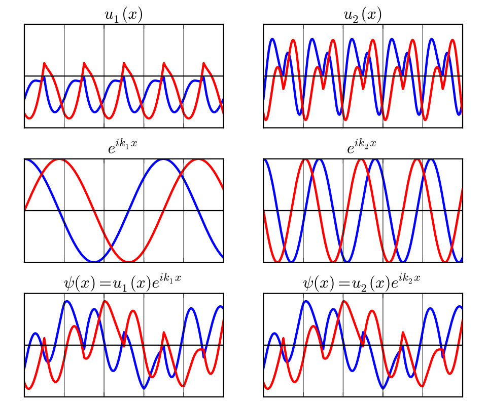
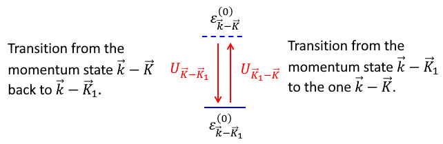

# 固体物理学 Solid State Physics

## Lecture 1: 晶体结构 Structure of Crystals

### 1.1 Lattice 点阵

点阵有三种定义：

- 由**线性无关的基矢集合** (set of linearly independent primitive lattice vectors) 的整数倍加和构成的**无限点集**；
- 一个无限向量集，其中任意两个向量加和得到的向量仍在集合中；
- 无限点集，任意两点环境相同。

一系列关于向量的定义：

- **格矢** (lattice vector)：任意一个从一个点阵点指向另一点阵点的矢量；
- **基矢** (primitive lattice vectors)：可产生点阵的最少数量格矢集合（线性无关）；
- **最短基矢** (shortest primitive lattice vectors)：基矢集合中矢量长度最短的一个。

---

### 1.2 Unit Cell 晶胞

晶胞是可通过平移堆积完全填满整个空间并表示点阵结构的**空间区域**。

- **素晶胞** (primitive unit cell)：晶胞内仅含一个点阵点；
- **正当晶胞** (conventional unit cell)：满足正当晶胞原则；
- **Wegner-Seitz 原胞** (Wegner-Seitz unit cell)：由垂直平分面/线围成（对于一个点阵点周围的W-S原胞区域是满足到该点阵点距离小于任意一个其他点阵点的所有点构成的轨迹 (locus) ）。

关于晶胞的具体分类已在结构化学晶体讲义中提到。

---

## Lecture 2：晶体的衍射表征 Diffraction by crystals

### 2.1 倒易点阵(resiprocal lattice)

定义：如果一个点阵的格矢是 $\vb R$，那么对于点 $\vb G$，满足：

$$
e^{i\vb G\cdot \vb R} = 1
$$

的所有点G在倒易点阵内。也可以看作是原点阵的傅里叶变换，因为严格有 $\vb G\cdot\vb R = 2n\pi$。

倒易空间实际上是由波矢 $k$ 构建的空间 ，因此数量维度是长度的倒数。

另一种更加直观的定义方法：对于素晶胞的三个基矢 $a_1, a_2, a_3$，倒易点阵的三个基矢 $b_1, b_2, b_3$ 满足：

$$
a_i \cdot b_j = 2\pi \delta_{ij}
$$

例如：对于基矢为 $a$ 的直线点阵，晶格矢量为 $na$ ，这对应倒易空间内基矢为 $2\pi / a$ ；对于简单立方点阵，会得到边长为 $2\pi/a$ 的简单立方倒易点阵。

六方点阵的倒易点阵也是六方点阵，可以得到其晶胞参数 $|b_1| = 4\pi / \sqrt 3 a$：

对于三维情况，根据定义有直观公式：

$$
\begin{cases}
b_1 = \frac{2\pi a_2\times a_3}{V}\\
b_2 = \frac{2\pi a_3\times a_1}{V}\\
b_3 = \frac{2\pi a_1\times a_2}{V}
\end{cases}
\qc V = a_1 \cdot(a_2\times a_3)
$$

体心立方和面心立方倒易点阵互换，也就是体心立方的倒易点阵是面心立方，面心立方的倒易点阵是体心立方。

> 对于BCC点阵：
>
> 取立方晶胞边长为$a$，分别用原胞基矢表示。
>
> $$
> \mathbf{a}_1 = \frac{a}{2}(\hat{\mathbf{x}} + \hat{\mathbf{y}} - \hat{\mathbf{z}}),\quad
> \mathbf{a}_2 = \frac{a}{2}(-\hat{\mathbf{x}} + \hat{\mathbf{y}} + \hat{\mathbf{z}}),\quad
> \mathbf{a}_3 = \frac{a}{2}(\hat{\mathbf{x}} - \hat{\mathbf{y}} + \hat{\mathbf{z}})
> $$
>
> 原胞体积$V_{\text{BCC}} = \mathbf{a}_1 \cdot (\mathbf{a}_2 \times \mathbf{a}_3) = a^3/2$。
>
> 利用$\mathbf{b}_i = 2\pi \frac{\mathbf{a}_j \times \mathbf{a}_k}{V_{\text{BCC}}}$，得：
>
> $$
> \mathbf{b}_1 = \frac{2\pi}{a}(\hat{\mathbf{x}} + \hat{\mathbf{y}}),\quad
> \mathbf{b}_2 = \frac{2\pi}{a}(\hat{\mathbf{y}} + \hat{\mathbf{z}}),\quad
> \mathbf{b}_3 = \frac{2\pi}{a}(\hat{\mathbf{x}} + \hat{\mathbf{z}})
> $$
>
> 这三个矢量正是边长为$4\pi/a$ 的 FCC 原胞基矢（例如，FCC 原胞基矢为$\frac{A}{2}(\hat{\mathbf{y}}+\hat{\mathbf{z}})$ 等，此处$A = 4\pi/a$）。因此 **BCC 的倒易点阵是 FCC**。
>
> 对于FCC点阵：
>
> $$
> \mathbf{a}_1' = \frac{a}{2}(\hat{\mathbf{y}} + \hat{\mathbf{z}}),\quad
> \mathbf{a}_2' = \frac{a}{2}(\hat{\mathbf{x}} + \hat{\mathbf{z}}),\quad
> \mathbf{a}_3' = \frac{a}{2}(\hat{\mathbf{x}} + \hat{\mathbf{y}})
> $$
>
> 原胞体积$V_{\text{FCC}} = a^3/4$。
>
> $$
> \mathbf{b}_1' = \frac{2\pi}{a}(-\hat{\mathbf{x}} + \hat{\mathbf{y}} + \hat{\mathbf{z}}),\quad
> \mathbf{b}_2' = \frac{2\pi}{a}(\hat{\mathbf{x}} - \hat{\mathbf{y}} + \hat{\mathbf{z}}),\quad
> \mathbf{b}_3' = \frac{2\pi}{a}(\hat{\mathbf{x}} + \hat{\mathbf{y}} - \hat{\mathbf{z}})
> $$
>
> 这正是边长为$4\pi/a$ 的 BCC 原胞基矢。因此 **FCC 的倒易点阵是 BCC**。
>

对于菱面体晶胞，它的倒易点阵也是菱面体晶胞，但是形状不同。

> 设菱面体正点阵的基矢为$\mathbf{a},\mathbf{b},\mathbf{c}$，满足
>
> $$
> |\mathbf{a}| = |\mathbf{b}| = |\mathbf{c}| = a, \quad \mathbf{a}\cdot\mathbf{b} = \mathbf{b}\cdot\mathbf{c} = \mathbf{c}\cdot\mathbf{a} = a^2\cos\alpha
> $$
>
> 其中$\alpha$ 为基矢间的夹角。晶胞体积为
>
> $$
> V = \mathbf{a}\cdot(\mathbf{b}\times\mathbf{c}) = a^3\sqrt{1-3\cos^2\alpha+2\cos^3\alpha} = a^3(1-\cos\alpha)\sqrt{1+2\cos\alpha}.
> $$
>
> 倒易点阵基矢定义为
>
> $$
> \mathbf{a}^*= \frac{\mathbf{b}\times\mathbf{c}}{V},\quad \mathbf{b}^* = \frac{\mathbf{c}\times\mathbf{a}}{V},\quad \mathbf{c}^* = \frac{\mathbf{a}\times\mathbf{b}}{V}
> $$
>
> 计算$|\mathbf{a}^*|$：
>
> $$
> |\mathbf{b}\times\mathbf{c}| = |\mathbf{b}||\mathbf{c}|\sin\alpha = a^2\sin\alpha
> $$
>
> 故
>
> $$
> |\mathbf{a}^*| = \frac{a^2\sin\alpha}{V}
> $$
>
> 同理$|\mathbf{b}^*|_= |\mathbf{c}^*|_= \frac{a^2\sin\alpha}{V}$，所以三个倒易基矢长度相等。
>
> 计算$\mathbf{a}^*$_与$\mathbf{b}^*$ 的点_：
>
> $$
> \mathbf{a}^*\cdot\mathbf{b}^* = \frac{1}{V^2}(\mathbf{b}\times\mathbf{c})\cdot(\mathbf{c}\times\mathbf{a})
> $$
>
> 利用矢量恒等式$(\mathbf{A}\times\mathbf{B})\cdot(\mathbf{C}\times\mathbf{D}) = (\mathbf{A}\cdot\mathbf{C})(\mathbf{B}\cdot\mathbf{D}) - (\mathbf{A}\cdot\mathbf{D})(\mathbf{B}\cdot\mathbf{C})$，取$\mathbf{A}=\mathbf{b},\mathbf{B}=\mathbf{c},\mathbf{C}=\mathbf{c},\mathbf{D}=\mathbf{a}$，得
>
> $$
> \begin{aligned}
> (\mathbf{b}\times\mathbf{c})\cdot(\mathbf{c}\times\mathbf{a}) &= (\mathbf{b}\cdot\mathbf{c})(\mathbf{c}\cdot\mathbf{a}) - (\mathbf{b}\cdot\mathbf{a})(\mathbf{c}\cdot\mathbf{c}) \\&= (a^2\cos\alpha)^2 - (a^2\cos\alpha)(a^2) \\&= a^4\cos\alpha(\cos\alpha-1)
> \end{aligned}
> $$
>
> 因此
>
> $$
> \mathbf{a}^*\cdot\mathbf{b}^* = \frac{a^4}{V^2}\cos\alpha(\cos\alpha-1)
> $$
>
> 而$|\mathbf{a}^*|^2 = \frac{a^4\sin^2\alpha}{V^2}$，故 $\mathbf{a}^*$ 与 $\mathbf{b}^*$ 的夹角$\alpha^*$ 满足：
>
> $$
> \begin{aligned}
> \cos\alpha^* &= \frac{\mathbf{a}^*\cdot\mathbf{b}^*}{|\mathbf{a}^*||\mathbf{b}^*|} = \frac{\cos\alpha(\cos\alpha-1)}{\sin^2\alpha} \\
> &= \frac{\cos\alpha(\cos\alpha-1)}{1-\cos^2\alpha} \\&= \frac{\cos\alpha(\cos\alpha-1)}{(1-\cos\alpha)(1+\cos\alpha)} \\&= -\frac{\cos\alpha}{1+\cos\alpha}
> \end{aligned}
> $$
>
> 同理可得$\mathbf{b}^*$与$\mathbf{c}^*$、$\mathbf{c}^*$ 与 $\mathbf{a}^*$ 的夹角均为 $\alpha^*$，故倒易点阵的基矢两两夹角也相等。
>

在倒易点阵内定义的一个晶胞被称为布里渊区（Brillouin zone）。按照通常点阵方法画出的Wigner-Zeise晶胞被称为第一布里渊区（first Brillouin zone）。

---

### 2.2 晶面(lattice plane)和晶向(lattice direction)

参考晶体讲义。

对于六方晶胞，有时也采取四轴定向的方法。

---

### 2.3 衍射 (Diffraction)定律

在结构化学里，我们已经知道Bragg衍射定律：

$$
2d\sin\theta = n\lambda
$$

不幸的是，这只给出了类似“反射”的单角度衍射。对于晶体来说，在其他方向上也可能存在衍射峰，我们假设入射光的波矢是 $\vb k$，出射光的波矢是 $\vb k'$，这两个波矢方向不同的大小相等（弹性散射不改变能量）。

我们从Fermi黄金法则出发：

$$
\Gamma(k',k) = \frac{2\pi}{\hbar}\abs{\mel{k'}{V}{k}}^2\delta(E_{k'} - E_k)
$$

代入平面波函数的表达式：

$$
\psi_k(r) = \frac{1}{\sqrt{L^3}}e^{ikr}
$$

于是内部矩阵元变为：

$$
\mel{k'}{V}{k} = \frac{1}{L^3}\int\dd r V(r) e^{-i(k'-k)r}
$$

这也就是势能函数的傅里叶变换。

由于平移对称性，我们假设一个晶胞内部的坐标是 $\vb x$，格矢为 $\vb R$，即可以设 $\vb r = \vb R+\vb x$ 。由于环境完全相同，这两个点的势能完全相同，也就是 $V(\vb x)=V(\vb x+\vb R)$。我们带入到原式，把它转化成一个晶胞内的积分：

$$
\begin{aligned}
\mel{k'}{V}{k} &= \frac{1}{L^3}\int\dd r V(r) e^{-i(k'-k)r} \\
&= \frac{1}{L^3}\sum_{\vb R}\int_{cell}\dd x\ e^{-i(k'-k)(\vb x + \vb R)}V(\vb x + \vb R) \\
&= \frac{1}{L^3}\pqty{\sum_{\vb R}e^{-i(k'-k)\vb R}}\pqty{\int_{cell}\dd x\ e^{-i(k'-k)\vb x}V(\vb x)} \\
\end{aligned}
$$

注意看第一项括号 $\pqty{\sum_{\vb R}e^{-i(k'-k)\vb R}}$。由于Poisson求和，有：

$$
\sum_{\vb R}e^{-i(k'-k)\vb R} \propto \sum_{\vb G}\delta(k'-k-G)
$$

这意味着只有当 $k' - k = G$ 时，原式才不为0. 这被称为**Laun方程**（Laun condition）。这同时也告诉我们在晶体内散射动量不守恒，也就是 $k' = k + G$，这被称为**晶体动量守恒**。

回到Bragg方程。考虑一束光从 $\hat x$ 方向射入：

这个时候晶胞的倒易点阵：

$$
\vb G = 2\pi n \hat x /d
$$

从纯几何的考虑，我们知道向量点乘：

$$
\vb G \cdot \vb k = \vb G \cdot \vb k' = |\vb G||\vb k|\sin \theta
$$

于是我们有：

$$
\begin{aligned}
|\vb G|^2 &= \vb G \cdot \vb G = \vb G \cdot (\vb k - \vb k')\\
&= \vb G \cdot \vb k - \vb G \cdot \vb k'\\
&= 2|\vb G||\vb k|\sin \theta
\end{aligned}
$$

这也就是说：

$$
\frac{2\pi n}{d} = 2\frac{2\pi}{\lambda}\sin\theta
$$

化简之后就能得到 Bragg 方程。

---

### 2.4 结构因子 (Structure factor)

我们来看第二项括号 $\pqty{\int_{cell}\dd x\ e^{-i(k'-k)\vb x}V(\vb x)}$ 。在固体物理里，我们一般用**结构因子** (Structure Factor) 称呼它：

$$
S(\vb G) = \int_{cell}\dd{\vb x}\ e^{-i\vb G \cdot \vb x}V(\vb x)
$$

我们考虑把势能分解成晶胞内各个原子的函数：

$$
V(\vb x) = \sum_{\text{all j in cell}} f_jg(\vb x - \vb x_j)
$$

进一步化简得到：

$$
\begin{aligned}
S(\vb G) &= \int_{cell}\dd {\vb x}\ \pqty{\sum_{\text{all j in cell}} f_jg(\vb x - \vb x_j)}e^{-i\vb G \cdot \vb x} \\
&= \sum_{\text{all j in cell}} \pqty{\int_{cell}\dd{\vb x}  f_jg(\vb x - \vb x_j) e^{-i\vb G \cdot \vb x}}\\
&= \sum_{\text{all j in cell}} \pqty{\int_{cell}\dd{(\vb x - \vb x_j)}  f_jg(\vb x - \vb x_j) e^{-i\vb G \cdot \vb (\vb x - \vb x_j)}}e^{i\vb G \cdot \vb x_j} \\
&= \sum_{\text{all j in cell}} f_j(\vb G) e^{i\vb G \cdot \vb x_j}
\end{aligned}
$$

这也就是说，假设我们知道晶胞内原子的分数坐标 $(n_j , m_j, p_j)$，我们就可以得到：

$$
\begin{aligned}
S(\vb G) &= \sum_{\text{all j in cell}} f_j(\vb G) e^{i\vb G \cdot \vb x_j} \\
&= \sum_{\text{all j in cell}} f_j(\vb G) e^{i(h\vb b_1 + k \vb b_2 + l \vb b_3) \cdot (n_j \vb a_1 + m_j \vb a_2 + p_j \vb a_3)} \\
&= \sum_{\text{all j in cell}} f_j(\vb G) e^{2\pi i(hn_j + km_j + lp_j)}
\end{aligned}
$$

这就是结构因子的最终表达式。将晶胞内各原子的 $f_j(\vb G) e^{2\pi i(hn_j + km_j + lp_j)}$ 加起来，得到的结构因子回合衍射强度成正比：

$$
\Gamma(k',k) \propto S(\vb G)
$$

> 求 $\ce{CsCl}$ 晶体的结构因子。原子坐标：Cs: (0, 0, 0) ; Cl: (1/2, 1/2, 1/2)。
>
> 
>
> 直接代入各原子坐标：
>
> $$
> \begin{aligned}
> S(\vb G) &= f_{\ce{Cs}} + f_{\ce{Cl}} e^{2\pi i(h/2 + k/2 + l/2)}\\
> &=  f_{\ce{Cs}} + f_{\ce{Cl}} e^{\pi i(h + k + l)}
> \end{aligned}
> $$
>
> 这意味着当 $(h+k+l)$ 为偶数时，$S(\vb G) = f_{\ce{Cs}} + f_{\ce{Cl}}$，得到一个强衍射峰；而当 $(h+k+l)$ 为奇数时，$S(\vb G) = f_{\ce{Cs}} - f_{\ce{Cl}}$，得到一个较弱的衍射峰。特别的，如果对于一个晶体体心和顶点原子相同，就有 $S(\vb G) = 0$，对应没有衍射峰。这种现象也被叫做**系统消光**（systematic extinction）。

对体心立方而言，只有满足 $(h+k+l)$ 为整数时才能通过；对面心立方而言，只有满足 $h,k,l$ 三者均为奇数或均为偶数时才能通过。

---

### 2.5 Ewald 球 (Ewald's sphere)

前面我们知道，入射和出射波矢的矢量差就对应倒易点阵里的一个格矢，并且由于弹性散射，它们的模相同。假设我们有一个端点在倒易点阵点上的入射波矢 $\vb k_0$ ，入射方向固定，画一个球：

在这个球面上还存在另一个球心到球面且正好在倒易点阵点上的矢量 $\vb k_1$，这里就能满足 $\vb k_1 - \vb k_0 = \vb G$ 且模相同了。这个时候就能在 $\vb k_1$ 的位置观测到一个衍射峰。

如何获得多组数据呢？

- **Laue 法**：固定晶体位置和入射光方向，改变入射光能量（也就是 $|\vb k_0|$），这个时候对应 Ewald 球的半径不断增大，就能找到不同半径对应的出射向量。

  

- **旋转晶体法**：固定入射光方向和波长，旋转单晶，对应倒易点阵发生旋转（相对来看，也就是Ewald球发生旋转）。这就能得到不同角度对应的衍射峰。

  

- **粉末法**：直接用晶体粉末进行衍射，这样就相当于有很多各个方向的微小单晶同时进行衍射了。

  

---

## Lecture 3：点阵的对称性与群 Symmetry of Lattice

### 3.1 对称操作(Symmetry transformation)

具体已在结构化学中提及，包括：

- 平移（Translation）；
- 旋转（Rotation）；
- 反映（Reflection）；
- 反演（Inversion）；
- 滑移反映（Glide Reflection）和 反映旋转（Improper Rotation）。

---

### 群 (Group)

> 对于一个集合 $G$ 和一个运算 $*$ （称为**群乘积**(group multiplication)），满足：
>
> - 任意两个集合中的元素 $a,b$，满足 $(a*b) \in G$
> - 结合律（Associative）：$(a*b)*c = a*(b*c)$
>
> - 单位元素（Identity）：$\exist\ e \in G, \ a*e = a$
> - 逆元素（Inversion）：$\exist\ a^{-1} \in G, \ a*a^{-1} = e$
>
> 这样 $G(*)$ 就被称为一个**群**（Group）。集合中元素的数量被称为群的**势**（cardinalty）。

---

（接下来基本都是对称性相关的简单内容，略过。）

---

## Lecture 4：能带理论

### 4.1 Bloch 理论

> **Bloch 定理**：对于一个周期性的势能 $U(\vb r) = U(\vb r,\vb R)$ ，其本征态波函数满足：
>
> $$
> \psi(\vb r) = u(\vb r)e^{i\vb k\cdot\vb r}\qc u(\vb r) = u(\vb r + \vb R)
> $$
>
> 

由于势能是周期性的，所以我们可以写成：

$$
U(\vb r) = \sum_{\vb K}U_{\vb K}e^{i\vb K\cdot\vb r}
$$

对应Fourier变换得到系数：

$$
\begin{aligned}
U_{\vb K} &= \frac{1}{v}\int_{cell}\dd[3]{\vb r} U(\vb r)e^{-i\vb K\cdot\vb r}\\
&= \frac{N}{V}\int_{cell}\dd[3]{\vb r} U(\vb r)e^{-i\vb K\cdot\vb r}\\
&= \frac{1}{V}\int_{whole}\dd[3]{\vb r} U(\vb r)e^{-i\vb K\cdot\vb r}
\end{aligned}
$$

这里 $\vb K$ 是倒易点阵格矢，$V$ 是全空间体积，$N$ 是晶胞数量，$v$ 是晶胞。

- 我们知道 $U_{0} = \frac{1}{v}\int_{cell}\dd[3]{\vb r} U(\vb r)$，表示的是势能的平均值。通常位力方便设 $U_0 = 0$；
- 如果势能是实数，那么有 $U_{\vb K} = U^*_{-\vb K}$；
- 如果势能是偶对称的（$U(\vb r) = U(-\vb r)$），那么有 $U_{\vb K} = U_{-\vb K}$.

我们设波函数是若干个平面波的叠加，也就是：

$$
\psi_\epsilon(\vb r) = \sum_{\vb q} C_{\vb q}e^{i\vb q \cdot \vb r}
$$

然后开始解Schrodinger方程：

$$
\begin{aligned}
\qty[\frac{p^2}{2m} + U(\vb r)]\psi(\vb r) &= \sum_{\vb q}\qty[\frac{p^2}{2m} + \sum_{\vb K}U_{\vb K}e^{i\vb K\cdot\vb r}]C_{\vb q}e^{i\vb q \cdot \vb r}\\
&= \sum_{\vb q}\frac{\hbar^2q^2}{2m}C_{\vb q}e^{i\vb q \cdot \vb r} + \sum_{\vb q}\sum_{\vb K}U_{\vb K}C_{\vb q}e^{i(\vb q + \vb K)\cdot\vb r}\\
&= \sum_{\vb q}\frac{\hbar^2q^2}{2m}C_{\vb q}e^{i\vb q \cdot \vb r} + \sum_{\vb q'}\sum_{\vb K}U_{\vb K}C_{\vb q' -\vb K}e^{i\vb q'\cdot\vb r}\\
&= \sum_{\vb q}\qty[\frac{\hbar^2q^2}{2m}C_{\vb q} + \sum_{\vb K'}U_{\vb K'}C_{\vb q -\vb K'}]e^{i\vb q\cdot\vb r}\\
&= \epsilon \psi(\vb r) = \epsilon \sum_{\vb q} C_{\vb q}e^{i\vb q \cdot \vb r}
\end{aligned}
$$

最后得到：

$$
\sum_{\vb q}\qty[(\frac{\hbar^2q^2}{2m}-\epsilon)C_{\vb q} + \sum_{\vb K'}U_{\vb K'}C_{\vb q -\vb K'}]e^{i\vb q\cdot\vb r} = 0
$$

由于平面波 $e^{i\vb q\cdot \vb r}$ 的正交性，必须对于每个 $q$ 都有系数为0. 于是就有：

$$
\boxed{(\frac{\hbar^2q^2}{2m}-\epsilon)C_{\vb q} + \sum_{\vb K'}U_{\vb K'}C_{\vb q -\vb K'} = 0}
$$

这被称为**中心方程**（central equation）。

我们不妨写成矩阵的形式，观察可以发现 $(\vb q - \vb K')$ 全是与 $\vb q$ 相差一个倒易格矢的值，我们认为它是非对角项；而动能项则是对角项。这于是可以转化成矩阵相乘：

$$
\mqty(T&V&\cdots&V\\V&T&\cdots&V\\\vdots&\vdots&\ddots&\vdots\\V&V&\cdots&T)\mqty(\vdots\\C_{\vb q}\\C_{\vb q-\vb K'}\\\vdots) = 0
$$

我们接下来设 $\vb q = (\vb k - \vb K)$，这个方程就转变为（注意能量和 $\vb k$ 有关）：

$$
\begin{gathered}
(\frac{\hbar^2(\vb k - \vb K)^2}{2m}-\epsilon_{\vb k})C_{\vb k - \vb K} + \sum_{\vb K'}U_{\vb K'}C_{\vb (\vb k - \vb K) -\vb K'} = 0\\
(\frac{\hbar^2(\vb k - \vb K)^2}{2m}-\epsilon_{\vb k})C_{\vb k - \vb K} + \sum_{\vb K'}U_{\vb K'- \vb K}C_{\vb k  -\vb K'} = 0
\end{gathered}
$$

这样矩阵就转变成：

$$
\mqty(T&V&\cdots&V\\V&T&\cdots&V\\\vdots&\vdots&\ddots&\vdots\\V&V&\cdots&T)\mqty(\vdots\\C_{\vb k - \vb K}\\C_{\vb k-\vb K'}\\\vdots) = 0
$$

原波函数就是：

$$
\begin{aligned}
\psi_{\epsilon_{\vb k}}(\vb r) &= \sum_{\vb K} C_{(\vb k - \vb K)}e^{i(\vb k - \vb K) \cdot \vb r} \\
&= e^{i\vb k \cdot \vb r}\sum_{\vb K} C_{(\vb k - \vb K)}e^{-i\vb K \cdot \vb r}\\
&= e^{i\vb k \cdot \vb r} u_{\epsilon_{\vb k}}(\vb r)
\end{aligned}
$$

验证 $u_\epsilon(\vb r)$ 的周期性：

$$
u_{\epsilon_{\vb k}}(\vb r + \vb R) = \sum_{\vb K} C_{(\vb k - \vb K)}e^{-i\vb K \cdot (\vb r+\vb R)} = \sum_{\vb K} C_{(\vb k - \vb K)}e^{-i\vb K \cdot \vb r} = u_{\epsilon_{\vb k}}(\vb r)
$$

---

- 这里的 Bloch 动量 $\vb k$ 是一个 Quasi 动量，因为它是在离散的空间内被定义的。尝试用动量算符：

  $$
  \vu p \psi_{\epsilon_{\vb k}}(\vb r) = \hbar \vb k \psi_{\epsilon_{\vb k}}(\vb r) +e^{i\vb k \cdot \vb r} \vu pu_{\epsilon_{\vb k}}(\vb r) \neq \hbar \vb k \psi_{\epsilon_{\vb k}}(\vb r)
  $$

  可以看出这和传统的动量不同。
  
- 在实际问题里，我们常常假设晶体是无限的，这被称为 Born-von Karman 边界条件。我们假设 $N_i$ 为可以向 $\vb a_i$ 方向平移的总次数：

  $$
  \psi_{\epsilon_{\vb k}}(\vb r) = \psi_{\epsilon_{\vb k}}(\vb r + N_i\vb a_i)
  $$

  这说明：

  $$
  e^{i\vb k \cdot (\vb r + N_i\vb a_i)} u_{\epsilon_{\vb k}}(\vb r + N_i\vb a_i) = e^{i\vb k \cdot (\vb r + N_i\vb a_i)} u_{\epsilon_{\vb k}}(\vb r ) = e^{i\vb k \cdot \vb r } u_{\epsilon_{\vb k}}(\vb r )
  $$

  这必须满足：

  $$
  N_i \vb k_i\cdot\vb a_i = 2m_i\pi\qc m_i = 0,1,\cdots,N_i-1\qc
  $$
  
  于是有：
  
  $$
  \vb k = \sum_{i=1}^3 \frac{m_i}{N_i}\vb b_i
  $$
  这限制了 $\va k$ 的取值。
  
- 由于Hilbert空间内的平面波是无限的，Bloch态数也是无限的。但是每个Bloch能带都只有有限种（$N = N_1N_2N_3$ 种，对应三个方向的平移，也正好是晶胞数）状态。我们用 $n$ 表示序数，这样就有：

  $$
  \psi_{\epsilon_{n \vb k}}(\vb r) = e^{-i\vb k \cdot \vb r} u_{\epsilon_{n\vb k}}(\vb r)
  $$

  对应到中心方程：

  $$
  \qty[\frac{(p+\hbar k)^2}{2m} + U(r)]u_{\epsilon_{n\vb k}}(\vb r) = \epsilon_{n\vb k}u_{\epsilon_{n\vb k}}(\vb r)
  $$

---

### 2.2 弱周期势

回到这个方程：

$$
(\frac{\hbar^2(\vb k - \vb K)^2}{2m}-\epsilon_{\vb k})C_{\vb k - \vb K} + \sum_{\vb K'}U_{\vb K'- \vb K}C_{\vb k  -\vb K'} = 0
$$

我们假设：

$$
|U_{\va K}| \ll \frac{h^2k^2}{2m}
$$

也就是周期势很弱，可以当成微扰。

考虑零阶近似，也就是势能为0，我们有：

$$
\epsilon_{k-K}^{(0)} =\frac{\hbar^2(\vb k - \vb K)^2}{2m}
$$

这对应自由电子的动能（$q=k-K$），是一条抛物线。

回到central equation，我们可以写成更简洁的形式：

$$
(\epsilon_{\vb k}-\epsilon_{k-K}^{(0)})C_{\vb (\vb k - \vb K)} = \sum_{\vb K'}U_{\vb K'- \vb K}C_{\vb k  -\vb K'}
$$

现在假设我们只研究其中的一个 $\vb K_1$，令其对应的 $C_{\va k - \va K_1} \sim 1$，而其他的 $C_{\va k - \va K} \ll 1$， 对其进行微扰，把它分离出来就是：

$$
(\epsilon_{\vb k}-\epsilon_{k-K_1}^{(0)})C_{\vb (\vb k - \vb K_1)} = \sum_{\vb K}U_{\vb K- \vb K_1}C_{\vb k  -\vb K}
$$

上面两个方程就可以解出。

- **非简并的情况** 假设能隙 $|\epsilon_{k-K}^{(0)} - \epsilon_{k-K_1}^{(0)}|\gg|U|$ 。把 $\vb K_1$ 分离：

  $$
  \begin{gathered}
  (\epsilon_{\vb k}-\epsilon_{k-K}^{(0)})C_{\vb (\vb k - \vb K)} = U_{\vb K_1- \vb K}C_{\vb k  -\vb K_1}+\sum_{\vb K'\neq\vb K_1}U_{\vb K'- \vb K}C_{\vb k  -\vb K'}\\
  C_{\vb (\vb k - \vb K)} = \frac{U_{\vb K_1- \vb K}C_{\vb k  -\vb K_1}}{\epsilon_{\vb k}-\epsilon_{k-K}^{(0)}}+\sum_{\vb K'\neq\vb K_1}\frac{U_{\vb K'- \vb K}C_{\vb k  -\vb K'}}{\epsilon_{\vb k}-\epsilon_{k-K}^{(0)}}
  \end{gathered}
  $$

  我们忽略后面的其他项，只关注选中的：

  $$
  C_{\vb (\vb k - \vb K)} = \frac{U_{\vb K_1- \vb K}C_{\vb k  -\vb K_1}}{\epsilon_{\vb k}-\epsilon_{k-K}^{(0)}}
  $$

  回代SE得到：

  $$
  \begin{gathered}
  (\epsilon_{\vb k}-\epsilon_{k-K_1}^{(0)})C_{\vb (\vb k - \vb K_1)} = \sum_{\vb K}U_{\vb K- \vb K_1}\frac{U_{\vb K_1- \vb K}C_{\vb k  -\vb K_1}}{\epsilon_{\vb k}-\epsilon_{k-K}^{(0)}}\\
  \epsilon_{\vb k}-\epsilon_{k-K_1}^{(0)} = \sum_{\vb K}U_{\vb K- \vb K_1}\frac{U_{\vb K_1- \vb K}}{\epsilon_{\vb k}-\epsilon_{k-K}^{(0)}}\\
  \epsilon_{\vb k}=\epsilon_{k-K_1}^{(0)} + \sum_{\vb K}U_{\vb K- \vb K_1}\frac{U_{\vb K_1- \vb K}}{\epsilon_{\vb k}-\epsilon_{k-K}^{(0)}}
  \end{gathered}
  $$

  由于修正很小，我们认为 $\epsilon_k \approx \epsilon_{k-K_1}^{(0)}$，最后得到：

  $$
  \epsilon_{\vb k}=\epsilon_{k-K_1}^{(0)} + \sum_{\vb K}\frac{U_{\vb K- \vb K_1}U_{\vb K_1- \vb K}}{\epsilon_{k-K_1}^{(0)}-\epsilon_{k-K}^{(0)}}
  $$

  其中后一项可以视为**二阶微扰**。这可以视为从 $\epsilon_{k-K_1}^{(0)}$ 变到 $\epsilon_{k-K}^{(0)}$ 再回来的一个虚拟过程。

  

  此处一阶微扰 $\ev{U}{n} = U_0$，对应能量零点为0.

- **简并的情况** 假设有若干个靠得很近的能级 $\epsilon_{k-K_i}^{(0)},i=1,2,\cdots,m$：我们在处理 $\va K_i$ 时把临近的简并能级都提出来：              
$$
  \begin{gathered}
  (\epsilon_{\vb k}-\epsilon_{k-K_i}^{(0)})C_{\vb (\vb k - \vb K)} = \sum_{j=1}^mU_{\vb K_j- \vb K_i}C_{\vb k  -\vb K_j}+\sum_{\vb K'\neq\vb K_{1,\dots,m}}U_{\vb K'- \vb K_i}C_{\vb k  -\vb K'}\\
  C_{\vb (\vb k - \vb K_i)} = \frac{1}{\epsilon_{\vb k}-\epsilon_{k-K_i}^{(0)}}(\sum_{j=1}^mU_{\vb K_j- \vb K_i}C_{\vb k  -\vb K_j}+\sum_{\vb K'\neq\vb K_{1,\dots,m}}U_{\vb K'- \vb K_i}C_{\vb k  -\vb K'})
  \end{gathered}
  $$
  
忽略掉除了简并subspace的项：
  
$$
  C_{\vb (\vb k - \vb K_i)} = \frac{1}{\epsilon_{\vb k}-\epsilon_{k-K_i}^{(0)}}\sum_{j=1}^mU_{\vb K_j- \vb K_i}C_{\vb k  -\vb K_j}
  $$
  
回代得到：
  
$$
  (\epsilon_{\va k} - \epsilon^{(0)}_{\va k -\va K_i})C_{\va k - \va K_i} =\sum_{j=1}^mU_{\vb K_j- \vb K_i}C_{\vb k  -\vb K_j} + \sum_{j=1}^m\qty(\sum_{\va K \neq \va K,\cdots,\va K_m} \frac{}{\epsilon_{\va k} - \epsilon^{(0)}_{\va k -\va K}})C_{\va k - \va K_j} + \order{U^3}
  $$
  
其中前一项代表临近能级的耦合，后一项代表可能跃迁回到简并能级的虚跃迁。

---

### 2.3 带隙 Bandgap

---

## 3. 半经典 输运 Semi-Classical Transport

