# 固体物理学 Solid State Physics

## Lecture 1: 晶体结构 Structure of Crystals

### 1.1 Lattice 点阵

点阵有三种定义：

- 由 **线性无关的基矢集合** (set of linearly independent primitive lattice vectors) 的整数倍加和构成的 **无限点集**；
- 一个无限向量集，其中任意两个向量加和得到的向量仍在集合中；
- 无限点集，任意两点环境相同。

一系列关于向量的定义：

- **格矢** (lattice vector)：任意一个从一个点阵点指向另一点阵点的矢量；
- **基矢** (primitive lattice vectors)：可产生点阵的最少数量格矢集合（线性无关）；
- **最短基矢** (shortest primitive lattice vectors)：基矢集合中矢量长度最短的一个。

---

### 1.2 Unit Cell 晶胞

晶胞是可通过平移堆积完全填满整个空间并表示点阵结构的 **空间区域**。

- **素晶胞** (primitive unit cell)：晶胞内仅含一个点阵点；
- **正当晶胞** (conventional unit cell)：满足正当晶胞原则；
- **Wegner-Seitz 原胞** (Wegner-Seitz unit cell)：由垂直平分面/线围成（对于一个点阵点周围的 W-S 原胞区域是满足到该点阵点距离小于任意一个其他点阵点的所有点构成的轨迹 (locus) ）。

关于晶胞的具体分类已在结构化学晶体讲义中提到。

---

## Lecture 2：晶体的衍射表征 Diffraction by crystals

### 2.1 倒易点阵 (reciprocal lattice)

定义：如果一个点阵的格矢是 $\vb R$，那么对于点 $\vb G$，满足：

$$
e^{i\vb G\cdot \vb R} = 1
$$

的所有点 G 在倒易点阵内。也可以看作是原点阵的傅里叶变换，因为严格有 $\vb G\cdot\vb R = 2n\pi$。

倒易空间实际上是由波矢 $k$ 构建的空间 ，因此数量维度是长度的倒数。

另一种更加直观的定义方法：对于素晶胞的三个基矢 $a_1, a_2, a_3$，倒易点阵的三个基矢 $b_1, b_2, b_3$ 满足：

$$
a_i \cdot b_j = 2\pi \delta_{ij}
$$

例如：对于基矢为 $a$ 的直线点阵，晶格矢量为 $na$ ，这对应倒易空间内基矢为 $2\pi / a$ ；对于简单立方点阵，会得到边长为 $2\pi/a$ 的简单立方倒易点阵。

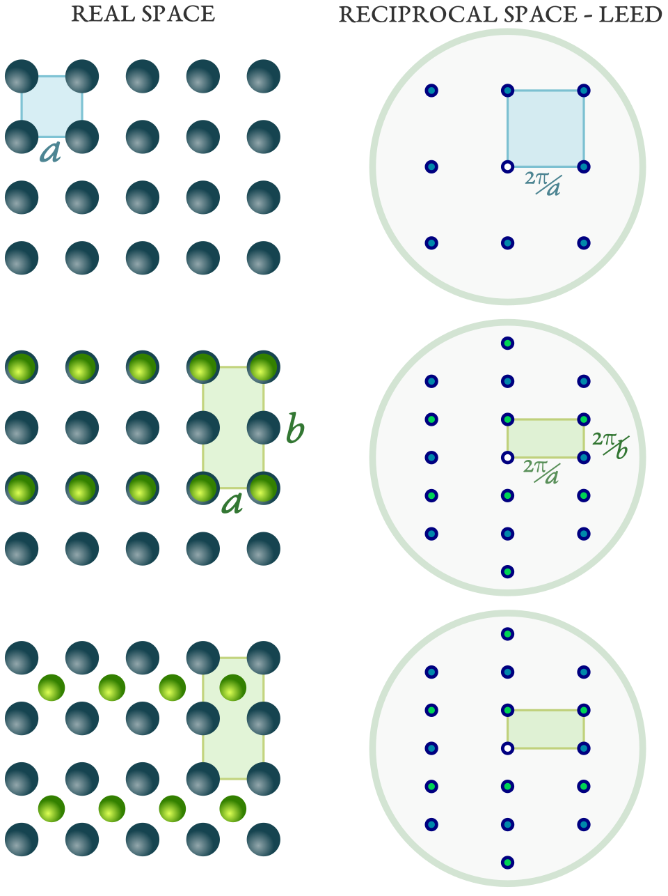

六方点阵的倒易点阵也是六方点阵，可以得到其晶胞参数 $|b_1| = 4\pi / \sqrt 3 a$：

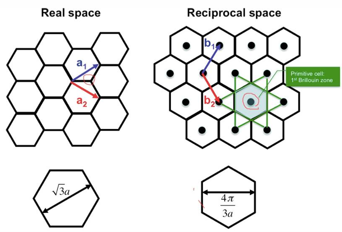

对于三维情况，根据定义有直观公式：

$$
\begin{cases}
b_1 = \frac{2\pi a_2\times a_3}{V}\\
b_2 = \frac{2\pi a_3\times a_1}{V}\\
b_3 = \frac{2\pi a_1\times a_2}{V}
\end{cases}
\qc V = a_1 \cdot(a_2\times a_3)
$$

体心立方和面心立方倒易点阵互换，也就是体心立方的倒易点阵是面心立方，面心立方的倒易点阵是体心立方。

> 对于 BCC 点阵：
>
> 取立方晶胞边长为 $a$，分别用原胞基矢表示。
>
> $$
> \mathbf{a}_1 = \frac{a}{2}(\hat{\mathbf{x}} + \hat{\mathbf{y}} - \hat{\mathbf{z}}),\quad
> \mathbf{a}_2 = \frac{a}{2}(-\hat{\mathbf{x}} + \hat{\mathbf{y}} + \hat{\mathbf{z}}),\quad
> \mathbf{a}_3 = \frac{a}{2}(\hat{\mathbf{x}} - \hat{\mathbf{y}} + \hat{\mathbf{z}})
> $$
>
> 原胞体积 $V_{\text{BCC}} = \mathbf{a}_1 \cdot (\mathbf{a}_2 \times \mathbf{a}_3) = a^3/2$。
>
> 利用 $\mathbf{b}_i = 2\pi \frac{\mathbf{a}_j \times \mathbf{a}_k}{V_{\text{BCC}}}$，得：
>
> $$
> \mathbf{b}_1 = \frac{2\pi}{a}(\hat{\mathbf{x}} + \hat{\mathbf{y}}),\quad
> \mathbf{b}_2 = \frac{2\pi}{a}(\hat{\mathbf{y}} + \hat{\mathbf{z}}),\quad
> \mathbf{b}_3 = \frac{2\pi}{a}(\hat{\mathbf{x}} + \hat{\mathbf{z}})
> $$
>
> 这三个矢量正是边长为 $4\pi/a$ 的 FCC 原胞基矢（例如，FCC 原胞基矢为 $\frac{A}{2}(\hat{\mathbf{y}}+\hat{\mathbf{z}})$ 等，此处 $A = 4\pi/a$）。因此 **BCC 的倒易点阵是 FCC**。
>
> 对于 FCC 点阵：
>
> $$
> \mathbf{a}_1' = \frac{a}{2}(\hat{\mathbf{y}} + \hat{\mathbf{z}}),\quad
> \mathbf{a}_2' = \frac{a}{2}(\hat{\mathbf{x}} + \hat{\mathbf{z}}),\quad
> \mathbf{a}_3' = \frac{a}{2}(\hat{\mathbf{x}} + \hat{\mathbf{y}})
> $$
>
> 原胞体积 $V_{\text{FCC}} = a^3/4$。
>
> $$
> \mathbf{b}_1' = \frac{2\pi}{a}(-\hat{\mathbf{x}} + \hat{\mathbf{y}} + \hat{\mathbf{z}}),\quad
> \mathbf{b}_2' = \frac{2\pi}{a}(\hat{\mathbf{x}} - \hat{\mathbf{y}} + \hat{\mathbf{z}}),\quad
> \mathbf{b}_3' = \frac{2\pi}{a}(\hat{\mathbf{x}} + \hat{\mathbf{y}} - \hat{\mathbf{z}})
> $$
>
> 这正是边长为 $4\pi/a$ 的 BCC 原胞基矢。因此 **FCC 的倒易点阵是 BCC**。

对于菱面体晶胞，它的倒易点阵也是菱面体晶胞，但是形状不同。

> 设菱面体正点阵的基矢为 $\mathbf{a},\mathbf{b},\mathbf{c}$，满足
>
> $$
> |\mathbf{a}| = |\mathbf{b}| = |\mathbf{c}| = a, \quad \mathbf{a}\cdot\mathbf{b} = \mathbf{b}\cdot\mathbf{c} = \mathbf{c}\cdot\mathbf{a} = a^2\cos\alpha
> $$
>
> 其中 $\alpha$ 为基矢间的夹角。晶胞体积为
>
> $$
> V = \mathbf{a}\cdot(\mathbf{b}\times\mathbf{c}) = a^3\sqrt{1-3\cos^2\alpha+2\cos^3\alpha} = a^3(1-\cos\alpha)\sqrt{1+2\cos\alpha}.
> $$
>
> 倒易点阵基矢定义为
>
> $$
> \mathbf{a}^*= \frac{\mathbf{b}\times\mathbf{c}}{V},\quad \mathbf{b}^* = \frac{\mathbf{c}\times\mathbf{a}}{V},\quad \mathbf{c}^* = \frac{\mathbf{a}\times\mathbf{b}}{V}
> $$
>
> 计算 $|\mathbf{a}^*|$：
>
> $$
> |\mathbf{b}\times\mathbf{c}| = |\mathbf{b}||\mathbf{c}|\sin\alpha = a^2\sin\alpha
> $$
>
> 故
>
> $$
> |\mathbf{a}^*| = \frac{a^2\sin\alpha}{V}
> $$
>
> 同理 $|\mathbf{b}^*|_= |\mathbf{c}^*|_= \frac{a^2\sin\alpha}{V}$，所以三个倒易基矢长度相等。
>
> 计算 $\mathbf{a}^*$ _与 $\mathbf{b}^*$ 的点_：
>
> $$
> \mathbf{a}^*\cdot\mathbf{b}^* = \frac{1}{V^2}(\mathbf{b}\times\mathbf{c})\cdot(\mathbf{c}\times\mathbf{a})
> $$
>
> 利用矢量恒等式 $(\mathbf{A}\times\mathbf{B})\cdot(\mathbf{C}\times\mathbf{D}) = (\mathbf{A}\cdot\mathbf{C})(\mathbf{B}\cdot\mathbf{D}) - (\mathbf{A}\cdot\mathbf{D})(\mathbf{B}\cdot\mathbf{C})$，取 $\mathbf{A}=\mathbf{b},\mathbf{B}=\mathbf{c},\mathbf{C}=\mathbf{c},\mathbf{D}=\mathbf{a}$，得
>
> $$
> \begin{aligned}
> (\mathbf{b}\times\mathbf{c})\cdot(\mathbf{c}\times\mathbf{a}) &= (\mathbf{b}\cdot\mathbf{c})(\mathbf{c}\cdot\mathbf{a}) - (\mathbf{b}\cdot\mathbf{a})(\mathbf{c}\cdot\mathbf{c}) \\&= (a^2\cos\alpha)^2 - (a^2\cos\alpha)(a^2) \\&= a^4\cos\alpha(\cos\alpha-1)
> \end{aligned}
> $$
>
> 因此
>
> $$
> \mathbf{a}^*\cdot\mathbf{b}^* = \frac{a^4}{V^2}\cos\alpha(\cos\alpha-1)
> $$
>
> 而 $|\mathbf{a}^*|^2 = \frac{a^4\sin^2\alpha}{V^2}$，故 $\mathbf{a}^*$ 与 $\mathbf{b}^*$ 的夹角 $\alpha^*$ 满足：
>
> $$
> \begin{aligned}
> \cos\alpha^* &= \frac{\mathbf{a}^*\cdot\mathbf{b}^*}{|\mathbf{a}^*||\mathbf{b}^*|} = \frac{\cos\alpha(\cos\alpha-1)}{\sin^2\alpha} \\
> &= \frac{\cos\alpha(\cos\alpha-1)}{1-\cos^2\alpha} \\&= \frac{\cos\alpha(\cos\alpha-1)}{(1-\cos\alpha)(1+\cos\alpha)} \\&= -\frac{\cos\alpha}{1+\cos\alpha}
> \end{aligned}
> $$
>
> 同理可得 $\mathbf{b}^*$ 与 $\mathbf{c}^*$、$\mathbf{c}^*$ 与 $\mathbf{a}^*$ 的夹角均为 $\alpha^*$，故倒易点阵的基矢两两夹角也相等。

在倒易点阵内定义的一个晶胞被称为布里渊区（Brillouin zone）。按照通常点阵方法画出的 Wigner-Zeise 晶胞被称为第一布里渊区（first Brillouin zone）。

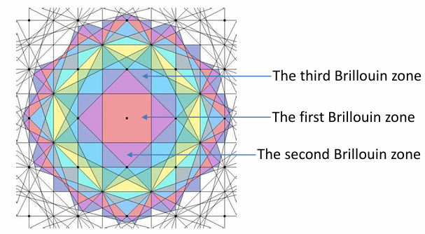

---

### 2.2 晶面 (lattice plane) 和晶向 (lattice direction)

参考晶体讲义。

对于六方晶胞，有时也采取四轴定向的方法。

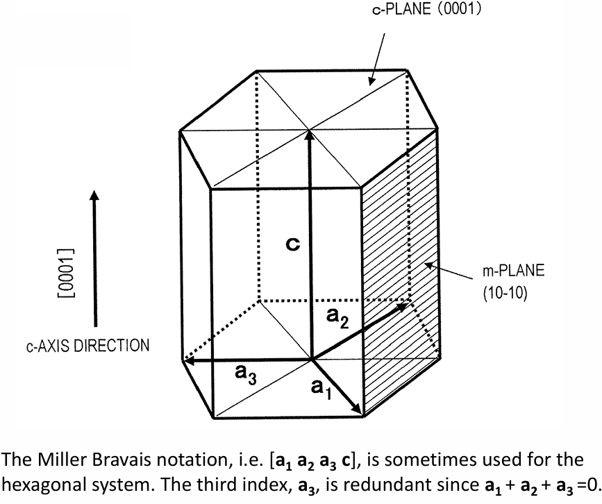

---

### 2.3 衍射 (Diffraction) 定律

在结构化学里，我们已经知道 Bragg 衍射定律：

$$
2d\sin\theta = n\lambda
$$

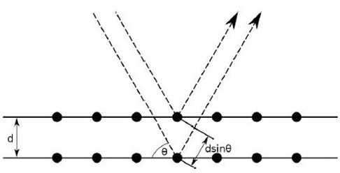

不幸的是，这只给出了类似“反射”的单角度衍射。对于晶体来说，在其他方向上也可能存在衍射峰，我们假设入射光的波矢是 $\vb k$，出射光的波矢是 $\vb k'$，这两个波矢方向不同的大小相等（弹性散射不改变能量）。

我们从 Fermi 黄金法则出发：

$$
\Gamma(k', k) = \frac{2\pi}{\hbar}\abs{\mel{k'}{V}{k}}^2\delta(E_{k'} - E_k)
$$

代入平面波函数的表达式：

$$
\psi_k(r) = \frac{1}{\sqrt{L^3}}e^{ikr}
$$

于是内部矩阵元变为：

$$
\mel{k'}{V}{k} = \frac{1}{L^3}\int\dd r V(r) e^{-i(k'-k)r}
$$

这也就是势能函数的傅里叶变换。

由于平移对称性，我们假设一个晶胞内部的坐标是 $\vb x$，格矢为 $\vb R$，即可以设 $\vb r = \vb R+\vb x$ 。由于环境完全相同，这两个点的势能完全相同，也就是 $V(\vb x)=V(\vb x+\vb R)$。我们带入到原式，把它转化成一个晶胞内的积分：

$$
\begin{aligned}
\mel{k'}{V}{k} &= \frac{1}{L^3}\int\dd r V(r) e^{-i(k'-k)r} \\
&= \frac{1}{L^3}\sum_{\vb R}\int_{cell}\dd x\ e^{-i(k'-k)(\vb x + \vb R)}V(\vb x + \vb R) \\
&= \frac{1}{L^3}\pqty{\sum_{\vb R}e^{-i(k'-k)\vb R}}\pqty{\int_{cell}\dd x\ e^{-i(k'-k)\vb x}V(\vb x)} \\
\end{aligned}
$$

注意看第一项括号 $\pqty{\sum_{\vb R}e^{-i(k'-k)\vb R}}$。由于 Poisson 求和，有：

$$
\sum_{\vb R}e^{-i(k'-k)\vb R} \propto \sum_{\vb G}\delta(k'-k-G)
$$

这意味着只有当 $k' - k = G$ 时，原式才不为 0. 这被称为 **Laun 方程**（Laun condition）。这同时也告诉我们在晶体内散射动量不守恒，也就是 $k' = k + G$，这被称为 **晶体动量守恒**。

回到 Bragg 方程。考虑一束光从 $\hat x$ 方向射入：

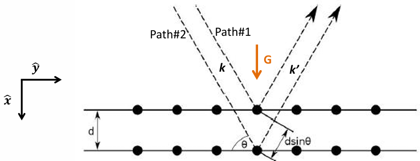

这个时候晶胞的倒易点阵：

$$
\vb G = 2\pi n \hat x /d
$$

从纯几何的考虑，我们知道向量点乘：

$$
\vb G \cdot \vb k = \vb G \cdot \vb k' = |\vb G||\vb k|\sin \theta
$$

于是我们有：

$$
\begin{aligned}
|\vb G|^2 &= \vb G \cdot \vb G = \vb G \cdot (\vb k - \vb k')\\
&= \vb G \cdot \vb k - \vb G \cdot \vb k'\\
&= 2|\vb G||\vb k|\sin \theta
\end{aligned}
$$

这也就是说：

$$
\frac{2\pi n}{d} = 2\frac{2\pi}{\lambda}\sin\theta
$$

化简之后就能得到 Bragg 方程。

---

### 2.4 结构因子 (Structure factor)

我们来看第二项括号 $\pqty{\int_{cell}\dd x\ e^{-i(k'-k)\vb x}V(\vb x)}$ 。在固体物理里，我们一般用 **结构因子** (Structure Factor) 称呼它：

$$
S(\vb G) = \int_{cell}\dd{\vb x}\ e^{-i\vb G \cdot \vb x}V(\vb x)
$$

我们考虑把势能分解成晶胞内各个原子的函数：

$$
V(\vb x) = \sum_{\text{all j in cell}} f_jg(\vb x - \vb x_j)
$$

进一步化简得到：

$$
\begin{aligned}
S(\vb G) &= \int_{cell}\dd {\vb x}\ \pqty{\sum_{\text{all j in cell}} f_jg(\vb x - \vb x_j)}e^{-i\vb G \cdot \vb x} \\
&= \sum_{\text{all j in cell}} \pqty{\int_{cell}\dd{\vb x}  f_jg(\vb x - \vb x_j) e^{-i\vb G \cdot \vb x}}\\
&= \sum_{\text{all j in cell}} \pqty{\int_{cell}\dd{(\vb x - \vb x_j)}  f_jg(\vb x - \vb x_j) e^{-i\vb G \cdot \vb (\vb x - \vb x_j)}}e^{i\vb G \cdot \vb x_j} \\
&= \sum_{\text{all j in cell}} f_j(\vb G) e^{i\vb G \cdot \vb x_j}
\end{aligned}
$$

这也就是说，假设我们知道晶胞内原子的分数坐标 $(n_j , m_j, p_j)$，我们就可以得到：

$$
\begin{aligned}
S(\vb G) &= \sum_{\text{all j in cell}} f_j(\vb G) e^{i\vb G \cdot \vb x_j} \\
&= \sum_{\text{all j in cell}} f_j(\vb G) e^{i(h\vb b_1 + k \vb b_2 + l \vb b_3) \cdot (n_j \vb a_1 + m_j \vb a_2 + p_j \vb a_3)} \\
&= \sum_{\text{all j in cell}} f_j(\vb G) e^{2\pi i(hn_j + km_j + lp_j)}
\end{aligned}
$$

这就是结构因子的最终表达式。将晶胞内各原子的 $f_j(\vb G) e^{2\pi i(hn_j + km_j + lp_j)}$ 加起来，得到的结构因子回合衍射强度成正比：

$$
\Gamma(k', k) \propto S(\vb G)
$$

> 求 $\ce{CsCl}$ 晶体的结构因子。原子坐标：Cs: (0, 0, 0) ; Cl: (1/2, 1/2, 1/2)。
>
> 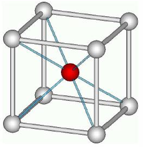
>
> 直接代入各原子坐标：
>
> $$
> \begin{aligned}
> S(\vb G) &= f_{\ce{Cs}} + f_{\ce{Cl}} e^{2\pi i(h/2 + k/2 + l/2)}\\
> &=  f_{\ce{Cs}} + f_{\ce{Cl}} e^{\pi i(h + k + l)}
> \end{aligned}
> $$
>
> 这意味着当 $(h+k+l)$ 为偶数时，$S(\vb G) = f_{\ce{Cs}} + f_{\ce{Cl}}$，得到一个强衍射峰；而当 $(h+k+l)$ 为奇数时，$S(\vb G) = f_{\ce{Cs}} - f_{\ce{Cl}}$，得到一个较弱的衍射峰。特别的，如果对于一个晶体体心和顶点原子相同，就有 $S(\vb G) = 0$，对应没有衍射峰。这种现象也被叫做 **系统消光**（systematic extinction）。

对体心立方而言，只有满足 $(h+k+l)$ 为整数时才能通过；对面心立方而言，只有满足 $h,k,l$ 三者均为奇数或均为偶数时才能通过。

---

### 2.5 Ewald 球 (Ewald's sphere)

前面我们知道，入射和出射波矢的矢量差就对应倒易点阵里的一个格矢，并且由于弹性散射，它们的模相同。假设我们有一个端点在倒易点阵点上的入射波矢 $\vb k_0$ ，入射方向固定，画一个球：

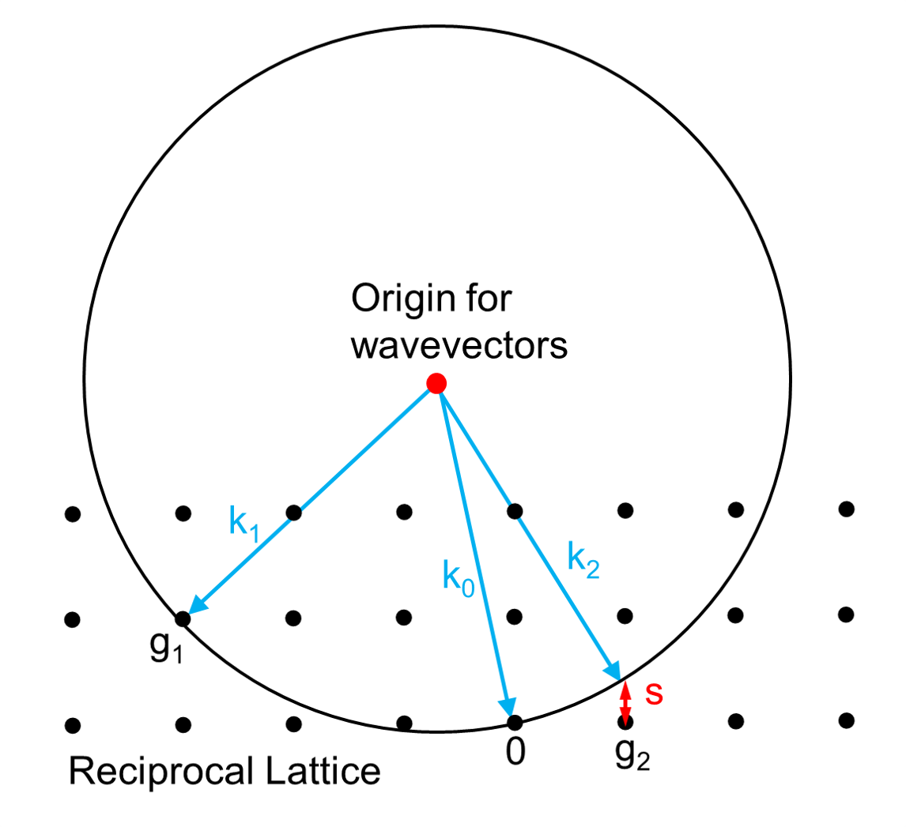

在这个球面上还存在另一个球心到球面且正好在倒易点阵点上的矢量 $\vb k_1$，这里就能满足 $\vb k_1 - \vb k_0 = \vb G$ 且模相同了。这个时候就能在 $\vb k_1$ 的位置观测到一个衍射峰。

如何获得多组数据呢？

- **Laue 法**：固定晶体位置和入射光方向，改变入射光能量（也就是 $|\vb k_0|$），这个时候对应 Ewald 球的半径不断增大，就能找到不同半径对应的出射向量。

  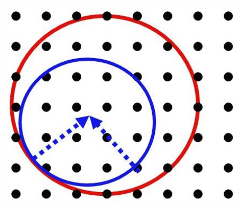

- **旋转晶体法**：固定入射光方向和波长，旋转单晶，对应倒易点阵发生旋转（相对来看，也就是 Ewald 球发生旋转）。这就能得到不同角度对应的衍射峰。

  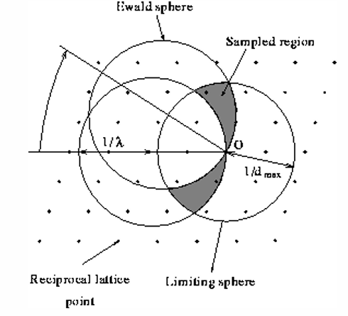

- **粉末法**：直接用晶体粉末进行衍射，这样就相当于有很多各个方向的微小单晶同时进行衍射了。

  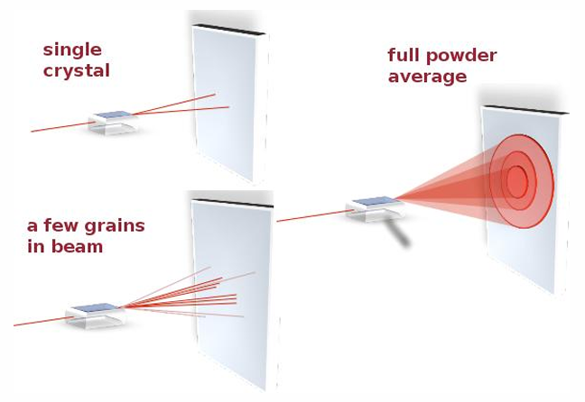

---

## Lecture 3：点阵的对称性与群 Symmetry of Lattice

### 3.1 对称操作 (Symmetry transformation)

具体已在结构化学中提及，包括：

- 平移（Translation）；
- 旋转（Rotation）；
- 反映（Reflection）；
- 反演（Inversion）；
- 滑移反映（Glide Reflection）和 反映旋转（Improper Rotation）。

---

### 群 (Group)

> 对于一个集合 $G$ 和一个运算 $*$ （称为 **群乘积**(group multiplication)），满足：
>
> - 任意两个集合中的元素 $a,b$，满足 $(a*b) \in G$
> - 结合律（Associative）：$(a*b)*c = a*(b*c)$
>
> - 单位元素（Identity）：$\exists\ e \in G, \ a*e = a$
> - 逆元素（Inversion）：$\exists\ a^{-1} \in G, \ a*a^{-1} = e$
>
> 这样 $G(*)$ 就被称为一个 **群**（Group）。集合中元素的数量被称为群的 **势**（cardinality）。

---

（接下来基本都是对称性相关的简单内容，略过。）

---

## Lecture 4：能带理论

### 4.1 Bloch 理论

> **Bloch 定理**：对于一个周期性的势能 $U(\vb r) = U(\vb r,\vb R)$ ，其本征态波函数满足：
> $$
> \psi(\vb r) = u(\vb r)e^{i\vb k\cdot\vb r}\qc u(\vb r) = u(\vb r + \vb R)
> $$
>
> 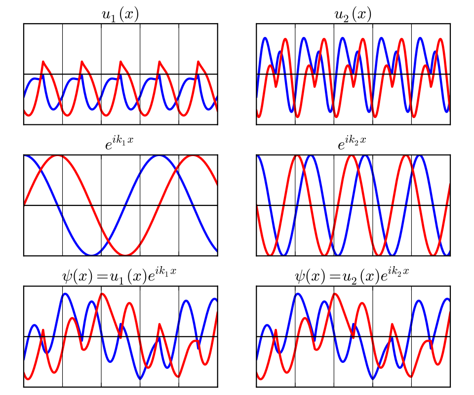

由于势能是周期性的，所以我们可以写成：

$$
U(\vb r) = \sum_{\vb K}U_{\vb K}e^{i\vb K\cdot\vb r}
$$

对应 Fourier 变换得到系数：

$$
\begin{aligned}
U_{\vb K} &= \frac{1}{v}\int_{cell}\dd [3]{\vb r} U(\vb r)e^{-i\vb K\cdot\vb r}\\
&= \frac{N}{V}\int_{cell}\dd [3]{\vb r} U(\vb r)e^{-i\vb K\cdot\vb r}\\
&= \frac{1}{V}\int_{whole}\dd [3]{\vb r} U(\vb r)e^{-i\vb K\cdot\vb r}
\end{aligned}
$$

这里 $\vb K$ 是倒易点阵格矢，$V$ 是全空间体积，$N$ 是晶胞数量，$v$ 是晶胞。

- 我们知道 $U_{0} = \frac{1}{v}\int_{cell}\dd[3]{\vb r} U(\vb r)$，表示的是势能的平均值。通常位力方便设 $U_0 = 0$；
- 如果势能是实数，那么有 $U_{\vb K} = U^*_{-\vb K}$；
- 如果势能是偶对称的（$U(\vb r) = U(-\vb r)$），那么有 $U_{\vb K} = U_{-\vb K}$.

我们设波函数是若干个平面波的叠加，也就是：

$$
\psi_\epsilon(\vb r) = \sum_{\vb q} C_{\vb q}e^{i\vb q \cdot \vb r}
$$

然后开始解 Schrodinger 方程：

$$
\begin{aligned}
\qty [\frac{p^2}{2m} + U(\vb r)]\psi(\vb r) &= \sum_{\vb q}\qty [\frac{p^2}{2m} + \sum_{\vb K}U_{\vb K}e^{i\vb K\cdot\vb r}] C_{\vb q}e^{i\vb q \cdot \vb r}\\
&= \sum_{\vb q}\frac{\hbar^2q^2}{2m}C_{\vb q}e^{i\vb q \cdot \vb r} + \sum_{\vb q}\sum_{\vb K}U_{\vb K}C_{\vb q}e^{i(\vb q + \vb K)\cdot\vb r}\\
\end{aligned}
$$

这里有两个指数项，我们进行合并，把后一个指数项平移：
$$
\begin{align}
 &  \sum_{\vb q}\frac{\hbar^2q^2}{2m}C_{\vb q}e^{i\vb q \cdot \vb r} + \sum_{\vb q'}\sum_{\vb K}U_{\vb K}C_{\vb q' -\vb K}e^{i\vb q'\cdot\vb r}\\
&= \sum_{\vb q}\qty [\frac{\hbar^2q^2}{2m}C_{\vb q} + \sum_{\vb K'}U_{\vb K'}C_{\vb q -\vb K'}] e^{i\vb q\cdot\vb r}\\
&= \epsilon \psi(\vb r) = \epsilon \sum_{\vb q} C_{\vb q}e^{i\vb q \cdot \vb r}
\end{align}
$$
最后得到：

$$
\sum_{\vb q}\qty [(\frac{\hbar^2q^2}{2m}-\epsilon)C_{\vb q} + \sum_{\vb K'}U_{\vb K'}C_{\vb q -\vb K'}] e^{i\vb q\cdot\vb r} = 0
$$

由于平面波 $e^{i\vb q\cdot \vb r}$ 的正交性，必须对于每个 $q$ 都有系数为 0. 于是就有：

$$
\boxed{(\frac{\hbar^2q^2}{2m}-\epsilon)C_{\vb q} + \sum_{\vb K'}U_{\vb K'}C_{\vb q -\vb K'} = 0}
$$

这被称为 **中心方程**（central equation）。

我们不妨写成矩阵的形式，观察可以发现 $(\vb q - \vb K')$ 全是与 $\vb q$ 相差一个倒易格矢的值，我们认为它是非对角项；而动能项则是对角项。这于是可以转化成矩阵相乘：

$$
\mqty(T&V&\cdots&V\\V&T&\cdots&V\\\vdots&\vdots&\ddots&\vdots\\V&V&\cdots&T)\mqty(\vdots\\C_{\vb q}\\C_{\vb q-\vb K'}\\\vdots) = 0
$$

我们接下来设 $\vb q = (\vb k - \vb K)$，这个方程就转变为（注意能量和 $\vb k$ 有关，所以我写成 $\varepsilon_\vb{k}$）：

$$
\begin{gathered}
(\frac{\hbar^2(\vb k - \vb K)^2}{2m}-\epsilon_{\vb k})C_{\vb k - \vb K} + \sum_{\vb K'}U_{\vb K'}C_{\vb (\vb k - \vb K) -\vb K'} = 0\\
(\frac{\hbar^2(\vb k - \vb K)^2}{2m}-\epsilon_{\vb k})C_{\vb k - \vb K} + \sum_{\vb K'}U_{\vb K'- \vb K}C_{\vb k  -\vb K'} = 0
\end{gathered}
$$

这样矩阵就转变成：

$$
\mqty(T&V&\cdots&V\\V&T&\cdots&V\\\vdots&\vdots&\ddots&\vdots\\V&V&\cdots&T)\mqty(\vdots\\C_{\vb k - \vb K}\\C_{\vb k-\vb K'}\\\vdots) = 0
$$

原波函数就是：

$$
\begin{aligned}
\psi_{\epsilon_{\vb k}}(\vb r) &= \sum_{\vb K} C_{(\vb k - \vb K)}e^{i(\vb k - \vb K) \cdot \vb r} \\
&= e^{i\vb k \cdot \vb r}\sum_{\vb K} C_{(\vb k - \vb K)}e^{-i\vb K \cdot \vb r}\\
&= e^{i\vb k \cdot \vb r} u_{\epsilon_{\vb k}}(\vb r)
\end{aligned}
$$

验证 $u_\epsilon(\vb r)$ 的周期性：

$$
u_{\epsilon_{\vb k}}(\vb r + \vb R) = \sum_{\vb K} C_{(\vb k - \vb K)}e^{-i\vb K \cdot (\vb r+\vb R)} = \sum_{\vb K} C_{(\vb k - \vb K)}e^{-i\vb K \cdot \vb r} = u_{\epsilon_{\vb k}}(\vb r)
$$

---

- 这里的 Bloch 动量 $\vb k$ 是一个 Quasi 动量，因为它是在离散的空间内被定义的。尝试用动量算符：

$$
  \vu p \psi_{\epsilon_{\vb k}}(\vb r) = \hbar \vb k \psi_{\epsilon_{\vb k}}(\vb r) +e^{i\vb k \cdot \vb r} \vu pu_{\epsilon_{\vb k}}(\vb r) \neq \hbar \vb k \psi_{\epsilon_{\vb k}}(\vb r)
$$

可以看出这和传统的动量不同。

- 在实际问题里，我们常常假设晶体是无限的，并存在某种周期性条件，这被称为 Born-von Karman 边界条件。我们假设 $N_i$ 为可以向 $\vb a_i$ 方向平移的总次数：

$$
  \psi_{\epsilon_{\vb k}}(\vb r) = \psi_{\epsilon_{\vb k}}(\vb r + N_i\vb a_i)
$$

  这说明：

$$
  e^{i\vb k \cdot (\vb r + N_i\vb a_i)} u_{\epsilon_{\vb k}}(\vb r + N_i\vb a_i) = e^{i\vb k \cdot (\vb r + N_i\vb a_i)} u_{\epsilon_{\vb k}}(\vb r ) = e^{i\vb k \cdot \vb r } u_{\epsilon_{\vb k}}(\vb r )
$$

  这必须满足：

$$
  N_i \vb k_i\cdot\vb a_i = 2m_i\pi\qc m_i = 0,1,\cdots, N_i-1\qc
$$

  于是有：

$$
  \vb k = \sum_{i = 1}^3 \frac{m_i}{N_i}\vb b_i
$$

  这限制了 $\va k$ 的取值。

- 由于 Hilbert 空间内的平面波是无限的，Bloch 态数也是无限的。但是每个 Bloch 能带都只有有限种（$N = N_1N_2N_3$ 种，对应三个方向的平移，也正好是晶胞数）状态。我们用 $n$ 表示序数，这样就有：

$$
  \psi_{\epsilon_{n \vb k}}(\vb r) = e^{-i\vb k \cdot \vb r} u_{\epsilon_{n\vb k}}(\vb r)
$$

  对应到中心方程：

$$
  \qty [\frac{(p+\hbar k)^2}{2m} + U(r)] u_{\epsilon_{n\vb k}}(\vb r) = \epsilon_{n\vb k}u_{\epsilon_{n\vb k}}(\vb r)
$$

---

### 2.2 弱周期势

回到这个方程：

$$
(\frac{\hbar^2(\vb k - \vb K)^2}{2m}-\epsilon_{\vb k})C_{\vb k - \vb K} + \sum_{\vb K'}U_{\vb K'- \vb K}C_{\vb k -\vb K'} = 0
$$

我们假设：

$$
|U_{\va K}| \ll \frac{h^2k^2}{2m}
$$

也就是周期势很弱，可以当成微扰。

考虑零阶近似，也就是势能为 0，我们有：

$$
\epsilon_{k-K}^{(0)} =\frac{\hbar^2(\vb k - \vb K)^2}{2m}
$$

这对应自由电子的动能（$q=k-K$），是一条抛物线。

回到 central equation，我们可以写成更简洁的形式：

$$
(\epsilon_{\vb k}-\epsilon_{k-K}^{(0)})C_{\vb (\vb k - \vb K)} = \sum_{\vb K'}U_{\vb K'- \vb K}C_{\vb k -\vb K'}
$$

现在假设我们只研究其中的一个 $\vb K_1$，令其对应的 $C_{\va k - \va K_1} \sim 1$，而其他的 $C_{\va k - \va K} \ll 1$， 对其进行微扰，把它分离出来就是：

$$
(\epsilon_{\vb k}-\epsilon_{k-K_1}^{(0)})C_{\vb (\vb k - \vb K_1)} = U_0 C_{\va{k} - \va{K}_1} +\sum_{\vb K'\neq \va{K}_1}U_{\vb K'- \vb K_1}C_{\vb k -\vb K'}
$$

上面两个方程就可以解出。

- **非简并的情况** 假设能隙 $|\epsilon_{k-K}^{(0)} - \epsilon_{k-K_1}^{(0)}|\gg|U|$ 。把 $\vb K_1$ 分离：

$$
  \begin{gathered}

  (\epsilon_{\vb k}-\epsilon_{k-K}^{(0)})C_{\vb (\vb k - \vb K)} = U_{\vb K_1- \vb K}C_{\vb k -\vb K_1}+\sum_{\vb K'\neq\vb K_1}U_{\vb K'- \vb K}C_{\vb k -\vb K'}\\

  C_{\vb (\vb k - \vb K)} = \frac{U_{\vb K_1- \vb K}C_{\vb k -\vb K_1}}{\epsilon_{\vb k}-\epsilon_{k-K}^{(0)}}+\sum_{\vb K'\neq\vb K_1}\frac{U_{\vb K'- \vb K}C_{\vb k -\vb K'}}{\epsilon_{\vb k}-\epsilon_{k-K}^{(0)}}

  \end{gathered}
$$

  我们忽略后面的其他项，只关注选中的：

$$
  C_{\vb (\vb k - \vb K)} = \frac{U_{\vb K_1- \vb K}C_{\vb k -\vb K_1}}{\epsilon_{\vb k}-\epsilon_{k-K}^{(0)}}
$$

  回代第二个 SE 得到：

$$
\begin{gathered}

  (\epsilon_{\vb k}-\epsilon_{k-K_1}^{(0)})C_{\vb (\vb k - \vb K_1)} = \sum_{\vb K}U_{\vb K- \vb K_1}\frac{U_{\vb K_1- \vb K}C_{\vb k -\vb K_1}}{\epsilon_{\vb k}-\epsilon_{k-K}^{(0)}}\\

  \epsilon_{\vb k}-\epsilon_{k-K_1}^{(0)} = \sum_{\vb K}U_{\vb K- \vb K_1}\frac{U_{\vb K_1- \vb K}}{\epsilon_{\vb k}-\epsilon_{k-K}^{(0)}}\\

  \epsilon_{\vb k}=\epsilon_{k-K_1}^{(0)} + \sum_{\vb K}U_{\vb K- \vb K_1}\frac{U_{\vb K_1- \vb K}}{\epsilon_{\vb k}-\epsilon_{k-K}^{(0)}}

  \end{gathered}
$$

  由于修正很小，我们认为 $\epsilon_k \approx \epsilon_{k-K_1}^{(0)}$，最后得到：

$$
\epsilon_{\vb k}=\epsilon_{k-K_1}^{(0)} + \sum_{\vb K'\neq \va{K}_1}\frac{U_{\vb K- \vb K_1}U_{\vb K_1- \vb K}}{\epsilon_{k-K_1}^{(0)}-\epsilon_{k-K}^{(0)}}
$$

  其中后一项可以视为 **二阶微扰**。这可以视为从 $\epsilon_{k-K_1}^{(0)}$ 变到 $\epsilon_{k-K}^{(0)}$ 再回来的一个虚拟过程。

  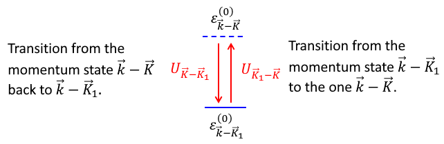

  此处一阶微扰 $\ev{U}{n} = U_0$，对应能量零点为 0.

- **简并的情况** 假设有若干个靠得很近的能级 $\epsilon_{k-K_i}^{(0)},i=1,2,\cdots,m$：我们在处理 $\va K_i$ 时把临近的简并能级都提出来：

$$
  \begin{gathered}

  (\epsilon_{\vb k}-\epsilon_{k-K_i}^{(0)})C_{\vb (\vb k - \vb K)} = \sum_{j = 1}^mU_{\vb K_j- \vb K_i}C_{\vb k -\vb K_j}+\sum_{\vb K'\neq\vb K_{1,\dots, m}}U_{\vb K'- \vb K_i}C_{\vb k -\vb K'}\\

  C_{\vb (\vb k - \vb K_i)} = \frac{1}{\epsilon_{\vb k}-\epsilon_{k-K_i}^{(0)}}(\sum_{j = 1}^mU_{\vb K_j- \vb K_i}C_{\vb k -\vb K_j}+\sum_{\vb K'\neq\vb K_{1,\dots, m}}U_{\vb K'- \vb K_i}C_{\vb k -\vb K'})

  \end{gathered}
$$

忽略掉除了简并 subspace 的项：

$$
  C_{\vb (\vb k - \vb K_i)} = \frac{1}{\epsilon_{\vb k}-\epsilon_{k-K_i}^{(0)}}\sum_{j = 1}^mU_{\vb K_j- \vb K_i}C_{\vb k -\vb K_j}
$$

回代得到：

$$
\begin{align}
 & (\epsilon - \epsilon^{(0)}_{\va k -\va K_i})C_{\va k - \va K_i}  \\
 & =\sum_{j = 1}^mU_{\vb K_j- \vb K_i}C_{\vb k -\vb K_j} + \sum_{j = 1}^m\qty(\sum_{\va K \neq \va K,\cdots,\va K_m} \frac{U_{\va{K}-\va{K}_i}U_{\va{K}_j-\va{K}}}{\epsilon - \epsilon^{(0)}_{\va k -\va K}})C_{\va k - \va K_j} + \order{U^3}
\end{align}
$$

其中前一项代表临近能级的耦合（一阶），后一项代表可能跃迁回到简并能级的虚跃迁。

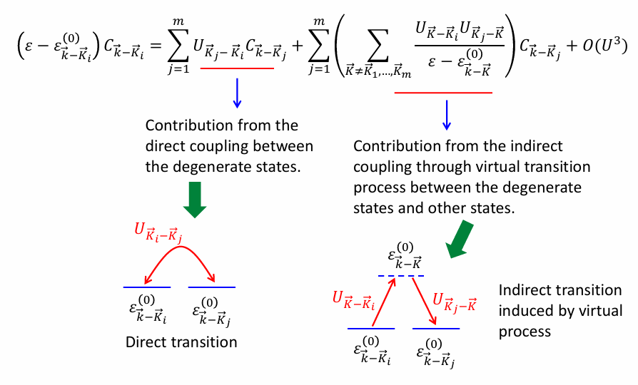

---

### 2.3 带隙 Bandgap

为了方便，先考虑  $m= 2$ 的情况：
$$
\begin{align}
 & (\epsilon - \epsilon^{(0)}_{\va k -\va K_i})C_{\va k - \va K_i}  \\
 & =\sum_{j = 1}^2 U_{\vb K_j- \vb K_i}C_{\vb k -\vb K_j} + \sum_{j = 1}^2\qty(\sum_{\va K \neq \va K,\cdots,\va K_m} \frac{U_{\va{K}-\va{K}_i}U_{\va{K}_j-\va{K}}}{\epsilon - \epsilon^{(0)}_{\va k -\va K}})C_{\va k - \va K_j} + \order{U^3}
\end{align}
$$
由于它们近乎简并，我们写出中心方程，此时我们只写出两者相互耦合的项：
$$
\begin{cases}
( \varepsilon - \varepsilon_{\va{k}-\va{K}_1}^{( 0 )} )C_{\va{k} - \va{K}_1} = U_{\va{K}_2 - \va{K}_1}C_{\va{k} - \va{K}_2} \\
( \varepsilon - \varepsilon_{\va{k}-\va{K}_2}^{( 0 )} )C_{\va{k} - \va{K}_2} = U_{\va{K}_1 - \va{K}_2}C_{\va{k} - \va{K}_1}
\end{cases}
$$
主要认为 $\va{q} = \va{k} - \va{K}_1$，相差向量 $\va{K} = \va{K}_2 - \va{K}_1$，这样就有：
$$
\begin{cases}
( \varepsilon - \varepsilon_{\va{q}}^{( 0 )} )C_{\va{q}} = U_{\va{K}}C_{\va{q} - \va{K}} \\
( \varepsilon - \varepsilon_{\va{q} - \va{K}}^{( 0 )} )C_{\va{q} - \va{K}} = U^*_{ \va{K}}C_{\va{q}}
\end{cases}
$$
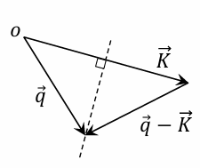

这个平面被称为 **Bragg平面**。

依旧解行列式：
$$
\mdet{
\varepsilon - \varepsilon_\va{q}^{( 0 )} & -U_\va{K} \\
-U_\va{K}^{*}  &  \varepsilon - \varepsilon_{ \va{q} - \va{K}}^{( 0 )} 
} = 0
$$
之后得到：
$$
\varepsilon_{ \pm } = \frac{1}{2}( \varepsilon_{\va{q}}^{ ( 0 ) } - \varepsilon_{\va{q}-\va{K}}^{( 0 )} ) \pm  \qty[ \qty( \frac{ \varepsilon_{\va{q}}^{ ( 0 ) } - \varepsilon_{\va{q}-\va{K}}^{( 0 )} }{2} )^{2} +\abs{ U_{\va{K}} }^{2} ]^{1/2}
$$
对于能量接近 $\varepsilon_{\va{q}}^{ ( 0 ) } - \varepsilon_{\va{q}-\va{K}}^{( 0 )} = 0$ 的情况，带隙即为：
$$
\Delta = \varepsilon_+ - \epsilon_- = 2\abs{ U_{\va{K}} }
$$
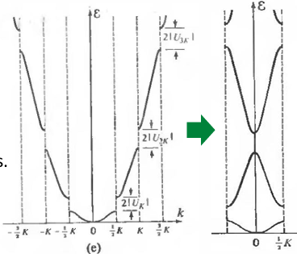

其中对应 $k$ 没有跨过Bragg平面（产生带隙）的值为第一 Brillouzine 区。

---

### 2.4 紧束缚近似

当原子间势能变得极强时，我们不再认为能用微扰，而是认为时原子轨道的组合。此时我们写出：
$$
H = H_{at} + \Delta U( \va{r}-\va{R} )
$$
其中原子哈密顿量部分满足：
$$
H_{at}( \va{r} )\psi _n( \va{r} ) = E_n\psi _n( \va{r} )
$$
这里 $\psi _n( \va{r})$ 表示原子的局域波函数。

我们Bloch展开波函数
$$
\psi _{\va{k}}( \va{r} ) = \sum_{\va{R}} e^{ i\va{k}\cdot \va{R} }\phi ( \va{r} - \va{R} )
$$
其中 $\phi ( \va{r} - \va{R} )$​ 可以认为是局部原子轨道的线性组合：
$$
\phi ( \va{r} ) = \sum_n b_n\psi _n( \va{r} )
$$
此时每个 Bloch 态也需要满足本征方程
$$
H\psi _{\va{k}}( \va{r} ) = \varepsilon_{\va{k}}\psi _{\va{k}}( \va{r} )
$$
乘 $\psi _{m}( \va{r})$ 并积分得到：
$$
\int \dd[ 3 ]{ \va{r} } \psi _m^{*}( \va{r} )H\psi _\va{k}( \va{r} ) = \varepsilon_{\va{k}}  \int \dd[ 3 ]{ \va{r} } \psi _m^{*}( \va{r} )\psi _\va{k}( \va{r} )
$$
化简后得到：
$$
\begin{align}
( \varepsilon_{\va{k}}-E_m )b_m   & = -( \varepsilon_{\va{k}} - E_m )\sum_n \qty(\sum_{\va{R}\neq 0} \int \dd[ 3 ]{ \va{r} } \psi _m^{*}( \va{r} )\psi _n( \va{r} - \va{R} )e^{ i\va{k}\cdot \va{R} })b_{n} \\
 & \quad + \sum_n \qty( \int \dd[ 3 ]{ \va{r} } \psi _m^{*}( \va{r} )\Delta U( \va{r} )\psi _n( \va{r} ))b_{n} \\
 & \quad + \sum_n \qty(\sum_{\va{R}\neq 0}\int \dd[ 3 ]{ \va{r} } \psi _m^{*}( \va{r} )\Delta U( \va{r} )\psi _n( \va{r} - \va{R} )e^{ i\va{k}\cdot \va{R} })b_{n}
\end{align}
$$
我们忽略任何局部轨道之间的耦合，比如只考虑s轨道，也就是 $b_n$ 只有 $b_s$ 一种，这样 $b$ 可以消掉：
$$
\begin{align}
( \varepsilon_{\va{k}}-E_m )b_s   & = -( \varepsilon_{\va{k}} - E_m ) \qty(\sum_{\va{R}\neq 0} \int \dd[ 3 ]{ \va{r} } \psi _s^{*}( \va{r} )\psi _s( \va{r} - \va{R} )e^{ i\va{k}\cdot \va{R} })b_{s} \\
 & \quad + \qty( \int \dd[ 3 ]{ \va{r} } \psi _s^{*}( \va{r} )\Delta U( \va{r} )\psi _s( \va{r} ))b_{s} \\
 & \quad +\qty(\sum_{\va{R}\neq 0}\int \dd[ 3 ]{ \va{r} } \psi _s^{*}( \va{r} )\Delta U( \va{r} )\psi _s( \va{r} - \va{R} )e^{ i\va{k}\cdot \va{R} })b_{s}
\end{align}
$$
 我们定义
$$
\begin{cases}
\beta = \int \dd[ 3 ]{ \va{r} } \psi _s^{*}( \va{r} )\Delta U( \va{r} )\psi _s( \va{r} ) \qq { On-Site potential correction } \\
\alpha( \va{R} ) = \int \dd[ 3 ]{ \va{r} } \psi _s^{*}( \va{r} )\psi _s( \va{r} - \va{R} ) \qq{ Overlapping integral } \\
\gamma( \va{R} ) = -\int \dd[ 3 ]{ \va{r} } \psi _s^{*}( \va{r} )\Delta U( \va{r} )\psi _s( \va{r} - \va{R} ) \qq{ Hopping energy }
\end{cases}
$$
可以简化写成：
$$
\varepsilon_{\va{k}} = E_s - \frac{ \beta + \sum_{\va{R}}\gamma( \va{R} )e^{ i\va{k}\cdot \va{R} } }{1+\sum_{\va{R}}\alpha( \va{R} )e^{ i\va{k}\cdot \va{R} }}
$$
在紧束缚模型下可以认为 $\alpha$ 极小，也就是：
$$
\varepsilon_{\va{k}} = E_s - { \beta + \sum_{\va{R}}\gamma( \va{R} )e^{ i\va{k}\cdot \va{R} } }
$$
继续简化，只考虑相邻的跃迁积分 $\gamma( \va{R}) \to t_s^{\va{R}}( 0)$ 。对于简单立方有：
$$
\varepsilon_{\va{k}} = E_s - { \beta + \sum_{\va{R} = \va{a}_j}t_s^{\va{R}}( 0)\cos \va{k} \cdot \va{R}  } =E_s - { \beta + \sum_{j}t_s^{( a_j )}\cos \va{k} \cdot \va{R}  }
$$
对于s轨道三个 $t_s^{( a_j )}$ 均大于零且相等。于是带底（band bottom）位于 $\va{k}=0$ ，带顶位于 $\va{k} = ( \pi ,\pi ,\pi )$。

如果对于p轨道，沿着p轨道延伸方向的 $t_p^{( a_j )} < 0$，其余方向 $t_p^{( a_j )} > 0$，对应带底 $\va{k} = ( \pi ,0,0)$，带顶 $\va{k} = ( 0,\pi ,\pi )$

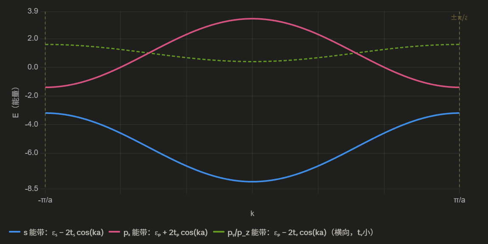

---

### 2.5 Wannier 函数

我们定义一种新的波函数：
$$
\psi _{n\va{k}}( \va{r} ) = \sum_{\va{R}}f_n( \va{R},\va{r} )e^{ i\va{k}\cdot \va{R} }
$$
其中系数通过逆傅里叶变换：
$$
f_n( \va{R},\va{r} ) = \frac{1}{v_0} \int\dd[ 3 ]{ \va{k} }e^{ -i\va{k}\cdot \va{R} }\psi _{n\va{k}}( \va{r} )
$$

可以证明满足正交性：
$$
\int f^{*}_n( \va{r}-\va{R} )f_{n'}( \va{r}-\va{R}' )\dd[ 3 ]{{\va{r}}}\propto \delta_{nn'}\delta_{\va{R}\va{R}'}
$$
这样就把连续的波函数转化为对格矢 $\va{R}$ 离散的波函数，接下来的波函数都可用Dirac状态描述（取负号只是为了方便讨论）：
$$
\ket{\varphi _{n,\va{k}}}  = \frac{1}{\sqrt{ N }}\sum_{\va{R}}e^{ -i\va{k}\cdot \va{R} }\ket{\varphi _{n}( \va{R} )} = \sum_{\va{R}}c_{\va{R}}\ket{\varphi _{n}( \va{R} )}
$$
再来推一下紧束缚模型。代入Schrodinger方程（此时认为能带之间基本没有耦合）：
$$
H\sum_{\va{R}}c_{\va{R}}\ket{\varphi _{n}( \va{R} )} = \varepsilon\sum_{\va{R}}c_{\va{R}}\ket{\varphi _{n}( \va{R} )}
$$
乘正交基：
$$
\sum_{\va{R}}c_{\va{R}}\mel{\varphi _{n}( \va{R} ')}{H}{\varphi _{n}( \va{R} )} = \varepsilon c_{\va{R}}
$$
我们定义矩阵元 $H^{( n)}_{\va{R}_1\va{R}_2} = \mel{\varphi _{n}( \va{R}_1 )}{H}{\varphi _{n}( \va{R}_2 )}$ ，对应哈密顿矩阵：
$$
H^{( n )} = \sum_{\va{R}'\va{R}}H_{\va{R}'\va{R}}\op{\varphi_n( \va{R}' )}{\varphi_n( \va{R} )} = -\sum_{\va{R}'\va{R}}t_{\va{R}'\va{R}}\op{\varphi_n( \va{R}' )}{\varphi_n( \va{R} )}
$$
如果我们只考虑相邻的跃迁，当 $\va{R}_i = \va{R}_j$ 是对应位点本身能量 $E_n$，相邻代表跃迁能量，就有：
$$
\begin{align}
H^{( n )} & = E_n - \sum_{<i,j>} t_{\va{R}_i\va{R}_j} \op{\varphi_n( \va{R}_i )}{\varphi_n( \va{R}_j )} \\
 & = E_n - \sum_{<i,j>} t_{\va{R}_i\va{R}_j} \frac{1}{N} \sum_{\va{k}_1,\va{k}_2} e^{ i\va{k}_1\va{R}_1 - \va{k}_2\va{R}_2} \op{\varphi_{n\va{k}_1}}{\varphi_{  n\va{k}_2}}
\end{align}
$$
我们假设 $\va{R}_2 = \va{R}_1 \pm a_j$，这样原式化为：
$$
\begin{align}
H^{( n )} & = E_n - \sum_{\va{a}_j} t_{\va{a}_j} \frac{1}{N} \sum_{\va{k}_1,\va{k}_2} e^{ i( \va{k}_1 - \va{k}_2)\va{R}_1 \mp  i\va{k}_2\va{a}_j} \op{\varphi_{n\va{k}_1}}{\varphi_{  n\va{k}_2}} \\
 & = E_n - \sum_{\va{a}_j} t_{\va{a}_j} \sum_{\va{k}_1,\va{k}_2} \delta( \va{k}_1 - \va{k}_2 ) e^{\mp  i\va{k}_2\va{a}_j} \op{\varphi_{n\va{k}_1}}{\varphi_{  n\va{k}_2}} \\
 & =  E_n - \sum_{\va{a}_j} t_{\va{a}_j} \frac{1}{N} \sum_{\va{k}_1} e^{\mp  i\va{k}\va{a}_j} \op{\varphi_{n\va{k}}}{\varphi_{  n\va{k}}} \\
 & = E_n - \sum_{\va{a}_j}\sum_{\va{k}} 2t_{\va{a}_j}\cos( \va{k}\cdot \va{a}_j ) \op{\varphi_{n\va{k}}}{\varphi_{  n\va{k}}} \\
 & = \sum_{\va{k}}\varepsilon_{n\va{k}} \op{\varphi_{n\va{k}}}{\varphi_{n\va{k}}} & 
\end{align}
$$
于是就有：
$$
\varepsilon_{n\va{k}} = E_n  - \sum_{\va{a}_j}2t_{\va{a}_j}\cos( \va{k}\cdot \va{a}_j )
$$

---

考虑一个**一维双势阱**

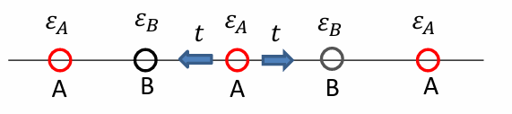

同样只考虑近邻跃迁，得到：
$$
H = -\sum_{<i,j>}t\op{\varphi_{A}( \va{R}_i )}{\varphi_{B}( \va{R}_i )} + h.c.+\sum_i\sum_{\alpha=A,B}\varepsilon_{\alpha}\op{\varphi_{A}( \va{R}_i )}{\varphi_{A}( \va{R}_i )}
$$
通过相同方法变换 $\ket{ \varphi_A( \va{R}_i)}$​ 得到：
$$
HH = -\sum_{<i,j>}t\op{\varphi_{A}( \va{R}_i )}{\varphi_{B}( \va{R}_i )} + h.c.+\sum_i\sum_{\alpha=A,B}\varepsilon_{\alpha}\op{\varphi_{A}( \va{R}_i )}{\varphi_{A}( \va{R}_i )}
$$

---

## 3. 半经典输运 Semi-Classical Transport

### 3.1 电子在晶体内的运动

我们认为一个在固体内的电子是一个波包，于是我们可以用这些量来描述：

- 绝对位置 $\va r$
- 波矢 $\va k$
- 所处能带序号 $n$

电子的运动满足以下性质：

- **$n$ 为常数**：电子永远在相同的能带内运动
- 电子速度满足：

$$
\dot{\va r} = \va{v}_n(\va k) = \frac{1}{\hbar}\grad_\va{k} \epsilon_n(\va k)
$$

> 证明：
>
> 对 Bloch 态有：
>
> $$
> \psi_{n\va{k}}(\va{r})=u_{n\va{k}}(\va{r})\,e^{i\va{k}\cdot\va{r}}
> $$
>
> 于是得到速度表达式，为了表达电子运动我们加上 $\hbar \va k$ 项：
>
> $$
> \begin{aligned}
> v_n(\va{R})
> &= \frac{1}{m}\,\langle \psi_{n\va{k}}^{*}(\va{r}) \mid \hat{p} \mid \psi_{n\va{k}}(\va{r}) \rangle \\
> &= \frac{1}{m}\int u_{n\va{k}}^{*}(\va{r})\left(\hat{p}+\hbar\va{k}\right)u_{n\va{k}}(\va{r})\,\dd{\va r}
> \end{aligned}
> $$
>
> 由 SE 有：
>
> $$
> \hat{H}_k \psi_{nk}(\va{r})=\varepsilon_n(\va{k})\psi_{nk}(\va{r})
> $$
>
> 又有：
>
> $$
> \hat{H}_k=
> \frac{\left({\hat{p}}+\hbar{\va{k}}\right)^2}{2m}
> +V\left(\va{r}\right)
> $$
>
> 现在对 SE 对 $\va k$ 做一次导数：
>
> $$
> \begin{aligned}
> &\frac{\hbar}{m}\qty(\hat{p}+\hbar \va{k})u_{n\va{k}}(\va{r})+\hat{H}_{\va{k}}\grad_{\va{k}}u_{n\va{k}}(\va{r})\\
> &\quad=
> \qty(\grad_{\va{k}}\varepsilon_n(\va{k}))u_{n\va{k}}(\va{r})
> +\varepsilon_n(\va{k})\grad_{\va{k}}u_{n\va{k}}(\va{r})
> \end{aligned}
> $$
>
> 

- 波矢满足：

  $$
  \hbar \dot{\va k}=-e\left[\va{E}(\va{r},t)+\va{v}_n(t)\times\va{B}(\va{r},t)\right]
  $$

> 证明

---

对于一个电子的加速度：

$$
\begin{aligned}
\dot{\va{v}}_n(\va{k}) &= \frac{\partial}{\partial t}\qty(\frac{1}{\hbar}{\grad}_{\va{k}}\varepsilon_n(\va{k})) \\
&= \frac{1}{\hbar}\grad_{\va k}\qty(\frac{1}{\hbar}{\grad}_{\va{k}}\varepsilon_n(\va{k}))\hbar\pdv{\va{k}}{t}
\end{aligned}
$$

其中右侧项代表外力：

$$
\hbar\pdv{\va k}{t} = \va F_{ext}
$$

进一步化简：

$$
\dot{\va v}_n(\va k) = \frac1{\hbar^2}\laplacian_{\va k}\varepsilon_n(\va{k})\hbar \pdv{ \va{k} }{ t }
$$

类比牛顿第二定律 $m\va{a} = \va{k}$，得到：

$$
\qty[1/m^{*}]_{ij}=\frac{1}{\hbar ^{2}}\pdv{ \varepsilon_n(\va{k}) }{ k_i }{k_j}
$$

这被称为 **有效质量张量**（effective mass tensor）。对于一个简单体系我们考虑 $[1/m^{*}]_{ii} = \delta_{ij}[1/m^{*}]_{ij}$，已知对应简单立方点阵有

$$
\varepsilon(\va{k}) = \varepsilon_s - J_0 - 2J_{1}(\cos k_xa+\cos k_ya+\cos k_za)
$$

于是对应 $\va{k} = (0,0,0)$

$$
m_x=m_y=m_y=\frac{\hbar ^2}{2a^2J_1}
$$

对应 $\va{k} = (\pm \pi/a,\pm \pi/a,\pm \pi /a   )$

$$
m_x=m_y=m_z = -\frac{\hbar ^2}{2a^2J_{1}}
$$

---

## 4. 晶格动力学 Lattice Dynamics

### 4.1 单原子一维原子链

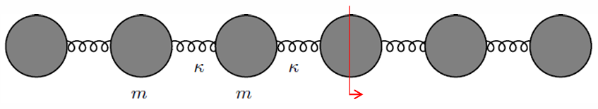

假设一个原子轻微偏离的平衡位置，展开有

$$
V(x)  =V(x_{eq})+\frac{\kappa}{2}(x-x_{eq})^{2} + \cdots
$$

其中一次项由于平衡位置受力为0，故略去。

类似三维，**压缩率**（compressibility）可被定义为

$$
\beta = -\frac{1}{L}\pdv{ L }{ F }  = \frac{1}{\kappa x_{eq}} = \frac{1}{\kappa a}
$$

类似声速的定义（先这么假定），我们有

$$
v = \sqrt{ \frac{1}{\rho \beta} } = \sqrt{ \frac{1}{(\frac{m}{a})(1/(\kappa a)) } } = \sqrt{ \frac{\kappa a^{2}}{m} }
$$

关注整个原子链的势能。如果我们假设平衡位置势能为0，由于平衡一次项也为零，就有

$$
V(\va{R}_{1}+\va{x}_{1}(t), \va{R}_{2}+\va{x}_{2}(t),\cdots ,\va{R}_n+\va{x}_n(t)) = \frac{1}{2}\sum_{i,j=1}^{3N} \qty(\pdv{ V }{ x_i }{ x_j } )_0x_ix_j + \order{x^3}
$$

这里势能项对应一个 $3N\times 3N$ 的矩阵

$$
V = \frac{1}{2}\pmqty{
x_{1} & \cdots  & x_{3N}
}
\pmqty{
V_{11} & \cdots  & V_{1,3N} \\
\vdots  & \vdots  & \vdots  \\
V_{3N,1} & \cdots  & V_{3N,3N}
}
\pmqty{
x_{1} \\
\vdots  \\
x_{3N}
}
$$

对角化成简正模：

$$
V = \frac{1}{2}\pmqty{
Q_{1} & \cdots  & Q_{3N}
}
\pmqty{
\dmat{\omega_{1},\ddots ,\omega_n}
}
\pmqty{
Q_{1} \\
\vdots  \\
Q_{3N}
}
$$

> 这里对角矩阵每一项除一个 $\sqrt{m_j}$，归一化掉质量。
>
> $$
> T = \pmqty{
> a_{11}/\sqrt{ m_{1} } &\cdots  &  a_{1,3N}/\sqrt{ m_{1} } \\
> \vdots  & \vdots  & \vdots  \\
> a_{3N,1}/\sqrt{ m_{3N} } & \cdots  & a_{3N,3N}/\sqrt{ m_{3N} }
> }
> $$
>
> 对应：
>
> $$
> \pmqty{
> x_{1} \\
> \vdots  \\
> x_{3N}
> } =
> \pmqty{
> a_{11}/\sqrt{ m_{1} } &\cdots  &  a_{1,3N}/\sqrt{ m_{1} } \\
> \vdots  & \vdots  & \vdots  \\
> a_{3N,1}/\sqrt{ m_{3N} } & \cdots  & a_{3N,3N}/\sqrt{ m_{3N} }
> }
> \pmqty{
> Q_{1} \\
> \vdots  \\
> Q_{3N}}
> $$

就有

$$
V = \frac{1}{2}\sum_{i=1}^{3N} \omega_j^2Q_j^2\qc K=\frac{1}{2}\sum_{i=1}^{3N} Q_j^2
$$

由于能量守恒

$$
\ddot{Q_i} +\omega_i^{2}Q_i = 0
$$

解得 $Q_i = A \sin(\omega_it+\beta)$，符合振动。

如果使用量子化 SE求解

$$
\frac{1}{2}\sum_{i=1}^{3N} \qty(-\hbar ^2 \pdv[2]{   }{ Q_i }  +\omega_i^{2}Q_i^{2} )\varphi_i(Q_i)  = \sum_{i=1}^{3N}\varepsilon_i \psi\qc \psi = \prod_{i=1}^{3N} \varphi_i(Q_i)
$$

这和简谐势能面的求解是一样的。

$$
\begin{gathered}
E = \sum_{i=1}^{3N} (n_i+\frac{1}{2})\hbar \omega_i \\
\varphi_i(Q_i) = A_{n_i}H_{n_i}(\sqrt{ \frac{\omega}{\hbar } }Q_i)e^{ -\frac{\omega Q_i^2}{2\hbar } }
\end{gathered}
$$

---

再回到一维无限原子链。我们统计每个想磷原子的变化

$$
V = \sum_i^N V_i = \sum_i^N \frac{\qty(\frac{\kappa(x_{i+1}-x_i)^2}{2} + \frac{\kappa(x_{i}-x_{i-1})^2}{2})}{2} = \frac{\kappa}{2} \sum_i^N (x_{i+1} - x_i)^2
$$

展开成矩阵：

$$
V = \frac{1}{2}\pmqty{
x_{1} & \cdots  & x_{N}
}\pmqty{
\kappa & -\kappa & \cdots  & \cdots  & 0 \\
-\kappa & 2\kappa & -\kappa & \cdots  & 0 \\
0 & -\kappa & 2\kappa & \ddots  & \vdots  \\
\vdots  & \ddots  & \ddots  & \ddots  & \vdots  \\
0 & \cdots  & \cdots  & -\kappa & \kappa
}\pmqty{
x_{1} \\
\vdots  \\
x_N
}
$$

对应 Newton 运动方程：

$$
m\ddot{x}_n = -\pdv{ V }{ x_n } =\kappa(x_{n+1} + x_{n-1} - 2x_{n})
$$

我去，耦合这么强怎么解嘛！我们假设

$$
x_{n} = Ae^{ -i\omega t+inaq }
$$

代入方程得到

$$
\begin{align}
-m\omega ^{2} e^{ inaq }  & = \kappa \qty(e^{ i(n+1)aq } + e^{ i(n-1)aq } - 2e^{ inaq }) \\
\omega^2 & = \frac{2\kappa}{m}(1-\cos qa) = \frac{4\kappa}{m}\sin[2]\frac{qa}{2}
\end{align}
$$

也就是：

$$
\boxed{
\omega = 2\sqrt{ \frac{\kappa}{m} }\abs{ \sin(\frac{qa}{2}) }
}
$$

> 这里 $q$ 代表一个原子相对其他原子的**相位**（Phase Shift），注意所有原子都以相同的频率和振幅振动。
>
> 由于是相位，所以我们可以设
>
> $$
> -\frac{\pi}{a}\leq q\leq \frac{\pi}{a}
> $$

Born-von Karman 假设：相位具有周期性

$$
x_n = x_{n+N} \implies e^{ iNaq } = 1
$$

于是有：

$$
q = \frac{2\pi }{Na}n\qc n=0,1,2,\cdots
$$

对应限制

$$
-\frac{N}{2} \leq  n \leq  \frac{N}{2}
$$

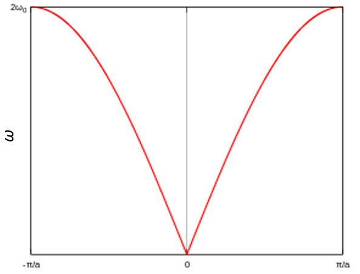

对于一个小的偏移量 $q$ 做近似

$$
\omega = \sqrt{ \frac{\kappa}{m} }|qa| = \sqrt{ \frac{\kappa a^{2}}{m} }|q| = v|q|
$$

---

对于含多个简正模的原子位置

$$
\begin{align}
x_{n}  & = \sum_q A_qe^{ -i\omega t + inaq } \\
 & = \frac{1}{\sqrt{ Nm }} \sum_q Q(q)e^{ inaq } \qc Q(q) = \sqrt{ Nm }A_qe^{ -i\omega t }
\end{align}
$$

这里的 $Q(q)$ 即为上面的简正模：

$$
\pmqty{
x_{1} \\
\vdots  \\
x_{3N}
} =
\pmqty{
a_{11}/\sqrt{ m_{1} } &\cdots  &  a_{1,3N}/\sqrt{ m_{1} } \\
\vdots  & \vdots  & \vdots  \\
a_{3N,1}/\sqrt{ m_{3N} } & \cdots  & a_{3N,3N}/\sqrt{ m_{3N} }
}
\pmqty{
Q_{1} \\
\vdots  \\
Q_{3N}}
$$

在解这个方程之前，先证明两个性质

$$
Q^{*}(q) = Q(-q)
$$

> $$
> x_n= x^{*}_n = \frac{1}{\sqrt{ Nm }} \sum_q Q^{*}(q)e^{ -inaq } = \frac{1}{\sqrt{ Nm }} \sum_{-q} Q(-q)e^{ -inaq }
> $$

$$
\frac{1}{N} \sum_{ n=0}^{N-1} e^{ ina(q-q') } = \delta_{qq'}
$$

> $q=q'$ 显然。 $q \neq  q'$ 时记 $q-q' = b = \frac{2\pi    }{Na}(j-j')$：
>
> $$
> \frac{1}{N} \sum_{n=0}^{N-1} e^{ inab } = \frac{1-e^{ iNab }}{1-e^{ iab }} = \frac{1-e^{ 2\pi i(j-j') }}{1-e^{ iab }} = \frac{1-1}{1-e^{ iab }} = 0
> $$

于是动能项：

$$
\begin{align}
K = \frac{1}{2}m\sum_n \dot{x}^{2}  & = \frac{1}{2}m \frac{1}{Nm}\sum_n \qty[\qty(\sum_q \dot{Q}(q)e^{ inaq })\qty(\sum_{q'} \dot{Q}(q)e^{ inaq' })] \\
 & = \frac{1}{2N} \sum_n \qty[\sum_{q,-q'} \dot{Q}(q)\dot{Q}(-q')e^{ ina(q-q') }] \\
 & = \frac{1}{2N} \sum_{q,-q'} \dot{Q}(q)\dot{Q}(-q')\qty[\sum_n e^{ ina(q-q')}] \\
 & = \frac{1}{2} \sum_{q,-q'}  \dot{Q}(q)\dot{Q}(-q')\delta_{q,-q'} = \frac{1}{2} \sum_q|\dot{Q}(q)|^2
\end{align}
$$

势能项：

$$
\begin{align}
V = \sum_i^N V_i  & = \sum_i^N \frac{\qty(\frac{\kappa(x_{i+1}-x_i)^2}{2} + \frac{\kappa(x_{i}-x_{i-1})^2}{2})}{2}  \\
 & = \frac{\kappa}{4}\sum_n^N(x_{n+1}^2 + 2x_{n}^2 + x_{n-1}^2 - 2x_{n+1}x_{n}-2x_{n}x_{n-1})
\end{align}
$$

对应得到：

$$
\begin{gathered}
\sum_n^N x_{n}^{2} = \frac{1}{m} \sum_q \abs{ Q(q) }^{2}\\
\sum_n^N x_{n}x_{n+1} = \frac{1}{m} \sum_q \abs{ Q(q) }^{2}e^{ iaq }\\
\sum_n^N x_{n}x_{n-1} = \frac{1}{m} \sum_q \abs{ Q(q) }^{2}e^{ -iaq }\\
\end{gathered}
$$

代入：

$$
\begin{align}
V & = \frac{\kappa}{m} \sum_q |Q(q)|^{2} \qty(1-(e^{ iaq }+ e^{ - iaq })) \\
 & = \frac{1}{2} \sum_q \frac{4\kappa}{m} \sin[2]\frac{aq}{2}|Q(q)|^{2}
\end{align}
$$

也就是

$$
V = \frac{1}{2}\sum_q \omega_q^2 |Q(q)|^{2}\qc \omega_q = 2 \sqrt{ \frac{\kappa}{m} }|\sin\frac{qa}{2}|
$$

和前面推导类似。

---

### 3.2 一维双原子链

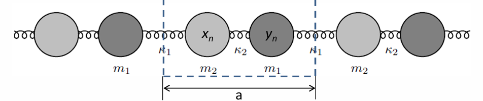

写出势能：

$$
\begin{cases}
m_x \ddot{x}_n = - \pdv{ V }{ x_n } = -\kappa_{2}(x_n - y_{n}) - \kappa_{1}(x_{n}- y_{n- 1}) \\
m_y \ddot{y}_n = - \pdv{ V }{ y_n } = \kappa_{2}(x_n - y_{n}) + \kappa_{1}(x_{n+ 1}- y_{n- 1})
\end{cases}
$$

同样可以假设：

$$
\begin{cases}
x_n = A_x e^{ - i\omega t + inaq } \\
y_{n} = A_y e^{ - i\omega t + inaq }
\end{cases}
$$

代入方程组得到：

$$
\begin{cases}
- m_x \omega^2 A_x = \kappa_{2}(A_y - A_x) - \kappa_{1}(A_ye^{ - iaq } - A_x) \\
- m_y \omega^2 A_y = \kappa_{2}(A_x - A_y) + \kappa_{1}(A_xe^{ iaq } - A_y)
\end{cases}
$$

写成矩阵：

$$
\omega^2 \binom{ A_x }{ A_y } = \pmqty{
\frac{\kappa_{1}+\kappa_{2}}{m_x}  & -\frac{\kappa_{1}e^{ - iaq }+\kappa_{2}}{m_x} \\
-\frac{\kappa_{1}e^{ iaq }+\kappa_{2}}{m_y} & \frac{\kappa_{1}+\kappa_{2}}{m_y}
}\binom{ A_x }{ A_y }
$$

解特征值 $\omega ^{2}$

$$
\qty(\frac{\kappa_{1}+\kappa_{2}}{m_x} - \omega ^{2})\qty(\frac{\kappa_{1}+\kappa_{2}}{m_y} - \omega ^{2}) = \frac{(\kappa_{1}e^{ iaq }+\kappa_{2})(\kappa_{1}e^{ - iaq }+\kappa_{2})}{m_xm_y}
$$

化简：

$$

$$

---

## 磁性

### 磁性和磁化率

基态能量有：
$$
E_{0}( H ) = -VM\cdot H + const.
$$
于是有：
$$
M( H ) = -\frac{1}{V}\pdv{ E_0( H ) }{ H } 
$$
用配分函数的写法：
$$
\begin{align}
M( H,T )  & = -\frac{1}{V}\frac{\sum\pdv{ E_n( H ) }{ H } e^{ -\beta E_n }}{Z} \\
 & = \frac{1}{V\beta Z}\sum\pdv{ e^{ -\beta E_n } }{ H } = -\frac{1}{V}\pdv{ F }{ H } 
\end{align}
$$

磁化率（susceptibility）表示为：
$$
\chi ( T ) = \pdv{ M }{ H } = -\frac{1}{V}\pdv[2]{ F }{ H }
$$
现在先假设温度为0，考虑每个原子中电子的贡献。对于电子在磁场的动量可以用正则动量得到（这里用对称规范）：
$$
P = p_i + \frac{e}{c}A( r_i )\qc A = -\frac{1}{2}r\times H
$$
于是动能有（假设磁场沿z方向）：
$$
\begin{align}
T  & = \frac{1}{2m}\sum_i \qty[ p_i - \frac{e}{2c}\va{r}\times \va{H} ]^{2} \\
 & = T_{0} + \mu _B\va{L}\cdot \va{H} + \frac{e^{2}}{8mc^{2}}H^{2}\sum_i( x_{i}^{2}+y_{i}^{2} )
\end{align}
$$
其中玻尔磁子 $\mu_B = \frac{e\hbar }{2mc}$，这里 $\hbar $ 整合到角动量算符里面。角动量算符相加得到总角动量算符。自旋引起的能量变化（塞曼效应）：
$$
\Delta \mathcal{H} = -\va{\mu }\cdot \va{H} = g_{0}\mu _BHS_z
$$
于是总的角动量可以写成：
$$
H = T_{0}+U( r ) + \mu _B\va{L}\cdot \va{H} + \frac{e^{2}}{8mc^{2}}H^{2}\sum_i( x_{i}^{2}+y_{i}^{2} ) +g_{0}\mu _BHS_z
$$
顺便可以写成：
$$
H = H_{0} + \Delta H
$$
做到能量二阶微扰：
$$
\begin{align}
\Delta E_n   & = \mu _B\va{H}\cdot \mel{ n }{ \va{L}+g_{0}\va{S} }{ n } + \sum_{n'\neq n} \frac{| \mel{ n }{ \mu _BH\cdot (\va{L}+g_{0}\va{S}) }{ n’ } |^{2}}{E_n - E_n'} \\
 & \quad + \frac{e^{2}}{8mc^{2}}H^{2}\mel{ n }{ \sum_i( x_{i}^{2}+y_{i}^{2} )  }{ n }
\end{align}
$$
这里有三项，其中第一项几乎是主导项（除非 L+g_0S = 0 的时候），第二项齐次，第三项最小。

---

对于电子态的基态可以用Hund规则判断，总之就是自旋选到最大值。对于总角动量 $\va{J} = \va{L}+\va{S}$，当填充电子小于一半时取 $J = |L-S  |$，大于一半取 $J = L+S$。

考虑全满的情况，这样所有角动量都是0了。于是能量变化只能由最后一项贡献：
$$
\Delta E_0 = \frac{e^{2}}{8mc^{2}}H^{2}\mel{ 0 }{ \sum_i( x_{i}^{2}+y_{i}^{2} ) }{ 0 } = \frac{e^{2}}{12mc^{2}}H^{2}\mel{ 0 }{ \sum_i r_i^2  }{ 0 }
$$
对应磁化强度：
$$
M( H ) = -\frac{N}{V}\pdv{ E_{0}( H ) }{ H } = -\frac{N}{V}\frac{e^{2}}{6mc^{2}}H\mel{ 0 }{ \sum_i r_i^2  }{ 0 }
$$
磁化强度和磁场反方向，于是呈现抗磁性。另外磁化率：
$$
\chi = -\frac{N}{V}\pdv[2]{ \Delta E_0 }{ H } = -\frac{N}{V}\frac{e^{2}}{6mc^{2}}\mel{ 0 }{ \sum_i r_i^2  }{ 0 }
$$
这是 Larmor 抗磁性。通常定义摩尔larmor磁化率：
$$
\chi _{molar} = \chi N_A( \frac{V}{N} ) = -Z_iN_A\frac{e^{2}}{6mc^{2}}\ev{ r^2  }
$$
可以看到和原子半径平方成正比。

---

现在我们考虑离半满差一个电子的 $J=0$ 的情况，此时第一项线性的期望和 $J$ 是一样的0，所以只能从后面两项得到：
$$
\Delta E_0 =  -\sum_{n} \frac{| \mel{ 0 }{ \mu _BH\cdot (\va{L}+g_{0}\va{S}) }{ n } |^{2}}{E_n - E_0} + \frac{e^{2}}{8mc^{2}}H^{2}\mel{ 0 }{ \sum_i( x_{i}^{2}+y_{i}^{2} )  }{ 0 }
$$
于是前一项对磁性有贡献，呈现顺磁性，称为vanvleck顺磁性。来源于激发态的贡献。

Wigner-Eckart定理：
$$
g( JLS) \mel{ JLSJ_z }{ J_z }{ JLSJ_z' } = \mel{ JLSJ_z }{ L+g_{0}S }{ JLSJ_z' }
$$
其中 $g( JLS)$ 为：
$$
g( JLS ) = g_L \frac{J( J+1 )+L( L+1 )-S( S+1 )}{2J( J+1 )} + g_S \frac{J( J+1 )-L( L+1 )+S( S+1 )}{2J( J+1 )}
$$

---

对于存在永久磁矩J的情况，由于线性项作用导致分裂：
$$
\Delta E_n = g( JLS )\mu _BHJ_z = -\va{\mu }\cdot \va{H}
$$
对应磁矩：
$$
\va{\mu } = -g( JLS )\mu _B\va{J}
$$
对于一个有限温度，$J$ 取值 $-J \to J$，对应得到：
$$
e^{ -\beta F } = \sum_{J_z = -J}^{J} e^{ -\beta\gamma HJ_z } = \frac{e^{ \beta\gamma H( J+1/2 )} -e^{ -\beta\gamma H( J+1/2 )}}{e^{ \beta\gamma H/2  } - e^{ -\beta\gamma H/2  }	}
$$
对应 $\gamma = g( JLS)\mu _B$。

可以求得磁化强度：
$$
M = -\frac{N}{V}\pdv{ F }{ H } = \frac{N}{V}\gamma JB_J( \beta\gamma JH )
$$
其中 $B_J( x)$是布里渊函数。
$$
B_J( x ) = \frac{2J+1}{2J}\coth\frac{2J+1}{2J}x - \frac{1}{2J}\coth \frac{1}{2J}x
$$
几个重要极限：

- $T \to  0$ 时，对应饱和磁矩：
  $$
  M \to \frac{N}{V}\gamma J
  $$

- 极高温情况 $k_{B}T \gg \gamma H$，由于 $\coth x \simeq \frac{1}{x}+\frac{1}{3}x$，对应布里渊函数：
  $$
  B_J( x ) \simeq \frac{ J+1 }{3J}x+\order{  x^{3} }
  $$
  对应磁化率：
  $$
  \chi = \frac{N}{V} \frac{ (g\mu _B)^{2} }{3}\frac{J( J+1 )}{k_{B}T}
  $$
  这称为curie定律。

---

可以把自由能写成
$$
F = \frac{1}{\beta } = \Phi ( \beta H )
$$
对温度求导即得到熵：
$$
S = k_B[ -\Phi ( \beta H ) + \beta H\Phi '( \beta H ) ]
$$
如果系统是绝热的，也就是熵不变，那么 $\beta H$ 也不变。这样可以通过控制磁场达到极低的温度。

---

### 金属磁性

现在关注在金属中的自由电子气。施加磁场会导致不同自旋电子能量发生变化：
$$
\epsilon_{\pm }( k ) = \varepsilon_k \pm  \mu_BH
$$
可以认为磁矩是不同自旋数目之差：
$$
M = -\mu _B ( n_+ - n_- )
$$
我们假设两种电子的态密度分别为 $g_+( \varepsilon)$ 和 $g_-( \varepsilon)$，总的电子态密度$g( \varepsilon)$可以得到：
$$
\begin{cases}
g_+(\varepsilon) = \frac{1}{2}g( \varepsilon-\mu _BH ) \\
g_0(\varepsilon) = \frac{1}{2}g( \varepsilon+\mu _BH )
\end{cases}
$$
Zeeman能极小（相比于Fermi能），于是只需要统计Fermi面附近的电子：
$$
M = -\mu _B \qty( \int_{\mu _BH}^{\varepsilon_F} g_+( \varepsilon ) \dd{\varepsilon}  - \int_{-\mu _BH}^{\varepsilon_F} g_-( \varepsilon ) \dd{\varepsilon}  )
$$
简单替换得到：
$$
M = \frac{1}{2}\mu _B \int_{\varepsilon_F - \mu _BH}^{\varepsilon_F+\mu _BH} g( \varepsilon ) \dd{\varepsilon}
$$
由于Zeeman能变化太小了，可以近似成长函数积分：
$$
M = \mu _B^{2} Hg( \varepsilon_F )\qc \chi = \mu _B^{2}g( \varepsilon_F )
$$
因为有 $g( \varepsilon_F) = mk_F/\hbar ^{2}\pi ^{2}$， $\mu_B = \frac{e\hbar }{2mc}$。可以变形成：
$$
\chi = \qty( \frac{e^{2}}{2\pi \hbar c} )^{2}( a_0k_F )
$$
如果加上轨道效应就变成landau抗磁了。但是他没讲。
$$
\chi _L = -\frac{1}{3}\chi _P
$$

---

### 磁结构 Heisberg模型

现在考虑电子和电子之间的耦合。有可能是磁偶极的相互作用，但是太弱了。因此最重要的是交换作用。

先考虑两个电子，众所周知有单线态和三线态。如果忽略电子间相互作用可以写成：
$$
( h_{1}+h_{2} )\psi ( r_{1},r_{2} ) = E\psi ( r_{1},r_{2} )
$$
对称波函数：
$$
\psi _s( r_{1}.r_{2} ) = \psi_{0}( r_{1} )\psi_{0}( r_{2} )\qc E_s = 2\varepsilon_{0}
$$
反对称波函数：
$$
\psi_t( r_{1},r_{2} ) = \psi_{0}( r_{1} )\psi_{1}( r_{2} ) - \psi_{0}( r_{2} )\psi_{1}( r_{1} )\qc E_t=\varepsilon_{0}+\varepsilon_{1}
$$
定义局域wannier波函数 $\phi_1( r)$ 和 $\phi_{2}( r)$，对应：
$$
\psi_{0}( r ) = \phi_{1}( r )+\phi_{2}( r )\qc \psi_{1}( r ) = \phi_{1}( r )-\phi_{2}( r )
$$
这样可以展开上面两个式子，需要注意的是由于heitler-london近似可以忽略掉两个电子处于同一原子的波函数：
$$
\psi_s( r_{1},r_{2} ) = \phi_{1}( r_{1} )\phi_{2}( r_{2} ) + \phi_{2}( r_{1} )\phi_{1}( r_{2} )
$$
反对称：
$$
\psi _t( r_{1},r_{2} ) = 2\qty( \phi_{2}( r_{1} )\phi_{1}( r_{2} ) - \phi_{1}( r_{1} )\phi_{2}( r_{2} ) )
$$
定义三线态和单线态的能量差：
$$
E_s - E_t = \frac{\mel{ \psi_s }{ H }{ \psi _s }}{\ip{ \psi _s }{ \psi _s }} - \frac{\mel{ \psi_t }{ H }{ \psi _t }}{\ip{ \psi _t }{ \psi _t }}
$$
展开写成：
$$
\frac{1}{2}( E_s - E_t ) = \int\dd{r_{1}} \dd{r_{2}} [ \phi_{1}( r_{1} )\phi_{2}( r_{2} ) ]\hat{H}[ \phi_{2}( r_{1} )\phi_{1}( r_{2} ) ]
$$

---

考虑：
$$
S^{2} = ( S_{1} + S_{2} )^{2} = \frac{3}{2} +2S_{1}\cdot S_{2}
$$
对应得到单线态 $S_{1}\cdot S_{2}=-\frac{3}{4}$，三线态 $S_{1}\cdot S_{2}=\frac{1}{4}$。

定义：
$$
H = A-BS_{1}\cdot S_{2}
$$
可以解方程得到：
$$
H = \frac{1}{4}( E_s+3E_t ) - ( E_s-E_t )S_{1}\cdot S_{2}
$$
忽略常数项，可以得到：
$$
H = -JS_{1}\cdot S_{2}
$$
如果拓展到整个晶格就是：
$$
H^{spin} = -\sum_{ij} J_{ij}S_i\cdot S_j
$$
这被称为Heisenberg模型。

---

先考虑基态情况，写出：
$$
H = -\frac{1}{2}\sum_{RR'}S( R )\cdot S( R' )J( R-R' )
$$
对铁磁性体系耦合常数 $J( R-R')$ 是正数。有量子不等式：
$$
\begin{align}
S_{1}\cdot S_{2}  & = \frac{1}{2}( ( S_{1}+S_{2} )^{2}-S_{1}^{2}-S_{2}^{2} ) \\
 & \leq \frac{1}{2} ( ( 2S )( 2S+1 ) - 2\cdot S( S+1 ) ) = S^{2}
\end{align}
$$
这里注意 $\va{S_{1}} + \va{S_{2}}$ 最大值是 $2S$ 。于是在基态下保持最大自旋 $S_{total}= NS$，对应能量：
$$
E_{0} = -\frac{1}{2}S^{2}\sum_{R,R'}J( R-R' )
$$
对于反铁磁性体系，耦合常数是负数。量子不等式：
$$
\begin{align}
S_{1}\cdot S_{2} & =\frac{1}{2}( ( S_{1}+S_{2} )^{2}-S_{1}^{2}-S_{2}^{2} )  \\
 & \geq \frac{1}{2}(  0 - 2\cdot S( S+1 )) = -S( S+1 )
\end{align}
$$
理想情况下总自旋应该为0，但是很多情况做不到，因此会规定一个下界：
$$
E_{0} \geq  -\frac{1}{2}S( S+1 )\sum_{R,R'}| J( R-R' ) |
$$
很麻烦，所以还是研究铁磁性情况为主。

---

带外场的情况下需要加上一个自旋项：
$$
H = -\frac{1}{2}\sum_{RR'}S( R )\cdot S( R' )J( R-R' ) - g\mu _BH\sum_RS_z( R )
$$
此时同样可以认为基态时完全极化的，也就是：
$$
\ket{0}  = \prod_R \ket{S} _R
$$
对应每个位点的自旋：
$$
S_z( R )\ket{S}_R = S\ket{S}_R
$$
同样定义升降算符：
$$
S_{\pm }( R ) = S_x( R )\pm iS_y( R )
$$
把点积形式拆开：
$$
\begin{align}
S_{1}\cdot S_{2}  & = S_{1x}S_{2x}+S_{1y}S_{2y}+S_{1z}S_{2z} \\
 & = S_{1z}S_{2z} + \frac{1}{2}( S_{1+}S_{2-} + S_{1-}S_{2+} )
\end{align}
$$
合并得到：
$$
\begin{align}
H =  & -\frac{1}{2}\sum_{RR'}S_z( R )\cdot S_z( R' )J( R-R' ) - g\mu _BH\sum_RS_z( R ) \\
 & - -\frac{1}{2}\sum_{RR'}S_+( R )\cdot S_-( R' )J( R-R' )
\end{align}
$$
显而易见的基态能量：
$$
E_0 = -\frac{1}{2}S^{2}\sum_{R,R'}J( R-R' )-Ng\mu _BHS
$$

---

巡游铁磁性（Itinerant ferromagnetism）考虑的是一个游离的电子气（而不是Heisenberg的紧束缚模型）。从HF模型可以得到电子电子作用能：
$$
E = N\qty[ \frac{3}{5}( k_Fa_0 )^{2} - \frac{3}{2\pi }( k_Fa_{0} ) ] \pu{ Ry }
$$
对于两种自旋粒子可以拆成自旋向上和向下的贡献：
$$
E_+ = N_+\qty[ \frac{3}{5}( k_+a_0 )^{2} - \frac{3}{2\pi }( k_+a_{0} ) ] \pu{ Ry }
$$
其中费米波矢：
$$
k_+ = ( 6\pi ^{2}n_+ )^{1/3 } = k_F( 1+P )^{1/3}
$$
为了知道磁矩，我们需要想办法知道极化率：
$$
P = \frac{N_+ - N_-}{N_++N_-}
$$
由于某些原因，能量最小值只能在 $P = 0 \qor P=1$ 时取到。完全极化对应：
$$
E = N\qty[ \frac{3}{5}( k_Fa_0 )^{2} - \frac{3}{2\pi }( k_Fa_{0} ) ] \pu{ Ry }
$$
完全不极化对应：
$$
E = N\qty[ \frac{3}{5}2^{2/3 }( k_Fa_0 )^{2} - \frac{3}{2\pi}2^{1/3 }( k_Fa_{0} ) ]
$$

---

### 自旋波spin-wave 理论

对于一个铁磁性体系，基态全部往一个方向极化，对应 $\ket{0}$。在有限温度下先考虑对一种一个自旋的激发，假设这个自旋位于 $\ket{R}$：
$$
\ket{R} = \frac{1}{\sqrt{ 2S }}S_-( R )\ket{0} 
$$
对应自旋：
$$
S_z( R' )\ket{R}=\begin{cases}
S\ket{R}, & R'\neq R \\
( S-1 ){ R }, & R'=R
\end{cases}
$$
对于该体系的哈密顿量：
$$
H\ket{R} = E_{0}\ket{R}+g\mu _BH\ket{R}+S\sum_{R'}J( R-R' )\qty( \ket{R}-\ket{R'}  )
$$
前两项时对角项，后一项是非对角项，于是哈密顿矩阵写成：
$$
H = \sum
$$

---

## 6. 超导

### 现象学解释

认为超导由普通流体和超流体构成，密度分别为 $n - n_S$ 和 $n_S$，并且电流完全由超流体携带：
$$
m\dv{ v_s }{ t } = -eE
$$
对应得到：
$$
\dv{ j }{ t } = -en_S\dv{ v_S }{ t } = \frac{n_se^{2}}{m}E
$$

对于交流电有：
$$
E( t ) = E( \omega )e^{ i\omega t }\qc j( t ) = j( \omega )e^{ i\omega t }
$$
由于电流密度满足 $j( \omega) = \sigma( \omega)E( \omega)$，于是：
$$
\sigma( \omega ) = i\frac{n_se^{2}}{m\omega}
$$
对应电导率为纯虚数，和电场差 $\pi/2$ 个相位。此时对应功率 $P = j\cdot E$ 均为0，无能量耗散。

由Maxwell方程得到：
$$
\curl E = \curl ( \frac{m}{n_se^{2}}\dv{ j }{ t } ) = -\frac{1}{c}\pdv{ B }{ t } 
$$
换一下顺序得到：
$$
\pdv{ t } ( \curl  j+\frac{n_se^{2}}{mc}B ) = 0
$$
第二个假设：认为这个值就是0.也就是：
$$
\curl  j = -\frac{n_se^{2}}{mc}B
$$
另外由Maxwell方程得到：
$$
\curl B = \frac{4\pi}{c}j
$$
可以解得：
$$
\laplacian B = -\frac{4\pi n_se^{2}}{mc^{2}}B\qc \laplacian j= -\frac{4\pi n_se^{2}}{mc^{2}}j
$$
假设流体方向沿z轴，解得：
$$
j( z ) = j_0 e^{ -\frac{| z |}{\Lambda} }\qc \Lambda = \sqrt{ \frac{mc^{2}}{4\pi n_se^{2}} }
$$
其中 $\Lambda$ 称为穿透深度。

---

### Cooper对

现在需要计算拆开一堆电子需要的能量，这个能量被称为超导能隙。但首先是为什么电子会吸引呢？这是由于声子介导导致的。

先不管是不是介导，研究一个最简单的模型：
$$
V( r ) = -g\delta^{( 3 )}( r )
$$
对应哈密顿量：
$$
H = \frac{p^{2}}{2m} -g\delta^{( 3 )}( r )
$$
先设
$$
\psi _b( r ) = \frac{1}{ \Omega}\sum_k \phi _ke^{ ik\cdot r }
$$
对应动能项能量约为：
$$
\frac{1}{\Omega} \sum_k \phi _k \frac{\hbar ^{2}\va{k}^{2}}{2m}\phi _k \sim \frac{\hbar ^{2}k_{max}^{2}}{2m}\frac{k_{max}^D}{( 2\pi  )^D}\phi _0^{2}
$$
这里假设束缚态很弱，波函数震动幅度 $k \leq k_{max}$。
$$
\sum_k | \phi _k |^{2} \sim k_{max}^D\phi_{0}^{2}
$$
对势能项：
$$
-g\psi ^{2}( 0 ) \sim -\frac{g}{\Omega ^{2}}\frac{k_{max}^D k_{max}^D \Omega ^{2}}{( 2\pi  )^{2D}}\phi_0^{2} \sim -g\frac{k_{max}^D k_{max}^D}{( 2\pi  )^{2D}}\phi_0^{2}
$$
于是估算得到能量的量级：
$$
\varepsilon_b \sim ( \alpha k_{max}^{D+2} - gk_{max}^{2D} )\phi _0^2
$$
于是 $D<2$ 时永远有束缚态，但在高维不一定存在。

---

对于二体束缚态写成：
$$
\qty[ \frac{p_{1}^{2}}{2m} + \frac{p_{2}^{2}}{2m}  - g\delta^{( 3 )}( r_{1}-r_{2} )	]\Psi ( r,R ) = E\Psi ( r,R )
$$
转化成算符形式：
$$
\qty[ -\frac{\hbar ^{2}}{2M}\grad _R^{2} - \frac{\hbar^{2}}{2\mu}\grad_r^{2} - g\delta^{( 3 )}( r )	]\Psi ( r,R ) = E\Psi ( r,R )
$$
其中质心质量 $M = 2m$，约化质量 $\mu = m/2$。现在分解波函数：
$$
\Psi ( r,R ) = \psi _{CM}( R )\psi ( r )
$$
分解得到的质心波函数很容易界的：
$$
E_{CM} = \frac{\hbar ^{2}k_{CM}^{2}}{2M}\qc \varepsilon = E - E_{CM}
$$
另外一个得到：
$$
\qty[ -\frac{\hbar ^{2}}{2\mu }\laplacian _r - g\delta^{( 3 )}( r ) ]\psi ( r ) = \varepsilon\psi ( r )
$$
同样的我们假设：
$$
\psi _b( r ) = \psi _b( -r ) = \frac{1}{\Omega}\sum_k \phi _k e^{ ik\cdot r }
$$
代入得到：
$$
\sum_k \frac{\hbar ^{2}k^{2}}{2\mu }\phi _ke^{ ik\cdot r } - \Omega g\delta^{( 3 )}( r )\psi _b( r ) = \varepsilon_b \sum_k \phi _k e^{ ik\cdot r }
$$
乘正交基并积分：
$$
\frac{\hbar ^{2}k^{2}}{2\mu }\phi _k - g\psi _b( 0 ) = \varepsilon_b \phi _k
$$
得到：
$$
\phi _k = \frac{ g\psi _b( 0 ) }{\frac{\hbar ^{2}k^{2}}{2\mu }-\varepsilon_b}
$$
得到自洽方程：
$$
\psi _b( 0 ) = \frac{1}{\Omega}\sum_k\frac{ g\psi _b( 0 ) }{\frac{\hbar ^{2}k^{2}}{2\mu }-\varepsilon_b}
$$
对三维得到：
$$
1 = \frac{g}{( 2\pi  )^{3}}\int\dd[ 3 ]{k} \frac{1}{\frac{\hbar^{2}k^{2}}{2\mu}-\varepsilon_b}
$$
由于电子在费米面附近，束缚态能量又极小，所以不妨设
$$
\varepsilon_b = 2\varepsilon_F - 2\Delta
$$
设 $\xi( k) \equiv \frac{\hbar ^{2}k^{2}}{ 2\mu }-2\varepsilon_F$，原式化为：
$$
1 = \frac{g}{( 2\pi  )^{3}}\int\dd[ 3 ]{k} \frac{1}{\xi ( k )-\varepsilon_b}
= \frac{4\pi g}{( 2\pi  )^{3}}\int\dd{k}k^{2} \frac{1}{\xi ( k )-\varepsilon_b}
$$
由于 $2k\dd{ k} = 2\mu \xi /\hbar ^{2}$ 得到：
$$
1 = \frac{g\mu }{2\pi ^{2}\hbar ^{2}}\int_{0}^{\infty}  \dd{\xi } \frac{k}{\xi +2\Delta}
$$
再近似：只关注费米波矢附近，并作截断：
$$
1 = \frac{gm_ek_F}{4\pi ^{2}\hbar ^{2}}\int_{0}^{2\hbar \omega_C}  \dd{\xi } \frac{1}{\xi +2\Delta} = \frac{1}{2}N( 0 )g\int_{0}^{2\hbar \omega_C}  \dd{\xi } \frac{1}{\xi +2\Delta}
$$
这里 $N(0)$ 对应费米能级的态密度。进一步得到：
$$
1 = \frac{1}{2}N( 0 )\ln\frac{2\hbar \omega_c+2\Delta}{2\Delta} \simeq \frac{1}{2}N( 0 )g\ln\frac{\hbar \omega_C}{\Delta}
$$
得到：
$$
\Delta = \hbar \omega_C e^{ -\frac{2}{N( 0 )g} }
$$
即任意弱吸引都会形成束缚态，也就对应原来的态不是基态了。换言之非相互作用的费米面不稳定，这称作 Cooper 不稳定性。

---

### 电子-声子作用

为了研究作用，定义一个总的波函数：
$$
\Psi = \sum_n C_n \ket{n} + \sum_\mu  D_\mu \ket{\mu } 
$$
其中前者代表没有声子耦合的电子态，后者代表又至少一个声子耦合的量子态。写成哈密顿矩阵：
$$
\bmqty{
H^{\alpha\alpha} & H^{\alpha\beta } \\
H^{\beta\alpha} & H^{\beta\beta }
}\bmqty{
\Psi ^{\alpha} \\
\Psi ^{\beta}
} = E\Psi 
$$
由第二行得到：
$$
\Psi ^{\beta } = [ E-H^{\beta\beta} ]^{-1}H^{\beta\alpha }\Psi ^\alpha
$$
带入到第一行：
$$
[ H^{\alpha\alpha} + H^{\alpha\beta} [ E-H^{\beta\beta} ]^{-1}H^{\beta\alpha }  ]\Psi ^\alpha = H_{eff}\Psi ^{\alpha}=\Psi ^\alpha
$$
中间一项可以微扰展开，令 $H_{0}$ 为电子和声子没有耦合的哈密顿量，$H_1$ 为耦合情况，展开：

 
$$
H_{eff} = H_{0}^{\alpha\alpha} + H_{1}^{\alpha\beta}\qty[ \frac{1}{E-H_{0}^{\beta\beta }}+ \frac{1}{E-H_{0}^{\beta\beta}}H_{1}^{\beta\beta}\frac{1}{E-H_{0}^{\beta\beta}}+\cdots ]H_{1}^{\beta\alpha}
$$
二次量子化结果：
$$
H_{el} = \sum_{k,s} \xi _k c_{k,s}^{\dagger}c_{k,s}
$$
简谐结果：
$$
H_{ph} = \sum_{q,\lambda}\hbar \omega_{q,\lambda}( a_{q,\lambda}^{\dagger}a_{q,\lambda}+\frac{1}{2} )
$$
分别带入：
$$
H_0^{\alpha\alpha} = H_{el}^{\alpha\alpha}\qc H_0^{\beta\beta} = H_{el}^{\beta\beta}+H_{el}^{\beta\beta}
$$
耦合结果：
$$
H_{1}^{\alpha\beta}=H_{el-ph} = \sum_{k,k',s,\lambda} g_{k,k',\lambda}c_{k',s}^{\dagger}c_{k,s}( a_{k'-k,\lambda}+a_{k-k',\lambda}^{\dagger} )
$$
其中：前者表示吸收一个声子，后者表示创造一个声子

重新想想：我们要推导一个电子-电子相互作用，因此最终要从 $\alpha$ 空间变到 $\alpha$ 空间，也就是中间经过一个 $\beta$ 空间的声子作用回到自己。

于是我们假设两个电子的变化为：
$$
\begin{cases}
k_{1}' = k_{1} - q \\
k_{2}' = k_{2}+q
\end{cases}
$$
并把状态改成 $\ket{n} \to \ket{n'}$，这样得到：
$$
H_{int} = \sum_{k_{1},k_{2},q;s_{1},s_{2}} V_{k_{1},k_{2},q} c_{k_{1}-q,s_{1}}^{\dagger}c_{k_{2}+q,s_{2}}^{\dagger} c_{k_{2},s_{2}}c_{k_{1},s_{1}}
$$
其中：
$$
V_{k_{1},k_{2},q} = \mel{ n' }{ H_{1}^{\alpha\beta} \frac{1}{E-H_{0}^{\beta\beta}}H_{1}^{\beta\alpha} }{ n }
$$
我们假设有一个中间态，此时声子被发射但还没有被吸收：
$$
V_{k_{1}k_{2}q} = \mel{ n' }{ H_{1}^{\alpha\beta} }{ \mu  } \frac{1}{E - \mel{ \mu  }{ H_{0}^{\beta\beta} }{ \mu  }} \mel{ \mu  }{ H_{1}^{\beta\alpha} }{ n  }
$$

---

现在考虑带有相互作用的电子对：
$$
H = \sum_{k,s} \frac{\hbar ^{2}k^{2}}{2m}c_{k,s}^{\dagger}c_{k,s} - \frac{\lambda}{\Omega}\sum_{k_{1},k_{2},q}c_{k_{1}-q,s_{1}}^{\dagger}c_{k_{2}+q,s_{2}}^{\dagger} c_{k_{2},s_{2}}c_{k_{1},s_{1}}
$$
认为库伯对是静止的，于是只保留：
$$
k_{2} = -k_{1}
$$
进一步得到：
$$
H = \sum_{k,s} \frac{\hbar ^{2}k^{2}}{2m}c_{k,s}^{\dagger}c_{k,s} - \frac{\lambda}{\Omega}\sum_{k,k'}c_{k',s_{1}}^{\dagger}c_{-k',s_{2}}^{\dagger} c_{-k,s_{2}}c_{k,s_{1}}
$$
利用巨正则系综：
$$
\hat{K} = H - \mu \hat{N} = \sum_{k,s} \qty( \frac{\hbar ^{2}k^{2}}{2m} - \mu )c_{k,s}^{\dagger}c_{k,s} - \frac{\lambda}{\Omega}\sum_{k,k'}c_{k',s_{1}}^{\dagger}c_{-k',s_{2}}^{\dagger} c_{-k,s_{2}}c_{k,s_{1}}
$$
配分函数：
$$
Z = \Tr e^{ -\beta \hat{K} }
$$
下一步简化四个产生湮灭算符项，利用平均场近似得到：
$$
K' = \sum_{k,s} \qty( \frac{\hbar ^{2}k^{2}}{2m} - \mu )c_{k,s}^{\dagger}c_{k,s} - \sum_k ( \Delta ^{*} c_{-k,s_{2}}c_{k,s_{1}}+\Delta c_{k,s_{1}}^{\dagger}c_{-k,s_{2}}^{\dagger} ) + \frac{\Omega}{\lambda}| \Delta( T ) |^{2}
$$
其中相互作用项：
$$
\Delta( T ) = \frac{\lambda}{\Omega} \ev{ \sum_k c_{-k,s_{2}}c_{k,s_{1}} }
$$
注意到前后可以统一成哈密顿矩阵的形式，动能项有：
$$
c_{k,s}^{\dagger} c_{k,s} = c_{k,s_{1}}^{\dagger}c_{k,s_{1}}	 - c_{-k,s_{2}}c_{-k,s_{2}}^{\dagger}
$$
写成哈密顿矩阵：
$$
\hat{K}' = \sum_k ( c_{k,s_{1}}^{\dagger}, c_{-k,s_{2}} )\mathcal{H}\pmqty{
c_{k,s_{1}} \\
c_{-k,s_{2}}^{\dagger}
} + \frac{\Omega}{\lambda}| \Delta( T ) |^{2}
$$
其中哈密顿矩阵：
$$
\mathcal{H} = \bmqty{
\frac{\hbar ^{2}k^{2}}{2m}-\mu  & -\Delta \\
-\Delta ^{*}  & -\qty( \frac{\hbar ^{2}k^{2}}{2m}-\mu )
}
$$
对角化得到：
$$
E_k = \pm \sqrt{ \xi ^{2}( k )+| \Delta |^{2} }
$$
也就是在费米面附近打开一个 $2\Delta$ 能带。

为了方便，定义空穴算符 $d_{k,s_{2}} = c_{-k,s_{2}}^{\dagger}$，得到：
$$
\hat{K}' = \sum_k ( c_{k,s_{1}}^{\dagger}, d_{k,s_{2}}^{\dagger} )\mathcal{H}\pmqty{
c_{k,s_{1}} \\
d_{k,s_{2}}
} + \frac{\Omega}{\lambda}| \Delta( T ) |^{2}
$$
定义两个准粒子，把哈密顿矩阵对角化：
$$
\begin{gathered}
\alpha_{k,1} = u_kc_{k,s_{1}} - v_k d_{k,s_{2}} \\
\alpha_{k,2}^{\dagger} = v_{k}^{*} c_{k,s_{1}} + u_{k}^{*} d_{k,s_{2}}
\end{gathered}
$$
且系数满足：
$$
\begin{gathered}
| u_k |^{2} + | v_k |^{2} = 1 \\
| u_k |^{2} - | v_k |^{2} = \xi _k / | E_k |
\end{gathered}
$$
我们知道前者对应高能态 $E_+$，后者对易那个低能态 $E_{-}$，那么基态就是所有粒子都在低能态
$$
\ket{G} = \prod _k ( \alpha_{k,1}^{\dagger} )^{\dagger}( \alpha_{k,2}^{\dagger} )^{\dagger} \ket{0} = \prod_k \alpha_{k,1}\alpha_{k,2}\ket{0}   
$$
代入具体数值：
$$
\ket{G} = \prod_k ( u_k  + v_k c_{k,s_{1}}^{\dagger} c_{-k,s_{2}}^{\dagger})\ket{0}
$$

---

还剩一个能隙没解出来。回到哈密顿量写成：
$$
\hat{K}' = \sum_k E_+( k )\alpha_{k,1}^{\dagger} \alpha_{k,1} + \sum_k E_-( k )\alpha_{k,2}\alpha_{k,2}^{\dagger} + const.
$$

