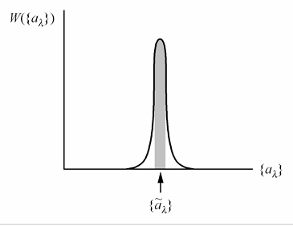
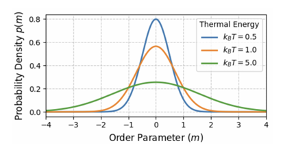
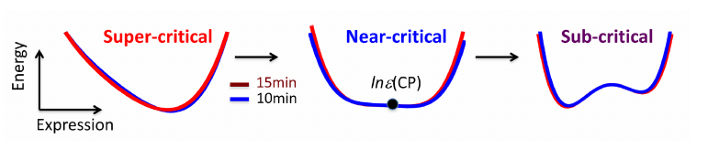
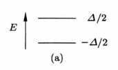
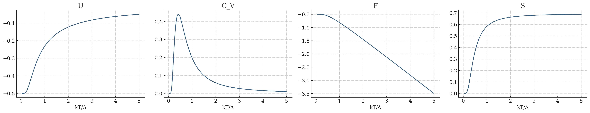
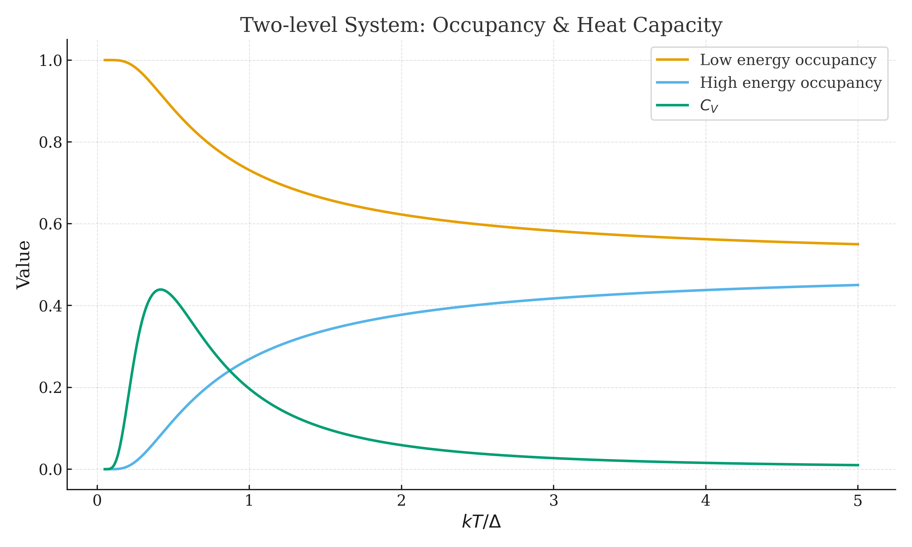

# 统计力学 笔记 Statistical Dynamics

## 1. 统计力学的基本假设

统计力学需要研究的体系是大量粒子组成的体系，核心是**概率**。

微观上的过程是可逆的，而很多宏观过程是不可逆的，原因不是因为动力学禁阻，而是因为概率很小。

可以看作是多对一的映射（微观粒子的位置&动量/量子数 → 宏观E/N/V）

然而实验无法长期准确观测，我们需要研究微观粒子的集合。

基本假设：等概率原理（约束条件下，所有可能的状态等概率出现（没有特别的优势））

如何确定概率是什么？——最大熵原理（principle of maximum entropy）。

---

### 最大熵原理

熵和不确定性有关。假设对于第 $i$ 种状态出现的概率为 $p_i$ ，我们有*Shannon*信息熵：

$$
S = -k_B\sum_i p_i\ln p_i
$$

> 这是唯一满足以下性质的函数形式：
>
> - 连续性：熵随概率连续变化；
> - 最大性：微观态等概率时，熵达到最大值；
> - 可加性：$S(A+B) = S(A) + \sum p_i S(B|i)$；
> - 零概率下不影响熵：$p_i = 0$ 时不增加熵。

最大熵原理认为：在所有概率分布种，体系取得的是**熵最大的概率分布**。这也对应了该体系的平衡态。

由大数定理可以得到：高自由度下概率会集中处于一个态，而其涨落呈指数级下降。因此对于宏观物体的状态是稳定的。

当然还有可能调节外参量使得出现两个或者多个峰。峰数就对应着相数的概念，这里表示的就是两相或者多相。

现在我们考虑能量约束。对于一个宏观能量恒定的体系：

$$
\begin{cases}
\sum p_i = 1\\
\sum E_ip_i = \ev{E}
\end{cases}
$$

---

## 2. 热力学定律的统计结构

### 2.1 热力学定律

#### 第〇定律

> 若体系A与B、B与C分别处于热平衡，则A与C也处于热平衡。

这告诉我们热平衡具有**传递性**，也就是有一个标量可以刻画热平衡状态，这一状态也被称为**温度**。

考虑最大熵原理：

$$
S = -k_B\sum_i p_i\ln p_i
$$

我们基于上述提到的约束条件进行变分得到：

$$
\delta(-\sum_i p_i\ln p_i+\alpha(1-\sum_i p_i) + \beta(\ev{E} - \sum_i p_iE_i)=0
$$

最终可以得到：

$$
\boxed{p_i = \frac{1}{Z}e^{-\beta E_i} \qc Z(\beta) = \sum_ie^{-\beta E_i}}
$$

我们把 $\beta$ 和 $E_i$ 称为一对**对偶变量**，因为 $\beta$ 是在变分中控制 $E_i$ 的变量。

!!! proof "配分函数的变分推导"

    先对 $p_i$ 进行变分：
    
    $$
    \begin{gathered}
    -\sum_i (\ln p_i + 1)-\alpha(\sum_i 1) - \beta( - \sum_i E_i) = 0 \\
    \sum_i (-\ln p_i - 1 - \alpha - \beta E_i) = 0
    \end{gathered}
    $$
    
    于是我们有：
    
    $$
    p_i = \exp(-\alpha-1-\beta E_i)
    $$
    
    回代到概率限制，有：
    
    $$
    \sum_i p_i = e^{-(\alpha + 1)} \sum_i e^{-\beta E_i} = e^{-(\alpha + 1)} Z = 1
    $$
    
    这对应 $\alpha = \ln Z -1$。带回到 $p_i$ 表达式即有：
    
    $$
    p_i = \frac{1}{Z}e^{-\beta E_i}
    $$

如果两个体系接触达到平衡，平衡态需要满足熵最大：

$$
\delta(S_1 + S_2) = 0
$$

而又由于体系的总能量固定 $U_1 + U_2 = U$，就有：

$$
\begin{gathered}
\pdv{(S_1 + S_2)}{U_1} = \pdv{S_1}{U_1} - \pdv{S_2}{U_2} = 0\\
\pdv{S_1}{U_1} = \pdv{S_2}{U_2}
\end{gathered}
$$

我们定义 $\beta = \pdv{S_1}{U_1}$ 称为热力学beta，再定义 $\beta = 1/k_BT$ 温度，就有：

$$
\beta_1 = \beta_2 \Rightarrow T_1=T_2
$$

这就是温度的定义。

---

#### 第一定律

> 能量在孤立系统中守恒，既不会凭空产生，也不 会凭空消失，只会在不同形式间转化。

我们提到过 $U = \sum p_iE_i$，对其偏导得到：

$$
\dd U = \sum E_i \dd p_i + \sum p_i \dd E_i
$$

如果能级依赖外参量 $\lambda$ ，则进一步化简得到：

$$
\begin{aligned}
\dd U &= \sum E_i \dd p_i + \sum p_i \pdv{E_i}{\lambda}\dd \lambda \\
&= \sum E_i \dd p_i + \ev{\pdv{H}{\lambda}}\dd \lambda \\
&= \delta Q + \delta W
\end{aligned}
$$

其中：

- 第一项代表“热”，即概率分布发生改变；
- 第二项代表“功”，即哈密顿量的结构发生改变。例如理想气体的体积功是 $V$ 变化引起的，则这一项就由 $\ev{\pdv{H}{V}}$ 产生。

---

#### 第二定律

> 孤立系统会自发演化到熵增加的方向，即趋向最可能的宏观状态。

假设对于一个能量固定的系统（ENV系统），由于等概率假设，所有状态概率相等：

$$
p_i = \frac{1}{\Omega}
$$

将热力学概率带入到*Shannon*熵：

$$
S = -k_B \sum \frac{1}{\Omega} \ln \frac{1}{\Omega} = k_B \ln \Omega
$$

这就是**Boltzmann熵公式**。

同样我们考虑两个孤立体系，它们的能量分别为 $E_A$ 和 $E - E_A$，对应微观状态数分别为 $\Omega(E_A)$ 和 $\Omega(E-E_A)$ ，于是总的微观状态数是 $\Omega(E_A) \cdot \Omega(E-E_A)$ 。于是宏观能量分配为 $E_A$ 的概率：

$$
P(E_A) \propto \Omega(E_A) \cdot \Omega(E-E_A)
$$

取对数得到：

$$
\ln P(E_A) \propto \ln \Omega(E_A) + \ln \Omega(E-E_A) \propto S_A(E_A) + S_B(E-E_A) = S_{tot}(E_A)
$$

我们想让概率最大，也就是：

$$
P(E_A) \propto e^{\frac{S_tot(E_A)}{k_B}}\ 达到最大值
$$

也就是**最大概率等价于总熵最大**。

从一阶导数来看：

$$
\dv{S_{tot}}{E_A} = \pdv{S_A}{E_A} + \pdv{S_B}{E_A} = \pdv{S_A}{E_A} - \pdv{S_B}{E_B} = 0
$$

这也就对应了温度相等的条件。

从二阶导数来看：

$$
\dv[2]{S_{tot}}{E_A} = \pdv[2]{S_A}{E_A} + \pdv[2]{S_B}{E_B} < 0
$$

同时有：

$$
\dv[2]{S_{tot}}{E_A} = -\frac{1}{T^2C} < 0 \Rightarrow C>0
$$

这就证明了为了让熵达到极大值稳定点，必须要满足热容为正。

---

我们尝试构造偏离极值点的情况，这需要用到Taylor展开，展开到第二项：

$$
S(E_A) = S(E_A^*) + \frac12 {\pdv[2]{S}{E}}(E-E_A^*)^2
$$

带入到概率分布得：

$$
P(E_A) \sim \exp(-\frac{(E_A-E_A^*)^2}{2k_BT^2C})
$$

由于 $\Delta E/E \sim N^{-1/2}$，偏离最大值的概率几乎为0。

---

### 2.2 最大熵原理与平衡分布

#### 概率和控制变量

我们之前提到过能量约束下的分布：

$$
\boxed{p_i = \frac{1}{Z}e^{-\beta E_i} \qc Z(\beta) = \sum_ie^{-\beta E_i}}
$$

接下来我们考虑允许粒子数的涨落，也就是：

$$
N = \sum_i p_i N_i
$$

再通过变分法可以得到：

$$
p_i = \frac{1}{\Xi} e^{-\beta(E_i - \mu N)} \qc \Xi = \sum_i e^{-\beta(E_i - \mu N)}
$$

这里的 $\mu$ 称为化学势，是约束粒子数 $N$ 的对偶变量。

---

#### 状态函数

在统计力学中，宏观量定义为微观量的统计平均。由于可能存在的涨落，所以我们需要定义热力学极限：

$$
N\to \infty,\ V\to\infty,\ \rho = N/V=const.
$$

此时：

- 相对涨落基本为0；
- 宏观量几乎可以视为确定值，即有函数关系 $U = U(S,V,N)$。这也是状态函数的来源。

我们可以从全微分得到：

$$
T = \qty(\pdv{U}{S})_{V,N}\qc P=\qty(\pdv{U}{V})_{S,N}\qc \mu =\qty(\pdv{U}{N})_{S,V}
$$

因此我们称 $T,P,\mu$ 三者为一组**共轭变量**。

当然，我们也可以用这种方式展开熵。我们有：

$$
\dd{S} = \frac{1}{T}\dd{E} - \frac{P}{T}\dd{V} + \frac{\mu}{T}\dd{N}
$$

这样就有：

$$
\frac{1}{T} = \qty(\pdv{S}{E})_{N,V}\qc\frac{P}{T} = \qty(\pdv{S}{V})_{E,N}\qc\frac{\mu}{T} = \qty(\pdv{S}{N})_{E,V}\qc
$$

因此我们可以说：**这三个共轭变量都是熵在不同约束下的偏导数**，也就是温度，压强，化学势**并非独立引入的量**。

---

当然问题就来了：比方说对于能量 $E = E(S,V,T)$ 来说，如果实验控制的是温度 $T$ 而不是熵 $S$ ，我们就需要构造一个新的函数了。我们通过**Legendre变换**实现这一点。

> 假设有：
>
> $$
> \dd{f(x_1,\cdots,x_n)} = \pdv{f}{x1} \dd{x_1} +\cdots  = p_1\dd{x_1} + \cdots
> $$
>
> 就有：
>
> $$
> \dd(f-x_1p_1) = \dd{f} - x_1\dd{p_1} + p_1\dd{x_1} = -x_1\dd{p_1} + p_2\dd{x_2} + \cdots
> $$
>
> 这样就可以得到以 $p_1$ 为变量的新的函数了。

考虑系统和一个温度为 $T$ 的足够大的热库接触，考虑熵最大原理，这就有：

$$
\var{S}_{tot} = \var{S}_{sys} + \var{S}_{env} = \var{S} - \frac{\var{E}}{T}=0
$$

这样右边就等价于 $\var{(E-TS)} = 0$，也就是得到了一个新的函数：

$$
F = E-TS
$$

这就是 **Helmholtz自由能**。也就是此时平衡态由 $\var{F} = 0$ 决定。我们也可以从基本方程看出这一点：

$$
\dd{F} = -S\dd{T}-P\dd{V} + \mu \dd{N}
$$

这就将变量变成 $(T,V,N)$ 三者了。

---

#### 响应函数

我们来求等温压缩率 $\kappa_T$，这对应的是等温状态下的状态函数，也就是Helmholtz自由能：

$$
\kappa_T = -\frac{1}{V}\qty(\pdv{P}{V})_{T,N} = -\frac{1}{V}\frac{1}{\qty(\pdv*{P}{V})_{T,N}} = \frac{1}{V}\qty(\pdv[2]{F}{V})_{T,N}^{-1}
$$

热力学稳定性要求：等温压缩率 $\kappa_T$ 必须为正值。这意味着 $\pdv*[2]{F}{V} > 0$，也就是稳定状态处于 $F$ 对体积 $V$的极小值。

同样的方法，我们来看定容热容 $C_V$：

$$
C_V= T\qty(\pdv{S}{T})_{V,N} = -T\qty(\pdv[2]{F}{T})_{V,N}
$$

定容热容 $C_V$ 必须为正值，这意味着 $\pdv*[2]{F}{T} < 0$，也就是稳定状态处于 $F$ 对温度 $T$ 的极大值。

---

#### 其他热力学势

类似地，还可以通过Legendre变换构造其他热力学量。其本质上都是通过添加约束条件引入其他Lagrange乘子：

| 控制变量  | 约束                                     | Lagrange乘子           | 对应热力学势      |
| --------- | ---------------------------------------- | ---------------------- | ----------------- |
| $E,V,N$   | 无                                       | 0                      | $S(E,V,N)$        |
| $T,V,N$   | 平均能量 $\ev{E} = \sum_i{E_i}$          | $\beta = 1/k_BT$       | $F(T,V,N)$        |
| $T,V,\mu$ | 平均能量和粒子数 $\ev{N} = \sum_i N_i$   | $\beta$ 和 $-\beta\mu$ | $\Omega(T,V,\mu)$ |
| $T,p,N$   | 平均能量和平均体积 $\ev{V} = \sum_i V_i$ | $\beta$ 和 $\beta p$   | $G(T,p,N)$        |

---

### 2.3 熵函数的结构

#### 单峰熵函数

前面已经说过：

$$
P(E_A) \sim \exp(-\frac{(E_A-E_A^*)^2}{2k_BT^2C})
$$

可以得到：

$$
\ev{(\Delta E)^2} = -\frac{k_B}{S''(E_0)} \sim k_B TC_V
$$

这意味着在高温下会导致分布展宽，涨落增强。

同时我们可以看出：**熵函数的稳定性由曲率决定**。当曲率结构较大时，对应稳定性较大。

---

#### 多峰波函数

调控参数不同，对应平衡状态时取到的极值也不同。一般而言：

- 孤立系统：熵最大
- 非孤立系统：熵最小

对于被调控的量 $X$，当两个极值满足：

$$
X_A = X_B
$$

对应有两个相同的热力学势。此时对应相平衡条件（即温度，压力，化学势相等）。

从统计的角度来看，这对应体系有两个等高的主峰，并有相同的统计权重。

---

#### 热力学第三定律

> $$
> \lim_{T\to 0}S(T,X) = k_B \ln g_0
> $$
>
> $g_0$ 为基态简并度。若基态唯一，则 $S \to 0$，此时热容 $C = T(\pdv*{S}{T}) = 0$。

假设基态能量为 $E_0$，当 $T\to0$ 时：

$$
k_BT \ll E_n - E_0
$$

也就是：

$$
e^{-E_n/k_BT} \ll e^{-E_0/k_BT}
$$

这也就是说，在极低温下激发态的分布都趋于0，于是基态概率：

$$
p_i = \frac{1}{g_0}
$$

代入熵的定义：

$$
S = -k_B \sum_i p_i\ln p_i = k_B \ln g_0
$$

这也规定了熵函数的**边界结构**：保证在 $T\to 0$ 时熵函数有确定值。

---

### 2.4 熵函数的演化

对于一个体系的自发演化方向时，始终考虑总熵增加：

$$
\Delta S_{total} = \Delta S + \Delta S_{env} \ge 0
$$

对于一个恒温恒容条件，有：

$$
\Delta S_{total} = \Delta S - \Delta U/T = -\Delta F/T
$$

对应极值函数为 $\Delta F\le 0$，即自由能最小。

恒温恒压有：

$$
\Delta S_{total} = \Delta S - (\Delta U + P \Delta V)/T = -\Delta G/T
$$

对应极值函数为 $\Delta G\le 0$，即Gibbs自由能最小。

---

## 3. 系综理论

系综就是“固定什么变量”：

| 控制变量  | 约束                                   | 对应概率分布                                | 系综       |
| --------- | -------------------------------------- | ------------------------------------------- | ---------- |
| $E,V,N$   | 无                                     | $p_i = \frac{1}{\Omega(E,V,N)}$             | 微正则系综 |
| $T,V,N$   | 平均能量 $\ev{E} = \sum_i{E_i}$        | $ p_i\propto e^{-\beta E_i}$                | 正则系综   |
| $T,V,\mu$ | 平均能量和粒子数 $\ev{N} = \sum_i N_i$ | $p_{i,N}\propto e^{-\beta (E_{i,N}-\mu N)}$ | 巨正则系综 |

### 3.1 微正则系综

实际上就是作变分：

$$
\var(-p_i\sum_i\ln p_i + \alpha\qty(\sum_ip_i - 1)) = 0
$$

可以得到所有 $p_i$ 都相同，也就是：

$$
p_i = \frac{1}{\Omega(E,V,N)}
$$

带入到 Shannon 熵就得到了 **Boltzmann 熵公式**：

$$
S = k_B\ln \Omega(E,N,V)
$$

根据我们前面定义：

$$
\frac1T = \qty(\pdv{S}{E})_{N,V} = k_B \pdv{\ln \Omega}{E}
$$

---

在量子表述下，密度算符可以表示为：

$$
\hat \rho = \sum_m w_m \op{\psi_m}
$$

其中 $w_i$ 为该波函数的概率。

在微正则系综下：

$$
\hat\rho_{m} = \frac{1}{\Omega(E,N,V)}\sum_{k=1}^\Omega \op{k}=\frac{1}{\Omega(E,N,V)}\hat\rho_E
$$

这个时候用von Neumann熵：

$$
S = -k_B\Tr(\hat\rho\ln\hat\rho) = k_B\ln\Omega(E,N,V)
$$

这和经典统计力学一致。

---

### 3.2 正则系综

虽然不能直接对系统用微观状态数，但假设系统A和一个热库B接触，这样系统和热库就可以视为一个孤立系统。概率和热库的微观状态数有关：

$$
p_i = 1/\Omega_B(E_{tot} - E_i)
$$

利用热库熵：

$$
S_B(E_B) = k_B\ln\Omega(E_B)\Rightarrow \Omega_B(E_{tot} - E_i)=\exp(\frac{S_B(E_{tot}-E_i)}{k_B})
$$

泰勒展开热库的熵，因为热库能量变化很小：

$$
S_B(E_{tot}-E_i) = S_B(E_{tot}) - \pdv{S_B}{E_B}E_i = S_B(E_{tot})-\frac{E_i}{T}
$$

这样我们就知道：

$$
p_i \propto e^{-\beta E_i}
$$

由此就归一化配分函数，得到：

$$
p_i = \frac{1}{Z}e^{-\beta E_i} \qc Z(\beta) = \sum_ie^{-\beta E_i}
$$

---

体系的平均能量：

$$
U=\ev{E} = \frac{1}{Z}\sum_i E_ie^{-\beta E_i} = -\frac1Z\pdv{Z}{\beta} = -\pdv{\ln Z}{\beta}
$$

能量涨落：

$$
\begin{aligned}
\ev{(\Delta E)^2} &= \ev{E^2} - \ev{E}^2 \\
&= \frac{1}{Z}\sum_i E^2_ie^{-\beta E_i}-\qty(-\pdv{\ln Z}{\beta})^2\\
&= \frac{1}{Z}\pdv[2]{Z}{\beta}-\qty(\pdv{\ln Z}{\beta})^2\\
&= \pdv[2]{\ln Z}{\beta}
\end{aligned}
$$

定容热容：

$$
C_v = -\pdv{T}\pdv{\ln Z}{\beta} = -\pdv{T}{\beta}\pdv[2]{\ln Z}{\beta} = \frac{1}{kT^2}\pdv[2]{\ln Z}{\beta}
$$

这可以和能量涨落关联起来：

$$
C_v = \frac{1}{kT^2}\ev{(\Delta E)^2}
$$

熵：

$$
\begin{aligned}
S &= -k\sum_i P_i\ln P_i \\
&= k\sum_i P_i (\beta E_i + \ln Z) \\
&= k(\beta U + \ln Z) = \frac{U}{T} + k\ln Z
\end{aligned}
$$

自由能：

$$
\begin{aligned}
F &= U-TS \\
&= U+k_BT\qty(\sum_i p_i(-\beta E_i-\ln Z))\\
&= U-U-k_BT\ln Z = k_B T\ln Z
\end{aligned}
$$

---

对固体而言，我们可以把每个原子都视为谐振子，与周围的6个原子相连接。对于单个原子的谐振子有：

$$
Z_1 = \sum_{n=0}^\infty e^{-\beta\hbar\omega(n+1/2)} = \frac{e^{-\beta\hbar\omega/2}}{1-e^{-\beta\hbar\omega}}
$$

总共有3N个谐振子：

$$
Z = (Z_1)^{3N}
$$

这样体系的内能有：

$$
\begin{aligned}
U &= -\pdv{\ln Z}{\beta}\\
&= -3N\pdv{\beta}(-\frac{\beta\hbar\omega}{2}-\ln(1-e^{-\beta\hbar\omega}))\\
&= 3N\qty(\frac{\hbar\omega}{2}+\frac{\hbar\omega}{e^{\beta\hbar\omega}-1})
\end{aligned}
$$

热容有：

$$
C_v = 3Nk_B\frac{(\beta\hbar\omega)^2e^{\beta\hbar\omega}}{(e^{-\beta\hbar\omega}-1)^2}
$$

这就对应两个极限：

- 高温下：$C_v = 3Nk_B$
- 低温下：$C_v = 3Nk_B(\beta\hbar\omega)^2e^{-\beta\hbar\omega}$

---

### 3.3 巨正则系综

懒得写了，直接：

$$
p_i = \frac{1}{\Xi} e^{-\beta(E_i - \mu N)} \qc \Xi = \sum_i e^{-\beta(E_i - \mu N)}
$$

平均粒子数：

$$
\overline N = \sum_i N_iP_i = \frac{\sum_i Ne^{\beta(\mu N - E_i)}}{\sum_i e^{\beta(\mu N - E_i)}} = \frac{1}{\beta \Xi} \pqty{\pdv{\Xi}{\mu}}_\beta = k_BT\pqty{\pdv{\ln \Xi}{\mu}}_\beta
$$

平均能量：

$$
\begin{aligned}
U = \ev{E} = \sum_i E_iP_i &= \frac{\sum_i E_ie^{\beta(\mu N - E_i)}}{\sum_i e^{\beta(\mu N - E_i)}} \\
&= -\frac{1}{\Xi} \pqty{\pdv{\Xi}{\beta}}_\mu + \mu \overline N \\
&=  - \pqty{\pdv{\ln \Xi}{\beta}}_\mu + \mu \overline N
\end{aligned}
$$

熵：

$$
\begin{aligned}
S = -k_B\sum_i P_i \ln {P_i} &= -k_B\frac{\sum_i (\beta(\mu N_i - E_i) - \ln \Xi)e^{\beta(\mu N - E_i)}}{\sum_i e^{\beta(\mu N - E_i)}} \\
&= \frac{-\mu \sum_i N_ie^{\beta(\mu N - E_i)} + \sum_i E_ie^{\beta(\mu N - E_i)} + \beta\ln \Xi}{T\Xi} \\
&= \frac{U - \mu \overline N + k_BT\ln \Xi}{T}
\end{aligned}
$$

这就得到**巨热力学势**：

$$
\Omega = \ev{E}-TS-\mu\ev{N} = k_BT\ln\Xi
$$

---

定义粒子数密度 $n=N/V$，这样等温压缩率：

$$
\kappa_T = -\frac1V\qty(\pdv{V}{P})_T = \frac1n\qty(\pdv{n}{P})_T
$$

又有巨热力学势：

$$
\Omega = U-TS-\mu N = -PV
$$

于是：

$$
\dd{\Omega} = -P\dd{V}-V\dd{P}
$$

又有：

$$
\dd{\Omega} = -P\dd{V}-S\dd{T}-N\dd{\mu}
$$

于是就有：

$$
\dd{P} = s\dd{T}+n\dd{\mu}
$$

这就得到了：

$$
n = \qty(\pdv{P}{\mu})_T
$$

通过链式法则：

$$
\qty(\pdv{n}{\mu})_T =\qty(\pdv{n}{P})_T\qty(\pdv{P}{\mu})_T = n^2\kappa_T
$$

于是粒子数涨落对应：

$$
\begin{aligned}
\ev{(\Delta N)^2} = k_BT\qty(\pdv{\ev{N}}{\mu})_T = k_BT\ev{N}n\kappa_T
\end{aligned}
$$

也就是粒子数涨落同样和宏观有关系。

对于能量和粒子数涨落量都和粒子数有关系，也就是：

$$
\ev{(\Delta X)^2}\sim N
$$

但是考虑相对偏差：

$$
\frac{\sqrt{\ev{(\Delta X)^2}}}{\ev{X}}\sim\frac{1}{\sqrt{N}}
$$

这同样在大体系下趋于0.

---

## 4. 经典统计力学

### 4.1 理想气体-连续体系

已经知道：

$$
Z_N = \frac1{N!h^{3N}} \int \prod_{i=1}^N e^{-\beta H(\vb p,\vb q)} \dd {\vb p}\dd {\vb q}
$$

当气体足够稀薄的情况下，假设势能项为0，那么势能积分为 $V$，也就是：

$$
Z_N = \frac{V}{N!} \pqty{\frac{2\pi mkT}{h^2}}^{3N/2} = \frac1{N!}\frac{V}{\Lambda^3}
$$

在知道理想气体的配分函数后，我们也不难把其他态函数求出来了。首先是内能：

$$
\begin{aligned}
U = -\dv{\ln Z_N}{\beta} &= -\dv{(N\ln V - 3N\ln \Lambda - \ln N!)}{\beta} \\
&= -\dv{( \frac32N\ln T +Const.)}{\beta} \\
&= \frac 32 Nk_BT
\end{aligned}
$$

由于整个式子里只有 $\Lambda \propto T^{-1/2}$ 和温度项有关，其他项都可作为常数项消去。由此导出的热容 $C_V = \frac 32 Nk$ 和能均分原理导出相同。

自由能（利用Stiring近似 $\ln N! \approx N\ln N - N$ ）：

$$
\begin{aligned}
F = -k_BT\ln Z_N &= -k_BT(N\ln V - 3N\ln \Lambda - \ln N!)\\
&=  Nk_BT(\ln (\frac NV\Lambda^3)  - 1) = Nk_BT(\ln(n\Lambda^3)-1)
\end{aligned}
$$

于是压强：

$$
p = -(\pdv{F}{V})_T = Nk_BT/V = nk_BT
$$

这就是**理想气体方程**！我们也可以求出焓：

$$
H = U+pV = \frac 52 Nk_BT
$$

接下来我们来求熵：

$$
\begin{aligned}
S &= \frac{U-F}{T} \\
&= \frac{\frac32 Nk_BT - k_BTN\ln V - 3k_BTN\ln \Lambda - k_BT(N\ln N - N)}{T} \\
&= \frac32 Nk_B + Nk_B \ln(\frac{V\mathrm{e}}{N\Lambda^3}) \\
&= \boxed{Nk\pqty{\frac52 - \ln{n\Lambda^3}}}
\end{aligned}
$$

这种表示方法被称为**Sackur-Tetrode 方程**。

我们还可以得到吉布斯自由能：

$$
G = H-TS = Nk_BT\ln(n\Lambda^3)
$$

化学势：

$$
\mu = k_BT(\ln(n\Lambda^3) - 1) + Nk_BT(\frac 1N) = k_BT\ln(n\Lambda^3)
$$

---

### 4.2 离散体系

#### 二能级系统

假设对于二能级系统，有：

其配分函数：

$$
Z = e^{-\frac{\beta\Delta}{2}} + e^{\frac{\beta\Delta}{2}} = 2\cosh{\frac{\beta\Delta}{2}}
$$

利用上述公式得到：

$$
\begin{gathered}
U = -\dv{\ln Z}{\beta} = -\frac{\Delta}{2}\tanh(\frac{\beta\Delta}{2})\\
C_V = (\pdv{U}{T})_V = k(\frac{\beta\Delta}{2})^2\sech^2(\frac{\beta\Delta}{2}) \\
F = -k_BT\ln Z = -k_BT\ln(2\cosh(\frac{\beta\Delta}{2})) \\
S = \frac{U-F}{T} = -\frac{\Delta}{2T} \tanh(\frac{\beta\Delta}{2}) + k\ln(2\cosh(\frac{\beta\Delta}{2}))
\end{gathered}
$$

这里出现了一些很抽象的事情：热容随温度会到达一个极大值，之后又随之衰减。事实上这被称为**肖基特反常**（Schottky anomaly），(i) 当低温时，只有低能级被占据且温度增加对其改变不大，(ii) 而高温时两个能级被同等占据，温度增加也没有什么改变。

> 当粒子数反转时，对应出现负温度状态。

---

#### 顺磁性固体

我们都知道一个基本粒子的自旋角动量等于 $\pm \frac12$ ，考虑其在磁场$B$中，这个粒子可以存在于两种本征态之一（ $\ket{\uparrow}$ 对应角动量平行于$B$， $\ket{\downarrow}$ 对应角动量反平行于$B$），他们的**磁矩**分别为 $-\mu_B$ 和 $+\mu_B$（玻尔磁子 $\mu_B = eh/2m$ ）。于是单粒子的配分函数：

$$
Z_1 = e^{\beta\mu_B B} + e^{-\beta\mu_B B} = 2\cosh{\beta\mu_BB}
$$

假设粒子间没有任何相互作用，则：

$$
Z_N = Z_1^N
$$

于是我们有：

$$
F = -kT\ln{Z_N} = -NkT\ln(2\cosh{\beta\mu_BB})
$$

之后我们即可求出单位体积内的磁矩：

$$
m = -\pqty{\pdv{F}{B}}_T = N\mu_B \tanh\pqty{\beta\mu_B B}
$$

对结果进行分析，我们发现当磁场$B$足够强时，能级趋向于 $N\mu_B$ ，对应几乎所有粒子都有极大概率处于 $\ket{\uparrow}$ 组态；而当磁场$B$在0附近时，曲线的行为类似于线性。事实上利用等价无穷小 $\tanh x \sim x$：

$$
m_{\sim 0} = \frac{N\mu_B^2B}{kT}, \quad M = m/V = \frac{N\mu_B^2B}{VkT}
$$

其中$M$为单位体积的磁矩。对弱磁材料，可认为 $M\approx \chi H$ ，其中 $\chi \ll 1$ 为磁化率。我们有：

$$
B = \mu_0(1+\chi)H \approx \frac{\mu_0M}{\chi}
$$

于是有：

$$
\boxed{\chi \approx \frac{N\mu_0\mu_B^2B}{VkT},\quad \chi\propto 1/T}
$$

这就是**居里定律**（Curie's Law）。

---

#### 一般能谱

前面一节我们说过，在高温下热容可以由能均分定理给出，这也可以由配分函数得到。假设在高温下能级可以视作是连续的：

$$
\begin{aligned}
Z_{rot} = \sum (2J+1)e^{-\frac{\Theta}{T}J(J+1)} &= \int_0^\infty (2J+1)e^{-\frac{\Theta}{T}J(J+1)} \dd J \\
&= -\left[ \frac{T}{\Theta}e^{-\frac{\Theta}{T} J(J+1)} \right]_0^\infty = \frac{T}{\Theta} = \frac{2IkT}{\hbar^2} \\
\end{aligned}
$$

于是 $U = -\dv{\ln Z}{\beta} = \frac 1\beta = k_BT$ ，而 $C_V = k$ 。同理对于振动能级：

$$
\begin{aligned}
Z_{vib} = \sum e^{-\beta(\frac12 + n)\hbar\omega} &= \int_0^\infty e^{-\beta(\frac12 + n)\hbar\omega} \dd n \\
&= e^{-\beta\hbar\omega/2}(\frac{1}{\beta\hbar\omega}\left[e^{-\beta n\hbar\omega}\right]_0^\infty) = \frac{e^{-\beta\hbar\omega/2}}{\beta\hbar\omega}
\end{aligned}
$$

于是 $U = -\dv{\ln Z}{\beta} = \frac{\hbar\omega}{2} + \frac{1}{\beta}$ ，而 $C_V = k$ 。注意对高温下的振动能级而言，其**内能与零点能有关，而热容与零点能无关。**

---

#### 相互作用体系

直接看Thermodynamic_2吧。

---

## 5. 量子理论

#### 判据

已经提到过：$n\Lambda^3 \gg 1$ 时，对应粒子在态空间分布稀疏；$n\Lambda^3 \ll 1$ 时，对应多个粒子占据态空间中的同一个态。

经典统计有高温极限，即 $kT\gg\Delta$；但量子统计能级间距远小于 $kT$。

---

#### 基本假设

我们认为粒子是不可区分的，即交换两个粒子将保持可观测量不变。于是至多改变一个相位：

$$
\abs{\Psi(q_1,q_2)}^2 = \abs{\Psi(q_2,q_1)}^2 \Rightarrow \Psi(q_1,q_2) = e^{i\theta}\Psi(q_2,q_1)
$$

又由于交换两次回到原状态，因此必有：

$$
\Psi(q_1,q_2) = \pm \Psi(q_2,q_1)
$$

- 对称波函数（+）：对应玻色子。多个粒子可占据相同量子态。
- 反对称波函数（-）：对应费米子。若两个粒子占据相同量子态，则 $\Psi=0$，因此**每个量子态至多被一个粒子占据**。

同样用最大熵原理求，此时我们知道各个能级的占据数的集合 $\qty{n_i}$，对应要求的概率是 $p(\qty{n_i})$。满足约束：

$$
\begin{gathered}
\sum_{\qty{n_i}}p(\qty{n_i})=1\\
\sum_{\qty{n_i}}p(\qty{n_i})\sum_{i}n_i = N\\
\sum_{\qty{n_i}}p(\qty{n_i})\sum_{i}n_i\epsilon_i = U
\end{gathered}
$$

最终得到：

$$
p(\qty{n_i}) = \frac1\Xi e^{-\beta\sum_i n_i(\epsilon_i-\mu)}
$$

对应的配分函数：

$$
\Xi = \sum_{\qty{n_i}} e^{-\beta\sum_i n_i(\epsilon_i-\mu)}
$$

类比单粒子配分函数，定义单能级配分函数，其中 $n_i$ 代表第 $i$ 个能级的占据数：

$$
\Xi_i =\sum_{n_i}e^{-\beta n_i(\epsilon_i-\mu)}\qc\Xi = \prod_i \Xi_i
$$

对于玻色子，单粒子配分函数就是求和：

$$
\Xi_i = \frac{1}{1-e^{-\beta(\epsilon_i-\mu)}}
$$

费米子只有两个求和：

$$
\Xi_i = 1+e^{-\beta(\epsilon_i - \mu)}
$$

> 可统一表达为：
>
> $$
> \Xi = \prod_i (1\mp e^{-\beta(\epsilon_i- \mu)})^{\mp 1}
> $$

由此可以得到平均占据数：

$$
\begin{aligned}
\ev{n_i} &= \sum_{n_i} n_iP(n_i)\\
&= \frac{1}{\Xi_1} \sum_{n_i} n_ie^{-\beta n_i(\epsilon_i-\mu)}\\
&= -\frac1\beta \pdv{\ln\Xi_i}{\epsilon_i}
\end{aligned}
$$

应用到玻色子得到Bose-Eistein分布：

$$
\ev{n_i} = \frac{1}{e^{\beta(\epsilon_i - \mu)}-1}
$$

应用在费米子得到Fermi-Dirac分布：

$$
\ev{n_i} = \frac{1}{e^{\beta(\epsilon_i - \mu)}+1}
$$

这两个分布在高温情况下都会退化成经典极限，也就是 Maxwell-Boltzmann 分布：

$$
\ev{n_i} \approx e^{-\beta(\epsilon_i-\mu)}
$$
