# 统计力学 笔记 Statistical Dynamics

## 1. 统计力学的基本假设

统计力学需要研究的体系是大量粒子组成的体系，核心是 **概率**。

微观上的过程是可逆的，而很多宏观过程是不可逆的，原因不是因为动力学禁阻，而是因为概率很小。

可以看作是多对一的映射（微观粒子的位置&动量/量子数 → 宏观 E/N/V）

然而实验无法长期准确观测，我们需要研究微观粒子的集合。

基本假设：等概率原理（约束条件下，所有可能的状态等概率出现（没有特别的优势））

如何确定概率是什么？——最大熵原理（principle of maximum entropy）。

---

### 最大熵原理

熵和不确定性有关。假设对于第 $i$ 种状态出现的概率为 $p_i$ ，我们有 *Shannon* 信息熵：

$$
S = -k_B\sum_i p_i\ln p_i
$$

> 这是唯一满足以下性质的函数形式：
>
> - 连续性：熵随概率连续变化；
> - 最大性：微观态等概率时，熵达到最大值；
> - 可加性：$S(A+B) = S(A) + \sum p_i S(B|i)$；
> - 零概率下不影响熵：$p_i = 0$ 时不增加熵。

最大熵原理认为：在所有概率分布种，体系取得的是 **熵最大的概率分布**。这也对应了该体系的平衡态。

由大数定理可以得到：高自由度下概率会集中处于一个态，而其涨落呈指数级下降。因此对于宏观物体的状态是稳定的。

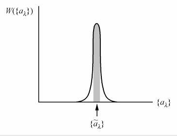

当然还有可能调节外参量使得出现两个或者多个峰。峰数就对应着相数的概念，这里表示的就是两相或者多相。

现在我们考虑能量约束。对于一个宏观能量恒定的体系：

$$
\begin{cases}
\sum p_i = 1\\
\sum E_ip_i = \ev{E}
\end{cases}
$$

---

## 2. 热力学定律的统计结构

### 2.1 热力学定律

#### 第 〇 定律

> 若体系 A 与 B、B 与 C 分别处于热平衡，则 A 与 C 也处于热平衡。

这告诉我们热平衡具有 **传递性**，也就是有一个标量可以刻画热平衡状态，这一状态也被称为 **温度**。

考虑最大熵原理：

$$
S = -k_B\sum_i p_i\ln p_i
$$

我们基于上述提到的约束条件进行变分得到：

$$
\delta(-\sum_i p_i\ln p_i+\alpha(1-\sum_i p_i) + \beta(\ev{E} - \sum_i p_iE_i)= 0
$$

最终可以得到：

$$
\boxed{p_i = \frac{1}{Z}e^{-\beta E_i} \qc Z(\beta) = \sum_ie^{-\beta E_i}}
$$

我们把 $\beta$ 和 $E_i$ 称为一对 **对偶变量**，因为 $\beta$ 是在变分中控制 $E_i$ 的变量。

!!! proof "配分函数的变分推导"

    先对 $p_i$ 进行变分：
    
    $$
    \begin{gathered}
    -\sum_i (\ln p_i + 1)-\alpha(\sum_i 1) - \beta( - \sum_i E_i) = 0 \\
    \sum_i (-\ln p_i - 1 - \alpha - \beta E_i) = 0
    \end{gathered}
    $$
    
    于是我们有：
    
    $$
    p_i = \exp(-\alpha-1-\beta E_i)
    $$
    
    回代到概率限制，有：
    
    $$
    \sum_i p_i = e^{-(\alpha + 1)} \sum_i e^{-\beta E_i} = e^{-(\alpha + 1)} Z = 1
    $$
    
    这对应 $\alpha = \ln Z -1$。带回到 $p_i$ 表达式即有：
    
    $$
    p_i = \frac{1}{Z}e^{-\beta E_i}
    $$

如果两个体系接触达到平衡，平衡态需要满足熵最大：

$$
\delta(S_1 + S_2) = 0
$$

而又由于体系的总能量固定 $U_1 + U_2 = U$，就有：

$$
\begin{gathered}
\pdv{(S_1 + S_2)}{U_1} = \pdv{S_1}{U_1} - \pdv{S_2}{U_2} = 0\\
\pdv{S_1}{U_1} = \pdv{S_2}{U_2}
\end{gathered}
$$

我们定义 $\beta = \pdv{S_1}{U_1}$ 称为热力学 beta，再定义 $\beta = 1/k_BT$ 温度，就有：

$$
\beta_1 = \beta_2 \Rightarrow T_1 = T_2
$$

这就是温度的定义。

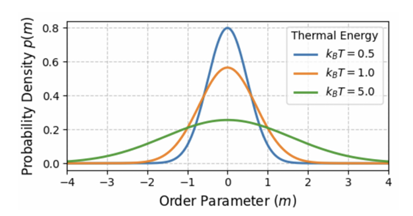

---

#### 第一定律

> 能量在孤立系统中守恒，既不会凭空产生，也不 会凭空消失，只会在不同形式间转化。

我们提到过 $U = \sum p_iE_i$，对其偏导得到：

$$
\dd U = \sum E_i \dd p_i + \sum p_i \dd E_i
$$

如果能级依赖外参量 $\lambda$ ，则进一步化简得到：

$$
\begin{aligned}
\dd U &= \sum E_i \dd p_i + \sum p_i \pdv{E_i}{\lambda}\dd \lambda \\
&= \sum E_i \dd p_i + \ev{\pdv{H}{\lambda}}\dd \lambda \\
&= \delta Q + \delta W
\end{aligned}
$$

其中：

- 第一项代表“热”，即概率分布发生改变；
- 第二项代表“功”，即哈密顿量的结构发生改变。例如理想气体的体积功是 $V$ 变化引起的，则这一项就由 $\ev{\pdv{H}{V}}$ 产生。

---

#### 第二定律

> 孤立系统会自发演化到熵增加的方向，即趋向最可能的宏观状态。

假设对于一个能量固定的系统（ENV 系统），由于等概率假设，所有状态概率相等：

$$
p_i = \frac{1}{\Omega}
$$

将热力学概率带入到 *Shannon* 熵：

$$
S = -k_B \sum \frac{1}{\Omega} \ln \frac{1}{\Omega} = k_B \ln \Omega
$$

这就是 **Boltzmann 熵公式**。

同样我们考虑两个孤立体系，它们的能量分别为 $E_A$ 和 $E - E_A$，对应微观状态数分别为 $\Omega(E_A)$ 和 $\Omega(E-E_A)$ ，于是总的微观状态数是 $\Omega(E_A) \cdot \Omega(E-E_A)$ 。于是宏观能量分配为 $E_A$ 的概率：

$$
P(E_A) \propto \Omega(E_A) \cdot \Omega(E-E_A)
$$

取对数得到：

$$
\ln P(E_A) \propto \ln \Omega(E_A) + \ln \Omega(E-E_A) \propto S_A(E_A) + S_B(E-E_A) = S_{tot}(E_A)
$$

我们想让概率最大，也就是：

$$
P(E_A) \propto e^{\frac{S_tot(E_A)}{k_B}}\ 达到最大值
$$

也就是 **最大概率等价于总熵最大**。

从一阶导数来看：

$$
\dv{S_{tot}}{E_A} = \pdv{S_A}{E_A} + \pdv{S_B}{E_A} = \pdv{S_A}{E_A} - \pdv{S_B}{E_B} = 0
$$

这也就对应了温度相等的条件。

从二阶导数来看：

$$
\dv [2]{S_{tot}}{E_A} = \pdv [2]{S_A}{E_A} + \pdv [2]{S_B}{E_B} < 0
$$

同时有：

$$
\dv [2]{S_{tot}}{E_A} = -\frac{1}{T^2C} < 0 \Rightarrow C> 0
$$

这就证明了为了让熵达到极大值稳定点，必须要满足热容为正。

---

我们尝试构造偏离极值点的情况，这需要用到 Taylor 展开，展开到第二项：

$$
S(E_A) = S(E_A^*) + \frac12 {\pdv [2]{S}{E}}(E-E_A^*)^2
$$

带入到概率分布得：

$$
P(E_A) \sim \exp(-\frac{(E_A-E_A^*)^2}{2k_BT^2C})
$$

由于 $\Delta E/E \sim N^{-1/2}$，偏离最大值的概率几乎为 0。

---

### 2.2 最大熵原理与平衡分布

#### 概率和控制变量

我们之前提到过能量约束下的分布：

$$
\boxed{p_i = \frac{1}{Z}e^{-\beta E_i} \qc Z(\beta) = \sum_ie^{-\beta E_i}}
$$

接下来我们考虑允许粒子数的涨落，也就是：

$$
N = \sum_i p_i N_i
$$

再通过变分法可以得到：

$$
p_i = \frac{1}{\Xi} e^{-\beta(E_i - \mu N)} \qc \Xi = \sum_i e^{-\beta(E_i - \mu N)}
$$

这里的 $\mu$ 称为化学势，是约束粒子数 $N$ 的对偶变量。

---

#### 状态函数

在统计力学中，宏观量定义为微观量的统计平均。由于可能存在的涨落，所以我们需要定义热力学极限：

$$
N\to \infty,\ V\to\infty,\ \rho = N/V = const.
$$

此时：

- 相对涨落基本为 0；
- 宏观量几乎可以视为确定值，即有函数关系 $U = U(S,V,N)$。这也是状态函数的来源。

我们可以从全微分得到：

$$
T = \qty(\pdv{U}{S})_{V, N}\qc P =\qty(\pdv{U}{V})_{S, N}\qc \mu =\qty(\pdv{U}{N})_{S, V}
$$

因此我们称 $T,P,\mu$ 三者为一组 **共轭变量**。

当然，我们也可以用这种方式展开熵。我们有：

$$
\dd{S} = \frac{1}{T}\dd{E} - \frac{P}{T}\dd{V} + \frac{\mu}{T}\dd{N}
$$

这样就有：

$$
\frac{1}{T} = \qty(\pdv{S}{E})_{N, V}\qc\frac{P}{T} = \qty(\pdv{S}{V})_{E, N}\qc\frac{\mu}{T} = \qty(\pdv{S}{N})_{E, V}\qc
$$

因此我们可以说：**这三个共轭变量都是熵在不同约束下的偏导数**，也就是温度，压强，化学势 **并非独立引入的量**。

---

当然问题就来了：比方说对于能量 $E = E(S,V,T)$ 来说，如果实验控制的是温度 $T$ 而不是熵 $S$ ，我们就需要构造一个新的函数了。我们通过 **Legendre 变换** 实现这一点。

> 假设有：
>
> $$
> \dd{f(x_1,\cdots, x_n)} = \pdv{f}{x1} \dd{x_1} +\cdots  = p_1\dd{x_1} + \cdots
> $$
>
> 就有：
>
> $$
> \dd(f-x_1p_1) = \dd{f} - x_1\dd{p_1} + p_1\dd{x_1} = -x_1\dd{p_1} + p_2\dd{x_2} + \cdots
> $$
>
> 这样就可以得到以 $p_1$ 为变量的新的函数了。

考虑系统和一个温度为 $T$ 的足够大的热库接触，考虑熵最大原理，这就有：

$$
\var{S}_{tot} = \var{S}_{sys} + \var{S}_{env} = \var{S} - \frac{\var{E}}{T}= 0
$$

这样右边就等价于 $\var{(E-TS)} = 0$，也就是得到了一个新的函数：

$$
F = E-TS
$$

这就是 **Helmholtz 自由能**。也就是此时平衡态由 $\var{F} = 0$ 决定。我们也可以从基本方程看出这一点：

$$
\dd{F} = -S\dd{T}-P\dd{V} + \mu \dd{N}
$$

这就将变量变成 $(T,V,N)$ 三者了。

---

#### 响应函数

我们来求等温压缩率 $\kappa_T$，这对应的是等温状态下的状态函数，也就是 Helmholtz 自由能：

$$
\kappa_T = -\frac{1}{V}\qty(\pdv{P}{V})_{T, N} = -\frac{1}{V}\frac{1}{\qty(\pdv*{P}{V})_{T, N}} = \frac{1}{V}\qty(\pdv [2]{F}{V})_{T, N}^{-1}
$$

热力学稳定性要求：等温压缩率 $\kappa_T$ 必须为正值。这意味着 $\pdv*[2]{F}{V} > 0$，也就是稳定状态处于 $F$ 对体积 $V$ 的极小值。

同样的方法，我们来看定容热容 $C_V$：

$$
C_V = T\qty(\pdv{S}{T})_{V, N} = -T\qty(\pdv [2]{F}{T})_{V, N}
$$

定容热容 $C_V$ 必须为正值，这意味着 $\pdv*[2]{F}{T} < 0$，也就是稳定状态处于 $F$ 对温度 $T$ 的极大值。

---

#### 其他热力学势

类似地，还可以通过 Legendre 变换构造其他热力学量。其本质上都是通过添加约束条件引入其他 Lagrange 乘子：

| 控制变量  | 约束                                     | Lagrange 乘子           | 对应热力学势      |
| --------- | ---------------------------------------- | ---------------------- | ----------------- |
| $E,V,N$   | 无                                       | 0                      | $S(E,V,N)$        |
| $T,V,N$   | 平均能量 $\ev{E} = \sum_i{E_i}$          | $\beta = 1/k_BT$       | $F(T,V,N)$        |
| $T,V,\mu$ | 平均能量和粒子数 $\ev{N} = \sum_i N_i$   | $\beta$ 和 $-\beta\mu$ | $\Omega(T,V,\mu)$ |
| $T,p,N$   | 平均能量和平均体积 $\ev{V} = \sum_i V_i$ | $\beta$ 和 $\beta p$   | $G(T,p,N)$        |

---

### 2.3 熵函数的结构

#### 单峰熵函数

前面已经说过：

$$
P(E_A) \sim \exp(-\frac{(E_A-E_A^*)^2}{2k_BT^2C})
$$

可以得到：

$$
\ev{(\Delta E)^2} = -\frac{k_B}{S''(E_0)} \sim k_B TC_V
$$

这意味着在高温下会导致分布展宽，涨落增强。

同时我们可以看出：**熵函数的稳定性由曲率决定**。当曲率结构较大时，对应稳定性较大。

---

#### 多峰波函数

调控参数不同，对应平衡状态时取到的极值也不同。一般而言：

- 孤立系统：熵最大
- 非孤立系统：熵最小

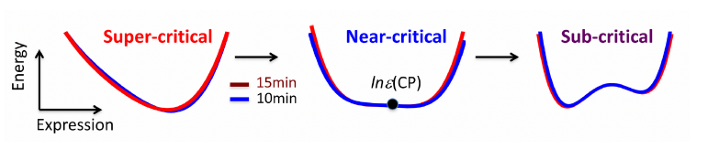

对于被调控的量 $X$，当两个极值满足：

$$
X_A = X_B
$$

对应有两个相同的热力学势。此时对应相平衡条件（即温度，压力，化学势相等）。

从统计的角度来看，这对应体系有两个等高的主峰，并有相同的统计权重。

---

#### 热力学第三定律

> $$
> \lim_{T\to 0}S(T, X) = k_B \ln g_0
> $$
>
> $g_0$ 为基态简并度。若基态唯一，则 $S \to 0$，此时热容 $C = T(\pdv*{S}{T}) = 0$。

假设基态能量为 $E_0$，当 $T\to0$ 时：

$$
k_BT \ll E_n - E_0
$$

也就是：

$$
e^{-E_n/k_BT} \ll e^{-E_0/k_BT}
$$

这也就是说，在极低温下激发态的分布都趋于 0，于是基态概率：

$$
p_i = \frac{1}{g_0}
$$

代入熵的定义：

$$
S = -k_B \sum_i p_i\ln p_i = k_B \ln g_0
$$

这也规定了熵函数的 **边界结构**：保证在 $T\to 0$ 时熵函数有确定值。

---

### 2.4 熵函数的演化

对于一个体系的自发演化方向时，始终考虑总熵增加：

$$
\Delta S_{total} = \Delta S + \Delta S_{env} \ge 0
$$

对于一个恒温恒容条件，有：

$$
\Delta S_{total} = \Delta S - \Delta U/T = -\Delta F/T
$$

对应极值函数为 $\Delta F\le 0$，即自由能最小。

恒温恒压有：

$$
\Delta S_{total} = \Delta S - (\Delta U + P \Delta V)/T = -\Delta G/T
$$

对应极值函数为 $\Delta G\le 0$，即 Gibbs 自由能最小。

---

## 3. 系综理论

系综就是“固定什么变量”：

| 控制变量  | 约束                                   | 对应概率分布                                | 系综       |
| --------- | -------------------------------------- | ------------------------------------------- | ---------- |
| $E,V,N$   | 无                                     | $p_i = \frac{1}{\Omega(E,V,N)}$             | 微正则系综 |
| $T,V,N$   | 平均能量 $\ev{E} = \sum_i{E_i}$        | $ p_i\propto e^{-\beta E_i}$                | 正则系综   |
| $T,V,\mu$ | 平均能量和粒子数 $\ev{N} = \sum_i N_i$ | $p_{i,N}\propto e^{-\beta (E_{i,N}-\mu N)}$ | 巨正则系综 |

### 3.1 微正则系综

实际上就是作变分：

$$
\var(-p_i\sum_i\ln p_i + \alpha\qty(\sum_ip_i - 1)) = 0
$$

可以得到所有 $p_i$ 都相同，也就是：

$$
p_i = \frac{1}{\Omega(E, V, N)}
$$

带入到 Shannon 熵就得到了 **Boltzmann 熵公式**：

$$
S = k_B\ln \Omega(E, N, V)
$$

根据我们前面定义：

$$
\frac1T = \qty(\pdv{S}{E})_{N, V} = k_B \pdv{\ln \Omega}{E}
$$

---

在量子表述下，密度算符可以表示为：

$$
\hat \rho = \sum_m w_m \op{\psi_m}
$$

其中 $w_i$ 为该波函数的概率。

在微正则系综下：

$$
\hat\rho_{m} = \frac{1}{\Omega(E, N, V)}\sum_{k = 1}^\Omega \op{k}=\frac{1}{\Omega(E, N, V)}\hat\rho_E
$$

这个时候用 von Neumann 熵：

$$
S = -k_B\Tr(\hat\rho\ln\hat\rho) = k_B\ln\Omega(E, N, V)
$$

这和经典统计力学一致。

---

### 3.2 正则系综

虽然不能直接对系统用微观状态数，但假设系统 A 和一个热库 B 接触，这样系统和热库就可以视为一个孤立系统。概率和热库的微观状态数有关：

$$
p_i = 1/\Omega_B(E_{tot} - E_i)
$$

利用热库熵：

$$
S_B(E_B) = k_B\ln\Omega(E_B)\Rightarrow \Omega_B(E_{tot} - E_i)=\exp(\frac{S_B(E_{tot}-E_i)}{k_B})
$$

泰勒展开热库的熵，因为热库能量变化很小：

$$
S_B(E_{tot}-E_i) = S_B(E_{tot}) - \pdv{S_B}{E_B}E_i = S_B(E_{tot})-\frac{E_i}{T}
$$

这样我们就知道：

$$
p_i \propto e^{-\beta E_i}
$$

由此就归一化配分函数，得到：

$$
p_i = \frac{1}{Z}e^{-\beta E_i} \qc Z(\beta) = \sum_ie^{-\beta E_i}
$$

---

体系的平均能量：

$$
U =\ev{E} = \frac{1}{Z}\sum_i E_ie^{-\beta E_i} = -\frac1Z\pdv{Z}{\beta} = -\pdv{\ln Z}{\beta}
$$

能量涨落：

$$
\begin{aligned}
\ev{(\Delta E)^2} &= \ev{E^2} - \ev{E}^2 \\
&= \frac{1}{Z}\sum_i E^2_ie^{-\beta E_i}-\qty(-\pdv{\ln Z}{\beta})^2\\
&= \frac{1}{Z}\pdv [2]{Z}{\beta}-\qty(\pdv{\ln Z}{\beta})^2\\
&= \pdv [2]{\ln Z}{\beta}
\end{aligned}
$$

定容热容：

$$
C_v = -\pdv{T}\pdv{\ln Z}{\beta} = -\pdv{T}{\beta}\pdv [2]{\ln Z}{\beta} = \frac{1}{kT^2}\pdv [2]{\ln Z}{\beta}
$$

这可以和能量涨落关联起来：

$$
C_v = \frac{1}{kT^2}\ev{(\Delta E)^2}
$$

熵：

$$
\begin{aligned}
S &= -k\sum_i P_i\ln P_i \\
&= k\sum_i P_i (\beta E_i + \ln Z) \\
&= k(\beta U + \ln Z) = \frac{U}{T} + k\ln Z
\end{aligned}
$$

自由能：

$$
\begin{aligned}
F &= U-TS \\
&= U+k_BT\qty(\sum_i p_i(-\beta E_i-\ln Z))\\
&= U-U-k_BT\ln Z = k_B T\ln Z
\end{aligned}
$$

---

对固体而言，我们可以把每个原子都视为谐振子，与周围的 6 个原子相连接。对于单个原子的谐振子有：

$$
Z_1 = \sum_{n = 0}^\infty e^{-\beta\hbar\omega(n+1/2)} = \frac{e^{-\beta\hbar\omega/2}}{1-e^{-\beta\hbar\omega}}
$$

总共有 3N 个谐振子：

$$
Z = (Z_1)^{3N}
$$

这样体系的内能有：

$$
\begin{aligned}
U &= -\pdv{\ln Z}{\beta}\\
&= -3N\pdv{\beta}(-\frac{\beta\hbar\omega}{2}-\ln(1-e^{-\beta\hbar\omega}))\\
&= 3N\qty(\frac{\hbar\omega}{2}+\frac{\hbar\omega}{e^{\beta\hbar\omega}-1})
\end{aligned}
$$

热容有：

$$
C_v = 3Nk_B\frac{(\beta\hbar\omega)^2e^{\beta\hbar\omega}}{(e^{-\beta\hbar\omega}-1)^2}
$$

这就对应两个极限：

- 高温下：$C_v = 3Nk_B$
- 低温下：$C_v = 3Nk_B(\beta\hbar\omega)^2e^{-\beta\hbar\omega}$

---

### 3.3 巨正则系综

懒得写了，直接：

$$
p_i = \frac{1}{\Xi} e^{-\beta(E_i - \mu N)} \qc \Xi = \sum_i e^{-\beta(E_i - \mu N)}
$$

平均粒子数：

$$
\overline N = \sum_i N_iP_i = \frac{\sum_i Ne^{\beta(\mu N - E_i)}}{\sum_i e^{\beta(\mu N - E_i)}} = \frac{1}{\beta \Xi} \pqty{\pdv{\Xi}{\mu}}_\beta = k_BT\pqty{\pdv{\ln \Xi}{\mu}}_\beta
$$

平均能量：

$$
\begin{aligned}
U = \ev{E} = \sum_i E_iP_i &= \frac{\sum_i E_ie^{\beta(\mu N - E_i)}}{\sum_i e^{\beta(\mu N - E_i)}} \\
&= -\frac{1}{\Xi} \pqty{\pdv{\Xi}{\beta}}_\mu + \mu \overline N \\
&=  - \pqty{\pdv{\ln \Xi}{\beta}}_\mu + \mu \overline N
\end{aligned}
$$

熵：

$$
\begin{aligned}
S = -k_B\sum_i P_i \ln {P_i} &= -k_B\frac{\sum_i (\beta(\mu N_i - E_i) - \ln \Xi)e^{\beta(\mu N - E_i)}}{\sum_i e^{\beta(\mu N - E_i)}} \\
&= \frac{-\mu \sum_i N_ie^{\beta(\mu N - E_i)} + \sum_i E_ie^{\beta(\mu N - E_i)} + \beta\ln \Xi}{T\Xi} \\
&= \frac{U - \mu \overline N + k_BT\ln \Xi}{T}
\end{aligned}
$$

这就得到 **巨热力学势**：

$$
\Omega = \ev{E}-TS-\mu\ev{N} = k_BT\ln\Xi
$$

---

定义粒子数密度 $n=N/V$，这样等温压缩率：

$$
\kappa_T = -\frac1V\qty(\pdv{V}{P})_T = \frac1n\qty(\pdv{n}{P})_T
$$

又有巨热力学势：

$$
\Omega = U-TS-\mu N = -PV
$$

于是：

$$
\dd{\Omega} = -P\dd{V}-V\dd{P}
$$

又有：

$$
\dd{\Omega} = -P\dd{V}-S\dd{T}-N\dd{\mu}
$$

于是就有：

$$
\dd{P} = s\dd{T}+n\dd{\mu}
$$

这就得到了：

$$
n = \qty(\pdv{P}{\mu})_T
$$

通过链式法则：

$$
\qty(\pdv{n}{\mu})_T =\qty(\pdv{n}{P})_T\qty(\pdv{P}{\mu})_T = n^2\kappa_T
$$

于是粒子数涨落对应：

$$
\begin{aligned}
\ev{(\Delta N)^2} = k_BT\qty(\pdv{\ev{N}}{\mu})_T = k_BT\ev{N}n\kappa_T
\end{aligned}
$$

也就是粒子数涨落同样和宏观有关系。

对于能量和粒子数涨落量都和粒子数有关系，也就是：

$$
\ev{(\Delta X)^2}\sim N
$$

但是考虑相对偏差：

$$
\frac{\sqrt{\ev{(\Delta X)^2}}}{\ev{X}}\sim\frac{1}{\sqrt{N}}
$$

这同样在大体系下趋于 0.

---

## 4. 经典统计力学

### 4.1 理想气体-连续体系

已经知道：

$$
Z_N = \frac1{N! h^{3N}} \int \prod_{i = 1}^N e^{-\beta H(\vb p,\vb q)} \dd {\vb p}\dd {\vb q}
$$

当气体足够稀薄的情况下，假设势能项为 0，那么势能积分为 $V$，也就是：

$$
Z_N = \frac{V}{N!} \pqty{\frac{2\pi mkT}{h^2}}^{3N/2} = \frac1{N!}\frac{V}{\Lambda^3}
$$

在知道理想气体的配分函数后，我们也不难把其他态函数求出来了。首先是内能：

$$
\begin{aligned}
U = -\dv{\ln Z_N}{\beta} &= -\dv{(N\ln V - 3N\ln \Lambda - \ln N!)}{\beta} \\
&= -\dv{( \frac32N\ln T +Const.)}{\beta} \\
&= \frac 32 Nk_BT
\end{aligned}
$$

由于整个式子里只有 $\Lambda \propto T^{-1/2}$ 和温度项有关，其他项都可作为常数项消去。由此导出的热容 $C_V = \frac 32 Nk$ 和能均分原理导出相同。

自由能（利用 Stiring 近似 $\ln N! \approx N\ln N - N$ ）：

$$
\begin{aligned}
F = -k_BT\ln Z_N &= -k_BT(N\ln V - 3N\ln \Lambda - \ln N!)\\
&=  Nk_BT(\ln (\frac NV\Lambda^3)  - 1) = Nk_BT(\ln(n\Lambda^3)-1)
\end{aligned}
$$

于是压强：

$$
p = -(\pdv{F}{V})_T = Nk_BT/V = nk_BT
$$

这就是 **理想气体方程**！我们也可以求出焓：

$$
H = U+pV = \frac 52 Nk_BT
$$

接下来我们来求熵：

$$
\begin{aligned}
S &= \frac{U-F}{T} \\
&= \frac{\frac32 Nk_BT - k_BTN\ln V - 3k_BTN\ln \Lambda - k_BT(N\ln N - N)}{T} \\
&= \frac32 Nk_B + Nk_B \ln(\frac{V\mathrm{e}}{N\Lambda^3}) \\
&= \boxed{Nk\pqty{\frac52 - \ln{n\Lambda^3}}}
\end{aligned}
$$

这种表示方法被称为 **Sackur-Tetrode 方程**。

我们还可以得到吉布斯自由能：

$$
G = H-TS = Nk_BT\ln(n\Lambda^3)
$$

化学势：

$$
\mu = k_BT(\ln(n\Lambda^3) - 1) + Nk_BT(\frac 1N) = k_BT\ln(n\Lambda^3)
$$

---

### 4.2 离散体系

#### 二能级系统

假设对于二能级系统，有：

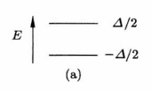

其配分函数：

$$
Z = e^{-\frac{\beta\Delta}{2}} + e^{\frac{\beta\Delta}{2}} = 2\cosh{\frac{\beta\Delta}{2}}
$$

利用上述公式得到：

$$
\begin{gathered}
U = -\dv{\ln Z}{\beta} = -\frac{\Delta}{2}\tanh(\frac{\beta\Delta}{2})\\
C_V = (\pdv{U}{T})_V = k(\frac{\beta\Delta}{2})^2\sech^2(\frac{\beta\Delta}{2}) \\
F = -k_BT\ln Z = -k_BT\ln(2\cosh(\frac{\beta\Delta}{2})) \\
S = \frac{U-F}{T} = -\frac{\Delta}{2T} \tanh(\frac{\beta\Delta}{2}) + k\ln(2\cosh(\frac{\beta\Delta}{2}))
\end{gathered}
$$

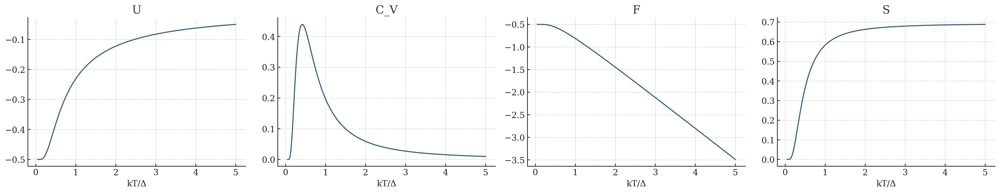

这里出现了一些很抽象的事情：热容随温度会到达一个极大值，之后又随之衰减。事实上这被称为 **肖基特反常**（Schottky anomaly），(i) 当低温时，只有低能级被占据且温度增加对其改变不大，(ii) 而高温时两个能级被同等占据，温度增加也没有什么改变。

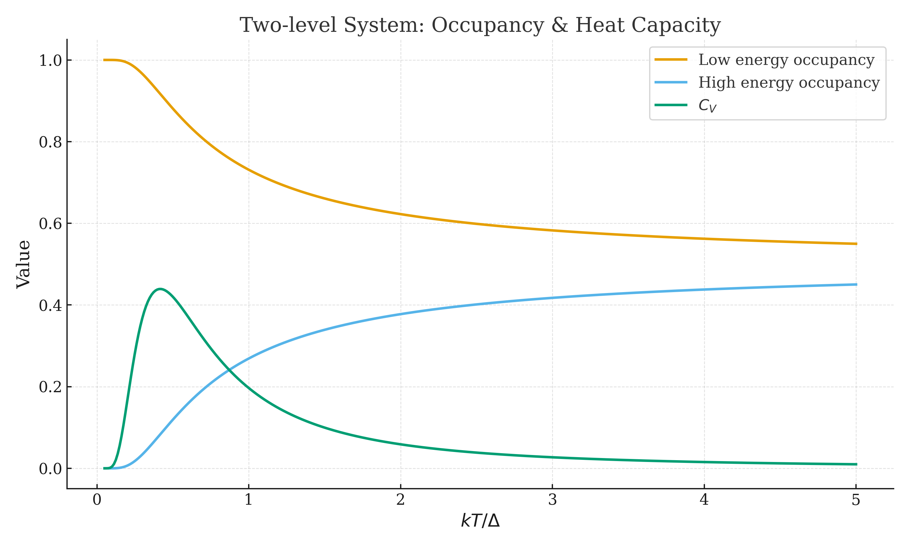

> 当粒子数反转时，对应出现负温度状态。

---

#### 顺磁性固体

我们都知道一个基本粒子的自旋角动量等于 $\pm \frac12$ ，考虑其在磁场 $B$ 中，这个粒子可以存在于两种本征态之一（ $\ket{\uparrow}$ 对应角动量平行于 $B$， $\ket{\downarrow}$ 对应角动量反平行于 $B$），他们的 **磁矩** 分别为 $-\mu_B$ 和 $+\mu_B$（玻尔磁子 $\mu_B = eh/2m$ ）。于是单粒子的配分函数：

$$
Z_1 = e^{\beta\mu_B B} + e^{-\beta\mu_B B} = 2\cosh{\beta\mu_BB}
$$

假设粒子间没有任何相互作用，则：

$$
Z_N = Z_1^N
$$

于是我们有：

$$
F = -kT\ln{Z_N} = -NkT\ln(2\cosh{\beta\mu_BB})
$$

之后我们即可求出单位体积内的磁矩：

$$
m = -\pqty{\pdv{F}{B}}_T = N\mu_B \tanh\pqty{\beta\mu_B B}
$$

对结果进行分析，我们发现当磁场 $B$ 足够强时，能级趋向于 $N\mu_B$ ，对应几乎所有粒子都有极大概率处于 $\ket{\uparrow}$ 组态；而当磁场 $B$ 在 0 附近时，曲线的行为类似于线性。事实上利用等价无穷小 $\tanh x \sim x$：

$$
m_{\sim 0} = \frac{N\mu_B^2B}{kT}, \quad M = m/V = \frac{N\mu_B^2B}{VkT}
$$

其中 $M$ 为单位体积的磁矩。对弱磁材料，可认为 $M\approx \chi H$ ，其中 $\chi \ll 1$ 为磁化率。我们有：

$$
B = \mu_0(1+\chi)H \approx \frac{\mu_0M}{\chi}
$$

于是有：

$$
\boxed{\chi \approx \frac{N\mu_0\mu_B^2B}{VkT},\quad \chi\propto 1/T}
$$

这就是 **居里定律**（Curie's Law）。

---

#### 一般能谱

前面一节我们说过，在高温下热容可以由能均分定理给出，这也可以由配分函数得到。假设在高温下能级可以视作是连续的：

$$
\begin{aligned}
Z_{rot} = \sum (2J+1)e^{-\frac{\Theta}{T}J(J+1)} &= \int_0^\infty (2J+1)e^{-\frac{\Theta}{T}J(J+1)} \dd J \\
&= -\left [ \frac{T}{\Theta}e^{-\frac{\Theta}{T} J(J+1)} \right]_0^\infty = \frac{T}{\Theta} = \frac{2IkT}{\hbar^2} \\
\end{aligned}
$$

于是 $U = -\dv{\ln Z}{\beta} = \frac 1\beta = k_BT$ ，而 $C_V = k$ 。同理对于振动能级：

$$
\begin{aligned}
Z_{vib} = \sum e^{-\beta(\frac12 + n)\hbar\omega} &= \int_0^\infty e^{-\beta(\frac12 + n)\hbar\omega} \dd n \\
&= e^{-\beta\hbar\omega/2}(\frac{1}{\beta\hbar\omega}\left [e^{-\beta n\hbar\omega}\right]_0^\infty) = \frac{e^{-\beta\hbar\omega/2}}{\beta\hbar\omega}
\end{aligned}
$$

于是 $U = -\dv{\ln Z}{\beta} = \frac{\hbar\omega}{2} + \frac{1}{\beta}$ ，而 $C_V = k$ 。注意对高温下的振动能级而言，其 **内能与零点能有关，而热容与零点能无关。**

---

#### 相互作用体系

直接看 Thermodynamic_2 吧。

---

## 5. 量子理论

### 判据

已经提到过：$n\Lambda^3 \gg 1$ 时，对应粒子在态空间分布稀疏；$n\Lambda^3 \ll 1$ 时，对应多个粒子占据态空间中的同一个态。

经典统计有高温极限，即 $kT\gg\Delta$；但量子统计能级间距远小于 $kT$。

---

### 基本假设

我们认为粒子是不可区分的，即交换两个粒子将保持可观测量不变。于是至多改变一个相位：

$$
\abs{\Psi(q_1, q_2)}^2 = \abs{\Psi(q_2, q_1)}^2 \Rightarrow \Psi(q_1, q_2) = e^{i\theta}\Psi(q_2, q_1)
$$

又由于交换两次回到原状态，因此必有：

$$
\Psi(q_1, q_2) = \pm \Psi(q_2, q_1)
$$

- 对称波函数（+）：对应玻色子。多个粒子可占据相同量子态。
- 反对称波函数（-）：对应费米子。若两个粒子占据相同量子态，则 $\Psi=0$，因此 **每个量子态至多被一个粒子占据**。

同样用最大熵原理求，此时我们知道各个能级的占据数的集合 $\qty{n_i}$，对应要求的概率是 $p(\qty{n_i})$。满足约束：

$$
\begin{gathered}
\sum_{\qty{n_i}}p(\qty{n_i})= 1\\
\sum_{\qty{n_i}}p(\qty{n_i})\sum_{i}n_i = N\\
\sum_{\qty{n_i}}p(\qty{n_i})\sum_{i}n_i\epsilon_i = U
\end{gathered}
$$

最终得到：

$$
p(\qty{n_i}) = \frac1\Xi e^{-\beta\sum_i n_i(\epsilon_i-\mu)}
$$

对应的配分函数：

$$
\Xi = \sum_{\qty{n_i}} e^{-\beta\sum_i n_i(\epsilon_i-\mu)}
$$

类比单粒子配分函数，定义单能级配分函数，其中 $n_i$ 代表第 $i$ 个能级的占据数：

$$
\Xi_i =\sum_{n_i}e^{-\beta n_i(\epsilon_i-\mu)}\qc\Xi = \prod_i \Xi_i
$$

对于玻色子，单粒子配分函数就是求和：

$$
\Xi_i = \frac{1}{1-e^{-\beta(\epsilon_i-\mu)}}
$$

费米子只有两个求和：

$$
\Xi_i = 1+e^{-\beta(\epsilon_i - \mu)}
$$

> 可统一表达为：
>
> $$
> \Xi = \prod_i (1\mp e^{-\beta(\epsilon_i- \mu)})^{\mp 1}
> $$

由此可以得到平均占据数：

$$
\begin{aligned}
\ev{n_i} &= \sum_{n_i} n_iP(n_i)\\
&= \frac{1}{\Xi_1} \sum_{n_i} n_ie^{-\beta n_i(\epsilon_i-\mu)}\\
&= -\frac1\beta \pdv{\ln\Xi_i}{\epsilon_i}
\end{aligned}
$$

应用到玻色子得到 Bose-Einstein 分布：

$$
\ev{n_i} = \frac{1}{e^{\beta(\epsilon_i - \mu)}-1}
$$

应用在费米子得到 Fermi-Dirac 分布：

$$
\ev{n_i} = \frac{1}{e^{\beta(\epsilon_i - \mu)}+1}
$$

> 可统一表达为：
>
> $$
> \ev{n_i} = \frac{1}{e^{\beta(\epsilon_i - \mu)}\pm  1}
> $$

这两个分布在高温情况下都会退化成经典极限，也就是 Maxwell-Boltzmann 分布：

$$
\ev{n_i} \approx e^{-\beta(\epsilon_i-\mu)}
$$

---

对化学势求导得到：

$$
\pdv{ \Xi  }{ \mu  } = \beta \sum_{ \{n_{i}\} } N e^{ -\beta ( U-\mu N ) }
$$

于是有：

$$
\ev{ N } = \frac{1}{\beta \Xi }\pdv{ \Xi  }{ \mu  } =  \frac{1}{\beta }\pdv{ \ln\Xi  }{ \mu  }
$$

对 $\beta$ 求导得到：

$$
\pdv{ \Xi  }{ \beta  } = -\sum_{ \{n_{i}\} } ( U-\mu N ) e^{ -\beta ( U-\mu N ) }
$$

于是有：

$$
U = -\pdv{ \ln\Xi  }{ \beta  } +\mu N
$$

巨热力学势：

$$
\Omega = -\frac{1}{\beta }\ln\Xi
$$

同样可以求得离子束和压强：

$$
\begin{align}
N = -\qty(\pdv{ \Omega }{ \mu  })_{ T, V }  = \frac{1}{\beta }\pdv{ \ln\Xi  }{ \mu  } \\
P = -\qty(\pdv{ \Omega }{ V  })_{ T,\mu  }  = \frac{1}{\beta }\pdv{ \ln\Xi  }{ V  }
\end{align}
$$

---

### 态密度

每个量子态占据空间 $h^{3}$ ，因此态密度 $g( \epsilon)\dd{ \epsilon}$ 定义为 $[\epsilon, \epsilon+\dd{\epsilon} ]$ 内的量子态总数。通常一个能量对应多个独立量子态（自旋，能带，极化等），内部简并度记为 $g_s$ 。对三维自由粒子累计态数记为：

$$
G( \epsilon ) = g_{s}\cdot \frac{V}{( 2\pi  )^{3}}\int_{\epsilon( k )\leq \epsilon}\dd [ 3 ]{ k }
$$

态密度定义为：

$$
g( \epsilon ) = \dv{ G( \epsilon ) }{ \epsilon }
$$

- 三维自由粒子允许的波矢 $k_{x},k_y,k_z = \frac{ 2\pi }{L} n$，即在 $k$ 空间占据体积 $(2\pi   )^{3}/V$。于是 $k$ 内的累计态数满足：

  $$
  G( k ) = g_{s}\cdot \frac{V}{( 2\pi  )^{3}}\int_{\epsilon( k )\leq \epsilon}\dd [ 3 ]{ k } = g_s\cdot \frac{V}{( 2\pi  )^{3}}\frac{ 4\pi  }{3}k^{3}
  $$

  对应色散关系为：

  $$
  \dv{ k }{ \epsilon } = \dv{ \epsilon }\sqrt{ \frac{ 2m\epsilon }{\hbar ^{2}} } = \frac{m}{\hbar ^{2}k} = \frac{1}{\hbar }\sqrt{ \frac{m}{2\epsilon} }
  $$

  态密度：

  $$
  g( \epsilon ) = \dv{ G }{ \epsilon } = g_s\cdot \frac{V}{2\pi ^2}k^{2}\dv{ k }{ \epsilon } = g_{s}\cdot \frac{V}{2\pi ^{2}}\qty( \frac{2m}{\hbar ^2} )^{3/2 }\sqrt{ \epsilon }
  $$

- 任意维度 $d$ 的粒子：

  $$
  g( \epsilon ) \propto g_{s}\epsilon^{ \frac{d}{2}-1}
  $$

- 线性色散关系：

  $$
  \epsilon = \hbar \omega = \hbar \nu k \implies  k =\frac{\epsilon}{\hbar \nu }
  $$

  对应态密度：

  $$
  g( \epsilon ) = g_{s} \cdot  \frac{V}{2\pi ^{2}( \hbar \nu  )^{3}}\epsilon ^{2}
  $$

从态密度计算和从巨正则函数计算等价。

---

### Fermi 气体

假设有一个金属电子气，单个量子态的平均占据数满足 F-D 统计：

$$
n( \epsilon ) = \frac{1}{e^{\beta(\epsilon_i - \mu)}+1}
$$

连续能谱的态密度满足：

$$
g( \epsilon ) = 2\cdot\frac{V}{2\pi ^{2}}\qty( \frac{2m}{\hbar ^2} )^{3/2 }\sqrt{ \epsilon } = \frac{ 4\pi V }{h^{3}}( 2m )^{3/2} \sqrt{ \epsilon }
$$

于是平均电子数为：

$$
\dd{ N_{\epsilon} } = g( \epsilon )n( \epsilon )\dd{ \epsilon } = \frac{ 4\pi V }{h^{3}}( 2m )^{3/2} \frac{\sqrt{ \epsilon }\dd{ \epsilon }}{e^{\beta(\epsilon_i - \mu)}+1}
$$

先考虑 $T \to \pu{ 0K}$ 下的极限。取此时电子最高能量为 $\mu( 0)$，记为 **Fermi 能级**，于是占据率在 Fermi 能级下为 1，Fermi 能级上为 0.

对应得到粒子数和化学势的关系：

$$
N = \frac{ 4\pi V }{h^{3}}( 2m )^{3/2}\int_0^{\mu ( 0 )} \sqrt{ \epsilon }\dd{ \epsilon } = \frac{ 8\pi V }{3h^{3}}( 2m\mu ( 0 ) )^{3/2}
$$

于是：

$$
\mu ( 0 ) = \frac{ \hbar ^{2} }{2m}\qty( 3\pi ^{2} \frac{N}{V} )^{2/3} = \frac{ \hbar ^{2} }{2m}\qty( 3\pi ^{2} n)^{2/3}
$$

类似动量的定义，记费米动量：

$$
p_{F}^{2} = \sqrt{ \mu ( 0 )\cdot 2m } = \hbar ( 2\pi ^{2} n)^{1/3}
$$

定义费米温度：

$$
k_{B}T_F = \mu ( 0 )
$$

零温下的内能可以通过态密度求得：

$$
U( 0 ) = \frac{ 4\pi V }{h^{3}}( 2m )^{3/2}\int_0^{\mu ( 0 )} \epsilon^{3/2} \dd{ \epsilon } = \frac{ 3N }{5}\mu ( 0 )
$$

看作理想气体，压强为：

$$
P( 0 ) = \frac{2}{3}\frac{ U( 0 ) }{V} = \frac{2}{5}n\mu ( 0 )
$$

这被称为 **简并压**，是由泡利不相容原理所导致的。

---

再考虑优先温度下的热力学量。此时化学势由粒子数守恒决定：

$$
N =  \frac{ 4\pi V }{h^{3}}( 2m )^{3/2} \int_{0}^{\infty} \frac{\sqrt{ \epsilon }\dd{ \epsilon }}{e^{\beta(\epsilon_i - \mu)}+1} = C \int_{0}^{\infty} \frac{\sqrt{ \epsilon }\dd{ \epsilon }}{e^{\beta(\epsilon_i - \mu)}+1}
$$

内能为：

$$
U = C \int_{0}^{\infty} \frac{{ \epsilon }^{ 3/2}\dd{ \epsilon }}{e^{\beta(\epsilon_i - \mu)}+1}
$$

形式相同，不妨把上面的 $\epsilon$ 幂次项都统一成 $\eta( \epsilon) = C\epsilon^{n/2}$，设 $\epsilon - \mu =k_{B}Tx$ 得到积分：

$$
\begin{align}
I & = \int_{-\frac{\mu}{ k_{B}T }}^{\infty} \frac{\eta ( \mu +k_{B}Tx )}{e^{ x }+1}k_{B}T \dd{x}  \\
 & = \int_{-\frac{\mu}{ k_{B}T }}^{0} \frac{\eta ( \mu +k_{B}Tx )}{e^{ x }+1}k_{B}T \dd{x} + \int_{0}^{\infty} \frac{\eta ( \mu +k_{B}Tx )}{e^{ x }+1}k_{B}T \dd{x} \\
 & = k_{B}T\int_{0}^{\frac{\mu}{ k_{B}T }} \frac{\eta ( \mu -k_{B}Tx )}{e^{ -x }+1} \dd{x} + k_{B}T\int_{0}^{\infty} \frac{\eta ( \mu +k_{B}Tx )}{e^{ x }+1} \dd{x}
\end{align}
$$

由于有 $\frac{1}{e^{ -x}+1} = 1-\frac{1}{e^{x}+1}$，另外由于 $\frac{\mu}{k_{B}T} \gg 1$，这样可以把积分上限取成 $\infty$。

$$
I = \int_{0}^{\mu } \eta ( \epsilon ) \dd{\epsilon}  + k_{B}T\int_{0}^{\infty} \frac{\eta ( \mu +k_{B}Tx )-\eta ( \mu -k_{B}Tx )}{e^{ x }+1} \dd{x}
$$

展开上面相减的项：

$$
\eta ( \mu +k_{B}Tx )-\eta ( \mu -k_{B}Tx ) \approx 2k_{B}Tx\eta '( \mu  )+\cdots
$$

于是得到：

$$
I = \int_{0}^{\mu } \eta ( \epsilon ) \dd{\epsilon} + 2( k_{B}T )^{2}\eta '( \mu  )\int_{0}^{\infty} \frac{x}{e^{ x }+1} \dd{x}
$$

后面一项积分是已知的：

$$
I = \int_{0}^{\mu } \eta ( \epsilon ) \dd{\epsilon} + \frac{\pi ^{2}}{6}( k_{B}T )^{2}\eta '( \mu  )
$$

于是得到：

$$
\begin{align}
N \simeq \frac{1}{3}C\mu ^{3/2 }\qty [ 1+\frac{\pi ^{2}}{8}\qty( \frac{k_{B}T}{\mu } )^{2}] \\
U \simeq \frac{2}{5}C\mu ^{5/2 }\qty [ 1+\frac{5\pi ^{2}}{8}\qty( \frac{k_{B}T}{\mu } )^{2}]
\end{align}
$$

反推化学势：

$$
\mu \simeq \qty( \frac{ 3N }{2C} )^{2/3 }\qty [  1+\frac{\pi ^{2}}{8}\qty( \frac{k_{B}T}{\mu } )^{2} ]^{-2/3 }
$$

由于第二项很小，我们可以用 $\mu( 0)$ 代替 $\mu$ ，得到：

$$
\mu \simeq \mu ( 0 )\qty [  1+ \frac{\pi ^{2}}{8}\qty( \frac{k_{B}T}{\mu( 0 ) } )^{2} ]^{-2/3 } \simeq \mu ( 0 )\qty [  1- \frac{2}{3}\cdot \frac{\pi ^{2}}{8}\qty( \frac{k_{B}T}{\mu( 0 ) } )^{2} ]
$$

对应得到内能（近似后展开到平方项）：

$$
\begin{align}
U  & \simeq \frac{2}{5}C\mu ( 0 )^{5/2}\qty [  1- \frac{2}{3}\cdot \frac{\pi ^{2}}{8}\qty( \frac{k_{B}T}{\mu( 0 ) } )^{2} ]^{5/2}\qty [ 1+\frac{5\pi ^{2}}{8}\qty( \frac{k_{B}T}{\mu } )^{2}] \\
 & =
\end{align}
$$

对应热容为线性：

$$
C_{v} = \gamma_{0}T \qc \gamma_0 = Nk\frac{ \pi ^{2}}{2}\frac{k_{B}T}{\mu ( 0 )}
$$

加上离子振动的热容，得到低温下金属的热容为：

$$
C_v \simeq \gamma T+AT^{3}
$$

---

### Bose 气体

由于占据数满足：

$$
n( \epsilon ) = \frac{1}{e^{\beta(\epsilon_i - \mu)}-1}> 0
$$

又由于基态下 $\epsilon_{0} = 0$，所以必须有：

$$
\mu < 0
$$

由于基态占据比重较大，所以把粒子数密度拆成基态和激发态的连续谱，于是有：

$$
n = n_0 + n_{ex}
$$

基态占据的粒子数密度为：

$$
n_{0} = \frac{1}{V} \frac{1}{e^{ -\mu /k_{B}T  }-1}
$$

激发态贡献为：

$$
n_{ex} = \int_{0}^{\infty} g( \epsilon ) \cdot \frac{1}{e^{\beta(\epsilon_i - \mu)}-1}\dd{x}
$$

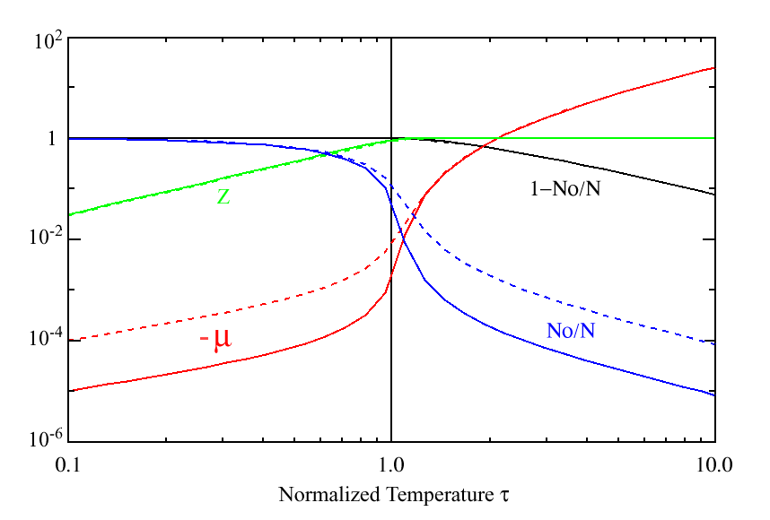

考虑极限 $\mu = 0^{-}$ 的情形，此时激发态概率达到极大值：

$$
\begin{align}
n_{ex}^{max}( T )  & = \int_{0}^{\infty} g( \epsilon ) \cdot \frac{1}{e^{\beta\epsilon_i}-1}\dd{x} \\
 & =\int_{0}^{\infty}\frac{1}{2\pi ^{2}}\qty( \frac{2m}{\hbar ^2} )^{3/2 } \frac{ \sqrt{ \epsilon }}{e^{\beta\epsilon_i}-1} \dd{x}
\end{align}
$$

令 $x = \epsilon/k_{B}T$，式子可以化为可计算的积分：

$$
\begin{align}
n_{ex}^{max}( T )  & = \qty( \frac{ mk_{B}T }{2\pi \hbar ^{2}} )^{3/2 } \int_{0}^{\infty} \qty( \frac{x^{1/2 }}{e^{ x }-1} ) \dd{x} \\
 & =\qty( \frac{ mk_{B}T }{2\pi \hbar ^{2}} )^{3/2 } \Gamma( \frac{3}{2} )\zeta( \frac{3}{2} ) \simeq 2.612\qty( \frac{ mk_{B}T }{2\pi \hbar ^{2}} )^{3/2 }
\end{align}
$$

定义临界点温度为激发态能量等于总粒子数时的温度，此时粒子数 $n$ 恰好等于 $n_{ex}^{max}$。对应温度为：

$$
T_c = \frac{2\pi \hbar ^{2}}{mk_B}\qty( \frac{n}{2.612} )^{2/3}
$$

当 $T<T_c$ 时， 由于激发态无法容纳多余粒子，于是多余粒子只能进入基态。对应发生 Bose-Einstein 凝聚（BEC）。

> 也可写成
>
> $$
> n\Lambda_{T}^{3} = \zeta( \frac{3}{2} )
> $$

凝聚相时满足：

$$
\frac{n_{ ex }( T )}{n_{ex}^{max}( T )} = \qty( \frac{T}{T_c} )^{3/2}
$$

相对的基态占据数：

$$
n_{0} = n\qty [ 1- \qty( \frac{T}{T_c} )^{3/2}]
$$

---

凝聚相的体系热力学完全由激发态决定。

$$
\Omega = -k_{B}T\int_{0}^{\infty} g( \epsilon )\ln( 1-e^{ -\beta\epsilon } ) \dd{\epsilon}
$$

同样令 $x = \epsilon/k_{B}T$，化为可计算的积分：

$$
\int_{0}^{\infty} x^{1/2 }\ln( 1-e^{ -x } ) \dd{x} = -\frac{ \sqrt{ \pi  }}{2} \zeta \qty( \frac{5}{2} )
$$

化简得到：

$$
\Omega = -Vk_{B}T^{5/2 } \qty( \frac{ mk_{B}T }{2\pi \hbar ^{2}} )^{3/2 } \zeta \qty( \frac{5}{2} ) = -AVT^{5/2 }
$$

由此可得压强

$$
P = -\qty(\pdv{ \Omega }{ V })_{ T,\mu  }  = AT^{5/2}
$$

熵：

$$
S = -\qty(\pdv{ \Omega }{ V })_{ V,\mu  } =\frac{5}{2}AVT^{3/2 }
$$

内能：

$$
U = \Omega+TS+\mu N = \Omega+TS = \frac{3}{2}PV
$$

凝聚相热容：

$$
C_V = \qty(\pdv{ U }{ T })_{ V }  = \frac{15}{4} AVT^{3/2 } = \frac{5}{2} \frac{\zeta ( \frac{5}{2} )}{\zeta ( \frac{3}{2} )}Nk_B \qty( \frac{T}{T_c} )^{3/2}
$$

当然非凝聚相的热容满足 MB 近似：

$$
C_V = \frac{3}{2}Nk_B
$$

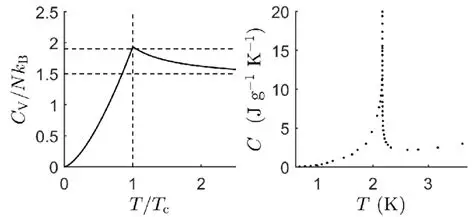

---

### 光子气体

电磁场可以等价于一组独立的经典简谐振动集合。真空中的色散关系：

$$
\omega = c| k | \implies  p = \hbar k =\frac{\hbar \omega}{c}
$$

由于光子不断被吸收和辐射，认为不满足粒子数守恒，仅满足能量守恒。于是化学势 $\mu = 0$，对应占据数为：

$$
\ev{ n( \omega ) } = \frac{1}{e^{ \beta \hbar \omega }-1}
$$

态密度的微分来自相空间：

$$
\dd{G} = 2\cdot \frac{V}{h^{3}}4\pi p^{2 }\dd{p} = \frac{V}{\pi ^{2}c^{3}}\omega ^{2}\dd{\omega}
$$

于是频率空间态密度：

$$
g( \omega ) = \frac{V}{\pi ^{2}c^{3}}\omega ^{2}\dd{\omega}
$$

平均光子数分布为：

$$
\dd{N} = g( \omega )\cdot \ev{ n( \omega ) }\dd{\omega}  = \frac{V}{\pi ^{2}c^{3}}\frac{\omega ^{2}}{e^{ \beta \hbar \omega }-1}\dd{\omega}
$$

对于能量密度谱：

$$
u( \omega, T )\dd{\omega} = \dd{N} \cdot \hbar \omega = \frac{V}{\pi ^{2}c^{3}}\frac{\hbar \omega ^{3}}{e^{ \beta \hbar \omega }-1}\dd{\omega}
$$

对应总能量：

$$
\begin{align}
U = \int_{0}^{\infty} u( \omega, T ) \dd{\omega}  & =  \frac{V}{\pi ^{2}c^{3}} \int_{0}^{\infty} \frac{\hbar \omega ^{3}}{e^{ \beta \hbar \omega }-1} \dd{\omega}  \\
 & = \frac{V}{\pi ^{2}c^{3}} \qty( \frac{k_{B}T}{\hbar } )^{4}\int_{0}^{\infty} \frac{x^{3}}{e^{ x }-1} \dd{x}  \\
 & = \frac{\pi ^{2}k^4}{15c^{3}\hbar ^{3}}VT^{4}
\end{align}
$$

这就是 Stefan-Boltzmann 定律。

> 如果是经典统计，那么高频区积分 $\int_{0}^{\infty} \omega ^{2}\dd{\omega}$ 发散。 这称为紫外灾难。

另外谱函数 $u( \omega,T)$ 的极值对应：

$$
\dv{ x }\qty( \frac{x^{3}}{e^{ x }-1} ) = 0 \implies 3-3e^{ -x }= x\qc x = 2.822
$$

于是有 $\omega_m = 2.822kT/\hbar$ ，称作位移定律。

---

求热力学量：

---

### 声子气体

声子振动的结论有近似线性色散：

$$
\omega = ck
$$

三维空间的模态数：

$$
\dd{G} = \frac{V}{( 2\pi  )^{3}}4\pi k^{2}\dd{k}
$$

态密度：

$$
g( \omega ) \dd{\omega} =\frac{V}{2\pi ^{2}}\qty( \frac{1}{c_l^{3}}+\frac{2}{c_t^{3}} )\omega ^{2}\dd{\omega} = B\omega ^{2}\dd{\omega}
$$

需要满足模态守恒，也就是总共有 3N 个自由度。但是直接积分变成无上限了，所以设置一个最大频率 $\omega_{D}$，有：

$$
\int_{0}^{\omega_D} g( \omega ) \dd{\omega}  = 3N
$$

对应得到：

$$
\omega_D^{3} = \frac{ 3N }{B}
$$

定义 Debye 特征温度：

$$
k_{B}\Theta_{D} = h\omega_D
$$

对应内能为：

$$
\begin{align}
U &  = \int_0^{\omega_D} g( \omega )n( \omega )\hbar \omega \dd{\omega}  \\
 & = \int_0^{\omega_D} \frac{g( \omega )\hbar \omega}{e^{ \beta \hbar \omega }-1}\dd{\omega} \\
 & = B\int_0^{\omega_D}\frac{h\omega ^{3}}{e^{ \beta \hbar \omega }-1}\dd{\omega}
\end{align}
$$

设 $x = \beta \hbar \omega$，$y = \beta \hbar \omega_D$，化简：

$$
U = 3NkT\cdot \frac{3}{y^{3}}\int_{0}^{y} \frac{x^{3}}{e^{ x }-1} \dd{x}
$$

 高温极限下：

$$
U \simeq 3NkT\cdot \frac{3}{y^{3}}\int_0^y x^{2} \dd{x}  = 3NkT
$$

低温极限下 $T\ll \Theta_D, y \gg  1$，于是有：

$$
D( y ) = \frac{3}{y^{3}}\int_{0}^{\infty} \frac{x^{3}}{e^{ x }-1} \dd{x} = \frac{\pi ^4}{5y^{3}}
$$

对应内能：

$$
U = 3Nk\frac{\pi ^4T^4}{5\Theta_D^{3}}
$$

热容：

$$
C_V = \frac{12Nk\pi ^4}{5}\qty( \frac{T}{\Theta_D} )^{3}
$$

---

## 6. 相变

### 相的定义

之前说一个相就对应热力学势的一个极小值，且对热力学势控制 $\var[ 2]{ \Phi } > 0$ 即达到稳定条件。

相变点的自由能连续但是导数不连续。因此一阶导数出现跳变，对应熵和体积出现跳变。

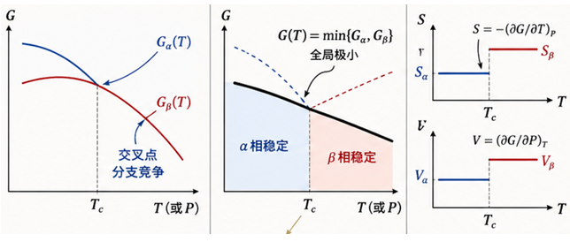

还有一种连续相变（二级相变），此时只有单一极小值，但是逐渐变平到稳定性丧失：

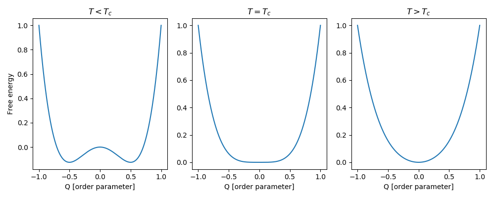

此时临界点满足：

$$
\pdv [2]{ G }{ m }  = 0
$$

---

自由能的一阶变分可以写成：

$$
\var{ G } = ( \mu _\alpha - \mu _\beta  )\var{ n } - ( P_{\alpha}-P_{\beta } )\var{ V } - ( T_{\alpha} - T_{\beta } )\var{ S }
$$

要使变分为 0，必须要逐项系数为 0，也就是化学势，压强，温度均相等。

另外要求二次变分必须为定号，也就是 Hessian 矩阵正定。这对应响应函数：

$$
-\qty(\pdv [ 2 ]{ F }{ V })_{ T } = \qty(\pdv{ P }{ V })_{ T } < 0
$$

对于 vdw 气体，在临界温度以下出现 S 形结构，显然是违背的。于是体系演化成气液分离相回复凸性结构。

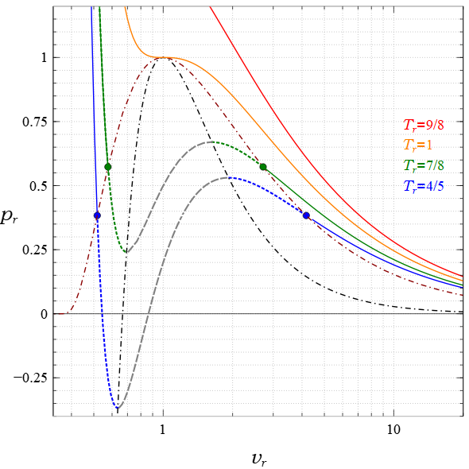

---

### Maxwell 构造

考虑含两个相的体系，满足

$$
\begin{gathered}
V = \lambda V_{1} + ( 1-\lambda )V_{2} \\
F_{mix} = \lambda F( V_{1} ) + ( 1-\lambda )F( V_{2} )
\end{gathered}
$$

现在用连接两个稳定体积点的公切线取代原来的非凸区间。对应两体积点：

$$
\qty(\pdv{ F }{ V })_{ V_{1} }  = \qty(\pdv{ F }{ V })_{ V_2 }  = -P_{0}
$$

于是两点压强相等并满足：

$$
F( V_{1} ) + P_{0}V_{1} = F( V_{2} )+P_{0}V_{2}
$$

也就是：

$$
f+Pv = \mu  = const.
$$

这正好对应相平衡的三个条件。也就是 Maxwell 构造和相平衡和吉布斯自由能 G 简并相互等价。

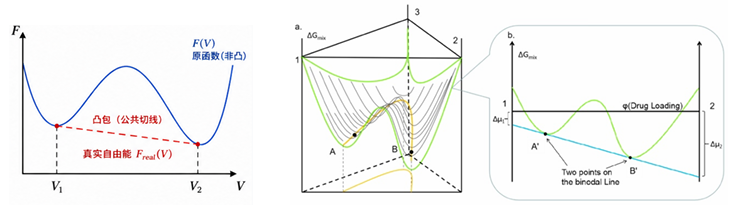

自由能满足：

$$
F( V_{2} )-F( V_{1} ) = -\int_{V_{1}}^{V_{2}} P( V ) \dd{V} = -P_0( V_{2}-V_{1} )
$$

也就是：

$$
\int_{V_{1}}^{V_{2}} [ P( V ) - P_{0} ] \dd{V} = 0
$$

这就是等面积法则，也就是水平上的 $P_0$ 分割的两个区域面积相等。

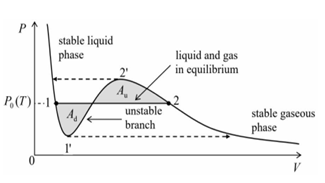

---

### 序参量

定义序参量为某一微观算符的统计平均：

$$
\eta = \ev{ \hat{O} }
$$

- 标量序参量描述有序程度，例如铁磁体系有：

  $$
  m  =\frac{1}{N}\sum_i s_i
  $$

  对液气体系有：

  $$
  \eta = \rho _l - \rho _g
  $$

- 复序参量包括相位信息，例如波函数

- 非局域序参量，如自旋玻璃

对 ising 铁磁体系，格点自旋满足：

$$
s_{i} = \pm 1
$$

对应哈密顿量为：

$$
H = -J\sum_{<ij>}s_is_j
$$

---

### 朗道连续相变理论

自由能可以写成序参量的函数：

$$
F = F( T,\eta  )
$$

且平衡态满足：

$$
\pdv{ F }{ \eta  }  = 0 \qc \pdv [2]{ F }{ \eta  } > 0
$$

对铁磁性体系，$T>T_c$ 时，$m=0$ 处于顺磁态（无序，高对称）；$T<T_c$ 时进入对称性降低的铁磁态。

朗道自由能可以展开为：

$$
F( T, m ) = F_{0}( T ) + \frac{1}{2}a( T )m^{2} + \frac{1}{4} b( T )m^{4}+ \cdots
$$

注意自由能满足反演对称性，因此均为偶次项。很明显稳定性取决于二次项，也就是临界点满足：

$$
a( T_c ) = 0
$$

展开 $a( T)$ 到一阶近似：

$$
a( T ) \approx a'( T_c )( T-T_c ) = a_{0}t
$$

定义临界温度

$$
t = \frac{T-T_c}{T_c}
$$

而由于 $b( T)$ 变化缓慢可以近似为常数，于是可以写成：

$$
F( T, m ) = F_0( T ) + \frac{1}{2}a_{0}tm^{2} + \frac{1}{4}bm^{4}
$$

平衡态对应自由能极小值，对应 $\pdv{ F }{ m } =0$，此时有：

$$
m = 0\qc m = \pm  \sqrt{ -\frac{a}{b} }
$$

再看稳定性条件：

$$
\pdv [2]{ F }{ m } = a + 3bm^{2} > 0
$$

高温下 $a>0$，仅有 $m = 0$ 满足稳定性，对应高对称无序态；低温下 $a < 0$，对应出现两个等价的稳定态。

---

自由能极小时对应：

$$
m^{2} = -\frac{a}{2b} \sim -t
$$

定义临界指数：

$$
m \propto ( -t )^{\beta } \implies \beta = \frac{1}{2}
$$

如果加入外场：

$$
F( m ) = am^{2} + bm^{4} - hm
$$

在高温下的平衡态：

$$
2am = h = > m =\frac{h}{2a} \implies  \chi = \pdv{ m }{ h } \sim \frac{1}{a} \sim  t^{-1}
$$

定义磁化率指数：

$$
\chi \sim | t |^{-\gamma} \implies  \gamma = 1
$$

在临界点处 $t=0, a=0$ 于是平衡条件：

$$
4bm^{3} = h
$$

定义 $\delta$ 指数：

$$
h \propto m^{\delta} \implies  \delta = 3
$$

由于自由能满足：

$$
F = am^{2} + bm^{4} -hm \sim t^{2}
$$

于是热容：

$$
C\sim \pdv [2]{ F }{ T } \sim const.
$$

定义比热指数：

$$
C\sim t^{\alpha} \implies  \alpha = 0
$$

并且两相热容差为：

$$
c_- - c_+ = \frac{a_{0}^{2}}{2bT_c}
$$

---

### Ising 模型

将系统的哈密顿量写成：

$$
H = -J\sum_{<ij>}s_{i}s_{j}-h\sum_is_i
$$

对应配分函数为：

$$
Z = \sum_{\{ s_i \}}\exp( \beta \qty( J\sum_{<ij>}s_{i}s_{j}+h\sum_is_i ) )
$$

定义平均磁化强度：

$$
m = \frac{1}{N} \sum_i \ev{ s_i }
$$

平均场近似：用周围自旋的平均作用代替涨落。作用在格点上的等效力：

$$
-\pdv{ H }{ s_i } = h + \sum_{j}J_{ij}s_{j}
$$

定义等效磁场：

$$
h_{i}^{eff} = h + \frac{1}{\mu }\sum_jJ_{ij}s_j \approx h + \frac{Jzm}{\mu }
$$

此时能量化为：

$$
H = -h^{eff}\sum_is_i
$$

对应单粒子配分函数：

$$
Z_1 = e^{ \beta h_{eff} } + e^{ -\beta h_{eff} } = 2\cosh( \beta h_{eff} )
$$

对应平均磁化强度：

$$
m = \frac{1}{\beta }\pdv{ h } \ln Z = \tanh( \beta h_{eff} )
$$

代入等效磁场的表达式得到自洽方程：

$$
m = \tanh( \beta h + \beta Jzm )
$$

在临界点附近无外场的情况下，近似后得到：

$$
\beta Jz = 1
$$

对应临界温度：

$$
T_c = \frac{Jz}{k_B}
$$

也就是 $T>T_c$ 时仅存在惟一解 $m=0$，$T<T_c$ 时出现两个非零解 $m = \pm m_{0}$

---

### Landau-Ginzburg 理论

---

### 7. 涨落和耗散

### Langevin 方程

加上随机扰动后，体系可以写成：

$$
\pdv{ m( r, t ) }{ t } = F [ m ]+\zeta( r, t )
$$

为了不破坏稳定性，必须遵循自由能梯度下降：

$$
\pdv{ m( r, t ) }{ t } = -\Gamma\fdv{ F }{ m }+\zeta( r, t )
$$

对于随机噪声满足均值为 0 和短相关性：

$$
\ev{ \zeta( r, t )\zeta( r', t' ) } \propto \delta( r-r' )\delta( t-t' )
$$

---

引入相空间分步函数 $P(x,v,t)$，可写出 Fokker-Plank 方程：

$$
\pdv{ P }{ t }  = -v\pdv{ P }{ x } +\frac{\gamma}{M}\pdv{ v } ( vP )+D\pdv [2]{ P }{ v }
$$

???

---

### Brownion 运动

考虑一维布朗粒子：

$$
M\dot{v} = -\gamma v+\eta ( t )
$$

假设热噪声满足：

$$
\ev{ \eta ( t )\eta ( t' ) } = 2\gamma k_{B}T\delta( t-t' )
$$

直接解微分方程，用常数变易法可得：

$$
v( t ) = v_{0}e^{ -\gamma t/M } + \frac{1}{M}\int_{0}^{t} e^{ -\gamma( t-t' ) }\eta ( t' ) \dd{t'}
$$

后一项代表噪声的累计。考虑速度关联函数：

$$
C_v( t ) = \ev{ v( t )v( 0 ) }
$$

代入得到：

$$
\begin{align}
\ev{v( t )v( 0 )} = \ev{v_{0}^{2}}e^{ -\gamma t/M  } = \frac{k_{B}T}{M}e^{ -\gamma t/M }
\end{align}
$$

这是速度自相关函数。

粒子位移：

$$
x( t ) - x( 0 ) = \int_{0}^{t} v( t' ) \dd{t'}
$$

于是均方根位移：

$$
\ev{ ( x( t ) -  x( 0 ) )^{2} }  = \int_{0}^{t}  \dd{t_{1}} \int_{0}^{t}\dd{t_{2}}\ev{ v( t_{1} )v( t_{2} ) }
$$

替换变量 $t_1 - t_{2} \to \tau$，$t_1 \to  t'$：

$$
\begin{align}
\ev{ ( x( t ) -  x( 0 ) )^{2} } & = \int_{-t}^{t}  \dd{\tau }\int_{0}^{t-\tau}  \dd{t'}  \ev{ v( \tau  )v( 0 ) }  \\
 &  = 2\int_{0}^{t}  \dd{\tau }( t-\tau )\ev{ v( \tau )v( 0 ) }
\end{align}
$$

令 $t \to \infty$，这样就有：

$$
\ev{ r^{2} } = 2Dt\qc D = \int_{0}^{\infty} \frac{k_{B}T}{M}e^{ -\gamma \tau/M } \dd{\tau }
$$

这是 green-kubo 关系。积分可以得到：

$$
D = \frac{k_{B}T}{\gamma}
$$

这是 Einstein 扩散关系。

---

### 模空间动力学

临界区域附近，由于涨落较小可以写成：

$$
F [ m ]\simeq \frac{1}{2}\int\dd [ d ]{r} [ am^{2}+c( \grad m )^{2} ]
$$

代入动力学方程：

$$
\pdv{ m }{ t } = -\Gamma( a-c\laplacian  )m + \zeta( r, t )
$$

对应倒空间的方程：

$$
\pdv{ m_k }{ t }  = -\Gamma( a+ck^{2} )m_k + \zeta_k( t )
$$

定义模的回复率：

$$
\lambda_k = \Gamma( a+ck^{2} )
$$

这样就得到标准形式：

$$
\pdv{ m_k }{ t }  = -\lambda_km_k + \zeta_k( t )
$$

之后思路就完全一样了。满足：

$$
\ev{ \zeta _k( t )\zeta _{k'}( t' ) } = 2\Gamma k_{B}T\delta( k+k' )\delta( t-t' )
$$

对应每个波之间完全解耦，每个模 $m_k$ 等价于一个独立的 OU 过程。

长时间收敛达到静态后，对一个模的自由能：

$$
F_k = \frac{1}{2}( a+ck^{2} )| m_k |^{2}
$$

于是概率：

$$
P( m_k )\propto \exp [ -\frac{\beta }{2}( a+ck^{2} )| m_k |^{2} ]
$$

由高斯分布得到：

$$
\ev{ | m_k |^{2} } = \frac{k_{B}T}{a+ck^{2}}
$$

对应长波下容易出现涨落。

涨落谱可以写成：

$$
S( k ) = \ev{ | m_k |^{2} } = \frac{k_{B}T}{a+ck^{2}} = \frac{S( 0 )}{1+\xi ^{2}k^{2}}
$$

实空间点的关联函数可以通过这个给出：

$$
G( r ) = \int\frac{\dd [ d ] k}{( 2\pi  )^d}\frac{k_{B}T}{a+ck^{2}}e^{ ik\cdot r } = \frac{k_{B}T}{c} \int\frac{\dd [ d ] k}{( 2\pi  )^d}\frac{1}{k^{2}+\xi^{-2}}e^{ ik\cdot r }
$$

在三维条件下积分可以得到：

$$
G( r ) \sim \frac{e^{ -r/\xi}}{r}
$$

对应短程强关联，但长城指数衰减到回复无序。这里关联长度表示出现临界极限的尺度：

$$
\xi = \sqrt{ c/a }
$$

---

现在尝试加入外场响应：

$$
F [ m ]\simeq \frac{1}{2}\int\dd [ d ]{r} [ am^{2}+c( \grad m )^{2} ]-\int\dd [ d ]{r} hm
$$

这样求导之后动力学方程变成：

$$
\pdv{ m }{ t } = -\Gamma( a-c\laplacian  )m + \Gamma h + \zeta
$$

换成频域表示：

$$
\pdv{ m_k }{ t }  = -\Gamma( a+ck^{2} )m_k + \Gamma h_k( t ) + \zeta_k( t )
$$

再对时间做一次傅里叶变换：

$$
[ -i\omega + \Gamma( a+ck^{2} ) ] m(k,\omega )=\Gamma h(k,\omega )+\zeta( k,\omega )
$$

由于平均意义下随机力为 0，于是可以得到线性响应：

$$
m( k,\omega ) = R( k,\omega )h( k,\omega )\qc R( k,\omega )=\frac{\Gamma}{-i\omega+\Gamma( a+ck^{2} )}
$$

当回复力 $a+ck^{2}\to 0$ 时，对应很小的外场都会产生强相应。

无外场条件下，得到的方程：

$$
m( k,\omega ) = R( k,\omega )\xi ( k,\omega )
$$

白噪声统计：

$$
\ev{ \xi ( k,\omega )\xi ( k',\omega' ) } = 2\Gamma k_{B}T\delta( k+k' )\delta( \omega+\omega' )
$$

对应动力学关联谱：

$$
C( k,\omega ) = | R( k,\omega ) |^{2}\cdot 2\Gamma k_{B}T
$$

因为有：

$$
\begin{gathered}
| R( k,\omega ) |^{2} = \frac{1}{\omega ^{2}+\Gamma ^{2}( a+ck^{2} )^{2}} \\
\Im R( k,\omega )  = \frac{\omega}{\omega ^{2}+\Gamma ^{2}( a+ck^{2} )^{2}}
\end{gathered}
$$

于是得到涨落-耗散定理 FDT：

$$
C( k,\omega ) = \frac{2k_{B}T}{\omega}\Im R( k,\omega )
$$

---

响应函数的极点：

$$
-i\omega+\Gamma( a+ck^{2} )= 0
$$

于是弛豫时间：

$$
\tau = \frac{1}{\Gamma( a+ck^{2} )}
$$

这对应临界极限 $a\to{0}, k\to 0$ 时弛豫时间趋向于无穷。

由于 $\xi \sim a^{-1/2}$，又有 $\tau = \xi^{-1}$，对应动力学临界系数：

$$
\tau \sim \xi^{z}\qc z = 2
$$

---

## 8. 非平衡统计

## 相空间描述

这时候我们不用单粒子轨迹描述，而改用相空间分布函数表述，定义时刻 t 的相空间体积元粒子数为

$$
\rho_N( r, v, t )\dd [ 3 ]{ r }\dd [ 3 ]{ v }
$$

可以把相空间坐标写成：

$$
\Gamma =( r_{1}, p_{1}, r_{2}, p_{2},\cdots , r_N, p_N )
$$

对应概率密度函数：

$$
\int \rho _N( \Gamma, t )\dd{\Gamma} = 1
$$

连续性方程

$$
\dv{ t }\int_V \rho _N \dd{\Gamma} = -\oint_{\partial V} \rho _N\dot{\Gamma}\cdot \dd{S} = -\int_V\grad _\Gamma\cdot ( \rho _N\dot{\Gamma} )\dd{\Gamma}
$$

要求：

$$
\pdv{ \rho _N }{ t } +\grad _\Gamma\cdot ( \rho _N\dot{\Gamma} )= 0
$$

在哈密顿空间

$$
\div \dot{\Gamma} = \sum_i\qty( \pdv{ \dot{r}_i }{ r_i } + \pdv{ \dot{p}_i }{ p_i } ) = \sum_i \qty( \pdv{ H }{ r_i }{ p_i } - \pdv{ H }{ r_i }{ p_i }  ) = 0
$$

于是有刘维尔方程：

$$
\pdv{ \rho _N }{ t } + \dot{\Gamma}\cdot \grad _\Gamma \rho _N = 0
$$

进一步：

$$
\dv{ \rho _N }{ t }= 0
$$

也就是相空间体积守恒。

---

### BBGKY 方程链

定义单粒子分布函数：

$$
f_{1}( 1 )= N\int\rho _N\dd{2} \cdots \dd{N}
$$

其中 $1\equiv ( r_{1},p_{1})$。另外双例子分布函数：

$$
f_{2}( 1,2 ) = N( N-1 )\int\rho _N\dd{3} \cdots \dd{N}
$$

刘维尔方程：

$$
\pdv{ \rho _N }{ t } + \sum_{i = 1}^{N} \qty( \frac{p_i}{m}\grad _{r_i}\rho _N + F_i \grad _{p_i}\rho _N )= 0
$$

对刘维尔方程两边成 N 并对其他所有粒子积分：第一项

$$
N\int \pdv{ \rho _N }{ t } \dd{2} \cdots \dd{N} = \pdv{ f_{1} }{ t }
$$

先考虑粒子 1，第二项仅仅对于粒子 1 有：

$$
\frac{p_{1}}{m}\cdot \grad _{r_{1}}f_{1}
$$

第三项对外力的积分：

$$
N\int F^{ext}\cdot \grad _{p_{1}}\rho _N\dd{2}\cdots \dd{N}  = F^{ext}\cdot \grad _{p_{1}}f_{1}
$$

对内力的积分：

$$
\begin{align}
 & N \int \sum_{j = 2}^{N}  F_{1j} \grad _{p_1}\rho _N \dd{2} \cdots \dd{N} \\
 &  = N( N-1 )\int F_{12}\grad _{p_1}\rho _N\dd{2\cdots \dd{N} } \\
 & = N( N-1 )\int F_{12} \cdot \grad _{p_{1}}f_2\dd{2}
\end{align}
$$

对于其他粒子的项分部积分后结果都为 0.

可以列出第一条方程：

$$
\pdv{ f_{1} }{ t } + v_{1}\cdot \grad _1f_{1}+F^{ext}\cdot \grad _{p_{1}}f_{1}=\int F_{12}\cdot \grad _{p_{1}}f_{2}\dd{2}
$$

接下去还可以得到 $\pdv*{ f_n}{ t} \sim f_{n+1}$ 的关系，也就是单粒子分布函数不能独立演化。

由于无法直接求解，可以有分子混沌近似，也就是碰撞前两粒子统计独立：

$$
f_2( 1,2 ) \simeq f_{1}( 1 )f_{1}( 2 )
$$

---

现在我们就可以处理单粒子配分函数了，粒子数密度：

$$
n( r, t ) = \int f\dd [ 3 ]{v}
$$

平均流速：

$$
u( r, t ) = \frac{1}{n}\int vf\dd [ 3 ]{v}
$$

能量密度：

$$
e( r, t ) = \int \frac{1}{2}mv^{2}f\dd [ 3 ]{v}
$$

f 分步随时间的变化有输运和碰撞两部分，忽略粒子碰撞的情况下从连续性方程：

$$
\pdv{ f }{ t } + v\cdot \grad _r f + F\cdot  \grad _v f = 0
$$

作一个弹性钢球假设，这样动量始终保持交换，碰撞结果只由散射角唯一确定：

$$
\Omega = ( \theta,\phi  )
$$

考虑速度 $v$ 的粒子与 $v_1$ 发生碰撞，用碰撞核表示单位时间单位速度体积单位立体角的碰撞概率：

$$
\Lambda( v, v_{1},\Omega )
$$

于是 $v$ 附近粒子因为碰撞离开的速率：

$$
ff_{1}\Lambda \dd{v_{1}} \dd{\Omega}
$$

从其他状态因为碰撞进入 $(v,v_{1})$ 的概率，由于微观可逆性：

$$
f'f_{1}'\Lambda \dd{v_{1}} \dd{\Omega}
$$

对应净变化率：

$$
\qty(\pdv{ f }{ t })_{ coll }  = \iint ( f'f_{1}' - ff_{1} )\Lambda \dd{v_{1}} \dd{\Omega}
$$

统一到源方程里面去：

$$
\pdv{ f }{ t } + v\cdot \grad _r f + F\cdot  \grad _v f = S [ f ]
$$

---

为了刻画演化的方向性，定义 H 函数：

$$
H( t ) = \int f( r, v, t )\ln f( r, v, t )\dd [ 3 ]{r}\dd [ 3 ]{v}
$$

由于有：

$$
\dv{ H }{ t } = \int ( 1+\ln f )\pdv{ f }{ t } \dd [ 3 ]{r} \dd [ 3 ]{v}
$$

由于边界消失条件，有：

$$
\int ( 1+\ln f )( v\cdot \grad _r f + F\cdot  \grad _v f ) \dd [ 3 ]{r} \dd [ 3 ]{v} = 0
$$

得到：

$$
\dv{ H }{ t } = \int( 1+\ln f )C [ f ]\dd [ 3 ]{r}\dd [ 3 ]{v}
$$

代入碰撞项：

$$
\dv{ H }{ t } = \int\dd [ 3 ]{v}\dd [ 3 ]{v_{1}} \dd{\Omega}( 1+\ln f )  \Lambda( f'f_{1}' - ff_{1} )
$$

由于交换对称性，交换 $(v,v_{1})$ 结果不变：

$$
\dv{ H }{ t } = \int\dd [ 3 ]{v}\dd [ 3 ]{v_{1}} \dd{\Omega}( 1+\ln f_{1} )  \Lambda( f_{1}'f' - ff_{1} )
$$

相加得到：

$$
2\dv{ H }{ t } =  \int\dd [ 3 ]{v}\dd [ 3 ]{v_{1}} \dd{\Omega} \Lambda( f'f_{1}' - ff_{1} )( \ln f - \ln f_{1} )
$$

根据对数不等式直接得到：

$$
\dv{ H }{ t }\leq 0
$$

也就是 H 单调递减且在极值抵达稳定。同时极值时有：

$$
f'f_{1}' = ff_{1}
$$

---

微扰平衡态展开分布函数：

$$
f = f^{( 0 )} + f ^{( 1 )} + \cdots
$$

零阶平衡对应 Maxwell 分布：

$$
f^{( 0 )}\propto \exp [ - \frac{( v-u )^{2}}{2k_{B}T} ]
$$

一阶平衡需要用展开。定义 Knudsen 数，$\lambda_{mfp}$ 为平均自由程：

$$
\varepsilon = \frac{\lambda_{mfp}}{L}
$$

当 $\varepsilon \ll  1$ 时可以用 Knudsen 数展开：

$$
f = f^{( 0 )} + \varepsilon f^{( 1 )}+ \cdots
$$

这是 Chapman-Enskog 方法。展开代入并求解就可以得到输运定律：

$$
\begin{gathered}
\sigma_{ij} = \eta ( \partial_iu_j + \partial_ju_i ) \\
q = -\kappa \grad T \\
J = -D\grad n
\end{gathered}
$$

