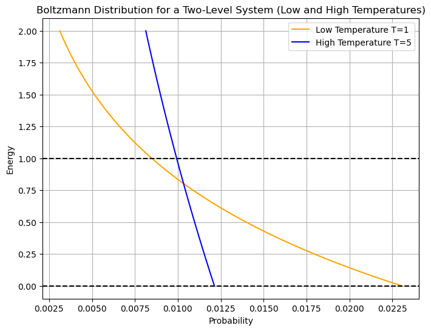
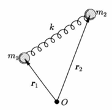
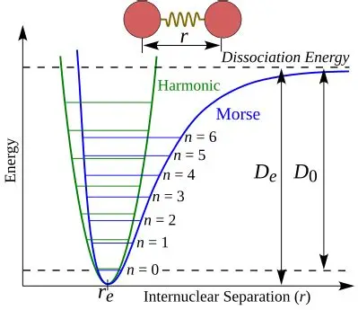
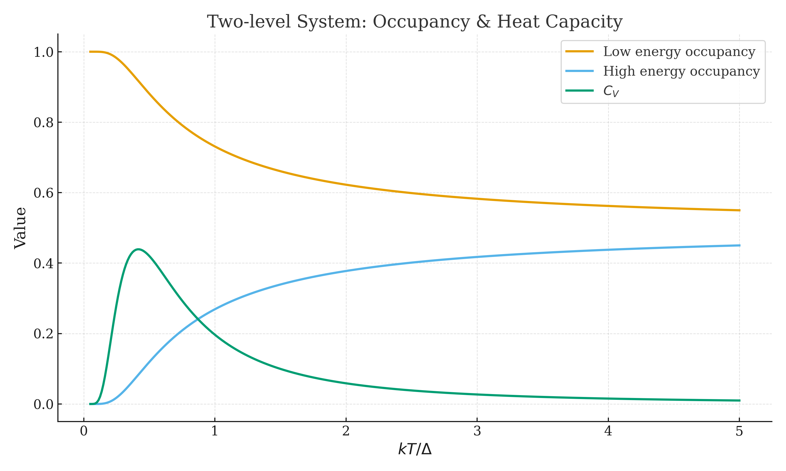
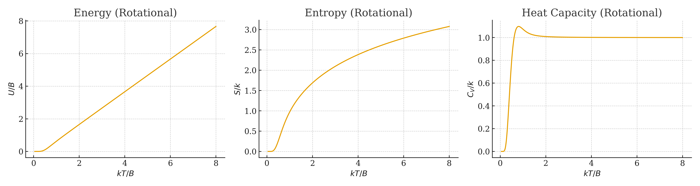
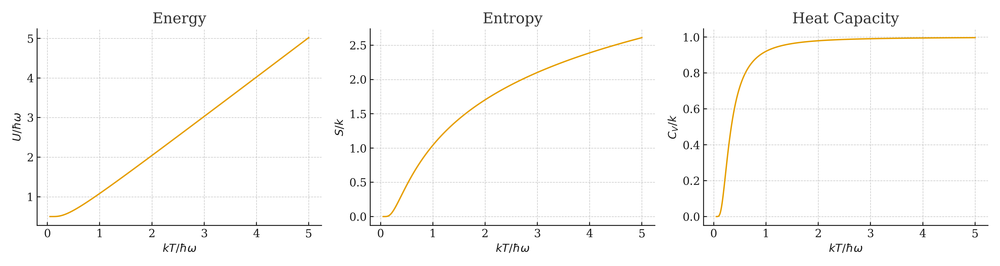
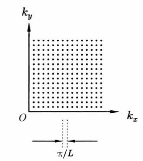
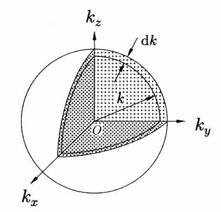
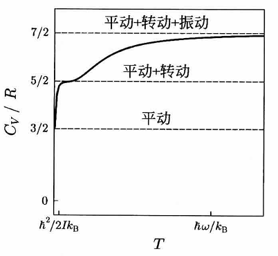

# 统计热力学 Statistic Thermodynamics

> 参考：Blundell, S. J., & Blundell, K. M. (2018). *热物理概念：热力学与统计物理学* (第2版). 许均华， 喇文， 刘志翔， 刘成 (译). 科学出版社.
>
> 本文档遵循[署名—非商业性使用—相同方式共享 4.0 协议](https://creativecommons.org/licenses/by-nc-sa/4.0/)（CC BY-NC-SA 4.0）授权:fontawesome-brands-creative-commons::fontawesome-brands-creative-commons-by::fontawesome-brands-creative-commons-nc::fontawesome-brands-creative-commons-sa:
>
> 作者：凯楽斯kelesss

## 0. 统计热力学到底是什么？

实际上，统计物理学要解决的事情一句话就是：**如何才能通过微观状态下粒子在不同能级的分布，导出宏观的热力学量？**

$$
粒子在能级E_i的概率为P_i \ce{->[某种函数关系]} 宏观热力学量(U, F,S... )
$$

我们先解决几个最基本的概念：

- **能级从何而来？** 我们知道量子尺度下能量是量子化的，即可以视作粒子可以处于一层一层的**能级**（Energy Level）上。能级能量的详细推导需要量子力学背景，但我们先直接在各个情景中给出。

- **怎么知道粒子在某个能级的概率？** 一般我们有**Boltzmann 分布**（Boltzmann Distribution）：

$$
p_i \propto e^{-\beta E_i}
$$

其中 $\beta = 1/k_BT$ 是一个很常用的温度量，在外文书一般把他叫做**热力学 beta**（Thermodynamic Beta）。你可以先把其当作一个公理，即粒子在某各能级分布的概率 $p_i$ 是和指数项 $\exp(-\beta E_i)$ 正相关的。

一个明显的趋势是，**低温下，粒子倾向于分布在最低能级；高温下，粒子倾向于在各能级平均分布**。

---

## 1. 能量均分

### 1.1 能均分定理

在很多地方我们都可以看见能量的表达式是以平方项的形式出现的，比如 $E_k = \frac12 mv^2$，$E_p = \frac12 kx^2$ ，这里我们不妨假设一个势阱可以用平方项表示：

$$
E = ax^2
$$

现在我们假设变量 $x$ 可以等概率的在无穷的长度中取值，由 Boltzmann 分布可得，系统取得特定能量 $\alpha x_i^2$ 的概率为（注意分母用于归一化）：

$$
P(x_i) = \frac{e^{-\beta\alpha x_i^2}}{\sum e^{-\beta\alpha x^2}} = \frac{e^{-\beta\alpha x_i^2}}{\int_{-\infty}^{\infty}e^{-\beta\alpha x^2} \dd x}
$$

则利用高斯矩公式，平均能量 $\langle E \rangle$ 可表示为：

$$
\begin{aligned}
\langle E \rangle = \int_{-\infty}^{\infty} EP(x)\dd x &= \frac{\int_{-\infty}^{\infty} \alpha x^2e^{-\beta\alpha x^2}\dd x}{\int_{-\infty}^{\infty}e^{-\beta\alpha x^2} \dd x} \\
&= \frac{\sqrt{\pi}/2\sqrt{\beta^3\alpha^3}}{\sqrt{\pi}/\sqrt{\beta\alpha}} \\
&= \frac1{2\beta} = \frac12 k_BT
\end{aligned}
$$

这意味着对于一个存在多个平方项能量的系统而言:

$$
E = \sum_i a_ix_i^2
$$

其总能量：

$$
\begin{aligned}
\langle E_n \rangle &= \int_{-\infty}^{\infty}...\int_{-\infty}^{\infty}EP(x_1,...,x_n) \dd x_1 ... \dd x_n \\
&= \int_{-\infty}^{\infty}...\int_{-\infty}^{\infty}(\sum_i \alpha_i x_i^2)P(x_1,...,x_n) \dd x_1 ... \dd x_n \\
&= \sum_i\frac{\int_{-\infty}^{\infty}...\int_{-\infty}^{\infty}(\alpha_i x_i^2)e^{-\beta(\sum_i \alpha_i x_i^2)} \dd x_1 ... \dd x_n}{\int_{-\infty}^{\infty}...\int_{-\infty}^{\infty}e^{-\beta(\sum_i \alpha_i x_i^2)} \dd x_1 ... \dd x_n} \\
&= \sum_i\frac{\int_{-\infty}^{\infty}(\alpha_i x_i^2)e^{-\beta\alpha_i} \dd x_i}{\int_{-\infty}^{\infty}e^{-\beta\alpha_i} \dd x_i} = \frac n2 k_BT
\end{aligned}
$$

注意倒数第二步中，分子中每一个非 $x_i$ 项的积分可以单独提出来，且均可与分母约去。

定义系统每一个平方能量项称作系统的一个**自由度**（degree of freedom），即对总能量而言，每一个自由度贡献 $\frac 12 k_BT$ 的能量，这被称为**能均分定理**（equipartition theorem）。

!!! WARNING "注意"
    能均分定理的特殊之处是它所导出的能量**与系统大小无关**。作为例子，我们考虑一个室温下的弹簧振子：

    $$
    E = E_p + E_k = \frac12 kx^2 + \frac12 mv^2 = k_BT = \pu{0.025 eV} = \pu{2.4 kJ/mol}
    $$
    
    这种能量对于一个宏观弹簧一点用都没有，但是对于原子（化学键可视作一个弹簧）来说已经是非常巨大的能量了。

!!! NOTE "拓展"
    借此还可以求出广义量$x$的平方的均值：

    $$
    \begin{aligned}
    \langle x_i^2 \rangle = \langle E_i \rangle/\alpha_i = \frac{k_BT}{2\alpha_i}
    \end{aligned}
    $$
    
    如果这个量是三个方向上的动量，我们即可推导出气体的**均方根速率 **$\sqrt{\langle x^2 \rangle} = \sqrt{\frac{3k_BT}{m}}$ ，这与宏观推导一致。

---

### 1.2 一般分子的能量和热容

对于一个一般分子来说，考虑**平动**和**转动**：

$$
E_{平动,i} = \frac12 mv_i^2 ,\quad E_{转动,i} = \frac 12 I\omega_i^2 = \frac12 \frac{L_i^2}{I}
$$

均为平方能量项，因此对于每一个方向上的分能量都可以用 $\frac12 k_BT$ 表示。

对于三维分子而言，平动包括 $x,y,z$ 三个方向，于是：

$$
\langle E_{平动} \rangle = \langle \frac 12 m (v_x^2 + v_y^2 + v_z^2) \rangle = \frac32 k_BT
$$

这和从宏观气体进行推导得到的结论相同。

对于**振动**来说考虑起来比较困难，我们不妨从双原子分子开始考虑吧：

当分子开始振动时，除了考虑整体的平动能外，还需考虑相对运动（Konig定理）：

$$
E = \frac12 m(v_x^2 + v_y^2 + v_z^2) + \frac12\pqty{\frac{L_1^2}{I_1}+\frac{L_2^2}{I_2}} + \frac 12 \mu(\dot{\vec{r_1}} - \dot{\vec{r_2}}) + \frac12 k(|\vec{r_1} - \vec{r_2}| - l_0)^2
$$

按照上面的理论，我们只关心有几个平方项能量，因此：

$$
\langle E \rangle = \frac72 k_BT
$$

一般我们认为**系统微观的平均能量为系统的内能**（$\langle E \rangle = U$），于是通过对能量项的求导，对于自由度为$f$的体系：

$$
\boxed{C_v = N_A \dv{U}{T} =\frac f2 R,\quad C_p = (\frac f2 +1) R}
$$

当然，对于单原子分子而言，只存在平动自由度，因此 $f=3$ ；而对于双原子分子，其一定在沿键轴方向没有转动自由度，如果算上所有的自由度则 $f=7$ 。

但是并不是所有的自由度在所有的温度下都会体现。通常情况下（室温附近），双原子气体只会体现平动和转动自由度，而振动自由度只有在极高温下才会解冻。当温度极低时，甚至转动自由度都会被冻结：

> 以$\ce{CO}$作为例子，$T_{rot} \approx \pu{2.8K}$，$T_{vib} \approx \pu{3103K}$。对于含弱键的分子比如 $\ce{I2}$，$T_{vib} \approx \pu{308K}$。事实上这一变换并不是突变，而是平滑的。

究其原因，我们知道能量是量子化的。以简谐振子来说，其能量由 $E = (n+\frac12)\hbar\omega$ 给出，当热能 $k_BT$ 远小于能级差 $\hbar\omega$ 时，振动能级就不可能被激发。而当它们具有大致相同的数量级时，能量的量子化就不可能被忽视，这意味着之前所做的" $x$ 为连续量"的假设不奏效了。所以，只有当 $k_BT$ 远大于能级差时，能均分定理的近似才相对较好，换句话说就是**能均分定理仅在相对高温下有效**。

!!! abstract "总结"
    | 气体类型             | 自由度                        | $f$  | $C_v$        | $C_p$        | $\gamma$   |
    | -------------------- | ----------------------------- | ---- | ------------ | ------------ | ---------- |
    | 单原子气体           | 平动                          | 3    | $\frac 32 R$ | $\frac 52 R$ | $\frac 53$ |
    | 双原子气体（极低温） | 整体平动                      | 3    | $\frac 32 R$ | $\frac 52 R$ | $\frac 53$ |
    | 双原子气体（通常）   | 整体平动+转动                 | 5    | $\frac 52 R$ | $\frac 72 R$ | $\frac 75$ |
    | 双原子气体（极高温） | 整体平动+转动+(相对平动+振动) | 7    | $\frac 72 R$ | $\frac 92 R$ | $\frac 97$ |

对于固体而言，原子基本没有平动和转动的自由度，因此我们只考虑振动自由度。一种近似方式是将原子视作前后左右上下连接一根弹簧：

如果固体内有 $N$ 个原子，则就有 $3N$ 根弹簧，由于一根弹簧贡献 $k_BT$ 的能量，则可得固体的平均能量和热容：

$$
\boxed{\langle E \rangle = 3Nk_BT, \quad C_v = 3R}
$$

这就是**Dulong-Petit定律**。

---

### 1.3 简谐近似

正如我们前面所讨论的，能量都是基于平方项讨论的，然而事实却没这么简单捏。如键振动势能通常用Morse函数表示：

$$
V(r) = -D_e+D_e\left(1-e^{-a(r-r_e)^2}\right)^2
$$

这时候我们就需要引入**简谐近似**（Harmonic Approximation），即将势能面近似看作是一个平方项势能（即看作是简谐的）：

我们可以用泰勒展开导出。在极值点处作泰勒展开：

$$
V(x) = V(z_0) + \frac12 \left( \pdv{V}{x} \right)_{x_0} (x-x_0)^2 + o((x-x_0)^2)
$$

如果不是极高温的情况，我们可以忽略高阶项，进而得到前面平方项的能量。这意味着能均分定理近似还需要温度控制在可以忽略掉非简谐项的情况，幸运的是一般这对应的温度已经远超一般讨论范围了。

!!! NOTE "非简谐的情况"
    若考虑能量项非平方项，即为：

    $$
    E = \alpha|x|^k,\quad k=1,2,3,\ldots
    $$
    
    则我们有：
    
    $$
    P(x_i) = \frac{e^{\alpha\beta|x_i|^k}}{\int_{-\infty}^{\infty}e^{\alpha\beta|x|^k}\dd x}
    $$
    
    $$
    \begin{aligned}
    \langle E \rangle = \int_{-\infty}^{\infty} EP(x)\dd x &= \frac{\int_{-\infty}^{\infty} \alpha |x|^ke^{-\beta\alpha |x|^k}\dd x}{\int_{-\infty}^{\infty}e^{-\beta\alpha |x|^k} \dd x}
    \end{aligned}
    $$
    
    令$t = \beta\alpha|x|^k$，则$x = (t/\beta\alpha)^{1/k}$：
    
    $$
    \begin{aligned}
    \left< E \right> = \frac{\int_{-\infty}^{\infty} t e^{t}\dd (\frac{t}{\alpha\beta})^{\frac1k}}{\beta\int_{-\infty}^{\infty}e^{t} \dd (\frac{t}{\alpha\beta})^{\frac1k}}
    &= \frac{\int_{-\infty}^{\infty} t e^{t} \cdot t^{1/k-1}\dd t}{\beta\int_{-\infty}^{\infty}e^{t}\cdot t^{1/k-1} \dd t} \\
    &= \frac{\int_{-\infty}^{\infty} t^{1/k} e^{t}\dd t}{\beta \int_{-\infty}^{\infty}t^{1/k-1}e^{t} \dd t} \\
    &= \frac{\Gamma(1/k+1)}{\beta\Gamma(1/k)} = \frac{k_BT}{k}
    \end{aligned}
    $$

---

## 2. 配分函数

### 2.1 引入

我们在第一节介绍了一个用于归一化概率用的量 $\int_{-\infty}^{\infty}e^{-\beta\alpha x^2} \dd x$ ，事实上这是一个很常用的量，我们称之为**配分函数**（Partition Function）。在一般定义下，你可以认为这是所有态的玻尔兹曼因子之和：

$$
\boxed{Z = \sum_\alpha e^{-\beta E_\alpha} (离散) = \int_{-\infty}^{\infty}e^{-\beta E(x)} \dd x(连续)}
$$

你可以看到，配分函数的实质就是每个态的玻尔兹曼因子相加，一种理解方式是配分函数可以看作**粒子选择不同能量的相对概率之和**。

所以配分函数到底有什么用呢？你可以暂时先认为配分函数是百变怪，我们后面将会讨论怎么从$Z$推导出宏观的一切热力学符号。

!!! warning "注意"
    有些情况下，能级可能有多个简并态，记简并态的个数为$g$，则：

    $$
    Z = \sum_\alpha g_ie^{-\beta E_\alpha} (离散) = \int_{-\infty}^{\infty} g(x)e^{-\beta E(x)} \dd x(连续)
    $$

!!! example "简谐振子的配分函数"
    考虑简谐振子：

    $$
    E = (n+\frac12)\hbar\omega
    $$
    
    于是其配分函数：
    
    $$
    Z = \sum_{n=0}^\infty e^{-\beta(n+\frac12)\hbar\omega} = e^{-\frac12 \beta \hbar \omega} \sum_{n=0}^\infty e^{-\beta n\hbar\omega} = \frac{e^{-\frac12 \beta \hbar \omega}}{1-e^{-\beta\hbar\omega}}
    $$

!!! example "双原子分子转动的配分函数"
    对于双原子分子，其转动能级：

    $$
    E = \frac{\hbar^2}{2I} J(J+1)
    $$
    
    且每个能级的简并度 $g(J) = 2J+1$ 。由配分函数定义：
    
    $$
    Z_{rot} = \sum_{J=0}^\infty (2J+1)e^{-\frac{\hbar^2}{2Ik_BT}J(J+1)}
    $$
    
    为了方便，我们可以引入**转动特征温度**：
    
    $$
    \Theta_r = \frac{\hbar^2}{2Ik}
    $$
    
    于是：
    
    $$
    Z_{rot} = \sum_{J=0}^\infty (2J+1)e^{-\frac{\Theta}{T}J(J+1)}
    $$

---

### 2.2 得到态函数

回顾之前的结论，系统采取特定能量 $E_j$ 的概率为：

$$
P_j = \frac{e^{-\beta E_j}}{Z}, \quad \ln P_j = -\beta E_j - \ln Z
$$

现在我们看宏观的热力学量怎么导出：

#### 内能 U

我们前面已经说明：

$$
U = \left< E \right> = \frac{\sum_i E_ie^{\beta E_i}}{\sum_i e^{\beta E_i}}
$$

替换配分函数：

$$
\boxed{U = -\frac 1Z \dv{Z}{\beta} = -\dv{\ln Z}{\beta} = kT^2\dv{\ln Z}{T}}
$$

据此我们还可以顺便得到热容的表达式：

$$
C_V = \pqty{\pdv{U}{T}}_V = kT \left[ 2 \pqty{\pdv{\ln Z}{T}}_V + T \pqty{\pdv[2]{\ln Z}{T}}_V \right]
$$

#### 熵 S

根据混合熵（Gibbs 熵）的定义，我们有：

$$
\begin{aligned}
S &= -k\sum_i P_i\ln P_i \\
&= k\sum_i P_i (\beta E_i + \ln Z) \\
&= k(\beta U + \ln Z) = \frac{U}{T} + k\ln Z
\end{aligned}
$$

!!! warning "等一下，为什么我不能用 Boltzmann 熵？"
    我们更熟悉的微观熵公式：

    $$
    S = k_B \ln \Omega
    $$
    
    在这里并不适用。原因是 Boltzmann 熵中的微观状态数 $\Omega$ 要求**每个微观状态出现的概率相等**，而在这里显然是不能保证的。一个公设是，概率相等需要满足**体系的能量恒定**（即后面我们要说的微正则系综，在能量相等的情况下，没有理由认为会偏向哪个微观态，因此作等概率假设），但在这里的讨论组存在多种能量 $E$ 。所以我们只能求统计平均的熵。

#### 自由能 F

根据定义：

$$
\boxed{F = U-TS = U - U - kT\ln Z = - kT\ln Z}
$$

多么简单的式子！(。・ω・。)

之后由热力学基本方程立即可以得到：

$$
\begin{gathered}
S = - \pqty{\pdv{F}{T}}_V = k\ln Z + kT \pqty{\pdv{\ln Z}{T}}_V \\
\boxed{p = - \pqty{\pdv{F}{V}}_T = kT \pqty{\pdv{\ln Z}{V}}_T}
\end{gathered}
$$

其中熵的式子和前面的推导式等价的。在实际推导中，为了简便，我们一般用如下的式子推导熵：

$$
\boxed{S = \frac{U-F}{T}}
$$

#### 焓 H

$$
H = U + pV = kT \left[ T \pqty{\pdv{\ln Z}{T}}_V + V \pqty{\pdv{\ln Z}{V}}_T \right]
$$

#### 吉布斯自由能 G

$$
G = F + pV = kT \left[ -\ln Z + V \pqty{\pdv{\ln Z}{V}}_T \right]
$$

!!! example "二能级系统的热力学量"
    考虑一个二能级系统 $\{+\Delta/2, -\Delta/2\}$：

    
    
    其配分函数：
    
    $$
    Z = e^{-\frac{\beta\Delta}{2}} + e^{\frac{\beta\Delta}{2}} = 2\cosh{\frac{\beta\Delta}{2}}
    $$
    
    利用上述公式得到：
    
    $$
    \begin{gathered}
    U = -\dv{\ln Z}{\beta} = -\frac{\Delta}{2}\tanh(\frac{\beta\Delta}{2})\\
    C_V = (\pdv{U}{T})_V = k(\frac{\beta\Delta}{2})^2\sech^2(\frac{\beta\Delta}{2}) \\
    F = -k_BT\ln Z = -k_BT\ln(2\cosh(\frac{\beta\Delta}{2})) \\
    S = \frac{U-F}{T} = -\frac{\Delta}{2T} \tanh(\frac{\beta\Delta}{2}) + k\ln(2\cosh(\frac{\beta\Delta}{2}))
    \end{gathered}
    $$
    
    
    
    这里出现了一些很抽象的事情：热容随温度会到达一个极大值，之后又随之衰减。事实上这被称为**肖基特反常**（Schottky anomaly），(i) 当低温时，只有低能级被占据且温度增加对其改变不大，(ii) 而高温时两个能级被同等占据，温度增加也没有什么改变。
    
    

对于双原子分子转动能级和振动能级来说，我们有：

$$
E_{rot} = \frac{\hbar^2}{2I}J(J+1) = B \cdot J(J+1)
$$

$$
E_{vib} = (n+\frac12)\hbar\omega
$$

你可以发现这里的内能 $U$ 在高温下（尤其是 $k_BT>\Delta$ 时）基本都是随$T$线性上升的，此时热容基本上为定值，这也印证了我们前面能均分定理的结论：

1. 如果 $k_BT$ 小于能级差，则系统基本位于最低能级；
2. 如果能级有限且 $k_BT$ 远大于能级差，则系统倾向于在各能级平均分布；
3. 如果能级无限且 $k_BT$ 远大于能级差，则平均能量随 $T$ 线性上升。

这也能够求出前面我们说的双原子分子**热容的转变温度**：

$$
T_{rot} = \frac{\hbar^2/2I}{k} = \frac{\hbar^2}{2Ik} \qc T_{vib}  = \frac{\hbar\omega}{k}
$$

!!! example "简谐振动的态函数"
    前面我们说过：

    $$
    Z = \frac{e^{-\frac12 \beta \hbar \omega}}{1-e^{-\beta\hbar\omega}}
    $$
    
    由此我们可以得出：
    
    $$
    \begin{gathered}
    U  = -\dv{\ln Z}{\beta} = \hbar\omega \left(\frac 12 + \frac{1}{e^{-\beta\hbar\omega}-1}\right) \\
    C_V = (\pdv{U}{T})_V = k(\beta\hbar\omega)^2\frac{e^{\beta\hbar\omega}}{(e^{\beta\hbar\omega}-1)^2} \\
    F = -k_BT\ln Z = \frac{\hbar\omega}{2} + k_BT\ln(1-e^{-\beta\hbar\omega}) \\
    S = \frac{U-F}{T} = k\left[ \frac{\beta\hbar\omega}{e^{\beta\hbar\omega}-1} - \ln(1-e^{-\beta\hbar\omega}) \right]
    \end{gathered}
    $$
    
    我们于后面讨论这些结果在高温下的表现。

### 2.3 高温下的配分函数

前面一节我们说过，在高温下热容可以由能均分定理给出，这也可以由配分函数得到。假设在高温下能级可以视作是连续的：

$$
\begin{aligned}
Z_{rot} = \sum (2J+1)e^{-\frac{\Theta}{T}J(J+1)} &= \int_0^\infty (2J+1)e^{-\frac{\Theta}{T}J(J+1)} \dd J \\
&= -\left[ \frac{T}{\Theta}e^{-\frac{\Theta}{T} J(J+1)} \right]_0^\infty = \frac{T}{\Theta} = \frac{2IkT}{\hbar^2} \\
\end{aligned}
$$

于是 $U = -\dv{\ln Z}{\beta} = \frac 1\beta = k_BT$ ，而 $C_V = k$ 。同理对于振动能级：

$$
\begin{aligned}
Z_{vib} = \sum e^{-\beta(\frac12 + n)\hbar\omega} &= \int_0^\infty e^{-\beta(\frac12 + n)\hbar\omega} \dd n \\
&= e^{-\beta\hbar\omega/2}(\frac{1}{\beta\hbar\omega}\left[e^{-\beta n\hbar\omega}\right]_0^\infty) = \frac{e^{-\beta\hbar\omega/2}}{\beta\hbar\omega}
\end{aligned}
$$

于是 $U = -\dv{\ln Z}{\beta} = \frac{\hbar\omega}{2} + \frac{1}{\beta}$ ，而 $C_V = k$ 。注意对高温下的振动能级而言，其**内能与零点能有关，而热容与零点能无关。**

!!! abstract "总结"
    论如何解决统计力学问题：

    1. 先写出配分函数$Z = \sum_\alpha e^{-\beta E_\alpha}$
    2. 然后根据上面的公式把热力学态函数全算出来...

!!! tips "拓展：氢原子的配分函数"
    我们知道氢原子的束缚能级 $E_n = -\frac{R}{n^2}$ ，简并度 $g_n = 2n^2$ ，我们写出配分函数：

    $$
    Z = \sum_n g_ne^{-\beta E_n} = \sum_n 2n^2e^{\frac{\beta R}{n^2}}
    $$
    
    恭喜你遇到一个很棘手的问题……这函数怎么不收敛啊！因此想让这个函数收敛，必须要做一些束缚。前面我们说过，可以忽略能级差大于 $k_BT$ 以上的能级的分布，因此我们不妨假设存在 $n_{max}$ 满足 $R/n_{max} \sim k_BT$ ：
    
    $$
    Z = \sum_{i=1}^{n_{max}} 2n^2 e^\frac{\beta R}{n^2}
    $$
    
    之后就可以按正常的方法数值计算了。令 $t = k_BT/R$ 数值绘图：
    
    
    
    需要注意的是，在极高的温度下氢原子可能发生电离，因此需要加入**Saha方程**加以考虑。本节不涉及。

---

### 2.4 组合配分函数

对于无相互作用的两个粒子（或有两种能量项的一个粒子）而言，我们有：

$$
Z = \sum_i\sum_j e^{-\beta(E_i^a + E_j^b)} = \sum_ie^{-\beta E_i^a} + \sum_je^{-\beta E_j^b} = Z_aZ_b
$$

即总的配分函数等于每个分配分函数相乘。同样的，对于无相互作用的 $N$ 个粒子：

$$
Z_N = Z_1^N
$$

这一结论看似很合理，但其实有一些*奇怪的限制条件*，我们之后会谈到。

---

### 2.5 *磁系统

我们都知道一个基本粒子的自旋角动量等于 $\pm \frac12$ ，考虑其在磁场$B$中，这个粒子可以存在于两种本征态之一（ $\ket{\uparrow}$ 对应角动量平行于$B$， $\ket{\downarrow}$ 对应角动量反平行于$B$），他们的**磁矩**分别为 $-\mu_B$ 和 $+\mu_B$（玻尔磁子 $\mu_B = eh/2m$ ）。于是单粒子的配分函数：

$$
Z_1 = e^{\beta\mu_B B} + e^{-\beta\mu_B B} = 2\cosh{\beta\mu_BB}
$$

假设粒子间没有任何相互作用，则：

$$
Z_N = Z_1^N
$$

于是我们有：

$$
F = -kT\ln{Z_N} = -NkT\ln(2\cosh{\beta\mu_BB})
$$

之后我们即可求出磁矩：

$$
m = -\pqty{\pdv{F}{B}}_T = N\mu_B \tanh\pqty{\beta\mu_B B}
$$

对结果进行分析，我们发现当磁场$B$足够强时，能级趋向于 $N\mu_B$ ，对应几乎所有粒子都有极大概率处于 $\ket{\uparrow}$ 组态；而当磁场$B$在0附近时，曲线的行为类似于线性。事实上利用等价无穷小 $\tanh x \sim x$：

$$
m_{\sim 0} = \frac{N\mu_B^2B}{kT}, \quad M = m/V = \frac{N\mu_B^2B}{VkT}
$$

其中$M$为单位体积的磁矩。对弱磁材料，可认为 $M\approx \chi H$ ，其中 $\chi \ll 1$ 为磁化率。我们有：

$$
B = \mu_0(1+\chi)H \approx \frac{\mu_0M}{\chi}
$$

于是有：

$$
\boxed{\chi \approx \frac{N\mu_0\mu_B^2B}{VkT},\quad \chi\propto 1/T}
$$

这就是**居里定律**（Curie's Law）。

---

## 3. 理想气体的统计力学

### 3.1 态密度

现在假设我们需要研究一个边长为 $L$ 的立方盒子内的很多气体分子。我们先取出一个气体分子来研究，**假设原点位于容器的边角（即边界在 $0$ 和 $L$ ）**，根据量子力学推导可得：

$$
\psi(x,y,z) = (2/L)^{3/2}\sin(k_xx)\sin(k_yy)\sin(k_zz), \quad k_i = \frac{n_i\pi}{L}
$$

这里的 $k_i$ 指的是粒子的**波矢** $\vec{k}$（可以看成带方向的波数 $2\pi/\lambda$ ）在三个方向上的分量。

定义波矢大小位于 $k$ 和 $k+\dd k$ 之间的允许态的数目用 $g(k)\dd k$ 表示，我们将$g(k)$成为**态密度**（density of states）（*我们后面解释其含义*）：

$$
g(k) = \frac{k空间内\ 球壳的一个卦限体积}{k空间内\ 每一个允许态占据的体积}
$$

这里的“ $k空间$ ” 指的是将 $k_x, k_y, k_z$ 三个方向为坐标轴所构建的空间坐标系。

现在我们考虑每一允许态的体积。我们知道 $k_i = n_i\pi/L$ ，这里的 $n_x, n_y, n_z$ 可以取任何正整数值。如果在 $k空间$ 里表示出来，这有点类似于是下图所示的三维网格，其中每个点都代表一个可能的取值：

于是我们可以认为一个态所占的边长是 $\frac {\pi}L$ ，于是一个态所占的体积就是 $(\frac{\pi}{L})^3$ 。

由于原点是顶点，我们只考虑三个方向均为正的球壳，绘出球壳，可以看到 $\frac 18$ 球壳内部的体积为 $\frac 18 \cdot 4\pi k^2 \dd k$ ：

于是态密度为：

$$
\boxed{g(k)\dd k = \frac{\frac18 \times 4\pi k^3\dd k}{(\pi/L)^3} = \frac{Vk^2\dd k}{2\pi^2}}
$$

现在我们来看看这个所谓的态密度到底是什么。我们可以看到这个除法实际上对应着在这个球壳空间内有多少个允许态占据的体积，其实也就是**球壳内有多少个允许态（即有多少个上图的“点”）**。

换句话来说，这其实就对应于我们说的**能级的简并态**。考虑一个在 $k空间$ 内 $k, k + \dd k$ 的球壳，我们可以得到单粒子的配分函数：

$$
\begin{aligned}
Z_1 = \int_0^\infty g(k) e^{-\beta E(k)} \dd k &= \int_0^\infty \frac{Vk^2}{2\pi^2}e^{-\beta \hbar^2k^2/2m} \dd k \\
&= \frac{V}{2\pi^2} \frac{m}{\beta\hbar^2}\sqrt{\frac{m\pi}{2\beta\hbar^2}}\\
&= \frac{V}{\hbar^3} \left( \frac{mk_BT}{2\pi} \right)^{3/2}
\end{aligned}
$$

我们定义**量子密度**（Quantum Concentration）$n_Q$：

$$
\boxed{n_Q \equiv \frac{Z_1}{V} = \frac{1}{\hbar^3} \left( \frac{mk_BT}{2\pi} \right)^{3/2}}
$$

为了方便，我们定义**热波长**（Thermal Wavelength）$\Lambda$：

$$
\boxed{\Lambda \equiv n_Q^{-1/3} = \frac{h}{\sqrt{2\pi mk_BT}} = \sqrt{\frac{2\pi \hbar^2}{mk_BT}}}
$$

于是配分函数可表示为：

$$
\boxed{Z_1 = \frac{V}{\Lambda^3}}
$$

---

### 3.2 可分辨性

我们之前说过，对于无相互作用的 $N$ 个粒子而言，总配分函数：

$$
Z_N = Z_1^N
$$

我们说这其实有一定的限制因素。我们考虑一个只有 $0$ 和 $\epsilon$ 两种状态的粒子：

$$
Z_1 = 1+e^{-\beta\epsilon}
$$

现在假设我们有两个这样的粒子：

$$
Z_2 = 1 + e^{-\beta\epsilon} + e^{-\beta\epsilon} + e^{-2\beta\epsilon} = Z_1^2
$$

这不是和我们之前的推导一样吗？且慢！

我们在上图中用黑色和白色标明了两个粒子，但对于气体分子而言，在绝大多数的情况下，**这两个粒子是不可分辨的**：

$$
Z_2 =1 + e^{-\beta\epsilon} + e^{-2\beta\epsilon}
$$

当粒子是不可分辨的的时候，**部分能级分布被重复计算了**。事实上，考虑 $N$ 个粒子的能级分布，如果其均分布在不同的能级上，其多乘的倍数就是粒子在 $N$ 个位置的全排列：

$$
C_N^N = N!
$$

然而这么计算是相当复杂的，因为我们需要考虑是否存在多粒子处于相同态上的情况。要是系统的绝大多数情况都是$N$个粒子处于不同态上就好了！

这样的想法其实对应于**粒子可及态数远大于粒子数**，用到前面我们说的能量密度，就是粒子密度 $n \ll n_Q$ 。于是此时不可分辨的 $N$ 粒子的配分函数 $Z_N$ ：

$$
\boxed{Z_N = \frac{Z_1^N}{N!}}
$$

!!! tip "热波长"
    事实上，热波长的一个重要作用是判断气体是否必须要用量子态描述（即需不需要考虑精细的“粒子位于不同态的简并度”的问题）。考虑比值：

    $$
    \frac{n}{n_Q} = n\Lambda^3
    $$
    
    以比值为1为分界线，这其实就是比较分子间的平均距离 $n^{1/3}$ 和热波长 $\Lambda$ 的关系。当平均距离远大于热波长时，我们可以用上面的统计描述气体；但是当平均距离在热波长以内时（对应系统体积很小或温度很低时），就需要用更精确的量子描述了。事实上，在大多数温度下，气体的都可以满足统计的要求。

!!! note "严谨的证明"
    我们人为的规定一个能量上限 $E_{max}$ ，这意味着最大的波矢 $k_{max} = \sqrt{\frac{2mE_{max}}{\hbar^2}}$ ，则能量小于其的总状态数为：

    $$
    N(E_{max}) = \int_0^{k_{max}} g(k) \dd k = \int_0^{k_{max}} \frac{Vk^2}{2\pi^2} \dd k = \frac{Vk_{max}^3}{6\pi^2}
    $$
    
    代入得到：
    
    $$
    N(E_{max}) = \frac{V}{6\pi^2}\pqty{\frac{2mE_{max}}{\hbar^2}}^{3/2}
    $$
    
    当 $E_{max}$ 为理论值 $\frac32k_BT$ 时：
    
    $$
    N(E_{max}) = \frac{V}{6\pi^2}\pqty{\frac{3mk_BT}{\hbar^2}}^{3/2} = \frac{V}{6\pi^2}\pqty{6\pi}^{3/2} n_Q = \sqrt{\frac{6}{\pi}} n_QV
    $$
    
    这说明当温度为 $T$ 时，对于一个理想气体的粒子，当其动能在最大平均动能以下时，**可访问的量子态约与 $Vn_Q$ 同量级**。于是只要使 $n \ll n_Q$，就能保证可用态数远多于粒子数。

对于电子，质子，氮气分子和 $\ce{C60}$ 分子而言，其量子密度和热波长随温度的关系（对数坐标）：

---

### 3.3 理想气体的态函数

在知道理想气体的配分函数后，我们也不难把其他态函数求出来了。首先是内能：

$$
\begin{aligned}
U = \dv{\ln Z_N}{\beta} &= \dv{(N\ln V - 3N\ln \Lambda - \ln N!)}{\beta} \\
&= \dv{( \frac32N\ln T +Const.)}{\beta} \\
&= \frac 32 Nk_BT
\end{aligned}
$$

由于整个式子里只有 $\Lambda \propto T^{-1/2}$ 和温度项有关，其他项都可作为常数项消去。由此导出的热容 $C_V = \frac 32 Nk$ 和能均分原理导出相同。

自由能（利用Stiring近似 $\ln N! \approx N\ln N - N$ ）：

$$
\begin{aligned}
F = -k_BT\ln Z_N &= -k_BT(N\ln V - 3N\ln \Lambda - \ln N!)\\
&=  Nk_BT(\ln (\frac NV\Lambda^3)  - 1) = Nk_BT(\ln(n\Lambda^3)-1)
\end{aligned}
$$

于是压强：

$$
p = -(\pdv{F}{V})_T = Nk_BT/V = nk_BT
$$

这就是**理想气体方程**！我们也可以求出焓：

$$
H = U+pV = \frac 52 Nk_BT
$$

接下来我们来求熵：

$$
\begin{aligned}
S &= \frac{U-F}{T} \\
&= \frac{\frac32 Nk_BT - k_BTN\ln V - 3k_BTN\ln \Lambda - k_BT(N\ln N - N)}{T} \\
&= \frac32 Nk_B + Nk_B \ln(\frac{V\mathrm{e}}{N\Lambda^3}) \\
&= \boxed{Nk\pqty{\frac52 - \ln{n\Lambda^3}}}
\end{aligned}
$$

这种表示方法被称为**Sackur-Tetride 方程**。

我们还可以得到吉布斯自由能：

$$
G = H-TS = Nk_BT\ln(n\Lambda^3)
$$

!!! warning "吉布斯佯谬"
    虽然很难以置信，但是 Sackur-Tetride 方程所定义的熵是**广度量**。我们把体系扩大$\lambda$倍：

    $$
    S(\lambda N, \lambda V) = (\lambda N)k_B(\frac52 - \ln(n\lambda^3)) = \lambda S(N,V)
    $$
    
    但是如果我们认为气体是可分辨的呢？我们就有：
    
    $$
    \begin{gathered}
    Z = (V/\Lambda^3)^N \\
    U = \dv{(N\ln V -3 N\ln \Lambda)}{\beta} = \frac 32 Nk_BT \\
    F = k_BT(3N\ln \Lambda - N\ln V) \\
    S = \frac{U-F}{T} = Nk_B(\frac32 -\ln(\Lambda^3/V))
    \end{gathered}
    $$
    
    此时如果把 $S$ 的体系扩大 $\lambda$ 倍：
    
    $$
    S(\lambda N,\lambda V) = Nk_B(\frac32 - \ln(\Lambda^3 / \lambda V)) \neq \lambda S(N,V)
    $$
    
    这告诉我们**只有不可分辨的粒子的熵才是广度量**。事实上，这是吉布斯佯谬的另一种表述形式，即完全相同的两种气体等容混合不带来熵增，而不同气体等容混合将存在熵增。

---

### 3.4 双原子分子的热容

我们前面说过，双原子分子的配分函数可以看作三个配分函数的乘积：

$$
Z = Z_{trans} Z_{rot} Z_{vib}
$$

平动的配分函数已在前面给出，而转动和振动的配分函数我们在第2节的时候就已经求过了。于是内能和热容均可以被求出：

---

## 4. 化学势

### 4.1 化学势的导出

我们说在常见的热力学方程里，一般认为粒子数不变。然而我们很清楚的知道：当粒子数变化 $\dd N$ 的时候，系统的态函数肯定也会发生变化。我们把它写进内能的表达式里：

$$
\dd U = T\dd S - p \dd V + \mu \dd N
$$

这里粒子数变化 $\dd N$ 前面的系数 $\mu$ 就被称之为**化学势**（chemical potential）。

同样的，四个常见的热力学量都有带化学势的版本，其就是在原来的热力学基本方程后面加了一个 $\mu \dd N$ ：

$$
\mu = \pqty{\pdv{U}{N}}_{S,V}  =  \pqty{\pdv{H}{N}}_{S,p} = \pqty{\pdv{F}{N}}_{T,V} = \pqty{\pdv{G}{N}}_{T,P}
$$

由于这几个态函数中，自由能 $F$ 的配分函数表达式最简单，所以我们一般有：

$$
\mu = \pqty{\pdv{F}{N}}_{T,V} = -kT\pqty{\pdv{\ln Z}{N}}_{T,V}
$$

!!! example "理想气体的化学势"
    前文已证对理想气体而言：

    $$
    F = Nk_BT(\ln(n\Lambda^3)-1)
    $$
    
    于是：
    
    $$
    \mu = k_BT(\ln(n\Lambda^3) - 1) + Nk_BT(\frac 1N) = k_BT\ln(n\Lambda^3)
    $$
    
    我们又知道，对于理想气体而言，有：
    
    $$
    n = \frac{p}{k_BT}
    $$
    
    代入上式：
    
    $$
    \mu = k_BT\ln(\frac{\Lambda^3}{k_BT}) + k_BT\ln p
    $$
    
    如果熟悉化学势公式，对应理想气体的化学势有：
    
    $$
    \mu = \mu^{\circ} + RT\ln(p/p^{\circ})
    $$
    
    这里的 $\mu^\circ$ 就是定义在标准态下的摩尔化学势：
    
    $$
    \mu^\circ = RT\ln(\frac{\Lambda^3}{k_BT^\circ}) + k_BT^\circ \ln p^\circ
    $$

!!! example "不可分辨粒子的化学势"
    进一步的，对于任意不可分辨粒子，我们有：

    $$
    Z_N = \frac{Z_1^N}{N!}
    $$
    
    于是其自由能：
    
    $$
    F = -k_BT(N\ln Z_1 - N\ln N + N) = -Nk_BT\pqty{\ln(\frac{Z_1}{N}) - 1}
    $$
    
    之后求导即得：
    
    $$
    \boxed{\mu = \pdv{F}{N} = k_BT\ln(\frac{Z_1}{N})}
    $$

---

### 4.2 巨正则系综

在讨论这节的内容前，我们先聊一聊**系综**（Ensemble）的概念。实际上这和Ensemble的本意（*全体，整体*）类似，系综的概念就是在**一定条件下，所有可能状态的集合**，换句话说就是，一个系综包含这个系统在微观里所有可能出现的状态，这个状态量通常极大甚至是无穷。如果你学过数学，实际上这就是**概率空间**的另一种说法。

热力学系综的前提就是控制这个**一定条件下**，前面我们所推导的式子都是基于温度，体积，粒子数固定的情况下，这就是所谓的一定条件。在满足**统计平衡**的前提下，*Gibbs*定义了三种重要的热力学系综：

- **正则系综**（Canonical Ensemble）（也叫**NVT系综**）：系综无法与环境交换粒子，并且只和相同温度的其他系综有弱接触。**粒子数和温度指定，但是能量未被精确确定**。为了维持统计平衡显然需要完全孤立。
- **微正则系综**（Microcanonical Ensemble）（也叫**NVE系综**）：系综的每个成员都有**固定的相同的总能量和粒子数**，显然这也需要完全孤立。在这种情况下，我们可以认为每种微观状态被选取的概率一样，因为它们没有特别的偏好。
- **巨正则系综**（Grand Canonical Ensemble）（也叫**μVT系综**）：系综的**能量和粒子数均不固定，但是温度和化学势是固定值**。这就可以表述开放系统了，一般而言我们描述的是一个系统和另一个相当大的物质和能量源之间的统计平衡。

显而易见的，我们前面讨论的配分函数其实是**正则配分函数**。

现在我们来考虑**巨配分函数**。假设有一个固定体积且能量为 $\epsilon$ 且包含 $N$ 个粒子的小系统和一个能量为 $E - \epsilon$ 且包含 $\mathcal N - N$ 个粒子的大系统连接（$U \gg \epsilon \qc \mathcal{N} \gg N$）：

于是源的熵可以通过泰勒一阶展开：

$$
\begin{aligned}
S(U-\epsilon, \mathcal{N} - N) &= S(U,\mathcal N) - \epsilon\pqty{\pdv{S}{U}}_{\mathcal N, V} - N\pqty{\pdv{S}{\mathcal N}}_{U, V}
\end{aligned}
$$

我们又知道：

$$
\begin{aligned}
\dd S &= \pqty{\pdv{S}{U}}_{\mathcal N, V} \dd U + \pqty{\pdv{S}{V}}_{\mathcal N, U} \dd V + \pqty{\pdv{S}{\mathcal N}}_{U, V} \\
&= \frac 1T \dd U + \frac pT \dd V - \frac \mu T \dd N
\end{aligned}
$$

所以有：

$$
S(U-\epsilon, \mathcal{N} - N) = S(U,\mathcal N) - \frac \epsilon T + \frac {\mu N} T = S(U, \mathcal{N}) - \frac 1T (\epsilon - \mu N)
$$

我们又知道概率 $P(\epsilon, N)$ 和微观态数 $\Omega$ 成正比：

$$
P(\epsilon, N) \propto e^{S/k_B} \propto e^{\beta(\mu N - \epsilon)}
$$

类比我们前面说的归一化常数，我们可以定义**巨配分函数** $\mathcal{Z}$：

$$
\boxed{\mathcal{Z} = \sum_i e^{\beta(\mu N_i - E_i)}}
$$

这样我们就可以写出巨正则系综中的概率：

$$
\boxed{P_i = \frac 1{\mathcal Z} e^{\beta(\mu N_i - E_i)}}
$$

!!! tip "系综配分函数的统一表述"
    我们在讨论正则系综的时候，说过自由能 $F$ 可表示为：

    $$
    F = -k_BT \ln Z
    $$
    
    反过来写成：
    
    $$
    \boxed{Z = e^{-\beta F}}
    $$
    
    对于微正则系综而言，由于每个态的能量都相同，我们即有 $S = k_B \ln \Omega$ 。于是：
    
    $$
    \boxed{\Omega = e^{\beta TS}}
    $$
    
    而对于巨正则系综而言，我们也可以定义一个类似的量满足：
    
    $$
    \boxed{\mathcal Z = e^{- \beta \Phi_G}}
    $$
    
    这里的 $\Phi_G$ 就称为**巨势**（Grand Potential）。

!!! question "为什么叫正则系综？"
    Canonical的本意是“标准的，合规的”，意指控制 $T, V, N$ 不变是最经常见到的体系，中文翻译过来不知道为什么起了一个特别文绉绉的名字。

!!! note "Boltzmann 分布的一种导出"
    事实上，通过这种方法可以导出 Boltzmann 分布。如果我们将上面的系统改为无物质传递（即 $\dd N = 0$），那么原概率公式变为：

    $$
    P_i = \frac{1}{\mathcal Z} e^{-\beta E_i}
    $$
    
    这就是 Boltzmann 分布的的一种形式。

接下来我们对巨配分函数进行进一步讨论。从前面我们知道，根据配分函数就可以求其他热力学量，对于平均粒子数：

$$
N = \sum_i N_iP_i = \frac{\sum_i Ne^{\beta(\mu N - E_i)}}{\sum_i e^{\beta(\mu N - E_i)}} = \frac{1}{\beta \mathcal Z} \pqty{\pdv{\mathcal{Z}}{\mu}}_\beta = k_BT\pqty{\pdv{\ln \mathcal{Z}}{\mu}}_\beta
$$

而对内能 $U$ ，还是考虑平均能量：

$$
\begin{aligned}
U = \ev{E} = \sum_i E_iP_i &= \frac{\sum_i E_ie^{\beta(\mu N - E_i)}}{\sum_i e^{\beta(\mu N - E_i)}} \\
&= -\frac{1}{\mathcal Z} \pqty{\pdv{\mathcal{Z}}{\beta}}_\mu + \mu N \\
&=  - \pqty{\pdv{\ln \mathcal{Z}}{\beta}}_\mu + \mu N
\end{aligned}
$$

对于 Gibbs 熵：

$$
\begin{aligned}
S = -k_B\sum_i P_i \ln {P_i} &= -k_B\frac{\sum_i (\beta(\mu N_i - E_i) - \ln \mathcal Z)e^{\beta(\mu N - E_i)}}{\sum_i e^{\beta(\mu N - E_i)}} \\
&= \frac{-\mu \sum_i N_ie^{\beta(\mu N - E_i)} + \sum_i E_ie^{\beta(\mu N - E_i)} + \beta\ln \mathcal Z}{T\mathcal Z} \\
&= \frac{U - \mu N + k_BT\ln \mathcal Z}{T}
\end{aligned}
$$

---

### 4.3 巨势

我们前面定义过**巨势**，实际上他和自由能类似，都是可以描述一定条件下一个系统的稳定性的物理量，只不过这里描述的是化学势恒定的大的开放系统。巨势定义如下：

$$
\boxed{\Phi_G = -k_BT\ln \mathcal{Z}}
$$

对 Gibbs 熵方程经过整理可得：

$$
-k_BT\ln\mathcal Z = -k_BT(U - TS - \mu N)
$$

于是我们有：

$$
\boxed{\Phi_G  =U-TS-\mu N = F-\mu N}
$$

对其作全微分：

$$
\Phi_G = \dd F - \mu\dd N - N \dd \mu = -S\dd T - p \dd V - N \dd \mu
$$

于是我们有偏微分关系式：

$$
\boxed{S = - \pqty{\pdv{\Phi_G}{T}}_{V, p} \qc p = - \pqty{\pdv{\Phi_G}{V}}_{T, \mu} \qc N = - \pqty{\pdv{\Phi_G}{\mu}}_{T,V}}
$$

!!! example "理想气体的巨势"
    由巨势和自由能的关系可以直接得到：

    $$
    \Phi_G = Nk_BT[\ln(n\Lambda^3) -1] - Nk_BT\ln(n\Lambda^3) = -Nk_BT
    $$

    再根据理想气体状态方程：
    
    $$
    \boxed{\Phi_G = -pV}
    $$

---

### 4.4 从微观到宏观的化学势

之前说过，要证明一个量是广度量，只需说明**将这个体系扩大 $\lambda$ 倍，这个量也扩大 $\lambda$ 倍**。我们对熵做同样的操作：

$$
S(\lambda U, \lambda V, \lambda N) = \lambda S(U,V,N)
$$

现在我们对 $\lambda$ 进行求导：

$$
S(U, V, N) = \pdv{S}{\lambda U}\cdot U + \pdv{S}{\lambda V}\cdot V + \pdv{S}{\lambda N}\cdot N
$$

现在我们假设 $\lambda = 1$ ，于是：

$$
\begin{aligned}
S(U, V, N) &= \pdv{S}{U}\cdot U + \pdv{S}{V}\cdot V + \pdv{S}{N}\cdot N \\
&= \frac{U}{T} + \frac{PV}{T} - \frac{\mu N}{T}
\end{aligned}
$$

把 $T$ 乘到左边，我们就可以得到：

$$
TS = U + PV - \mu N \Rightarrow \boxed{\mu = \frac{U+PV-TS}{N} = \frac{G}{N}}
$$

这意味着什么？意味着化学势 $\mu$ 其实就是**单个粒子的吉布斯自由能**，所以它自然也是一个广度量。这也可以导出巨势的另一种形式：

$$
\boxed{\Phi_G = F - \mu N = -pV}
$$

!!! question "为什么要这么做？"
    事实上，我们做的就是把熵的微分性质转化为广度性质。因为我们知道：

    $$
    \dd S = \frac 1T \dd U + \frac pT \dd V - \frac \mu T \dd N
    $$
    
    但是我们并不知道这里 $S$ 是不是全微分，也不知道直接积分会不会有积分常数，而且这里的 $T, p, \mu$ 都是变量的函数。为了规避直接积分带来的麻烦，我们才考虑引入**熵是广度量**这一基本事实（你可以理解为也是一种“边界限制”），绕过积分的方法求解。

就这样，我们把微观的化学势 $\mu$ 和宏观的吉布斯自由能 $G$ 联系了起来，而从吉布斯自由能 $G$ 出发，通过宏观的热力学推导，我们又可以再次建立化学平衡等等关系。微观的统计热力学和宏观的化学热力学又一次连接到了一起。

!!! abstract "Saha 方程"
    在结束之前，我们来聊一个悬而未决的问题：**到底怎么精确的解决氢原子问题**？

    我们知道我们必须考虑氢原子的电离：
    
    $$
    \ce{H -> p+ + e-}
    $$
    
    由于达成平衡，认为左右两边化学势相等：
    
    $$
    \mu_H = \mu_p + \mu_e
    $$
    
    之后代入不可分辨粒子的化学势：
    
    $$
    k_BT\ln(\frac{Z_1^H}{N_H}) = k_BT\ln(\frac{Z_1^p}{N_p}) + k_BT\ln(\frac{Z_1^e}{N_e})
    $$
    
    对于质子和电子而言，没什么需要注意的：
    
    $$
    Z_1^p = \frac{V}{\Lambda_p^3} \qc Z_1^e = \frac{V}{\Lambda_e^3}
    $$
    
    而对于氢原子而言，我们还需要考虑电子能级。幸运的是，由于电子跃迁能量是巨大的，我们可以只考虑基态：
    
    $$
    Z_{H,elec} = e^{\beta R} \qc Z_H = \frac{Ve^{\beta R}}{\Lambda_H^3}
    $$
    
    代入表达式：
    
    $$
    k_BT\ln(\frac{Ve^{\beta R}}{\Lambda_H^3}) = k_BT\ln(\frac{V}{\Lambda_p^3}) + k_BT\ln(\frac{V}{\Lambda_e^3})
    $$
    
    整理得到：
    
    $$
    \frac{n_pn_e}{n_H} = e^{-\beta R}\frac{\Lambda_H^3}{\Lambda_p^3\Lambda_e^3}
    $$
    
    由于电子的质量很小，我们近似认为氢原子和质子的质量差不多，因此他们的热波长也差不多。之后展开电子的热波长，我们就能得到：
    
    $$
    \boxed{\frac{n_pn_e}{n_H} = \pqty{\frac{2\pi m_ek_BT}{h^2}}^{3/2}e^{-\beta R}}
    $$
    
    这个式子相当于给出了电离平衡常数，我们据此可以数值绘图其电离度：
    
    
    
    1. 随温度增加，电离度增加。这个是显然的；
    2. 随气体数密度减少，电离度增加。这是由于气体较为稠密时，电子和质子有较高的概率结合产生氢原子。
    
    图中可以看出，想让氢原子产生明显的电离，最少也需要达到 $10^4$ 这个量级，这是一般情况很难考虑到的。然而，在一些红巨星内部确实可能出现这样的情况。

>To see a world in a grain of sand
>
>And a heaven in a wild flower,
>
>Hold infinity in the palm of your hand
>
>And eternity in an hour.
>
>**一粒沙中见世界，**
>
>**一朵花里见天堂，**
>
>**一手掌握无限大，**
>
>**永恒不比片刻长。**
>
>
—— 威廉·布莱克《天真的预言》

~終わり~

