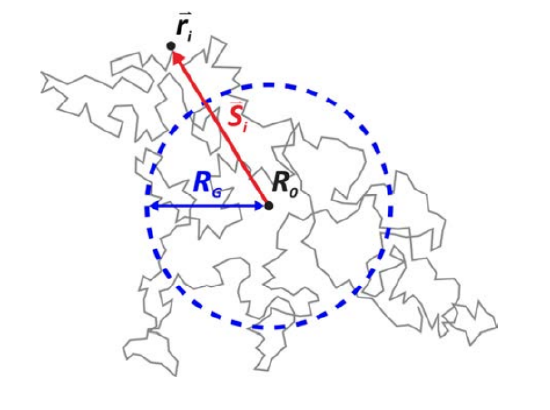

# 统热进阶专题 Statistic Thermodynamics II

> 本文档遵循[署名—非商业性使用—相同方式共享 4.0 协议](https://creativecommons.org/licenses/by-nc-sa/4.0/)（CC BY-NC-SA 4.0）授权:fontawesome-brands-creative-commons::fontawesome-brands-creative-commons-by::fontawesome-brands-creative-commons-nc::fontawesome-brands-creative-commons-sa:
>
> 作者：**凯楽斯kelesss**

## 1. 实际气体

### 1.1 经典力学系统的配分函数

我们知道在经典力学中，能量可以用哈密顿量 $H(p,q)$ 表示，我们把它带入到正则配分函数中：

$$
Z \sim \int e^{\beta H(p,q)} \dd[3] {p}\dd[3] {q}
$$

然而这种定义有一个问题：我们的配分函数应当是**无量纲数**，但这里的 $ \dd{p}\dd{q}$ 存在量纲。于是可以除以一个普朗克常数平衡掉量纲：

$$
\boxed{Z_1 = \frac1{h^3} \int e^{\beta H(\vb p,\vb q)} \dd {\vb p}\dd {\vb q}}
$$

这就是对于经典力学系统的单粒子配分函数。而对于 $N$ 个全同粒子，根据前面的结论：

$$
Z_N = \frac1{N!h^{3N}} \int \prod_{i=1}^N e^{\beta H(\vb p,\vb q)} \dd {\vb p}\dd {\vb q}
$$

要化简这个表达式，我们需要把哈密顿量拆成位置和动量两部分：

$$
\begin{aligned}
Z_N &= \frac1{N!h^{3N}} \pqty{\int \prod_{i=1}^N e^{\beta E_k} \dd{\vb p_i} \cdot \int \prod_{i=1}^N e^{\beta U(\vb q_i)} \dd{\vb q_i}} \\
&= \frac1{N!h^{3N}} \pqty{\int \prod_{i=1}^N e^{\beta \vb p_i^2/2m} \dd{\vb p_i} \cdot \int \prod_{i=1}^N e^{\beta \sum_{i<j}U(r_{ij})}\dd{\vb r_i}}
\end{aligned}
$$

其中前者可以直接积分得到:

$$
\int \prod_{i=1}^N e^{\beta \vec p_i^2/2m} \dd{\vec p_i} = \pqty{2\pi mkT}^{N/2}
$$

而后者的处理相对比较复杂。为了简便，我们定义**构型积分**（Configuration Integral） $Q_N$ ：

$$
\boxed{Q_N = \int \prod_{i=1}^N e^{\beta \sum_{i<j}U(r_{ij})}\dd{\vec r_i}}
$$

这样我们就将原来的表达式化为了：

$$
\boxed{Z_N = \frac1{N!} \pqty{\frac{2\pi mkT}{h^2}}^{3N/2} Q_N = \frac1{\Lambda^3N!} Q_N}
$$

---

### 1.2 实际气体的配分函数

我们假设这个系统是一个足够大的系统，事实上，对于这样的系统而言，**三种系综得到的结果是一样的**。根据巨配分函数的定义：

$$
\mathcal Z(\mu, V,T) = \sum_{N=0}^\infty Z(N,V,T) e^{N\beta\mu} = 1+\sum_{N=1}^\infty Z(N,V,T) \lambda^N
$$

于是：

$$
\mathcal Z = \sum_{N=0}^{\infty} \frac{\pqty{\lambda \pqty{\frac{2\pi mkT}{h^2}}^{3/2}}^N}{N!}Q_N
$$

为了方便，我们定义**逸度**（Fugacity）：

$$
\boxed{z = \lambda \pqty{\frac{2\pi mkT}{h^2}}^{3/2}}
$$

于是我们就可以得到一个简洁的式子：

$$
\boxed{\mathcal Z = \sum_{N=0}^{\infty} \frac{z^N}{N!}Q_N}
$$

根据巨配分函数的结论，压强可以由巨配分函数得到：

$$
P = kT\pqty{\pdv{\ln \mathcal Z }{V}}_{T, \mu}  = \frac{kT}{V}\ln( \sum_{N=0}^{\infty} \frac{z^N}{N!}Q_N)
$$

现在我们回到实际气体。我们知道实际气体有一个很重要的方程，即**位力展开**（Virial Expansion）：

$$
\frac{P}{kT} = \rho + B_2(T) \rho^2 + B_3(T)\rho^3 ...
$$

其中 $B_2(T), B_3(T),\ldots$ 被称为**第二/第三位力系数**。尽管对于表面上来看，这只是一个幂级数的展开，但位力系数是可以明确从统计热力学的推导得到的。

!!! question "为什么第一项系数为1？"
    我们一般认为第一位力系数为常数值 $B_1 = 1$，原因在于这样才能在气体密度趋于 $0$ 时回到理想气体表达式。

回到统计热力学本身，我们这里能直接得到的是压力 $P$ 关于 $z$ 的表达式。于是我们尝试先得到 $z$ 的展开式：

$$
\frac{P}{kT} = b_1 z + b_2 z^2 + b_3z^3 ... = \frac1V\ln( \sum_{N=0}^{\infty} \frac{z^N}{N!}Q_N)
$$

对右侧表达式进行展开：

$$
\begin{aligned}
&b_1 z + b_2 z^2 + b_3z^3 \cdots \\
&= \frac1V \pqty{ \sum_{N=1}^{\infty} \frac{z^N}{N!}Q_N - \frac12\pqty{\sum_{N=1}^{\infty} \frac{z^N}{N!}Q_N}^2 + \frac 13\pqty{\sum_{N=1}^{\infty} \frac{z^N}{N!}Q_N}^3 + \cdots} \\
&= \frac1V \pqty{ Q_1z + \frac12 Q_2z^2 + \frac13 Q_3z^3 - \frac12 \pqty{Q_1^2z^2 + Q_1Q_2z^3} + \frac13 Q_1^3z^3 + \cdots }
\end{aligned}
$$

对比系数可得：

$$
\begin{cases}\
b_1 = \frac{Q_1}{V} = 1 \\
b_2 = \frac{1}{2V}(Q_2 - Q_1^2) \\
b_3 = \frac{1}{6V}(6Q_3 - 3Q_1Q_2 + 2Q_1^3)
\end{cases}
$$

!!! question "为什么第一项系数等于1？"
    当 $N=1$ 时，由于没有任何外场，所以势能 $U_1 = 0$，构型积分等价于：

    $$
    Q_1 = \int e^{\beta U_1}\dd{\vb r_1} = \int1 \dd{\vb r_1} = V
    $$
    
    即一个位矢对于全空间的积分，自然就是全空间的体积。

这样我们就可以得到 $P$ 关于 $z$ 方程。但是我们还差了一步：我们需要知道的是关于 $\rho$ 的方程！因此我们还需要在 $\rho$ 和 $z$ 之间建立联系。从前两个式子可以得到：

$$
\rho + B_2(T) \rho^2 + B_3(T)\rho^3 ... = b_1 z + b_2z^2 + b_3z^3 ...
$$

接下来我们只需要求出 $z(\rho)$ 的函数关系，就可以通过系数对比得到位力系数了！我们先尝试用巨配分函数表达 $\rho$ ：

$$
\begin{aligned}
\rho = \ev{N}/V &= \frac{kT}{V} \pqty{\pdv{\ln \mathcal Z}{\mu}}_T \\
&= \frac{\lambda}{V}\pqty{\pdv{\ln \mathcal Z}{\lambda}}_T \\
&= \frac{z}{V}\pqty{\pdv{\ln \mathcal Z}{z}}_T = \frac{z}{kT}\pqty{\pdv{P}{z}}_T
\end{aligned}
$$

结合前面我们定义的 $\frac{P}{kT} = b_1 z + b_2 z^2 + b_3z^3 ...$ ：

$$
\rho = \sum_{j=1}^\infty jb_jz^j
$$

但是我们求的应该是 $z$ 对 $\rho$ 的函数关系 $z(\rho)$ 呀！这里就需要用到一些数学技巧了。我们假设 $z$ 也可以展开成幂级数的形式：

$$
z = a_1\rho + a_2\rho^2 + a_3 \rho^3 + \cdots
$$

于是就有：

$$
\begin{aligned}
\rho &= \sum_{j=1}^\infty jb_j(a_1 \rho + a_2 \rho^2 + a_3 \rho^3 ...)^j \\
&= a_1b_1 \rho + a_2b_1 \rho^2 + a_3b_1 \rho^3 + 2a_1^2b_2\rho^2 + 4a_1a_2b_2\rho^3 + 3a_1^3b_3 \rho^3
\end{aligned}
$$

对比系数可得：

$$
\begin{cases}
a_1b_1 = 1 \Rightarrow a_1 = 1/b_1 = 1 \\
a_2b_1 + 2a_1^2b_1 = 0 \Rightarrow a_2 = -2b_2 \\
a_3b_1 + 4b_2a_1a_2 + 3b_3a_1^3 = 0 \Rightarrow a_3 = -2b_3 + 8b_2^2
\end{cases}
$$

回到原来的式子：

$$
\begin{aligned}
&\rho + B_2(T) \rho^2 + B_3(T)\rho^3 ... = b_1 z + b_2z^2 + b_3z^3 ... \\
&= a_1b_1\rho + a_2b_1\rho^2 + a_3b_1\rho^3 + a_1^2b_2\rho^2 + 2a_1a_2b_2\rho^3 + a_1^3b_3\rho^3
\end{aligned}
$$

再次对比系数：

$$
\begin{cases}
B_2(T) = -b_2 = -\frac{1}{2V}(Q_2 - Q_1^2) \\
B_3(T) = 4b_2^2 - 3b_3 = -\frac{1}{3V^2}[V(Q_3 - 3Q_2Q_1 + 2Q_1^3) - 3(Q_2 - Q_1^2)^2]
\end{cases}
$$

这样就把宏观的位力系数和微观的构型积分联系起来了。通过这样的方式一步步展开系数推导，有一个专业的名字叫**团簇展开**（Cluster Expansion），我们在下一节中讨论这个名称的由来。

---

### 1.3 位力系数与集团积分

回到构型积分的定义：

$$
\boxed{Q_N = \int \prod_{i=1}^N e^{\beta \sum_{i<j}U(r_{ij})}\dd{\vec r_i}}
$$

对于理想的球状气体而言，最重要的作用就是两个分子之间只和距离有关的作用了。我们把它对应的势能记为 $U(\vb r_{12})$ 。于是对于第二位力系数：

$$
\begin{aligned}
B_2(T) &= -\frac{1}{2V} \iint(e^{-\beta U(\vec r_{12})} - 1)\dd(\vec r_1)\dd(\vec r_2) \\
\end{aligned}
$$

为了简便，我们以 $\vb r_1$ 为参照考虑 $\vb r_2 = \vec r_1 + \vec r_{12}$，这样就可以化为：

$$
\begin{aligned}
B_2(T) &= -\frac{1}{2V} \int \dd(\vec r_1) \int(e^{-\beta U(\vec r_{12})}-1)\dd(\vec r_{12}) \\
&= -\frac12 \int(e^{-\beta U(\vec r_{12})}-1)\dd(\vec r_{12}) \\
\end{aligned}
$$

我们定义**Mayer 函数**：

$$
\boxed{f_{ij} = e^{-\beta U(r_{ij})} - 1}
$$

这样我们就可以得到第二位力系数：

$$
\boxed{B_2(T) = -\frac 12 \int f_{12} \dd{\vec r_{12}}}
$$

如果假设粒子1位于原点（即为 $\vec r_1 = 0$）,可以得到：

$$
\begin{aligned}
B_2(T) &= -\frac12  \int(e^{-\beta U(r_{2})}-1)4\pi r_{2}^2 \dd(r_{2}) \\
&= -2\pi \int(e^{-\beta U(r)}-1)r^2 \dd r = -2\pi \int_0^\infty f_{12}r^2\dd r
\end{aligned}
$$

这就是第二位力系数的表达式。顺带一提，我们积分求出来的系数 $b_2, b_3 \ldots$ 被称为**集团积分**（cluster integrals）。

分析这个表达式，你可以发现其本质上与两个原子之间的相互作用力有关。

- 如果分子间主要是**排斥力**（如在高压下），分子会占据更多“有效空间”，导致压强高于理想气体。这使得 $B_2(T)>0$。
- 如果分子间主要是**吸引力**（如在中等密度和低温下），分子相互“拉扯”，导致压强低于理想气体。这使得 $B_2(T)<0$。
- **Boyle温度** 就定义为 $B_2(T)=0$ 时的温度。在此温度下，两个分子间的排斥和吸引效应在宏观上恰好抵消，使得气体在低密度范围内表现得像理想气体。

要求第三位力系数，就必须知道集团积分 $b_3$ 的值：

$$
\begin{aligned}
b_3 &= \frac{1}{6V}(6Q_3 - 3Q_1Q_2 + 2Q_1^3)
\end{aligned}
$$

这里出现了 $Q_3$ ，意味着我们必须知道三个分子相互作用的势能。我们把它近似为两两势能的加和：

$$
U(r_1,r_2,r_3) \simeq U(r_1,r_2) + U(r_2,r_3) + U(r_1,r_3)
$$

这样就有：

$$
\begin{aligned}
Q_3 &= \iiint e^{U_3/kT} \dd{\vec r_1}  \dd{\vec r_2}  \dd{\vec r_3} \\
&= \iiint(1+f_{12})(1+f_{23})(1+f_{13})\dd{\vec r_1}  \dd{\vec r_2}  \dd{\vec r_3} \\
&= \iiint(f_{12}f_{23}f_{13} + f_{12}f_{23} + f_{12}f_{13} + f_{23}f_{13} + f_{12} + f_{13} + f_{23} + 1)\dd{\vec r_1}  \dd{\vec r_2}  \dd{\vec r_3}
\end{aligned}
$$

我们同样还是把粒子1固定在原点，这样 $b_3$ 就可表示为：

$$
\begin{aligned}
b_3 &= \frac 1{6V} \iiint(f_{12}f_{23}f_{13} + f_{12}f_{23} + f_{12}f_{13} + f_{23}f_{13})\dd{\vec r_1}  \dd{\vec r_2}  \dd{\vec r_3}\\
&= \frac 16 \iint(f_{12}f_{23}f_{13} + 3f_{12}f_{13}) \dd{\vec r_{12}}  \dd{\vec r_{13}}
\end{aligned}
$$

这一步我们认为从一个原子出发到其余两个原子的这种作用是对称相等的。于是我们可以导出：

$$
\begin{aligned}
B_3(T) &=  4b_2^2 - 2b_3 \\
&= \pqty{\int f_{12} \dd{\vec r_{12}}}^2 - \frac13 \iint(f_{12}f_{23}f_{13} + 3f_{12}f_{13}) \dd{\vec r_{12}}  \dd{\vec r_{13}} \\
&= -\frac{1}{3} \iint f_{12}f_{23}f_{13} \dd{\vec r_{12}}  \dd{\vec r_{13}}
\end{aligned}
$$

如果用比较对称的写法：

$$
\boxed{B_3(T) = -\frac{1}{3V}\iiint f_{12}f_{23}f_{13}\dd{\vec r_1}  \dd{\vec r_2}  \dd{\vec r_3} = -\frac{1}{3V}\iiint \triangle \dd{\vec r_1}  \dd{\vec r_2}  \dd{\vec r_3}}
$$

其中 $\triangle$ 代表这是三个分子两两之间的 **Mayer 函数** 形式的作用。

到这里我们应当可以看出位力系数的具体意义。对于第二位力系数，所表述的是两个粒子之间的相互作用（对于Mayer函数 $f_{12}$）；对于第三位力系数，所表述的是三个粒子之间的相互作用（对于Mayer函数 $f_{12}f_{23}f_{13}$），这也是“团簇展开”的含义。

对于第四位力系数，自然就是考虑四个粒子的团簇之间的相互作用。我们不加推导地给出：

$$
B_n(T) = \frac{1-n}{n!V} I_n
$$

其中右边 $I_n$ 代表 $n$ 个粒子所有标记的 biconnected 图的积分和。例如4原子团簇：

其中对于四粒子系统，有3种 $\square$ 作用，6种 $\oslash$ 作用，1种 $\boxtimes$ 作用。于是：

$$
B_4(T) = -\frac{1}{8V}\iiiint (3\square + 6\oslash + 1\boxtimes) \dd{\vec r_1}  \dd{\vec r_2}  \dd{\vec r_3} \dd{\vec r_4}
$$

---

### 1.4 van de Waals 实际气体方程

对于位力展开，我们知道：

$$
B_2(T) = -2\pi \int_0^\infty [e^{-\beta u(r)} - 1] r^2 \dd r
$$

这里 $B_2$ 的数值和给定的势能有关系。现在我们假设分子直径为 $\sigma$，这样就有硬球势（hard-sphere）：

$$
u(r) = \begin{cases}
\infty ,&r<\sigma \\
0 ,&r\ge \sigma
\end{cases}
$$

于是计算得到：

$$
B_2(T) = -2\pi \int_0^\sigma (-1)r^2\dd r = \frac{2\pi\sigma^3}{3}
$$

如果我们放宽一点条件，考虑在 $\lambda \sigma$ 距离内的吸引力作用：

$$
u(r) = \begin{cases}
\infty &r<\sigma \\
-\epsilon &\sigma<r<\lambda\sigma \\
0 &r>\sigma
\end{cases}
$$

计算得到：

$$
B_2(T) = b_0{(1-(\lambda^3-1)(e^{\beta\epsilon}-1))}
$$

再进一步地，我们可以考虑 Lennard-Jones 势：

$$
u(r) = 4\epsilon [(\sigma/r)^{12} - (\sigma/r)^6]
$$

然而 Lennard-Jones 势太不好计算了！为了让计算更简单，我们采用简化版的 Lennard-Jones 势：

$$
u(r) = \begin{cases}
\infty ,&r<\sigma \\
-4\epsilon\pqty{\sigma/r}^6 ,&r\ge \sigma
\end{cases}
$$

计算可得：

$$
\begin{aligned}
B_2(T) &= \frac{2\pi\sigma^3}{3} - 2\pi\int_\sigma^\infty r^2\pqty{e^{4\beta\epsilon (\sigma/r)^6}-1} \dd r \\
&\approx \frac{2\pi\sigma^3}{3} - 2\pi\int_\sigma^\infty 4\beta\epsilon\frac{\sigma^6}{r^4} \dd r \\
&= \frac{2\pi\sigma^3}{3} - \frac{8\pi\epsilon\sigma^3}{3kT}
\end{aligned}
$$

代入位力展开公式：

$$
\frac{p}{kT} = (\frac nV) + (\frac{2\pi\sigma^3}{3} - \frac{8\pi\epsilon\sigma^3}{3kT})(\frac nV)^2
$$

整理得到：

$$
\pqty{p+\frac{8\pi\epsilon\sigma^3}{3kT}\pqty{\frac {n^2}{V^2}}}\frac{1}{1+\frac{2\pi\sigma^3n}{3V}} = \frac{n}{V}kT
$$

再对分式进行 Taylor 展开，即可得到 **van de Waals 实际气体方程**：

$$
(p+a(n^2/V^2))(V-bn) = nkT
$$

其中系数：

$$
\begin{cases}
\displaystyle a = \frac{8\pi\epsilon\sigma^3}{3} \\
\displaystyle b = \frac{2\pi\sigma^3}{3}
\end{cases}
$$

从这里可以看出，范德华气体方程的 $b$ 值是分子体积的 $4$ 倍 ：

$$
b = 4\cdot\frac{\pi\sigma^3}{6} = 4v_0
$$

---

## 2. 聚合物

### 2.1 无规卷曲

我们假设一个单体长度为 $l$，并且由 $N$ 个单体组成的聚合物无规线团（random coil）：

我们先考虑一维下的随机链，假设有 $N_L$ 个链段向左，$N_R$ 个链段向右，假定头尾之间的距离是 $n$ 倍单体长度 $nl$ 。我们可以列出：

$$
\begin{cases}
N_L + N_R = N \\
n = N_L - N_R
\end{cases}
$$

于是可能的微观状态数：

$$
W = \frac{N!}{N_L!N_R!} = \frac{N!}{(\frac{N+n}{2})!(\frac{N-n}{2})!}
$$

在所有的 $2^N$ 的可能性下，观测到头尾长度 $nl$ 的

$$
P = \frac{W}{2^N} = \frac{N!}{2^N(\frac{N+n}{2})!(\frac{N-n}{2})!}
$$

利用 Stiring 公式（$\ln M! \approx M\ln M - M + \frac12 \ln(2\pi M)$）：

$$
\ln P \approx \frac 12 \ln\frac{2}{\pi N} - \frac12 N(\frac{n}{N})^2
$$

于是就可以得到：

$$
P_{1D} = \sqrt{\frac2{\pi N}}e^{-\frac{h^2}{2N}}
$$

对三维情况，我们可以推导得到：

$$
f =4\pi\pqty{\frac{3}{2\pi Nl^2}}^{3/2} R^2e^{-\frac{3R^2}{2Nl^2}}
$$

!!! proof "证明"
    由于每个链段的方向是独立的，于是：

    $$
    \begin{aligned}
    \ev{R^2} &= \ev{\pqty{\sum_i \vb r_i}\cdot \pqty{\sum_j \vb r_j}} \\
    &= nl^2 + l^2\sum_{i\neq j}\ev{\cos\theta_{ij}} = nl^2
    \end{aligned}
    $$
    
    于是每个方向上的方差：
    
    $$
    \ev{X^2} = \ev{Y^2} = \ev{Z^2} = \frac{Nl^2}{3}
    $$
    
    代入到三维高斯分布：
    
    $$
    \begin{aligned}
    f(\vb{R}) &= f_x(x)f_y(y)f_z(z) \\
    &= \bqty{\frac{1}{\sqrt{2\pi\sigma^2}}e^{-\frac{x^2}{2\sigma^2}}}\bqty{\frac{1}{\sqrt{2\pi\sigma^2}}e^{-\frac{y^2}{2\sigma^2}}}\bqty{\frac{1}{\sqrt{2\pi\sigma^2}}e^{-\frac{z^2}{2\sigma^2}}} \\
    &= \pqty{\frac{1}{2\pi\cdot\frac{Nl^2}{3}}}^{3/2} e^{-\frac{3R^2}{2Nl^2}}
    \end{aligned}
    $$
    
    之后转化为球壳内的分布概率即可：
    
    $$
    f(R)\dd R = f(\vb{R})\cdot4\pi R^2 \dd R = 4\pi\pqty{\frac{3}{2\pi Nl^2}}^{3/2} R^2e^{-\frac{3R^2}{2Nl^2}}
    $$

通过求导可以证明：聚合物最可能的端点距离为：

$$
R = \sqrt\frac{2nl^2}{3}
$$

根据此，我们可以求出**均方末端距**（root mean distance）$R_{rms} = \sqrt{\ev{R^2}}$：

$$
\begin{aligned}
\ev{R^2} &= \int_0^\infty R^2f(r)\dd R \\
&= 4\pi(\frac a\pi)^{3/2} \int_0^\infty R^4e^{-aR^2} \dd R \\
&= 4\pi(\frac a\pi)^{3/2} \frac{3}{8a^2} \sqrt{\frac\pi a} \\
&= \frac{3}{2a} = Nl^2
\end{aligned}
$$

于是：

$$
\boxed{R_{rms} = \sqrt{N} l}
$$

经典物理有一个定义是**回转半径**（Radius of Gyration）$R_g$，即“若将物体的总质量集中于该点，则该点对旋转轴的转动惯量等于物体实际质量分布所产生的转动惯量”，其实就是相对于质心的均方根距离。

$$
R_g = \frac{1}{N}\int_0^N \ev{[\vb r(s) - \vb r_{cm}]^2}\dd s
$$

对于后半积分，实际上由公式：

$$
\sum_i (\vb r_i - \vb r_{cm})^2 = \frac{1}{2N}\sum_{i,j}(\vb r_i - \vb r_j)^2
$$

!!! proof "证明"
    我们知道：

    $$
    \begin{aligned}
    \vb r_{cm} = \frac{m}{M}\sum_i \vb r_i = \frac{1}{N}\sum_i \vb r_i
    \end{aligned}
    $$
    
    左边：
    
    $$
    \begin{aligned}
    \sum_i (\vb r_i - \vb r_{cm})^2 &= \sum_i\vb r_i^2 - 2\sum_i\vb r_i\vb r_{cm} + \sum_i\vb r_{cm}^2 \\
    &= \sum_i \vb r_i^2 - N\vb r_{rm}^2
    \end{aligned}
    $$
    
    右边：
    
    $$
    \begin{aligned}
    \frac{1}{2N}\sum_{i,j}(\vb r_i - \vb r_j)^2 &= \frac{1}{2N}\bqty{2\sum_i \vb r_i^2\sum_j 1- \sum_{i,j} \vb r_i\vb r_j} \\
    &= \frac{1}{2N}\bqty{2N\sum_i \vb r_i - (N\vb r_{cm})(N\vb r_{cm})} \\
    &= \sum_i \vb r_i - N\vb r_{cm}^2
    \end{aligned}
    $$

于是原式转化为：

$$
R_g = \frac{1}{N}\iint_0^N \ev{[\vb r(s) - \vb r(t)]^2}\dd s \dd t
$$

结合随机分布的性质，我们有：

$$
\begin{aligned}
\ev{[\vb r(s) - \vb r(t)]^2} &= \abs{s-t}l^2
\end{aligned}
$$

于是有：

$$
\begin{aligned}
R_g &= \frac{1}{2N^2}\iint_0^N \ev{[\vb r(s) - \vb r(t)]^2}\dd s \dd t \\
&= \frac{l^2}{2N^2}\int_0^N\int_0^N |s-t|\dd s \dd t \\
&= \frac{l^2}{N^2}\int_0^N\dd s\int_0^s (s-t)\dd t  \\
&= \frac{l^2N}{6} = \frac16\ev{R^2}
\end{aligned}
$$

---

### 2.2 构象熵

根据玻尔兹曼熵公式，我们可以求得**构象熵**（conformation entropy）：

$$
\begin{aligned}
S &= k\ln W \\
&= k[N\ln N +\frac 12 \ln(2\pi N)
- \pqty{\frac{N+n}{2}}\ln (\frac{N+n}{2}) -\frac 12 \ln(2\pi \frac{N+n}{2}) \\
&\quad - \pqty{\frac{N-n}{2}}\ln (\frac{N-n}{2}) -\frac 12 \ln(2\pi \frac{N-n}{2})] \\
\end{aligned}
$$

定义拉伸率 $\nu = n/N$, 可以得到：

$$
\begin{aligned}
S &= k[N\ln N - \frac{N(1+\nu)}{2}\ln(\frac{N(1+\nu)}{2}) - \frac{N(1-\nu)}{2}\ln(\frac{N(1-\nu)}{2}) \\
&\quad + \frac 12 \ln(2\pi N) -\frac 12 \ln(2\pi \frac{N(1+\nu)}{2})-\frac 12 \ln(2\pi \frac{N(1-\nu)}{2}) \\
&= k[-N\ln 2 - \frac{N(1+\nu)}{2}\ln(1+\nu) - \frac{N(1-\nu)}{2}\ln(1-\nu) \\
&\quad - \frac 12 \ln(2\pi N) - \frac12 \ln(1+\nu) - \frac12 \ln(1-\nu)]
\end{aligned}
$$

其中后面三项远小于前面三项，我们将其省略：

$$
S(\nu) = -\frac12 kN\bqty{2\ln2 + \ln\Bqty{(1+\nu)^{1+\nu} \cdot (1-\nu)^{1-\nu}}}
$$

易得当 $\nu = 0$ 时，微观状态数最多，熵取到最大值：

$$
S_{max} = S(\nu=0) = -kN\ln 2
$$

于是我们得到熵变：

$$
\boxed{\Delta S = S(\nu) - S(0) = -\frac12 kN \ln\Bqty{(1+\nu)^{1+\nu} \cdot (1-\nu)^{1-\nu}}}
$$

---

## 3. 计算热力学：插入法与耦合

### 3.1 简单流体的模拟

我们先做一个最傻逼的假设，假若我们要算一个氦的液体，不考虑量子效应（虽然这是不可能的，但是先这么假设），直观上看就是解一个原子和周围的核和电子的关系，这里就要用B-O近似。

考虑宏观情况，一个粒子包含六个信息：

$$
N(x_1, y_1,z_1,p_x,p_y,p_z)
$$

现在我们将 $N$ 个位置出现粒子的概率用向量表示：

$$
P^{(N)} (\vb r_1 , \vb r_2, \vb r_3, ...\vb r_N, \vb p_1, \vb p_2, \vb p_3,...\vb p_N) = \frac{1}{Z_N}e^{-\beta H}
$$

现在我们只关心n个粒子的位置状态，其他的 $N-n$ 个粒子的位置信息和所有动量信息通过积分平均掉：

$$
\begin{aligned}
& P^{(n)} (\vb r_1 , ...\vb r_n) {\dd}\vb r_n ... {\dd}\vb r_1 \\
&= \int...\int P^{(n)} (\vb r_1 , ...\vb r_n, \vb p_1, ..., \vb p_n) \\&\quad {\dd}\vb r_n ... {\dd}\vb r_1\dd{\vb r_{n+1}} ... \dd{\vb r_N}\dd{\vb p_{1}} ... \dd{\vb p_N}
\end{aligned}
$$

对于动能项，我们知道可以拆开来并作为一个独立的项消去：

$$
\begin{gathered}
\int_{-\infty}^\infty e^{\beta p_{i,x}^2/2m_i} \dd p_{i,x} = \sqrt{\frac{2\pi m_i}{\beta}} \\
\int\cdots\int_{-\infty}^\infty \prod_N e^{\beta \vb p_{i}^2/2m_i} \dd {\vb p_{i}} = \prod_N \pqty{\frac{2\pi m_i}{\beta}}^{3/2} = C_K
\end{gathered}
$$

于是原式子可以化为：

$$
\begin{aligned}
P^{(n)}(\vec{r}_1, ..., \vec{r}_n) &= \int \frac{1}{Z_N} \left[ e^{-\beta K(\vb{p}^N)} e^{-\beta U(\vb{r}^N)} \right] d\vb{p}^N \, d\vb{r}_{n+1}...d\vb{r}_N \\
&= \frac{1}{Z_N} \left[ \int e^{-\beta K(\vb{p}^N)} d\vb{p}^N \right] \int e^{-\beta U(\vb{r}^N)} \, d\vb{r}_{n+1}...d\vb{r}_N \\
&= \frac{C_{K}}{Z_N} \int e^{-\beta U(\vb{r}_1, ..., \vb{r}_N)} \, d\vb{r}_{n+1}...d\vb{r}_N \\
&= \frac{1}{Q_N}\int e^{-\beta U(\vb{r}_1, ..., \vb{r}_N)} \, d\vb{r}_{n+1}...d\vb{r}_N
\end{aligned}
$$

其中动能项可以与配分函数消去，最后剩余构型积分 $Q_N$。

现在我们定义一个**n粒子密度分布函数** $\rho^{(n)}$，表示在给定位置 $\vb r_1, ...,\vb r_n$ 同时找到 $n$ 个特定粒子的数密度。这相当于是从 $n$ 粒子的概率密度里乘上选择 $n$ 个粒子的组合数：

$$
\boxed{\rho^{(n)}(\vb r_1 , \vb r_2, \vb r_3, ...\vb r_n) = \frac{N!}{(N-n)!(n)!}P^{(n)}}
$$

当 $n = 1$ 时，就相当于是在任意位置找到一个粒子的数密度，其实就是密度 $\rho = N/V$ 啦。我们也可以用积分证明这一点：

$$
\begin{aligned}
\rho^{(1)}(\vb r_1 , \vb r_2, \vb r_3, ...\vb r_n) &= \frac{N!}{(N-1)!}P^{(1)} \\
&= N\int ... \int \frac{e^{-\beta U_N}}{Z_N} {\dd}\vb r_2 ... \dd{\vb r_N} \\
&= N/V
\end{aligned}
$$

于是 $\rho^{(1)}$ 对于全空间的积分就是粒子数 $N$ ：

$$
\int \rho^{(1)}(\vb r) \dd{\vb r} = \rho V = N
$$

很显然，对于一个有力场作用的体系，平均的密度分布并不是一个定值。为了表示这一点，我们定义**n粒子相关函数**（correlation function）$g^{(n)}$ ，表示实际的联合密度 $\rho^{(n)}$ 和假设完全独立的密度 $\rho^{(1)}$ 之比：

$$
\boxed{g^{(n)} = \frac{\rho^{(n)}(\vb r_1 , \vb r_2, \vb r_3, ...\vb r_n)}{\rho^{(1)}(\vb r_1) \cdots \rho^{(1)}(\vb r_n)} = \frac{\rho^{(n)}(\vb r_1 , \vb r_2, \vb r_3, ...\vb r_n)}{\rho^n}}
$$

当 $n=2$ 时，由于只有两个粒子，$g^{(2)}$ 也被称作**对分布函数**（Pair distribution function）或**径向分布函数**（Radial Distribution Function），它相当于是同时找到两个粒子的相对概率：

$$
g^{(2)} = \frac{V^2}{N^2} \frac{N(N-1)}{2}\int ... \int \frac{e^{-\beta U_N}}{Z_N} {\dd}r_{3} ... \dd r_N
$$

对于球形的粒子而言，$g^{(2)}$ 只与粒子间距 $(r_1 - r_2)$ 有关，我们把它写成 $g(r)$。对这里的 $g(r)$ 而言，归一化积分，得到的应该是除了参考粒子外得到所有其他粒子数 $N-1$ ：

$$
\int_0^\infty \rho g(r)4\pi r^2\dd r = N-1
$$

我们考虑三种最简单的情况，对于理想气体，显然没有任何立场作用，相对概率为 $1$；对于硬球模型会在分子直径 $\sigma$ 处存在突跃；对于理想的一维晶体，应该在严格的间距处出现类似 $\delta$ 函数的性质：

而对于实际流体而言呢？

这里液体在近程呈现出类似1D-crystal的关系，这是由于我们把观察中心放在了一个粒子上，因此，在直径 $\sigma$ 的地方出现其他粒子的概率很大，相应的在中间出现的概率很小。而在远程上，由于熵效应又恢复到无序状态。

为了表示简便，我们简单的引入**结构因子**（Structrural factor）:

$$
h(r) = g(r)-1
$$

- $h(r)>0$：粒子倾向于出现在该距离。
- $h(r)<0$：粒子倾向于避开该距离。
- $h(r)\to0$ 当 $r\to\infty$：长程无关联。

---

### 3.2 简单流体的热力学量

对于总的势能比较难考虑，我们不妨先拆成两两的势能对，由于对称性，我们假设这些势能都可以用 $U(r)$ 来表示：

$$
U_N(\vb r^N) = \sum_{i<j} U(r_{ij})
$$

而对于平均势能来说，我们不妨化简成只有两两作用的形式，由于这样的形式一共有 $N(N-1)/2$ 对且完全等价，我们只需要考虑粒子 $\vb r_1, \vb r_2$ 就行了。于是平均势能就可以表示为：

$$
\begin{aligned}
\ev U &= \frac{1}{Z_N}\int...\int U_N(\vb r^N)e^{-\beta U_N}\dd{\vb r_1} ... \dd{\vb r_N} \\
&= \frac{N(N-1)}{2} \frac{1}{Z_N}\int...\int U_{12}(r_{12})e^{-\beta U_N}\dd{\vb r_1} ... \dd{\vb r_N}
\end{aligned}
$$

之后引入对分布函数：

$$
\begin{aligned}
\ev{U} &=  \iint U_{12}(r_{12})\rho^{(2)}(\vb r_1, \vb r_2) \dd{\vb r_1}\dd{\vb r_2} \\
&= \rho^2\iint U_{12}(r_{12})\rho^{(2)}(\vb r_1, \vb r_2) \dd{\vb r_1}\dd{\vb r_2} \\
&= 4\pi\rho^2V\int_0^\infty U_{12}(r)\rho^{(2)}(r)r^2 \dd{r}\\
&= \frac{4\pi N^2}{V} \int_0^\infty U_{12}(r)\rho^{(2)}(r)r^2 \dd{r}
\end{aligned}
$$

于是总内能可以表示为：

$$
\ev{E} = kT^2\pqty{\pdv{\ln Z}{T}} = \frac32 NkT + \ev U
$$

现在我们来求压强 $P$ 。根据基本的统计热力学有：

$$
P = kT(\pdv{\ln Z}{V})_{N,T} = kT(\pdv{\ln Q_N}{V})_{N,T}
$$

其中构型积分：

$$
Q_N = \int_0^{V^{1/3}} \int_0^{V^{1/3}} \int_0^{V^{1/3}} e^{-\beta U_N} \dd x_1 \dd y_1 \dd z_1 ... \dd x_n \dd y_n \dd z_n
$$

作变量替换 $x_i' = x_i / V^{1/3}$，继续化简：

$$
Q_N = V^N \int_0^{1} \int_0^{1} \int_0^{1} e^{-\beta U(x_1'V^{1/3}...)} \dd x_1' \dd y_1' \dd z_1' ... \dd x_n' \dd y_n' \dd z_n'
$$

于是

$$
\begin{aligned}
\pdv{Q}{V} &= NV^{N-1} \int_0^{1} \int_0^{1} \int_0^{1} e^{-\beta U_N} \dd x_1' \dd y_1' \dd z_1' ... \dd x_n' \dd y_n' \dd z_n' \\
& \quad -V^N\int_0^{1} \int_0^{1} \int_0^{1} \beta e^{-\beta U_N} \pdv{U_N}{V} \dd x_1' \dd y_1' \dd z_1' ... \dd x_n' \dd y_n' \dd z_n'
\end{aligned}
$$

其中势能对体积的导数可以表示为：

$$
\pdv{U_N}{V} = \sum_{i<j} \dv{U_{ij}}{{r_{ij}}}\dv{{r_{ij}}}{V} = \sum_{i<j} \dv{U_{ij}}{{r_{ij}}} (\frac13 V^{-\frac23}r_{ij}')
$$

代入到原始式子：

$$
\begin{aligned}
\pdv{\ln Z}{V} &= \rho - \frac{\rho^2}{3VkT}\iint r_{12} \dv{U(r_{12})}{r_{12}} g^{(2)}(r_1,r_2) \dd r_1 \dd r_2 \\
&= \rho - \frac{4\pi\rho^2}{3kT}\int \dv{U(r)}{r} g(r)r^3 \dd r
\end{aligned}
$$

对比位力系数，就可以得到 $B_2(T)$ 的表达式：

$$
B_2(T) = -\frac{4\pi}{3kT}\int \dv{U(r)}{r} g(r)r^3 \dd r
$$

---

### 3.3 化学势的计算

我们前面说过构型积分：

$$
-F = kT\ln Z_N = \ln Q_N - \ln N! - 3N\ln\Lambda
$$

于是我们可以得到化学势，由于粒子数是离子化的，我们可以写出：

$$
\begin{aligned}
\mu &= \pdv{F}{N} = F(N,V,T) - F(N-1,V,T)\\
&= -kT\bqty{\ln(\frac{Q_N}{Q_{N-1}}) - \ln N - \ln \Lambda^3}
\end{aligned}
$$

这里我们需要计算一个比较难算的量 构型积分之比 $Z_N/Z_{N-1}$。由于粒子数 $N$ 是离散化的，我们直接处理它比较麻烦，所以我们不妨用一点连续化的方法

我们引入一个参数 $\xi$ 称为耦合参数，现在我们假设第 $N$ 个粒子是一个​“鬼”粒子:ghost: ，它占据一部分空间但不与其他粒子发生作用。当其从0到1的过程，相当于“鬼”粒子逐渐显性，从完全没作用线性变化到与正常作用一样。

这样我们就可以用构型积分表示 $(N-1)$ 个粒子和一个鬼粒子：

$$
Q_N(\xi) = \iint e^{-\frac{U(\xi)}{kT}} \dd r_i \dd r_N
$$

其中势能项写成：

$$
U_N(r_1, \ldots r_N, \xi) = \sum_{j=2}^N \xi U(r_{1j}) + \sum_{2\le i,j \le N} U(r_{ij})
$$

当鬼粒子完全没有作用（$\xi = 0$）时：

$$
Z_N(\xi = 0) = \iint e^{-U(r_2,r_N)/kT}\dd r_2 \dd r_N \int 1\dd r_1 = Z_{N-1}V
$$

所以原式可以转化为这个积分：

$$
\ln (Z_N/Z_{N-1}) = \ln(Z_N(\xi=1)/Z_N(\xi = 0)) + \ln V = \ln V + \int_0^1 \pdv{\ln Z_N}{\xi} \dd\xi
$$

后面的导数可以表示为：

$$
\pdv{Z_N}{\xi} = -\beta \int\cdots\int e^{-\beta U(\xi)} \bqty{\sum_{j=2}^N U_{1j}} \dd r_1 \cdots \dd r_N
$$

我们认为出现的这个粒子与其他粒子作用相同：

$$
\sum_{j=2}^N U_{1j} = (N-1)U_{1,2}
$$

两边同除构型积分：

$$
\begin{aligned}
\pdv{\ln Z_N}{\xi} &= -\beta \int\cdots\int \frac{e^{-\beta U(\xi)}}{Z_N} \bqty{\sum_{j=2}^N U_{1j}} \dd r_1 \cdots \dd r_N \\
&= -\beta \int\cdots\int \frac{(N-1)e^{-\beta U(\xi)}}{Z_N}\dd r_3 \cdots \dd r_N \  U_{12} \dd r_1 \dd r_2 \\
\end{aligned}
$$

由于两体密度分布函数：

$$
\begin{aligned}
\rho^{(2)} &= \frac{N(N-1)}{Z_N(\xi)}\int\cdots\int e^{-\beta U(\xi)}\dd r_3\cdots \dd r_N \\
&= \frac{N^2}{V^2}g(r_{12}, \xi, T)
\end{aligned}
$$

原积分化为：

$$
\begin{aligned}
\pdv{\ln Z_N}{\xi}
&= -\frac{N}{V^2kT} \iint U_{12}g(r_{12}, \xi, T) \dd {\vb r_1} \dd {\vb r_2} \\
&= -\frac{N}{VkT} \int U({\vb r})g(\vb r, \xi, T) \dd {\vb r}\\
&= -\frac{4\pi N}{VkT} \int_0^\infty U(r)g(r,\xi,T) r^2 \dd r
\end{aligned}
$$

于是就可以表达出化学势：

$$
\mu = kT\ln \frac{N\Lambda^3}{V} -\frac{4\pi N}{V} \int_0^1\int_0^\infty U(r)g(r,\xi,T) r^2 \dd r \dd \xi
$$

这种方法被称为 **Widom 插入法**（Widom insertion method）。（事实上，这个“创造原子的过程”也被叫做是一种“炼金术过程”，对应 **Kirkwood耦合参数法**（Kirkwood's coupling parameter））。

---

### 3.4 自由能微扰

考虑这样一个情形：我有两种超状态 $x$ 和 $y$ （可以是相似的化学结构，不同构象等等等），但是我不知道他们的自由能差值是多少。为此我们可以用哈密顿量：

$$
\begin{aligned}
\Delta F &= F_y - F_x \\
&= -kT \ln\frac{\iint e^{-\beta H_y}\dd r \dd p}{\iint e^{-\beta H_x}\dd r \dd p} \\
&= -kT \ln\frac{\iint e^{-\beta (H_y-H_x)}e^{-\beta H_x}\dd r \dd p}{\iint e^{-\beta H_x}\dd r \dd p} \\
&= -kT\ln\ev{e^{-\beta(H_y - H_x)}}_x
\end{aligned}
$$

这就是说，我只需要基于 $x$ 态测周围很多个态的均值，我们就能求出自由能的插值。这种方法被称为**自由能微扰**（free energy perturbation, FEP）。

然而这样很多情况会失败，原因在于据大多数情况，对于偏离平衡态的 $H_y$ 能量会特别高，导致这个指数特别小甚至就是0。这就需要超状态 $y$ 的所有高概率构型均包含在超状态 $x$ 的高概率构型中。

为了避免这一点，我们定义一个耦合参数 $\lambda$ 进行插值，相当于是在这两个态之间加上若干个台阶：

$$
H(\lambda) = (1-\lambda)H_x + \lambda H_y
$$

这样我们就可以**热力学积分**（Thermodynamic Integration）计算：

$$
\begin{aligned}
\pdv{F(\lambda)}{\lambda} &= -kT\frac1Z\pdv{Z}{\lambda} \\
&= \frac{kT}Z \iint \pdv{H_\lambda}{\lambda}\frac{1}{kT}e^{-\beta H_\lambda} \dd r \dd p \\
&= \iint \frac{\pdv{H_\lambda e^{-\beta H_\lambda}}{\lambda}}{Z}\dd r \dd p\\
&= \ev{\pdv{H(\lambda)}{\lambda}}_\lambda
\end{aligned}
$$

在计算化学中，常常用哈密顿量的插值代替这个导数：

$$
\Delta F = F_y - F_x = \int_0^1 \ev{H_y - H_x}_\lambda \dd \lambda
$$

---
