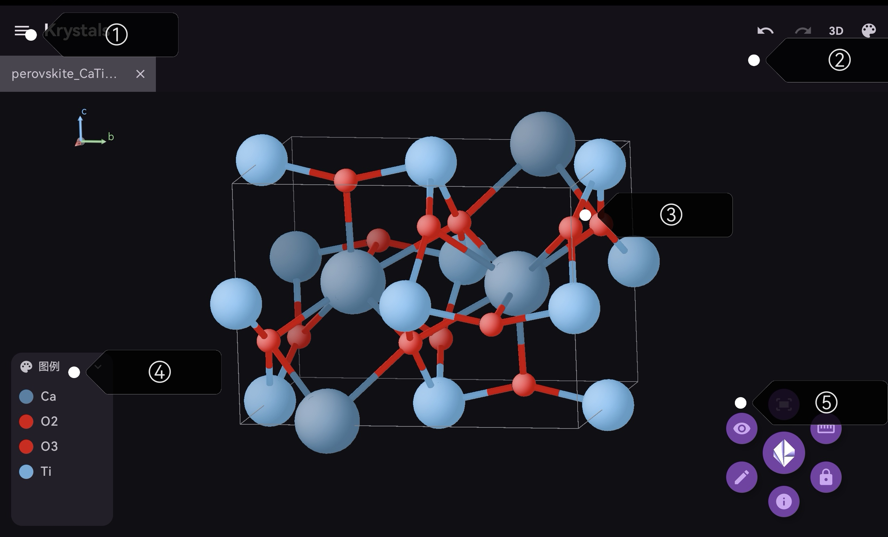

# Krystals

  

<h3 align="center"> Krystals: Android 平台轻量化 CIF 晶体编辑器 </h3>
  

    像 vesta 一样在移动平台便捷地查看晶体！
     
    <a href="https://www.kelesss.art/lib/krystals-release/krystals_v0.6.5.apk"> <strong> 下载测试版 v0.6.5 </strong> </a>
  

---

## 快速上手

### 文件导入

主界面内提供了四种方式导入 CIF 文件：

- **导入本地文件**：从文件管理器选择 CIF（晶体学信息文件） 文件并打开。
- **从预设中导入**：软件提供了丰富的预设资源包，涵盖大部分基础 CIF 测试。您也可以通过“保存到预设”将自己的 CIF 文件保存在预设中。
- **从在线源导入**：提供了从 [Crystallography Open Database](https://qiserver.ugr.es/cod/index.php) 中导入和从 [Materials Project](https://next-gen.materialsproject.org/) 中导入两种选择，其中后者需要 apikey，属于高级功能，需要赞助后使用激活码解锁。前者使用不受限制。
- **创建新文件**：从空文件开始创建 CIF 文档。

### 查看器界面

### ① :material-menu: 菜单选项

包括文件读取与输出的基本操作和其他工具。

- **导入选项**：在新标签栏导入目标 CIF 文件。效用同主界面；
- **保存到本地路径**：将目前展示的 CIF 文件导出到本地路径；
- **保存到预设**：将目前展示的 CIF 文件保存到预设晶体库，后续可以在预设中打开文件；
- **导出图片**：将查看器内的视角高质量渲染，并保存到移动端相册；
- **分享到...**：打开分享窗口，将目前展示的 CIF 文件发送到目标应用。

### ② :material-undo: 撤回 & :material-video-3d: 引擎切换 & :material-palette: 更改整体外观配置

- 3D 引擎使用 filament 进行渲染（推荐，更高流畅度以及画面质量）。对于可能无法正常渲染的机型，保留了用 canvas 绘图的 2D legacy 模式。
- **世界光源**：调整查看器内光源的位置和材料光学行为；
- **景深**：deep-cueing，根据线性调节远处物体的不透明度。“起始值” 和 “终止值” 代表景深线性函数的起始点和结束点。

### ③ 查看器 主界面

- 单指拖动可旋转晶体，双指开合可缩放晶体，双指拖动可平移晶体；
- 双击目标原子将显示原子信息，点按原子信息窗即可锁定该信息窗，后续可通过再次单击解锁。当信息窗被锁定时，信息窗不再自动消失，并且可保留多个信息窗。

### ④ :material-palette: 图例

- 展开后，点按顶部按钮并拖动可改变图例窗口高度。

### ⑤ 常用操作悬浮球

点按后即可展开悬浮球菜单。支持拖动并吸附到窗口边缘。

#### :material-fit-to-screen: 对齐

将晶体视图对齐到某一轴向。

#### :material-lock: **锁定**

固定晶胞视图不变。

#### :material-ruler: **测量**

- 进入测量模式，选择测量长度和角度数据。依次点按路径上的原子即可完成测量；
- 与原子信息窗相同，单击测量信息窗可锁定；
- 要退出测量模式，只需再次点击“测量”，之后点击“关闭”按键。

#### :material-pencil: **编辑**

进入编辑页面，修改晶胞数据，原子坐标和化学键规则：

- 基本信息：自由修改文件名，空间群和晶胞参数信息；
- **原子**：点按“新建”在指定坐标新增原子。点按“修改”或”删除“，之后点击查看器内的原子，即可对原子信息作出修改。
- **化学键**：定义键规则，或自动应用键规则。提供三种模式：
  - 智能离子：采用 Voronoi 方法，计算原子键价和匹配对应半径。选用此规则时，原子信息窗将以 `s=...` 显示当前原子键价；
  - 键合半径：用拟合的晶体内原子半径计算键规则；
  - vdW 半径：使用 van der Waals 半径计算键规则（极其不精确！）；
  - 容忍度 $\epsilon$ 可控制成键最大值。
- **扩展晶胞**：从三个方向扩展晶胞得到超胞。

#### :material-eye: **显示**

进入显示页面，调节原子，化学键和配位多面体可见性：

- **原子**：调节原子可见性及显示颜色；
- **化学键**：调整对应化学键可见性。**注意：取消勾选化学键不影响多面体显示。如需改变配位多面体，请进入编辑页面删除对应的键规则。** 勾选“延伸至晶胞外”可汇出晶胞内原子与晶胞外原子配位的化学键。
- **多面体**：调整对应原子的配位多面体可见性。

#### : material-information: **信息**

显示晶体信息窗。包含原子数目，空间群和晶胞参数等信息。

---

## 贡献者

- [SUPERkelesss (kelesss)](https://github.com/SUPERkelesss)

## 版权说明

本项目遵循 MIT 协议许可。

## 鸣谢

- 项目使用的 AI 模型：Openai ChatGPT-5.6-sol & Kimi-k3 & glm-5.2
- [kunoyo-Galactose](https://github.com/kunoyo-Galactose)
- 参与软件测试版的测试人员
